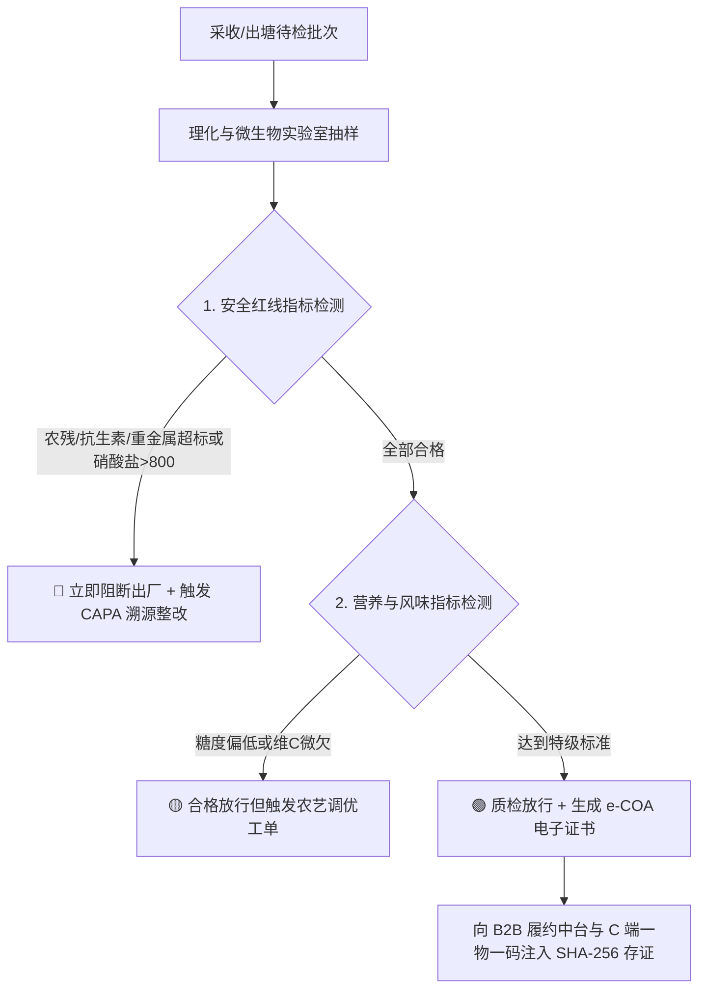

# 鱼菜共生数字工业化工厂 · 品质控制与实验室子系统 (Quality Control & Lab Subsystem)

---

## 1. 系统定位与核心价值

在工业化鱼菜共生生态闭环中，**品质控制与驻厂实验室（QC Laboratory）** 是全厂产品实现 **300%+ 终端品牌溢价** 与 **大客户/高端会员免检信任** 的最高守门人（Gatekeeper）。

品质主管对出厂产品拥有**一票否决权（Release Gatekeeper）**。驻厂实验室对每一批采收的水培蔬菜与出塘循环水产执行严格的双维度指标检验：
1. **安全红线指标（Food Safety & Zero Contaminants）**：农药 0 检出、抗生素 0 检出、低硝酸盐（母婴级 $< 800\text{ mg/kg}$）、重金属极微、致病微生物阴性、水产无土腥味；
2. **超额营养与风味指标（Nutritional Value & Sensory Profile）**：维生素 C 富集（$+110\%$）、可溶性糖度（Brix $\ge 4.0$）、加州鲈粗蛋白（$\ge 19.8\%$）、微量元素微生态富集。

每批次检测合格后，系统自动生成不可篡改的 **e-COA（电子质量检验合格证书）**，并向 B2B 交付链与 C 端一物一码区块链防伪节点注入哈希存证。

---

## 2. 驻厂实验室仪器台账与 SOP 标定体系

| 仪器设备名称 | 规格型号 | 核心检测项目 | 质控与标定周期 | 数据接口 |
| :--- | :--- | :--- | :--- | :--- |
| **双光束紫外可见分光光度计** | 北京普析 T6-1650E 新世纪 (190~1100nm, 8联自动旋转池) | 蔬菜硝酸盐 ($NO_3^-$)、亚硝酸盐 ($NO_2^-$) | 每日标准曲线校正 ($R^2 \ge 0.999$) | RS-232 / UV-Win / LIMS |
| **多通道农药残留快速检测仪** | 北京智云达 ZYD-NP6 (6通道, 胆碱酯酶法) | 有机磷类、氨基甲酸酯类等 62 项农残 | 每批次阳性/阴性双对照 | USB-CP210x 串口 / 自研边缘网关直连 |
| **高精度便携式数字折光糖度计** | PAL-1 (0.0~53.0% Brix) | 生菜/水果番茄可溶性固形物 (糖度) | 每日超纯水零点校准 | BLE 蓝牙实时同传 |
| **原子吸收分光光度计 (AAS)** | 北京普析 TAS-990 (火焰+石墨炉一体机) | 重金属 (铅 Pb、镉 Cd) 与营养矿物质 (铁 Fe、锌 Zn、钙 Ca) | 每周质控盲样比对 | RS-232 / AA-Win / LIMS 集中采录 |
| **食品物性分析仪 (质构仪)** | TA.XT PlusC | 鲈鱼肌肉硬度、弹性、胶着性、回复性 | 每次开机力值传感器归零 | USB / TCP-IP |
| **顶空固相微萃取气质联用仪** | HS-SPME-GCMS | 活鱼土腥味物质 (Geosmin / 2-MIB) | 每月外部标样标定 | 专属工作站数据直连 |
| **十万级洁净超净台与恒温培养箱** | SW-CJ-2FD / DHP-9052 | 沙门氏菌、金黄色葡萄球菌、单增李斯特菌 | 紫外杀菌 30min / 每批次空白平皿对照 | 电子培养记录表 |

---

## 3. 双维度质量判定标准与红线矩阵

### 3.1 安全指标判定红线 (Safety Thresholds)
- **硝酸盐 ($NO_3^-$)**：
  - $\le 800\text{ mg/kg}$：🟢 **特级母婴级（满分放行）**
  - $800 \sim 1500\text{ mg/kg}$：🟡 **一级优品（允许放行，下发调光工单）**
  - $> 1500\text{ mg/kg}$：🔴 **不合格（阻断出厂，转入后段清洗脱硝处理）**
- **化学农药多残留**：$0\text{ 检出 (LOD < 0.01 mg/kg)}$，任何微量检出即判定为严重事故并排查水源与周边飞飘。
- **水产违禁药物（孔雀石绿/氯霉素/呋喃类）**：$0\text{ 检出 (0 容忍)}$。
- **土腥味化合物（Geosmin 几何土味素）**：$\le 10\text{ ng/kg}$（吊水净化后感官完全无腥）。
- **致病微生物（沙门氏菌 / 单增李斯特菌）**：$0\text{ 检出 / 25g}$。

### 3.2 营养与风味等级指标 (Nutritional Quality)
- **维生素 C（抗坏血酸）**：$\ge 25.0\text{ mg/100g}$（标杆值 $28.5\text{ mg/100g}$）；
- **糖度 Brix**：$\ge 3.8^\circ\text{Brix}$（标杆值 $4.2^\circ\text{Brix}$）；
- **加州鲈肌肉粗蛋白**：$\ge 19.0\%$（标杆值 $19.8\%$）；
- **DHA + EPA 富集度**：$\ge 1.20\text{ g/100g 鱼油}$。

---

## 4. 电子防伪质量证明书 (e-COA) 与溯源存证

每次批次放行，系统根据实验室原始检验数据自动生成标准 JSON 数据包，并使用工厂私钥进行 SHA-256 数字签名：
1. **B2B 商超核验**：商超收货仓扫码即可调取原始光谱图、色谱图与出厂检测报告；
2. **C 端消费者扫码**：C 端小程序直观展示“农残0检出证明”、“母婴级低硝酸盐证书”与“维C富集勋章”；
3. **不可篡改防伪链**：所有 e-COA 数据哈希自动广播至分布式节点，杜绝任何人工后门篡改。

---

## 5. 留样观察室与 CAPA 闭环整改机制

1. **4°C 留样冷藏库**：
   - 每批次产品留样 3 份（净菜 2 盒，鱼肉 1 份），在恒温 $4.0^\circ\text{C} \pm 0.5^\circ\text{C}$、湿度 $85\%\text{RH}$ 环境下保存 **72 ~ 120 小时**（涵盖完整货架销售期）。
   - 每日监测失重率（$< 2.5\%$）与维 C 衰减率（5天衰减 $< 15\%$），验证包装微气调与冷链保鲜效果。
2. **质量 CAPA（纠正与预防措施）联动**：
   - 当检测出现轻微偏离（如糖度降至 3.4°Brix），系统自动向种植长下发《光环境调优工单》——将采收前 48 小时的光照强度提高 15%，促进光合产物糖分累积；
   - 当水体悬浮物微升，自动向养殖长下发《微滤机反冲洗频率调增工单》，形成生产、检测、纠偏全自动闭环。
