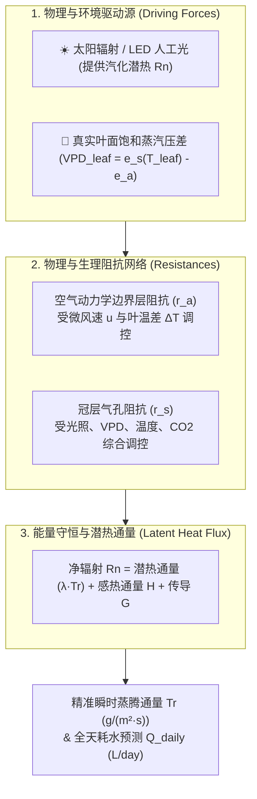
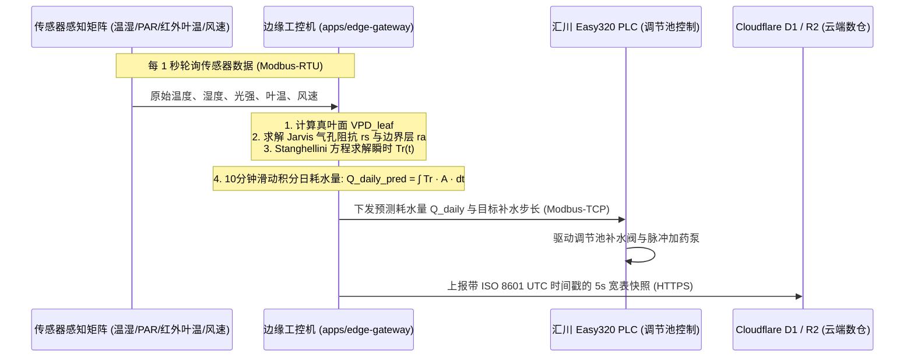

# 连锁数字化农业工厂：03_温室作物蒸腾量估算与感知算法规范 (Greenhouse Transpiration Estimation & Sensing Algorithm Specification)

在设施水培与鱼菜共生系统中， **作物蒸腾（Transpiration Rate, $T_r$ / $ET_c$）** 是沟通植物生理活性、微气候环境控制（VPD/PPFD）以及水力营养液调配（调节池补水）的最核心桥梁。

本规范详述了温室水培作物的蒸腾蒸发生理机理、多维度传感器感知矩阵、Stanghellini 冠层蒸腾模型完整算法推导、Jarvis 气孔导度动态修正模型、边缘计算实现流程以及工程避坑红线。

---

## 1. 蒸腾蒸发生理机理与能量平衡

水培蔬菜（如生菜、罗勒、番茄等）从栽培槽中吸收的水分，**$95\%$ 以上通过叶片表皮的气孔（Stomata）以气态水蒸气的形式蒸腾进入温室空气中**，只有不到 $5\%$ 的水分用于细胞构建与光合反应。

### 1.1 蒸腾的双重驱动机制
1. **热力学能量驱动（汽化潜热）**：水分子从液态转化为气态需要吸收潜热（$\lambda \approx 2.45\,\text{MJ/kg}$），主要由太阳辐射或高功率 LED 补光灯（PPFD）提供；
2. **空气动力学浓度梯度驱动（$\text{VPD}_{\text{leaf}}$）**：叶片内部气孔下腔的饱和水汽压与周围空气实际水汽压之间的差值，是水汽向外扩散的直接物理“泵动力”。

---

## 2. 传感器感知配置矩阵 (Sensing Matrix)

为了消除传统农业“凭经验盲猜”带来的 $30\%\sim 50\%$ 估算偏差，系统推行分级传感器感知配置：

### 2.1 核心级传感器（决定 $85\%$ 的估算精度）

| 传感器名称 | 选型与安装规范 | 测量物理量 | 算法中的核心作用 |
| :--- | :--- | :--- | :--- |
| **冠层空气温湿度计** | 百叶箱/防辐射通风罩，悬挂于生菜冠层上方 $15\sim 30\,\text{cm}$ | 空气温度 $T_{\text{air}}$ ($^\circ\text{C}$)、相对湿度 $RH$ ($\%$) | 计算空气实际水汽压 $e_a$ 与饱和水汽压斜率 $\Delta$ |
| **PAR 光量子传感器** | 量子效应光合有效辐射计，垂直水平安装于作物上方 | 光合有效光通量密度 PPFD ($\mu\text{mol}/(\text{m}^2\cdot\text{s})$) | 蒸腾主要能量源，也是驱动气孔开启的核心变量 |
| **非接触红外叶温传感器** | 工业级红外测温探头 (IR Sensor)，对准代表性叶片 | 叶片表面真实温度 $T_{\text{leaf}}$ ($^\circ\text{C}$) | **核心命门**：计算叶面饱和水汽压 $e_s(T_{\text{leaf}})$，得到真实 $\text{VPD}_{\text{leaf}}$ |

### 2.2 进阶级传感器（将精度提升至 $95\%$ 以上）

| 传感器名称 | 选型与安装规范 | 测量物理量 | 算法中的核心作用 |
| :--- | :--- | :--- | :--- |
| **微风速传感器** | 超声波/热线式风速计，测量范围 $0.05 \sim 3.0\,\text{m/s}$ | 冠层局部空气流速 $u$ ($\text{m/s}$) | 计算叶片空气动力学边界层阻抗 $r_a$（风速增大，阻抗降低，蒸腾加快） |
| **$\text{CO}_2$ 浓度传感器** | NDIR 非色散红外式，冠层高度安装 | 二氧化碳浓度 ($\text{ppm}$) | 高 $\text{CO}_2$ 浓度促使气孔部分闭合，增大植物气孔阻抗 $r_s$ |
| **高空俯视 RGB 相机** | 定点广角相机结合 **YOLO11-Seg** 语义分割 | 蔬菜冠层覆盖率与叶面积指数 (LAI) | 随生长期动态将单叶蒸腾扩展为全田/全槽群体蒸腾 |

### 2.3 校验与闭环“真值”传感器（Ground Truth Calibration）
* **微称量浮板 (Load Cell / 称重传感器)** 或 **高精度磁致伸缩液位计**：
  在选定的标杆水培槽中，在停止补水的 $2 \sim 4$ 小时窗口期内，直接监测水体质量/液位的微米级下降斜率，作为 AI 算法在线自校准与卡尔曼滤波的基准真值。

---

## 3. 核心算法模型体系

在温室水培密闭环境中，国际公认最精确的算法是专门针对温室多层散射与低风速修正的 **Stanghellini 冠层蒸腾模型**。

### 3.1 真实叶面饱和蒸汽压差 ($\text{VPD}_{\text{leaf}}$) 计算

严禁使用空气温度计算 VPD，必须采用真实红外叶温：

$$\text{VPD}_{\text{leaf}} = e_s(T_{\text{leaf}}) - e_a(T_{\text{air}})$$

根据 Magnus-Tetens 饱和水汽压经验方程：
$$e_s(T) = 0.61078 \times \exp\left(\frac{17.27 \times T}{T + 237.3}\right) \quad (\text{单位: kPa})$$
$$e_a(T_{\text{air}}) = e_s(T_{\text{air}}) \times \frac{RH}{100} \quad (\text{单位: kPa})$$

饱和水汽压-温度曲线导数斜率 $\Delta$：
$$\Delta = \frac{4098 \times e_s(T_{\text{air}})}{(T_{\text{air}} + 237.3)^2} \quad (\text{单位: kPa/}^\circ\text{C})$$

---

### 3.2 Stanghellini 温室冠层蒸腾模型方程

$$T_r = \frac{1}{\lambda} \left[ \frac{\Delta \cdot R_{\text{net}} + 2 \cdot \text{LAI} \cdot \rho_a \cdot c_p \cdot \frac{\text{VPD}_{\text{leaf}}}{r_a}}{\Delta + \gamma \left(1 + \frac{r_s}{r_a}\right)} \right]$$

#### 参数物理定义与工程取值：
* **$T_r$**：瞬时蒸腾通量速率（$\text{g}/(\text{m}^2\cdot\text{s})$ 或 $\text{kg}/(\text{m}^2\cdot\text{s})$）；
* **$\lambda$**：水分子汽化潜热常数（$\lambda \approx 2.45 \times 10^6\,\text{J/kg}$）；
* **$R_{\text{net}}$**：作物冠层吸收的净辐射通量（由 PAR 传感器换算，$\text{W/m}^2$）；
* **$\text{LAI}$**：叶面积指数（Leaf Area Index，由视觉分割或生长期模型按天更新）；
* **$\rho_a$**：空气干湿密度（$\approx 1.205\,\text{kg/m}^3$ 在 $20^\circ\text{C}$ 时）；
* **$c_p$**：空气定压比热容（$\approx 1013\,\text{J}/(\text{kg}\cdot^\circ\text{C})$）；
* **$\gamma$**：干湿表常数（$\approx 0.066\,\text{kPa/}^\circ\text{C}$）；
* **$r_a$**：叶片空气动力学边界层阻抗（$\text{s/m}$）；
* **$r_s$**：作物冠层气孔阻抗（$\text{s/m}$，受作物生理活性控制）。

---

### 3.3 空气动力学边界层阻抗 ($r_a$) 修正方程

在温室相对低风速环境下，边界层阻抗受强制对流（风速）与自然自由对流（温差）协同影响：

$$r_a = \frac{1174 \cdot (d_{\text{leaf}})^{0.5}}{\left( d_{\text{leaf}} \cdot |T_{\text{leaf}} - T_{\text{air}}| + 207 \cdot u^2 \right)^{0.25}}$$

* **$d_{\text{leaf}}$**：生菜特征叶片宽度（通常取 $0.05 \sim 0.08\,\text{m}$）；
* **$u$**：冠层周围实测微风速（$\text{m/s}$）。

---

### 3.4 Jarvis 气孔阻抗 ($r_s$) 多因子生理修正模型

气孔是植物控制蒸腾的“智能阀门”。气孔导度 $g_s = 1/r_s$ 随外部环境因子的变化服从非线性相乘关系：

$$r_s = \frac{r_{s,\text{min}}}{\text{LAI}} \times \left[ f_{\text{light}}(\text{PPFD}) \times f_{\text{vpd}}(\text{VPD}) \times f_{\text{temp}}(T_{\text{air}}) \times f_{\text{co2}}(\text{CO}_2) \right]^{-1}$$

1. **光照响应函数 $f_{\text{light}}(\text{PPFD})$**：
   $$f_{\text{light}}(\text{PPFD}) = \frac{\text{PPFD}}{\text{PPFD} + K_{\text{light}}} \quad (K_{\text{light}} \approx 120\,\mu\text{mol}/(\text{m}^2\cdot\text{s}))$$
   *黑暗状态下 ($\text{PPFD}=0$)，$f_{\text{light}} \rightarrow 0$，$r_s \rightarrow \infty$，气孔完全关闭，夜间蒸腾微弱。*
2. **饱和水汽压差响应函数 $f_{\text{vpd}}(\text{VPD})$**：
   $$f_{\text{vpd}}(\text{VPD}) = \frac{1}{1 + \beta_{\text{vpd}} \cdot \text{VPD}_{\text{leaf}}} \quad (\beta_{\text{vpd}} \approx 0.45\,\text{kPa}^{-1})$$
   *当空气极度干燥 ($\text{VPD}>2.0\,\text{kPa}$) 时，植物气孔自卫性收缩防脱水。*
3. **温度响应函数 $f_{\text{temp}}(T_{\text{air}})$**：
   $$f_{\text{temp}}(T_{\text{air}}) = \frac{(T_{\text{air}} - T_{\text{min}})(T_{\text{max}} - T_{\text{air}})^{\frac{T_{\text{max}} - T_{\text{opt}}}{T_{\text{opt}} - T_{\text{min}}}}}{(T_{\text{opt}} - T_{\text{min}})(T_{\text{max}} - T_{\text{opt}})^{\frac{T_{\text{max}} - T_{\text{opt}}}{T_{\text{opt}} - T_{\text{min}}}}}$$
   *(生菜适宜参数：$T_{\text{min}}=5^\circ\text{C}, T_{\text{opt}}=20^\circ\text{C}, T_{\text{max}}=35^\circ\text{C}$)*
4. **二氧化碳响应函数 $f_{\text{co2}}(\text{CO}_2)$**：
   $$f_{\text{co2}}(\text{CO}_2) = 1 - 0.00025 \times (\text{CO}_2 - 400)$$

---

## 4. 边缘网关算法实现与数据流转

---

## 5. 与调节池（Buffer Tank）的闭环协同

通过本规范计算出的日均蒸腾耗水总量 $Q_{\text{daily}}$，直接作为《[02_调节池水力计算与加药自治规范.md](./02_调节池水力计算与加药自治规范.md)》中调节池容积与进出水泵选型的最底层输入：

$$Q_{\text{daily}} = \int_{0}^{24\,\text{h}} T_r(t) \cdot A_{\text{plant}} \cdot dt \times (1 + \eta_{\text{loss}})$$

同时，瞬时蒸腾速率 $T_r(t)$ 与水培槽 EC 浓缩速率成正比，边缘网关据此动态调整调节池向菜池供水时的**营养液稀释比率**。

---

## 6. 反复调整成功的经验教训（【避坑红线】）

> [!IMPORTANT]
> **【经验教训备注 1：绝不能用空气温度简单代替叶片温度】**
> 在强光高湿的温室中，植物剧烈蒸腾吸热，**叶片表面温度通常比周围空气低 $2^\circ\text{C} \sim 4^\circ\text{C}$**；而在高温干燥引发气孔休克闭合时，叶温又会**反超气温 $3^\circ\text{C} \sim 5^\circ\text{C}$**。如果省去“红外叶温传感器”而直接用气温代替叶温算 VPD，会导致蒸腾量估算产生高达 **$30\% \sim 50\%$ 的非线性偏差**。
>
> **【经验教训备注 2：生长期叶面积指数（LAI）的动态校准】**
> 生菜从定植幼苗期（株重 10g，冠层覆盖率 $<10\%$，$\text{LAI} \approx 0.2$）到采收期（株重 250g，冠层完全郁闭，$\text{LAI} \approx 3.5$），单槽每天的耗水量相差 **10 倍以上**。算法中严禁将 LAI 设为静态常数，必须结合视觉分割模型（或定植天数生长方程）按天动态更新 LAI 权重。
