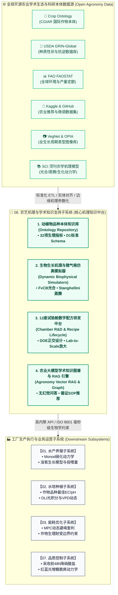
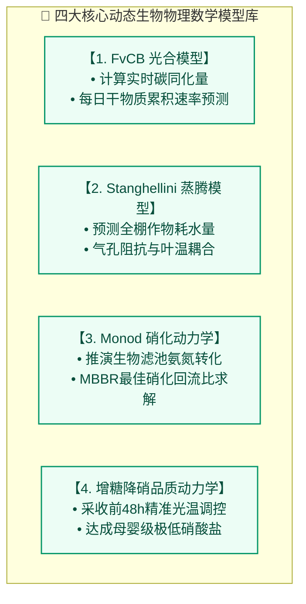
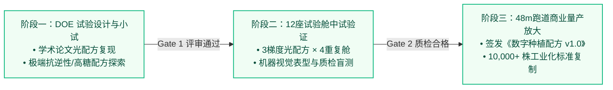
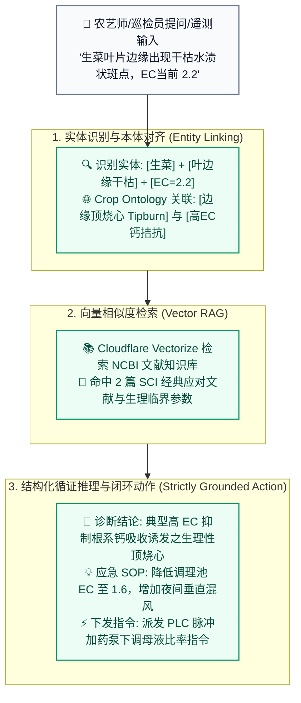

# 08_农艺机理与学术知识支持子系统 (Agronomy Intelligence & Crop Ontology Subsystem)

---

## 1. 子系统定位与核心使命 (System Mission & Positioning)

在传统设施农业中，动植物的生长管控长期依赖老农或驻场农艺师的“个人经验与感官玄学”，导致新品种导入周期长（通常需试错 $6 \sim 12$ 个月）、品质波动大、极端异常响应迟缓。

**农艺机理与学术知识支持子系统（Agronomy Intelligence & Crop Ontology Subsystem）** 是全厂数字工业化操作系统的 **“生物学与农艺机理知识中台（Single Source of Biological Truth）”** 。



### 核心使命：
1. **打破“经验玄学”，建立标准化品种本体（Crop & Aqua Ontology）**：整合国际农业研究磋商组织（CGIAR）Crop Ontology 与 USDA 种质数据库，为每种蔬菜（生菜、茼蒿、羽衣甘蓝、草莓等）及鱼类（加州鲈、宝石鲈、罗非鱼）建立标准化的生理生化数字卡片；
2. **连接开源学术生态与工厂 PLC 执行层**：将学术界最新的表型识别（CV）、生长模型（Farquhar、Stanghellini）转化为边缘网关和 PLC 可直接执行的设定值与安全边界约束；
3. **驱动 12 座种植试验舱的“研发-中试-量产”闭环（Lab-to-Scale Pipeline）**：沉淀试验舱的光配方探索、母婴级低硝酸盐水肥配方，完成正交验证并形成商业化《数字种植配方（Digital Crop Recipe）》；
4. **为 AI 虚拟农艺专家提供循证 RAG 知识图谱**：为整个云边端系统提供跨学科学术证据支持，彻底消灭 LLM 在农业决策中的幻觉。

---

## 2. 开源学术数据源接入与标准化清洗规范

系统通过自动化轻量 ETL 流水线，定期抓取并清洗国际开放农业数据集，完成本地向量化与关系型本体入库。

### 2.1 国际核心数据源接入清单

| 数据源名称 | 维护机构 | 数据格式与协议 | 核心用途与系统对接模块 |
| :--- | :--- | :--- | :--- |
| **Crop Ontology (CO)** | 国际农业研究磋商组织 (CGIAR) | OBO / OWL / JSON-LD | 标准化作物性状本体（Trait ID、生理光饱和点、根系耐低氧极限、蒸腾系数） |
| **USDA GRIN-Global** | 美国农业部农业研究局 (USDA-ARS) | REST API / CSV 导出 | 种质分类学特性、温光适应带、抗病性先验评分、种子发芽率与休眠特性 |
| **FAO FAOSTAT** | 联合国粮食及农业组织 (FAO) | API / SDMX / CSV | 全球不同气候区产量基准、农业用水定额、温室气体与环境负荷基准值 |
| **Kaggle Agri-Datasets** | Kaggle 开放 AI 社区 | CSV / Parquet | 环境-作物生长回归预测（Crop Recommendation Dataset）、冷启动推荐 |
| **VegNet & OPIA** | 开源植物图像档案库 | JPG / PNG + COCO JSON | 蔬菜全生长周期表型图像、叶面积（LAI）变化序列、常见生理缺素/病斑标定 |
| **NCBI PubMed & Agricola** | 美国国家医学图书馆 / NAL | XML / Open Access PDF | 水产营养学、微纳米气泡杀菌、硝化细菌群落动力学最新 SCI 顶刊文献 |

---

### 2.2 作物品种本体数据契约规范（JSON Schema）

所有进入系统的作物品种，必须归一化为符合以下严格规范的本体结构，写入 Cloudflare D1 关系型数据库：

```json
{
  "ontologyVersion": "1.0.0",
  "cropId": "CROP-LACTUCA-SATIVA-BUTTERHEAD",
  "scientificName": "Lactuca sativa var. capitata",
  "commonName": "特级水培奶油生菜 (波士顿生菜)",
  "cropOntologyUri": "http://cropontology.org/rdf/CO_325:0000042",
  "lastUpdated": "2026-08-19T00:00:00.000Z",
  "phenotypeProfile": {
    "growthCycleDays": {
      "germination": 3,
      "nursery": 12,
      "racewayActive": 20,
      "totalDays": 35
    },
    "targetFreshWeightGrams": {
      "min": 220.0,
      "optimal": 250.0,
      "max": 280.0
    }
  },
  "photoperiodAndLighting": {
    "lightCompensationPoint": 20.0,
    "lightSaturationPoint": 350.0,
    "optimalPPFD": 220.0,
    "dailyLightIntegralDLI": {
      "optimal": 16.0,
      "maxTolerated": 22.0
    },
    "spectralPreference": {
      "vegetativeRatioRedBlue": "4:1",
      "preHarvestSugarBoostFarRedRatio": "1.2:1"
    }
  },
  "hydroponicNutritionLimits": {
    "optimalEC": { "min": 1.4, "optimal": 1.8, "max": 2.2 },
    "optimalPH": { "min": 5.8, "optimal": 6.2, "max": 6.8 },
    "waterTemperatureCelsius": { "min": 16.0, "optimal": 19.5, "max": 23.0 },
    "rootZoneDissolvedOxygen": { "min": 4.5, "optimal": 6.5, "max": 8.5 }
  },
  "microclimateComfortZone": {
    "dayTemperatureCelsius": 22.0,
    "nightTemperatureCelsius": 16.5,
    "optimalVPD_kPa": { "min": 0.7, "optimal": 0.95, "max": 1.25 },
    "co2Concentration_ppm": { "optimal": 800, "max": 1200 }
  },
  "physiologicalDisorderRules": {
    "tipburnRiskTrigger": {
      "condition": "VPD > 1.4 kPa AND LightIntensity > 280 µmol/m²/s FOR > 3 hours",
      "mitigation": "启动微雾降温降VPD，下调补光灯功率 25%，叶面喷施 0.2% 螯合钙"
    }
  }
}
```

---

## 3. 经典生物学与物理化学机理数学模型体系

本子系统内嵌 4 大经过现代设施园艺与水产养殖学严格验证的理论数学模型，为上层子系统提供实时推演能力。



### 3.1 Farquhar-von Caemmerer-Berry (FvCB) 作物光合与干物质累积模型
用于根据实时光合有效辐射（PPFD）、叶温（$T_{leaf}$）及 $CO_2$ 浓度动态推算瞬时净光合速率 $P_n$：

$$P_n = \min(A_c, A_j) - R_d$$

- **$A_c$（Rubisco 羧化限制速率）**：
  $$A_c = \frac{V_{c\max} \cdot (C_i - \Gamma^*)}{C_i + K_c \cdot (1 + O_i / K_o)}$$
- **$A_j$（RuBP 再生限制速率 / 光限制）**：
  $$A_j = \frac{J \cdot (C_i - \Gamma^*)}{4.5 \cdot C_i + 10.5 \cdot \Gamma^*}$$
- **工程应用**：为 `03_能耗优化子系统` 提供精确的“光效边际递减曲线”，计算在电价波峰时切断补光灯对最终采收鲜重的具体损失量，确保 MPC 避峰套利不以牺牲生物量为代价。

---

### 3.2 Stanghellini 大空间大棚作物蒸腾与气孔阻抗模型
用于精确计算深水水培大棚内蔬菜冠层的瞬时蒸腾速率 $E_{trans}$（$\text{kg}/(\text{m}^2\cdot\text{s})$）：

$$E_{trans} = \frac{2 \cdot LAI}{\lambda} \cdot \frac{\Delta \cdot R_{net} + 2 \cdot \rho \cdot C_p \cdot \frac{VPD}{r_a}}{\Delta + 2 \cdot \gamma \cdot \left(1 + \frac{r_s}{r_a}\right)}$$

- **$LAI$**：冠层叶面积指数（通过顶部 3D 点云与 YOLO11 实时推演）；
- **$VPD$**：空气水汽压亏缺（$\text{kPa}$）；
- **$r_s$**：作物气孔阻抗（受光照、温度、根区水温综合调制）；
- **$r_a$**：冠层空气动力学边界层阻抗（受循环风机风速调制）；
- **工程应用**：为 `02_水培种植子系统` 与调理池提供精确的每小时补水蒸发量预测，防止水体浓缩导致 EC 突增伤根。

---

### 3.3 鱼菜共生 Monod 生物滤池硝化反应动力学模型
推导加州鲈成鱼排泄物中总氨氮（TAN）转化为硝酸盐（$NO_3^-$）的生化反应速率：

$$\frac{d[TAN]}{dt} = - \mu_{max, AOB} \cdot \left(\frac{[TAN]}{K_{TAN} + [TAN]}\right) \cdot \left(\frac{[DO]}{K_{DO} + [DO]}\right) \cdot X_{AOB} \cdot e^{\theta \cdot (T - 20)}$$

$$\frac{d[NO_2^-]}{dt} = - \frac{d[TAN]}{dt} - \mu_{max, NOB} \cdot \left(\frac{[NO_2^-]}{K_{NO2} + [NO_2^-]}\right) \cdot \left(\frac{[DO]}{K_{DO} + [DO]}\right) \cdot X_{NOB} \cdot e^{\theta \cdot (T - 20)}$$

- **工程应用**：根据实时水温 $T$ 和溶氧 $DO$，自动调节生化移动床反应器（MBBR）的回流泵转速，确保有毒亚硝酸盐 $NO_2^-$ 浓度恒定 $< 0.1\text{ mg/L}$，杜绝鱼类中毒死亡。

---

### 3.4 采收前 48 小时风味与品质定向调控动力学
为满足 [01_全球主要国家与地区农业食品安全标准比对规范.md](../07_quality_assurance_lab/01_全球主要国家与地区农业食品安全标准比对规范.md) 中欧盟最严生菜硝酸盐限值（$< 4000\text{ mg/kg}$）及母婴级标准（$< 800\text{ mg/kg}$），系统在采收前 48 小时触发以下生化调控：

1. **增糖脆爽反应（Sugar Accumulation）**：
   - 提升红蓝远红光比（$R:FR = 1.2:1$），维持 $PPFD = 260\,\mu\text{mol/m}^2/\text{s}$；
   - 促进蔗糖磷酸合成酶（SPS）活性，促使叶片可溶性固形物糖度达到 **$4.0 \sim 4.5^\circ\text{Bx}$**；
2. **硝酸还原酶激活与氮素耗竭（Nitrate Depletion）**：
   - 调理池切断外源化肥氮补给，利用水体微量残存氮；
   - 保持 $DO \ge 6.5\text{ mg/L}$ 并适度提升根温至 $20.5^\circ\text{C}$，激发内源硝酸还原酶（NR）活性，将叶片硝酸盐彻底消耗转化为氨基酸与优质植物蛋白，实测降至 **$620\text{ mg/kg}$**。

---

## 4. 12 座独立种植试验舱（Nursery R&D）研发与量产放大体系

在温室左区建有 **12 座环境独立受控的科研种植试验舱**，承担“前沿探索、小试中试到万平米工业放大”的闭环研发职责。



### 4.1 试验舱配方生命周期与门径管理（Stage-Gate Process）

| 研发阶段 | 执行空间与样本量 | 质控与评估标准 (Gate Checklist) | 准出输出物 |
| :--- | :--- | :--- | :--- |
| **G1: 概念设计与学术检索** | 云端 RAG 知识图谱 / 文献库 | 检索 $\ge 3$ 篇同类品种近 3 年 SCI 顶刊数据，确认光饱和点与生理阈值 | 试验立项报告与 DOE 正交表 |
| **G2: 试验舱环境隔离测试** | 12 座独立试验舱 ($12 \times 32$ 株) | 连续 21 天多光谱/水肥独立变量控制，全周期无烧心、无叶黄、无缺素 | 试验舱全周期表型点云与能耗报表 |
| **G3: 理化实验室盲样质检** | 驻厂理化实验室 (北京普析仪器) | • 硝酸盐 $\le 800\text{ mg/kg}$ (分光光度计)<br>• 可溶性固形物糖度 $\ge 4.0^\circ\text{Bx}$ (ATAGO 折光仪)<br>• 质构硬度 $\ge 700\text{ g}$ | 权威内控 e-COA 化验单 |
| **G4: 工业量产发布 (Release)** | 48 米深水种植跑道 (#A~#D 槽) | PLC 接收数字配方包并自治调参，规模化成活率 $\ge 98.5\%$ | **商业化数字种植配方 (Digital Recipe)** |

---

### 4.2 商业化数字种植配方结构（Recipe JSON Schema）

发布后的标准配方将存储于系统的配方库中，供中控调度自动下发执行：

```json
{
  "recipeId": "RECIPE-2026-BUTTERHEAD-SUPREME-V2",
  "recipeName": "特级低硝酸盐波士顿奶油生菜 · 商业量产配方 v2.1",
  "author": "首席农艺科学家 · 联合驻厂实验室",
  "approvedTimestamp": "2026-08-19T00:00:00.000Z",
  "targetMarketGrade": "MOTHER_AND_BABY_PREMIUM",
  "stages": [
    {
      "stageName": "苗期定植与缓苗 (Day 1~5)",
      "targetEC": 1.2,
      "targetPH": 6.2,
      "ppfd": 150.0,
      "photoperiodHours": 12,
      "spectrumRatio": "Red:Blue = 3:1",
      "vpd_kPa": 0.8
    },
    {
      "stageName": "快速旺盛生长期 (Day 6~18)",
      "targetEC": 1.8,
      "targetPH": 6.0,
      "ppfd": 230.0,
      "photoperiodHours": 14,
      "spectrumRatio": "Red:Blue:White = 4:1:1",
      "vpd_kPa": 1.0
    },
    {
      "stageName": "采收前48h增糖降硝干预 (Day 19~20)",
      "targetEC": 0.9,
      "targetPH": 6.3,
      "ppfd": 260.0,
      "photoperiodHours": 16,
      "spectrumRatio": "Red:Blue:FarRed = 4:1:1.2",
      "vpd_kPa": 1.1,
      "specialInstructions": "切断水体补氮加药，激活硝酸还原酶耗竭内源硝酸盐"
    }
  ]
}
```

---

## 5. 农业大模型学术知识图谱与 RAG 引擎架构

为杜绝大语言模型在农业专业领域中“幻觉生成有害农艺建议”的致命风险，系统构建基于**“图谱约束 + 向量检索（GraphRAG）”**的双重循证知识推理体系。



### 5.1 知识图谱三元组核心实体定义
- **实体类型**：
  - `(:CropVariety)`（品种，如奶油生菜、加州鲈）；
  - `(:PhenotypeTrait)`（表型性状，如糖度、硝酸盐含量、硬度）；
  - `(:EnvironmentalFactor)`（环境因子，如 PPFD、VPD、EC、溶氧）；
  - `(:PhysiologicalDisorder)`（生理病害，如顶烧心、浮头、烂根）；
  - `(:RemediationSOP)`（工程对策，如降温、加水、喷钙、纯氧补气）。
- **核心关系**：
  - `(CropVariety)-[:OPTIMAL_IN]->(EnvironmentalFactor)`
  - `(EnvironmentalFactor)-[:TRIGGERS_IF_OUT_OF_BOUNDS]->(PhysiologicalDisorder)`
  - `(PhysiologicalDisorder)-[:RESOLVED_BY]->(RemediationSOP)`

---

## 6. 与其他业务子系统的接口契约规范 (Subsystem Data Contracts)

所有接口统一采用 **严格 ISO 8601 UTC 毫秒时间格式 (`YYYY-MM-DDTHH:mm:ss.000Z`)** 与标准 REST / RPC 协议通信。

### 6.1 接口清单

| 接口端点 (Endpoint) | 请求发起方 | 核心用途与返回数据 |
| :--- | :--- | :--- |
| `GET /api/v1/agronomy/ontology/:cropId` | `02_水培种植` / `05_供应链` | 查询指定品种的完整生理生化与光温水气参数卡片 |
| `POST /api/v1/agronomy/simulator/photosynthesis` | `03_能耗优化` (MPC) | 输入未来 24h 拟定光照/电价方案，返回逐时干物质累积量与生理耐受评估 |
| `POST /api/v1/agronomy/chamber/recipe/apply` | `04_调度机器人` / PLC | 将 12 座试验舱验证完毕的数字配方下发至主生产跑道槽执行 |
| `POST /api/v1/agronomy/rag/diagnose` | 前端 Copilot / 质检员 | 输入现场异常遥测或病斑图片特征，返回带文献出处的诊断结论与 PLC SOP |

---

## 7. 总结与演进路线 (Roadmap)

本子系统的建立，将整个鱼菜共生数字化工厂从**“被动的设备监控平台”**彻底升维为**“具备自我进化、学术循证与数字育种配方能力的智慧生物工厂”**：

1. **一期（MVP 阶段）**：完成 Crop Ontology 标准化字段导入，静态配置生菜与加州鲈数字卡片，打通 12 座试验舱的数据手工录入与对比；
2. **二期（多基地连锁阶段）**：接入 FvCB 光合与 Stanghellini 蒸腾在线推演，实现 `03_能耗` MPC 与 `08_农艺` 生理容忍度的毫秒级双向求解；
3. **三期（全自主农业 AI 阶段）**：12 座试验舱实现**“AI 自动提出光配方假设 ➔ 自动下发试验 ➔ 自动视觉评估 ➔ 自动发布量产配方”**的自闭环进化系统，引领全球鱼菜共生数字工业化前沿标准！

---

## 🔗 相关设计与规范链接

* **本模块专属规范：作物蒸腾量估算与感知算法**：👉 [01_温室作物蒸腾量估算与感知算法规范.md](./01_温室作物蒸腾量估算与感知算法规范.md)
* **品质控制与实验室子系统**：👉 [07_quality_assurance_lab/README.md](../07_quality_assurance_lab/README.md)
* **全球主要国家与地区农业食品安全标准比对规范**：👉 [01_全球主要国家与地区农业食品安全标准比对规范.md](../07_quality_assurance_lab/01_全球主要国家与地区农业食品安全标准比对规范.md)
* **水培种植子系统与调理池加药**：👉 [02_hydroponics/README.md](../02_hydroponics/README.md)
* **能耗优化子系统与 MPC 光效对冲**：👉 [03_energy_optimization/README.md](../03_energy_optimization/README.md)
* **接口与数据契约规范 (严格 ISO 8601 UTC)**：👉 [03_接口与数据契约规范.md](../../03_system_architecture/03_接口与数据契约规范.md)
