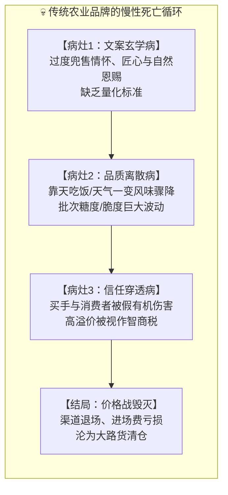
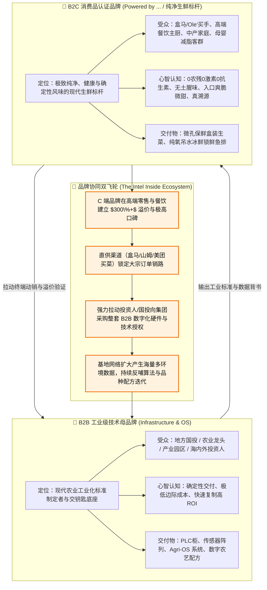
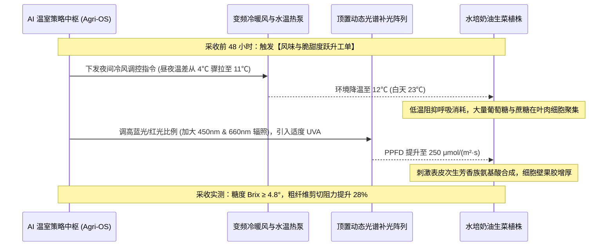
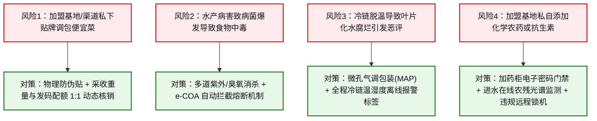
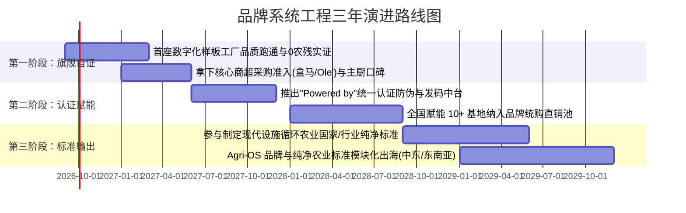

# 连锁数字化农业工厂：01_品牌战略与认知系统工程白皮书 (Brand Strategy & Cognitive Systems Engineering Whitepaper)

> **最高纲领**：  
> 本白皮书确立了连锁数字化农业工厂在构建现代农业品牌过程中的**顶层战略、工程编译法则与系统级防御体系**。  
> 我们旗帜鲜明地主张：**“品牌从来不是市场部的空洞口号与包装贴纸，而是物理工程、生物机理、数据资产与供应链履约高度协同后的高确定性必然结晶。”**  
> 唯有将感性的品牌承诺完整编译为工业级的底层硬约束，现代农业才能彻底跳出“看天吃饭、品质离散、信任脆弱”的历史轮回。

---

## 目录索引

- [一、 传统农业品牌的致命陷阱与认知重构](#一-传统农业品牌的致命陷阱与认知重构)
  - [1.1 传统农业品牌的三大慢性死因](#11-传统农业品牌的三大慢性死因)
  - [1.2 系统工程视角的破局哲学：品牌即系统输出](#12-系统工程视角的破局哲学品牌即系统输出)
- [二、 双轮驱动品牌战略架构（Dual-Track Architecture）](#二-双轮驱动品牌战略架构dual-track-architecture)
  - [2.1 B2B 工业级技术母品牌：高确定性交钥匙底座](#21-b2b-工业级技术母品牌高确定性交钥匙底座)
  - [2.2 B2C 终端消费品认证品牌：“Powered by” 品质背书体系](#22-b2c-终端消费品认证品牌powered-by-品质背书体系)
  - [2.3 商业飞轮与“Intel Inside”协同生态](#23-商业飞轮与intel-inside协同生态)
- [三、 核心工程转换机：品牌价值的技术编译矩阵（Technical Substantiation Matrix）](#三-核心工程转换机品牌价值的技术编译矩阵technical-substantiation-matrix)
  - [3.1 纯净度编译：从“良心种植”到“物理生物双闭环”](#31-纯净度编译从良心种植到物理生物双闭环)
  - [3.2 风味与口感编译：从“自然熟”到“微温差与靶向光谱配方”](#32-风味与口感编译从自然熟到微温差与靶向光谱配方)
  - [3.3 鲜味与去腥编译：从“生态慢养”到“微纳米纯氧活水代谢”](#33-鲜味与去腥编译从生态慢养到微纳米纯氧活水代谢)
  - [3.4 真实性编译：从“扫码看宣传片”到“时空数字孪生档案”](#34-真实性编译从扫码看宣传片到时空数字孪生档案)
- [四、 理性悲观防线：品牌生命周期的系统性风控与容灾工程](#四-理性悲观防线品牌生命周期的系统性风控与容灾工程)
  - [4.1 防冒充与调包：物理防伪与一物一码产量配额硬锁](#41-防冒充与调包物理防伪与一物一码产量配额硬锁)
  - [4.2 防食品安全黑天鹅：多级快检与秒级产品召回熔断机制](#42-防食品安全黑天鹅多级快检与秒级产品召回熔断机制)
  - [4.3 防冷链断链：微孔气调包装与温湿度异常标记](#43-防冷链断链微孔气调包装与温湿度异常标记)
  - [4.4 防加盟基地失控：PLC 门禁与自动化加药柜远程硬切断](#44-防加盟基地失控plc-门禁与自动化加药柜远程硬切断)
- [五、 品牌演进阶梯与度量体系（Brand KPIs & Roadmap）](#五-品牌演进阶梯与度量体系brand-kpis--roadmap)

---

## 一、 传统农业品牌的致命陷阱与认知重构

### 1.1 传统农业品牌的三大慢性死因

在过去的农业实践中，数以万计的农产品企业试图打造高溢价品牌，但绝大多数最终沦为先烈。究其根本，在于陷入了不可逆的“三大致命病灶”：

1. **文案玄学病（Emotional Vacuum）**：
   * 缺乏可度量的物理指标支撑，只能把希望寄托在包装设计、非遗故事、匠人古法、原生态等主观概念上。一旦遭遇专业买手或挑剔消费者的深层质询，瞬间原形毕露。
2. **品质离散病（Quality Variance）**：
   * 传统露天或简易大棚受季节气候影响巨大。第一周批次的生菜清甜爽脆，第二周遇到连阴天或高温，立刻纤维变粗、发苦抽薹。工业品品牌之所以成立，是因为**“一致性”（Consistency）**；而传统农业最大的痛点就是批次间离散度极大，无法支撑稳定的品牌复购。
3. **信任穿透病（Trust Deficit）**：
   * 市场上充斥着“贴牌有机”、“洗澡鱼”、“扫码只看一段宣传片”的伪溯源。消费者在一次次被骗后形成了“农业宣称皆吹牛”的防御性心理。传统农企越用力做宣传，消费者越怀疑其在收“智商税”。

### 1.2 系统工程视角的破局哲学：品牌即系统输出

在数字化农业工厂体系中，我们确立了全新的认知公理：
* **公理一：品牌不是市场部门的“包装发明”，而是整套工业控制系统运行的“终态副产物”。**
* **公理二：品牌溢价的本质，是消费者为“确定性”与“心理免责/安心”支付的保费。**
* **公理三：凡是不能被传感器观测、不能被执行机构调控、不能在数据库中溯源的品牌承诺，皆属于高风险谎言。**

---

## 二、 双轮驱动品牌战略架构（Dual-Track Architecture）

我们的商业战略定位是**“全栈数字化基础设施与交钥匙整体方案服务商”**。基于此定位，品牌必须解耦为互为驱动的“双轮”体系：

### 2.1 B2B 工业级技术母品牌：高确定性交钥匙底座
* **使命**：解决产业投资人“农业投资周期长、不可控、高度依赖个别技术员”的恐惧。
* **对外语言**：严谨、理性、数据化、工业级可靠性（如“深圳国数传感器质保3年”、“毫秒级PLC防窒息逻辑”、“饲料转化率FCR降低 $15\%\sim 20\%$”）。
* **护城河**：完整的数字工业交付标准（弱电施工规范、水动力物料守恒计算、ISO 8601 UTC 数据契约）。

### 2.2 B2C 终端消费品认证品牌：“Powered by” 品质背书体系
* **使命**：类似“Intel Inside”或“Gore-Tex”，作为所有由我们赋能的农业工厂所产出农水产品的统一品质认证标签。
* **对外语言**：纯净、治愈、生机、高净值生活美学、母婴级安全。
* **商业价值**：合作基地自建品牌极难获得全国性商超认可；但只要贴上我们的“数字化认证标识”，即可直接接入集团的商贸集采直通车，获得 $150\%\sim 300\%$ 的售价溢价。

---

## 三、 核心工程转换机：品牌价值的技术编译矩阵

品牌工程的核心在于**“翻译能力”**——如何把消费者渴望的感性词汇，无损编译为自动化流水线上的控制参数：

| 编译流转阶段 | 核心载体与输入来源 | 转化目标与输出表征 | 典型工程与体验示例 |
| :--- | :--- | :--- | :--- |
| **第 1 阶：消费端感性诉求** | 消费者真实生活痛点与心理渴望 | 转化为品牌核心承诺 (Brand Claims) | 0农药残留疑虑、入口清甜爽脆、肉质紧实无泥腥味 |
| **第 2 阶：算法与中台工单** | Agri-OS 数字配方与生物环境模型 | 编译为可调控的物理与化学环境变量 | 采收前大温差冷风模型、纯氧微纳米活水吊水排腥曲线、解耦加药工单 |
| **第 3 阶：底层物理执行与质控** | PLC 本地控制器、传感器与执行机构 | 闭环执行、留样复核与区块链存证 | 变频热泵调温、纯氧发生器推流、GC-MS质谱盲检与一物一码真实溯源 |

### 3.1 纯净度编译：从“良心种植”到“物理生物双闭环”

| 品牌宣称 (Claim) | 消费心理认知 | 编译出的工程物理参数 (Engineering Spec) | 自动化执行与检测闭环 (Verification) |
| :--- | :--- | :--- | :--- |
| **“0 化学农药”** | 拒绝致癌与神经毒素疑虑 | • 生产车间正压微滤风道，阻隔外源害虫（孔径 $<0.25\,\text{mm}$） • 黄板色相诱捕波长：$560\sim 590\,\text{nm}$ • 天敌生物（如捕食螨/丽蚜小蜂）释放投放比：$5\,\text{head/m}^2$ | 生产全周期农药出入库为零记录；每批次出厂提供第三方 GC-MS/MS 普析 62 项农残检测（全检出限以下 ND）。 |
| **“0 生长激素”** | 杜绝儿童性早熟恐慌 | • 严禁赤霉素、氯吡脲等外源生长调节剂 • 作物生长速度纯靠 DLI 累计光积分（$14\sim 16\,\text{mol}/(\text{m}^2\cdot\text{d})$）与温度积分线性驱动 | 采收期作物形态学比对，严格符合自然生长规律的纵横径比例分布。 |
| **“0 抗生素与违禁药”** | 拒绝耐药菌残留与肝肾负担 | • 水体纯物理沉淀微滤（转鼓滤网 $40\,\mu\text{m}$） • 紫外线中压杀菌剂量 $\ge 400\,\text{J/m}^2$ • 绝不添加孔雀石绿、硝基呋喃、磺胺类药物 | 水产生物全生命周期水质在线监测；起捕前鱼肉组织 HPLC-MS/MS 零抗生素检出认证。 |

### 3.2 风味与口感编译：从“自然熟”到“微温差与靶向光谱配方”

传统水培蔬菜之所以被批评为“寡淡如水/嚼塑料”，本质是缺乏风味物质合成的微环境激发。我们通过算法将“口感与风味”量化为严谨的调控工单：

* **脆度量化指标**：质构仪实测断裂峰值应力 $\ge 1.8\,\text{kg/cm}^2$，断裂瞬间呈现高频声学爆破特性。
* **甜度与芳香量化**：可溶性固形物（Brix）稳定控制在 $4.5^\circ \sim 5.2^\circ$（传统露地水培仅 $2.5^\circ \sim 3.0^\circ$）；叶片挥发性风味物质（芳樟醇等）较普通温室提升 $40\%$。

### 3.3 鲜味与去腥编译：从“生态慢养”到“微纳米纯氧活水代谢”

水产土腥味源于泥土放线菌合成的**土味素（Geosmin）**与 **2-MIB**。品牌宣称的“无土腥味”，在工程上落实为起捕前的活水吊水净化工程：

$$\text{Geosmin 排空模型：} \quad C(t) = C_0 \cdot e^{-k_{\text{dep}} \cdot t}$$

* **工程参数约束**：
  * **吊水车间流速**：环形微激流喷嘴推流，流速 $0.35 \sim 0.45\,\text{m/s}$（迫使鱼群巡游，代谢肌间游离脂肪）；
  * **溶氧浓度 (DO)**：高压纯氧微纳米发生器维持 $\text{DO} \ge 8.5\,\text{mg/L}$；
  * **水体纯度**：循环水经活性炭深层吸附与紫外光催化氧化，水中土味素浓度 $< 1\,\text{ng/L}$；
  * **断食净化时长**：严格执行 $72 \sim 120\,\text{h}$ 饥饿净化。
* **交付实测**：鱼肉组织 GC-MS 实测 Geosmin 降至仪器检测下限（$<10\,\text{ng/kg}$），从源头斩断一切泥腥与草腥味，形成入口清甜、蒜瓣肉质感。

### 3.4 真实性编译：从“扫码看宣传片”到“时空数字孪生档案”

传统防伪二维码只是将用户引导至固定视频网页，无法自证产品没有被调包。我们的一物一码系统直接连接底层数据库：
1. **真实物理数据入库**：每一包菜关联其具体在水培床号、浮板编号上的停留周期，调取传感器在此期间记录的实际 DLI 曲线、EC 波动历史、水温历史；
2. **唯一性时间戳**：包装切根封口瞬间，贴标机自动打印该批次不可逆二维码，扫码呈现的是**“这棵菜真实的生长日历与环境折线图”**，用无法编造的物理真实性彻底击穿信任障碍。

---

## 四、 理性悲观防线：品牌生命周期的系统性风控与容灾工程

品牌资产积累需要数年，但崩塌往往只需一次恶性事件。在系统工程视角下，必须把**“最具毁灭性的边缘事故”**作为最高优先级设计防线：

### 4.1 防冒充与调包：物理防伪与一物一码产量配额硬锁
* **行业痛点**：高溢价产品一旦打响知名度，合作农场或分销商极易私自从周边菜市场以 2 元/斤进货，套上我们的品牌袋以 15 元/盒销售。
* **系统闭环防线**：
  * **产量动态核销硬约束**：集团 MES 系统的发码量受物理地磅与视觉分选秤的严密约束。如果该基地当日采收称重为 $800\,\text{kg}$，系统最多生成 $1600$ 枚（$500\,\text{g/盒}$）防伪码，一枚多余的码都无法打印。
  * **物理易碎标签**：采用防撕防转移激光易碎刀口，一旦撕开即刻破坏天线与芯片物理结构，彻底杜绝回收包装二次贴牌。

### 4.2 防食品安全黑天鹅：多级快检与秒级产品召回熔断机制
* **行业痛点**：农副产品出现单次大肠杆菌或副溶血性弧菌感染，足以导致品牌被监管部门吊销并引发全网危机。
* **系统闭环防线**：
  * **电子质检单 (e-COA) 门禁**：每批次必须完成 ATP 荧光生物洁净度快检。检测数据经数字签名上传至 R2/D1，未取得合格电子放行凭证前，立体库 WMS 自动化堆垛机拒绝执行出库工单（物理硬隔离）。
  * **秒级召回广播**：一旦某批次留样复核发现异常，后台可一键在 3 秒内将该批次二维码全局标红，消费者或商超扫描时直接弹出“安全熔断召回提示”，同时向所有采购买手推送拦截 API 告警。

### 4.3 防冷链断链：微孔气调包装与温湿度异常标记
* **行业痛点**：高水润水培生菜在经历多次装卸、脱温后，呼吸热积聚导致包装内部凝结大量水珠，24 小时内叶片化水发黄腐烂。
* **系统闭环防线**：
  * **微孔气调包装工程 (MAP)**：根据生菜呼吸速率设计激光打孔透气膜（透氧率 OTR $8000 \sim 12000\,\text{cm}^3/(\text{m}^2\cdot\text{d}\cdot\text{atm})$），维持盒内 $3\%\sim 5\%\,\text{O}_2$ 与 $5\%\sim 8\%\,\text{CO}_2$ 的休眠气体环境；
  * **脱温物理变色标签**：在集装箱与周转筐内嵌不可逆温度累积积分卡（TTI），若冷链运输过程中脱温超过 $10^\circ\text{C}$ 累计达 2 小时，化学指示环变色，商超收货质检员可直接拒收，防止变质产品流入货架伤害品牌。

### 4.4 防加盟基地失控：PLC 门禁与自动化加药柜远程硬切断
* **行业痛点**：加盟模式下，个别基地管理人员为了短期私利，偷偷在水体中打抗生素防鱼病，或在温室里喷农药杀虫。
* **系统闭环防线**：
  * **核心药箱物理互锁**：解耦调理池与水力加药系统采用密码电磁门禁。加药柜只允许放入集团统购认证的螯合微量元素，且每一次打开门禁均有高分辨率人脸抓拍与物联记录。
  * **远程授权硬切断**：水体配置紫外荧光光谱在线探头，一旦探测到有机磷或三唑类农药特征吸收峰，PLC 自动触发水力解耦隔离阀，切断向水培区供水，并远程注销该基地的“品牌认证使用授权”，向当地市场监管与集团合规委触发紧急报案。

---

## 五、 品牌演进阶梯与度量体系（Brand KPIs & Roadmap）

品牌资产的建立是一个非线性的滚雪球过程。我们将其规划为三个清晰的战略阶段，每个阶段设立严苛的度量指标：

### 各阶段量化考核指标 (KPIs)

1. **第一阶段（自证期：2026 ~ 2027）**：
   * **Brix 糖度一致性**：批次间糖度变异系数 $CV < 8\%$；
   * **盲测去腥认可度**：在 50 家高端日料/清蒸餐厅盲测中，无腥好评率 $\ge 92\%$；
   * **退货损耗率**：精品商超门店货架期（7天内）损耗率 $< 2.5\%$。
2. **第二阶段（扩面期：2027 ~ 2028）**：
   * **品牌授权溢价率**：经认证的合作基地产品平均售价较普通水培高出 $120\%\sim 200\%$；
   * **溯源码真扫码率**：终端消费者实际扫码查看数字孪生日历的比例 $\ge 15\%$；
   * **社媒净推荐值 (NPS)**：在母婴与高端生鲜客群中 NPS 达到 $75+$ 分。
3. **第三阶段（标准期：2028 ~ 2029）**：
   * **标准主导权**：主导或参与制定至少 1 项纯净设施农业团体标准或行业规范；
   * **技术母品牌心智**：“数字化农业工厂全栈方案选我们”成为国投和产业园区第一心智。

---

## 结语：让科技成为最高尚的品牌护城河

在农业这个古老的行业里，最昂贵的东西是**“信任”**，最稀缺的资产是**“确定性”**。

我们不做追逐概念的弄潮儿，也不做靠天吃饭的投机客。通过将品牌系统工程化，我们把每一道光照、每一滴循环水、每一克养分的精密运动，全部编译为消费者餐桌上最纯粹的安心与最自然的甜脆。科技不应让人感到疏离，科技的存在，正是为了守护生命最初的纯粹与生机。
