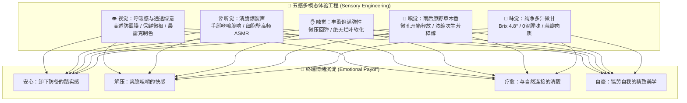
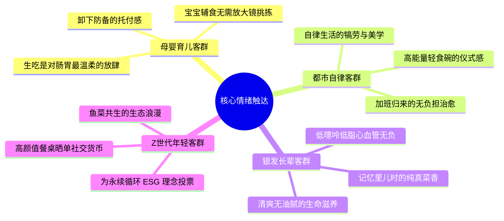
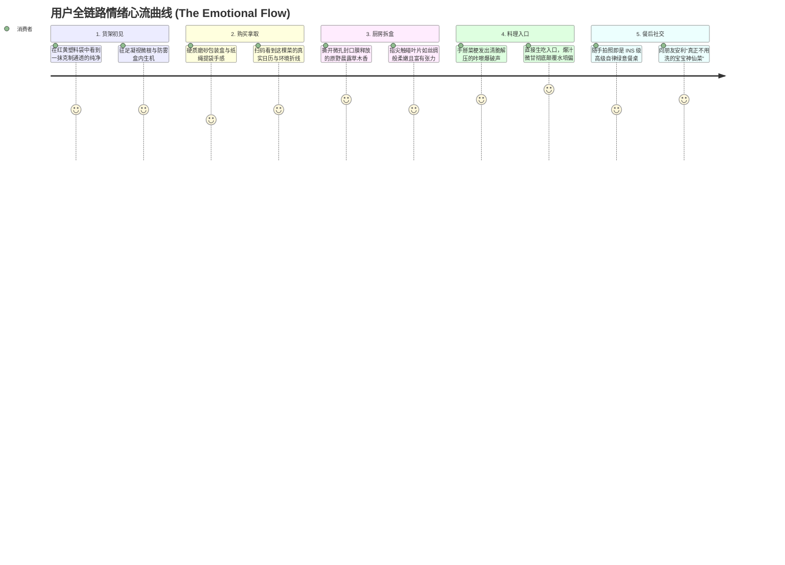

# 连锁数字化农业工厂：02_感性体验与多模态情绪设计规范 (Sensory Experience & Emotional Branding Design Specification)

> **设计公理**：  
> **数据是理性信任的底线，情绪是感性偏爱的源泉。**  
> 科技农业最致命的病症是“技术自嗨引起的科技冰冷感”——把流水线、传感器和化肥桶的意象甩给消费者，引发“生化怪人菜”的恐慌与疏离。  
> 本规范明确确立：**让工业级算法与物理装备隐于幕后，将生命力、呼吸感、爽脆解压、母婴安心与生态浪漫推向台前。**  
> 每一个触点、每一声脆响、每一抹色彩，都必须经过精密工程化设计，以在消费者心智中唤醒深层次的愉悦与治愈。

---

## 目录索引

- [一、 破除“科技冰冷感”：感性设计的伦理与审美基准](#一-破除科技冰冷感感性设计的伦理与审美基准)
  - [1.1 科技农业的“去工业化”视觉语境](#11-科技农业的去工业化视觉语境)
  - [1.2 情绪设计的本质：为都市人打造“精神安全岛”](#12-情绪设计的本质为都市人打造精神安全岛)
- [二、 五感多模态体验工程（Sensory Design Matrix）](#二-五感多模态体验工程sensory-design-matrix)
  - [2.1 视觉工程：呼吸感、水雾通透与保鲜微根](#21-视觉工程呼吸感水雾通透与保鲜微根)
  - [2.2 触觉与听觉工程：断裂脆响与咀嚼 ASMR](#22-触觉与听觉工程断裂脆响与咀嚼-asmr)
  - [2.3 嗅觉工程：微孔气调开箱的旷野草木香](#23-嗅觉工程微孔气调开箱的旷野草木香)
  - [2.4 味觉工程：糖酸黄金比与丰盈多汁感](#24-味觉工程糖酸黄金比与丰盈多汁感)
- [三、 四大人群情绪共鸣叙事系统（Emotional Narrative Archetypes）](#三-四大人群情绪共鸣叙事系统emotional-narrative-archetypes)
  - [3.1 母婴与育儿客群：从“焦虑挑拣”到“纯粹托付”](#31-母婴与育儿客群从焦虑挑拣到纯粹托付)
  - [3.2 都市白领与减脂客群：从“被动吃草”到“自律犒劳”](#32-都市白领与减脂客群从被动吃草到自律犒劳)
  - [3.3 银发健康客群：从“慢性病担忧”到“清爽滋养”](#33-银发健康客群从慢性病担忧到清爽滋养)
  - [3.4 新一代年轻人：鱼菜共生的生态浪漫与 ESG 精神共鸣](#34-新一代年轻人鱼菜共生的生态浪漫与-esg-精神共鸣)
- [四、 用户全生命周期情绪体验旅程（Emotional Touchpoint Journey）](#四-用户全生命周期情绪体验旅程emotional-touchpoint-journey)
  - [4.1 货架偶遇：在视觉喧嚣中脱颖而出的“克制留白”](#41-货架偶遇在视觉喧嚣中脱颖而出的克制留白)
  - [4.2 拆盒瞬间：仪式感撕拉与气体释放](#42-拆盒瞬间仪式感撕拉与气体释放)
  - [4.3 烹饪免洗：颠覆认知的“免水洗直接入口”](#43-烹饪免洗颠覆认知的免水洗直接入口)
  - [4.4 扫码体验：从冷冰冰报表到温暖的“生命日记”](#44-扫码体验从冷冰冰报表到温暖的生命日记)
- [五、 包装工业设计工程与材料规范](#五-包装工业设计工程与材料规范)

---

## 一、 破除“科技冰冷感”：感性设计的伦理与审美基准

### 1.1 科技农业的“去工业化”视觉语境

许多农业科技展厅或包装充斥着蓝光 LED、机械臂、电控箱和生化符号。这种语言只适合面对政府和投资者（B2B），如果直接面对家庭消费者（B2C），会立刻触发潜意识里的**“工业催熟、化学生物变异、无机塑料感”**恐惧。

| 沟通维度 | ❌ 错误的工程冷漠沟通 (The "Cold Lab" Fallacy) | ✔️ 正确的感性情绪沟通 (The "Living Vitality" Resonance) |
| :--- | :--- | :--- |
| **典型表达方式** | “通过我们先进的 PLC 变频施肥系统与高压微纳米水解，在封闭无菌车间制造出标准生菜……” | “每一滴纯净活水，都经历过活鱼与绿植的温柔互哺；在模拟晨光大温差的微风中，它悄悄锁住了深层的脆甜与生机。” |
| **消费者心智感知** | 化工厂流水线产物、生硬冰冷、生化科技怪人菜、缺乏生命温度 | 纯净、自然、生机盎然、被现代科技温柔守护的安心与纯真 |
| **终端商业后果** | 引发本能怀疑与心理防御，高溢价被视作“智商税”，极难形成高频复购 | 唤醒心理共鸣与健康生活向往，自然支撑 $300\%+$ 绿色高溢价 |

### 1.2 情绪设计的本质：为都市人打造“精神安全岛”

现代都市人群长期生活在过度加工食品、外卖高油高盐、农药残留焦虑以及高压内卷的环境中。吃一顿饭不仅是补充卡路里，更是一次**“自我身心的清淤、治愈与疗养”**。

感性品牌设计的最高使命，是将我们的纯净生鲜转化为一个**“触手可及的精神安全岛”**：
* 告诉消费者：**在这里，你无需防备，无需怀疑，尽情享受最纯粹的生命滋养。**

---

## 二、 五感多模态体验工程（Sensory Design Matrix）

情绪不是抽象的灵感，它是物理五感信号在人类大脑边缘系统（Limbic System）引发的神经递质共振。我们通过可量化的设计标准，将感官体验系统工程化：

### 2.1 视觉工程：呼吸感、水雾通透与保鲜微根

* **防雾消光高透膜 (Anti-Fog Clarity)**：
  * 普通自封袋在商超冷柜常布满水雾，导致蔬菜看起来像“浸泡在水坑里腐烂的湿草”。
  * 必须采用涂布双向拉伸聚丙烯（BOPP）防雾涂层，保证在 $0^\circ\text{C}\sim 4^\circ\text{C}$ 冷柜中镜面级通透无凝露，让消费者清晰看清叶脉的生机纹理。
* **保留“保鲜微根”的生命体态 (Living Root Retention)**：
  * 传统生鲜切除根部，本质是蔬菜死亡的开端；
  * 我们水培生菜在无菌水洗分选时，特意保留长约 $8\sim 12\,\text{mm}$ 的雪白呼吸微根，配以特制固定槽。微根向消费者直观传递：**“它不是货架上的蔬菜遗体，它依然是一株正在呼吸的鲜活生命。”**
* **色彩美学体系**：
  * 摒弃大红大黄的促销廉价感，主色调采用 **“极简白（Pure White）” + “晨雾绿（Dew Green）” + “深海蓝（Aquifer Blue）”**，视觉留白率 $\ge 45\%$，呈现高端护肤品级别的克制与纯净。

### 2.2 触觉与听觉工程：断裂脆响与咀嚼 ASMR

人在咀嚼爽脆食物时，下颌骨传导至内耳的声波能显著降低大脑皮质醇水平（释放压力）：
* **断裂脆度声学标准**：
  * 生菜经过采收前 48 小时昼夜温差炼苗，表皮细胞膨压维持在 $0.4\sim 0.6\,\text{MPa}$；
  * 消费者用手指掰断菜梗时，声学拾音分析显示在 $2.5\sim 4.5\,\text{kHz}$ 频段产生高能量断裂脉冲，呈现清脆短促的**“咔嚓（Crack）”**声；
* **咀嚼多汁感（Juicy Bounce）**：
  * 叶片厚度控制在 $0.32\pm 0.03\,\text{mm}$，咬下瞬间细胞壁破裂，大量清甜细胞液瞬间迸发，没有传统露地菜粗老塞牙的粗纤维残留。

### 2.3 嗅觉工程：微孔气调开箱的旷野草木香

* **微孔阻隔气调工程 (MAP Fragrance Seal)**：
  * 蔬菜在采收后会释放微量次生挥发油（如顺-3-己烯醇、芳樟醇）；
  * 包装盒采用微孔激光透气膜，封存适度浓度（$10\sim 25\,\text{ppm}$）的原生植物香气；
  * 当消费者撕开密封膜的一瞬间，积聚在盒顶的植物清新香气扑鼻而来，如同一阵微风拂过晨曦中的森林，瞬间击退厨房油烟味。

### 2.4 味觉工程：糖酸黄金比与丰盈多汁感

* **清甜微甘无苦味**：
  * 传统水培易产生硝酸盐苦涩味，我们通过采收前纯水冲刷将硝酸盐压制在 $<1200\,\text{mg/kg}$；
  * 可溶性固形物 Brix 维持在 $4.5^\circ \sim 5.2^\circ$，入口先是微凉的爆汁爽口，随后在舌根处泛起一丝淡淡的植物回甘。
* **水产刺身级鲜甜**：
  * 纯氧微纳米吊水使鱼肉游离氨基酸（谷氨酸、甘氨酸）富集提升 $22\%$，生滚或清蒸入口鲜甜如蟹肉，绝无一丝泥塘草腥。

---

## 三、 四大人群情绪共鸣叙事系统（Emotional Narrative Archetypes）

不同人群的脆弱点与情绪渴望截然不同。我们的品牌叙事必须精准抚平其内心的焦虑，给予最高级别的情感犒赏：

### 3.1 母婴与育儿客群：从“焦虑挑拣”到“纯粹托付”

* **用户心理痛点**：害怕农残引发婴儿肝肾负担、害怕激素导致性早熟。每次做辅食像做化学实验，反复用小苏打水浸泡、洗洁精冲洗，心力交瘁。
* **情绪主张与金句**：
  > **“给宝宝的第一口纯净辅食，不需要你戴着放大镜挑挑拣拣。”**  
  > **“洗洁精和小苏打洗不掉母亲的担心，但我们的纯水微纳米物理屏障可以。”**
* **落地触点**：外包装明确标注母婴级生食品质背书，附带“免洗即食，连根须都干干净净”的安抚标签。

### 3.2 都市白领与减脂客群：从“被动吃草”到“自律犒劳”

* **用户心理痛点**：减脂期吃水煮菜和枯燥沙拉感觉像“在受刑”，渴望轻盈但痛恨寡淡与塑料口感；工作繁重，疲惫回家无力繁琐洗切。
* **情绪主张与金句**：
  > **“自律不是对味蕾的苦修，而是一口咬下时的爆汁犒赏。”**  
  > **“撕开包装，无需淘洗，给今天疲惫的自己一盘带晨露的能量花园。”**
* **落地触点**：设计契合沙拉碗尺寸的模块化菜叶，搭配低卡冰鲜无刺锁鲜鱼排，10 分钟内完成一顿米其林级无油烟自律晚餐。

### 3.3 银发健康客群：从“慢性病担忧”到“清爽滋养”

* **用户心理痛点**：伴有三高、痛风或胃肠消化脆弱，渴望营养又害怕普通肉类脂肪过高、嘌呤超标；怀念年轻时没有化肥农药年代的自然老味道。
* **情绪主张与金句**：
  > **“清蒸不放料酒，尝尝时光倒流三十年的自然清甜。”**  
  > **“多做运动的健美鱼，给长辈低脂、弹牙、不给血管添负担的纯净蛋白。”**
* **落地触点**：强调鱼肉经过 72 小时激流锻炼后肌间脂肪降低 $25\%$，肉质如蒜瓣般紧实弹牙。

### 3.4 新一代年轻人：鱼菜共生的生态浪漫与 ESG 精神共鸣

* **用户心理痛点**：关注气候危机、动物福利、海洋微塑料与绿色低碳，厌恶冷酷剥削自然的生产方式，渴望有态度、有温度的消费。
* **情绪主张与金句**：
  > **“鱼游水欢，菜碧叶绿。我们不在大地上留下伤痕，只在方寸间重现生命的微缩生态。”**  
  > **“每一盒蔬菜，都是你为地球水资源循环投出的一张绿色选票。”**
* **落地触点**：展示节水 $90\%$ 的减碳凭证，包装盒采用玉米淀粉全降解 PLA 环保材质。

---

## 四、 用户全生命周期情绪体验旅程（Emotional Touchpoint Journey）

感性体验必须贯穿从“第一眼心动”到“空盒丢弃”的全部 6 大心流节点：

### 4.1 货架偶遇：在视觉喧嚣中脱颖而出的“克制留白”
* 许多生鲜柜堆满打折标签和杂乱保鲜袋，视觉上极具压迫感与廉价感；
* 我们的产品采用**独立立式硬挺托盒**，整齐排列如同艺术画廊中的展品；透明窗口面积精准占盒面 $68\%$，无论从俯视还是平视角度，第一眼捕捉到的都是纯粹的绿色。

### 4.2 拆盒瞬间：仪式感撕拉与气体释放
* 告别用剪刀费力剪塑料袋或抠透明胶带的粗糙体验；
* 盒沿设计有**专利“一拉即开”易撕拉环（Easy-Peel Corner）**。撕开时伴随轻柔的阻尼手感，内部微压保鲜气体缓缓逸出，带来第一道清香嗅觉冲击。

### 4.3 烹饪免洗：颠覆认知的“免水洗直接入口”
* 传统洗菜需要摘烂叶、浸泡、洗去泥土杂质；
* 盒盖内部印制温情提示：**“无尘车间微孔采收，水质优于饮用水标准。您可以直接用手指捏起菜叶入口，尝尝大自然本来的脆甜。”**
* 这种“敢于直接生吃”的笃定体验，带给用户无可比拟的省心与爽快。

### 4.4 扫码体验：从冷冰冰报表到温暖的“生命日记”
* 扫描防伪码进入的页面，不是冷漠的质检报告 PDF；
* 呈现的是拟人化的小插画界面：
  * *“嗨，我是奶油生菜 No.0842，生长在 3 号阳光温室 12 号水培床。”*
  * *“这是我 28 天前发芽的照片，这是我经历过的日光与微风折线……”*
  * *“采收前两天，AI 帮我把夜间温度调低了 8 度，所以我比平时更甜了一点点。”*
* 将硬核数据转化为具有生命温度的“植物成长故事”，让科技彻底融入温情。

---

## 五、 包装工业设计工程与材料规范

| 部件 / 触点 | 选材与工程标准 | 感性与美学目的 | 避免的负面情绪 |
| :--- | :--- | :--- | :--- |
| **透明顶盖** | 进口 BOPP 双面纳米防雾涂层，雾度 $<1.2\%$ | 晶莹剔透，如同晨露初凝的温室玻璃天窗 | 避免水滴积聚导致的“受潮腐烂、视线模糊”感 |
| **底托盒体** | 玉米淀粉基聚乳酸（PLA）生物可降解吸塑硬盒 | 硬挺抗压（承重 $>15\,\text{kg}$），抚摸呈细腻哑光质感 | 避免普通软塑料袋受挤压变形导致的“压烂感”与白色污染愧疚 |
| **封口撕膜** | 激光定深弱化线，剥离强度控制在 $4.5 \sim 6.0\,\text{N}/15\,\text{mm}$ | 一拉即断，手感顺滑且有阻尼仪式感 | 避免撕裂不齐、汁液溅出的烦躁破坏感 |
| **外包装标签** | 水性环保大豆油墨印刷，无荧光剂原白纸质 | 哑光质朴，带有微微的植物纤维触感 | 避免劣质亮面塑料贴纸的刺眼廉价商业感 |

---

## 结语：让每一次入口，都成为生命最美好的相遇

最好的科技，是让你感觉不到科技的存在，只留下大自然的慷慨与生命的跃动。

当我们用微温差算法孕育出一口清脆，用纯氧微纳米换来一缕无腥的鲜甜，我们交付给消费者的，不仅仅是一盒蔬菜或一块鱼肉，而是**在疲惫日常中一份不妥协的生活审美，一份对家人的深情厚谊，以及一份人与自然和谐共生的永恒浪漫。**
