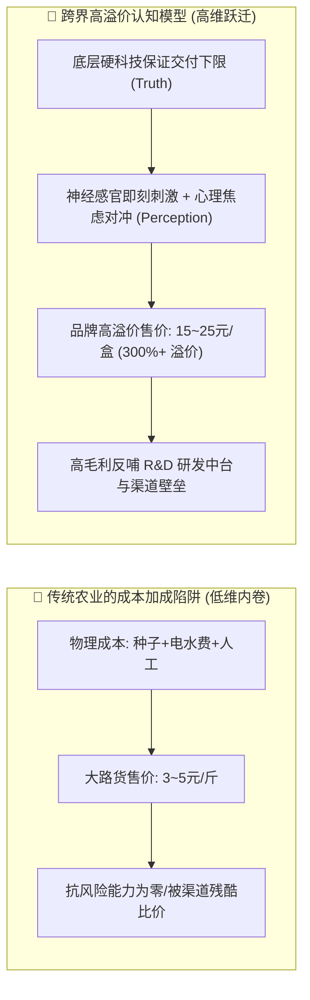
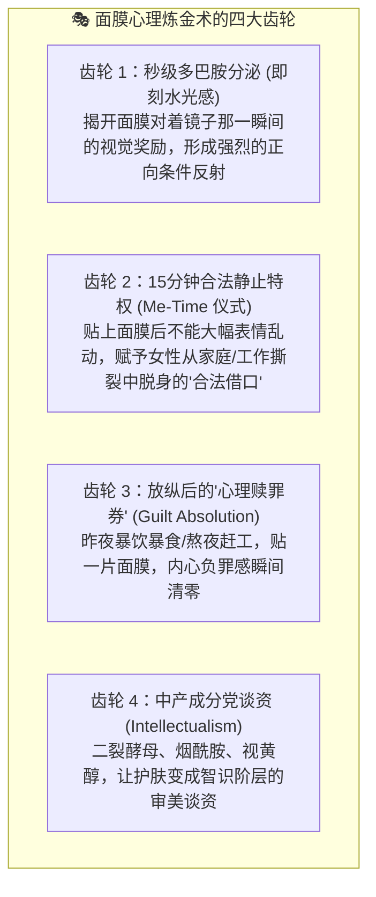
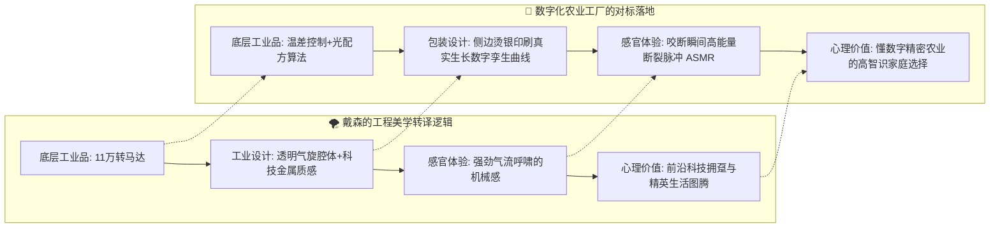
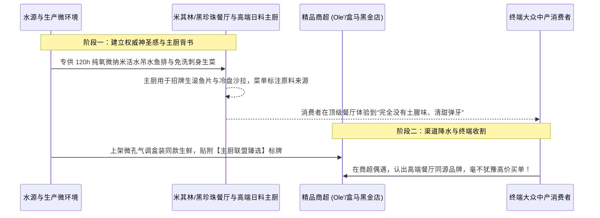
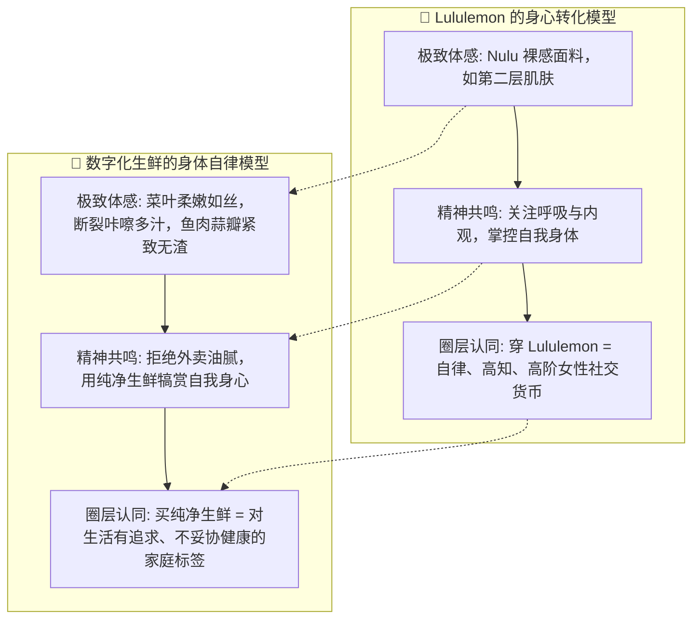

# 连锁数字化农业工厂：04_跨界品牌工程与消费心智启示录 (Cross-Industry Brand Engineering & Consumer Mindset Playbook)

> **方法论宣言**：  
> 科技农业若只向传统同行看齐（对比露天菜农或传统水产养殖户），其商业模式与品牌溢价永远会被锁死在“产地大路货、批发走量、几毛钱利差”的泥潭中。  
> 真正的品牌跃迁，必须**向成熟的高溢价消费品跨界“逆向工程”**——解构美妆护肤、高科技家电、高端饮用水与运动生活方式是如何跨越物理成本局限，在人类大脑边缘系统中创造出巨大的**感官奖赏、心理代偿、神圣仪式与阶层认同**。  
> 本专著以极端理性与科学批判的视角，深度扒皮四大经典跨界标杆的底层机制，并将其完整转译为数字化农业工厂**可直接落地执行的产品定位、包装视觉、感官工单与营销工具箱**。

---

## 目录索引

- [一、 引言：为什么科技农业必须向美妆与高端消费品跨界？](#一-引言为什么科技农业必须向美妆与高端消费品跨界)
  - [1.1 摆脱“成本加成定价”的宿命陷阱](#11-摆脱成本加成定价的宿命陷阱)
  - [1.2 行为经济学第一公理：消费者为“心理免责与自我投射”付费](#12-行为经济学第一公理消费者为心理免责与自我投射付费)
  - [1.3 跨界逆向工程的坐标系：物理真理（Truth）与认知感知（Perception）](#13-跨界逆向工程的坐标系物理真理truth与认知感知perception)
- [二、 深度解构一：美妆“面膜效应” —— 角质层屏障与情绪封包的心理炼金术](#二-深度解构一美妆面膜效应--角质层屏障与情绪封包的心理炼金术)
  - [2.1 科学扒皮：角质层屏障与短暂水合的真相](#21-科学扒皮角质层屏障与短暂水合的真相)
  - [2.2 四大核心心理机制逆向解析](#22-四大核心心理机制逆向解析)
  - [2.3 数字化农业工厂的可操作落地方案（内服绿色水光针）](#23-数字化农业工厂的可操作落地方案内服绿色水光针)
- [三、 深度解构二：戴森（Dyson）—— 如何将工业级马达转译为阶层科技图腾](#三-深度解构二戴森dyson--如何将工业级马达转译为阶层科技图腾)
  - [3.1 工业事实与品牌转译：拒绝隐藏机械，展示科技暴力美学](#31-工业事实与品牌转译拒绝隐藏机械展示科技暴力美学)
  - [3.2 数字化农业工厂的可操作落地方案（数字孪生艺术化）](#32-数字化农业工厂的可操作落地方案数字孪生艺术化)
- [四、 深度解构三：依云与巴黎水 —— 最普通的水分子如何构筑“神圣源泉”信仰](#四-深度解构三依云与巴黎水--最普通的水分子如何构筑神圣源泉信仰)
  - [4.1 水源地神圣化叙事与高端餐饮渠道降水机制](#41-水源地神圣化叙事与高端餐饮渠道降水机制)
  - [4.2 数字化农业工厂的可操作落地方案（都市微缩阿尔卑斯与主厨联盟）](#42-数字化农业工厂的可操作落地方案都市微缩阿尔卑斯与主厨联盟)
- [五、 深度解构四：Lululemon —— 极致体感与身体自律的超级认同](#五-深度解构四lululemon--极致体感与身体自律的超级认同)
  - [5.1 裸感体验（Align）与身体觉知（Mindfulness）的社群信仰](#51-裸感体验align与身体觉知mindfulness的社群信仰)
  - [5.2 数字化农业工厂的可操作落地方案（高自律生活方式连接）](#52-数字化农业工厂的可操作落地方案高自律生活方式连接)
- [六、 科技农业落地实操工具箱：认知升维的五大操作杠杆](#六-科技农业落地实操工具箱认知升维的五大操作杠杆)
  - [6.1 杠杆 1：感官即刻性（Sensory Immediacy）自检表](#61-杠杆-1感官即刻性sensory-immediacy自检表)
  - [6.2 杠杆 2：心理内疚对冲（Guilt Absolution）场景工单表](#62-杠杆-2心理内疚对冲guilt-absolution场景工单表)
  - [6.3 杠杆 3：场景神圣化（Ritual Anchoring）流程 SOP](#63-杠杆-3场景神圣化ritual-anchoring流程-sop)
  - [6.4 杠杆 4：高智识成分党（Ingredient Intellectualism）包装转译字典](#64-杠杆-4高智识成分党ingredient-intellectualism包装转译字典)
  - [6.5 杠杆 5：阶层与身份投射（Identity Signaling）视觉规范](#65-杠杆-5阶层与身份投射identity-signaling视觉规范)

---

## 一、 引言：为什么科技农业必须向美妆与高端消费品跨界？

### 1.1 摆脱“成本加成定价”的宿命陷阱

在农业领域，普遍存在着一种粗暴的思维定式：
$$\text{终端售价} = \text{农资化肥成本} + \text{人工采摘成本} + \text{电费折旧} + 15\%\text{毛利}$$

这种**“成本加成思维”**是农产品永远被压制在大宗商品（Commodity）层面的根本原因。一旦周边农场增产或天气转好，价格立刻发生踩踏崩盘。

而在美妆、高端家电与轻奢生活方式行业，其定价逻辑彻底脱钩了物理原材料成本：
* 一片售价 35 元的面膜，其无纺布与精华液原料成本往往不足 1.5 元；
* 一瓶售价 25 元的高端天然气泡水，其水体与二氧化碳成本不足 0.2 元；
* 一条售价 850 元的瑜伽裤，其锦纶/氨纶化纤布料成本不足 25 元。

它们之所以能维持 $80\%\sim 95\%$ 的惊人毛利率且长期被消费者狂热复购，是因为它们交付的从来不是“物质本身”，而是**“情绪价值、心理免责、感官犒赏与生活方式认同”**。

### 1.2 行为经济学第一公理：消费者为“心理免责与自我投射”付费

现代神经经济学（Neuroeconomics）与消费心理学研究证实：人类在做日常消费决策时，新皮层（理性脑）主要负责“事后寻找合理化借口”，而边缘系统（感性脑/杏仁核/伏隔核）才是真正的买单决策中枢。

消费者为一件商品支付超额溢价，往往基于两个强烈的深层动机：
1. **心理免责（Guilt Absolution）**：解除焦虑、内疚或恐惧。比如：*“吃这个绝对不会有农残伤害宝宝”、“吃这盘生菜能洗掉我熬夜吃外卖的罪恶感”*；
2. **自我投射（Identity Projection）**：向自己和外部世界确认自己的生活审美与阶层定位。比如：*“我是懂成分的高知女性”、“我是自律掌控自我身体的精英”*。

### 1.3 跨界逆向工程的坐标系：物理真理（Truth）与认知感知（Perception）

| 认知感知 (Perception) *(故事 / 情绪 / 仪式 / 社交价值)* \ 物理真理 (Truth) *(数据 / 检测 / 算法 / 工业底座)* | **低真理 (Truth Low)** *(缺乏硬核技术交付 / 靠天吃饭)* | **高真理 (Truth High)** *(工业级硬核交付 / 算法闭环)* |
| :---: | :--- | :--- |
| **高感知 (Perception High)** *(美妆级情绪触达 / 仪式感 / 审美认同)* | **【虚假泡沫区】** *(部分美妆 / 伪有机 / 洗澡鱼)* • **特征**：故事 100 分，物理事实 20 分 • **宿命**：概念营销收割短期溢价，但在成分党与质谱扒皮下难逃“智商税”信任崩塌。 | **【超级品牌圣杯】** ⭐ *(本项目的战略目标)* • **特征**：故事 100 分，物理事实 100 分 • **破局**：美妆级感性情绪触达 ＋ 工业级硬科技闭环交付；始于颜值与情绪，终于硬核品质，无懈可击！ |
| **低感知 (Perception Low)** *(缺乏感性设计 / 科技冰冷感 / 无品牌)* | **【悲催大路货】** *(传统菜市场大路货)* • **特征**：无技术，无故事，无标准 • **宿命**：深陷成本加成定价陷阱，品质离散，随时被渠道和天气踩踏比价。 | **【理工男自嗨区】** *(传统科技农业/植物工厂痛点)* • **特征**：数据 100 分，认知感知 20 分 • **痛点**：把传感器和仪表盘直接甩在用户脸上，投入巨大却被误认为“冷冰冰的生化怪人菜”。 |

数字化农业工厂要实现的，就是彻底跳出“理工男自嗨区”，直接进军右上角的**“超级品牌圣杯区”**。

---

## 二、 深度解构一：美妆“面膜效应” —— 角质层屏障与情绪封包的心理炼金术

### 2.1 科学扒皮：角质层屏障与短暂水合的真相

在现代皮肤医学与经皮吸收生理学中：
* **角质层结构**：由死亡的角质细胞与细胞间脂质构成紧密的“砖墙结构（Brick and Mortar Model）”，其进化本质就是阻挡外界一切大分子异物侵入体内；
* **渗透极限**：分子量超过 $500\,\text{Dalton}$（道尔顿）的物质（如大分子胶原蛋白、未交联玻尿酸）根本无法穿透角质层进入真皮层；
* **面膜的物理真相**：贴片面膜通过湿敷形成高湿度的**物理封闭环境（Occlusion）**，强迫表皮角质层过度水合膨胀，光线发生镜面漫反射。揭下面膜的那半小时，皮肤看起来水嫩透亮、毛孔隐形，但数小时后随着游离水分蒸发，角质层恢复原状，对深层真皮细胞的衰老逆转作用微乎其微。

### 2.2 四大核心心理机制逆向解析

既然科学效果如此短暂脆弱，为什么面膜能成为全球美妆界利润率最高、复购最强的必需品？

### 2.3 数字化农业工厂的可操作落地方案（内服绿色水光针）

将“面膜效应”直接复制到我们的数字化纯净果蔬与活水水产上：

#### 方案 A：打造“消化系统与肠道微生态的内服绿色水光针”
* **心智定位**：吃一盒生菜，不是为了填饱肚子，而是在给胃肠道做一次**“深层微生态清洁与水润灌注 SPA”**；
* **视觉与动作锚定**：**“免淘洗，直接用手指捏起送入口中”**。传统洗菜需要浸泡淘洗摘烂叶，这破坏了仪式的纯粹性；撕开微孔封口膜直接抓着生吃，向大脑传递的是最高级别的“无菌安心感”。

#### 方案 B：开发“周末 72 小时身心重置套盒（Body Reset Kit）”
* **瞄准场景**：都市白领周一至周五经历重油高盐外卖、奶茶咖啡轰炸，周末产生强烈的“肠胃负罪感”；
* **产品组合**：
  * 3 盒高糖度脆甜奶油生菜（富含天然果胶与叶绿素，负责肠道机械清淤）；
  * 2 份 72h 纯氧吊水去腥冰鲜银鳕鱼/鲈鱼排（无抗生素、高纯净蒜瓣蛋白，负责细胞修复）；
* **营销金句**：
  > **“面膜抚平脸上的疲惫，这一餐洗净身体深处的喧嚣。”**  
  > **“给肠胃一次彻底的放假，让每一个细胞都喝上来自纯净活水的甘露。”**

#### 方案 C：农水产品的“美妆级成分党”包装转译
美妆行业把枯燥的化学分子做成卖点，我们也可以将农业控制参数转化为**高阶营养指标**印刷在盒身：

| PURE HARVEST · 纯净微气候生理指标面板 (Ingredient Panel) | 实测认证标准值 | 对应底层工程与生物机制 |
| :--- | :---: | :--- |
| **◆ 土味素 (Geosmin) 残留** | **ND (< 10 ng/kg)** | 72h 纯氧微纳米活水微激流代谢，源头清空腥味根源 |
| **◆ 可溶性果糖 Brix 糖度** | **4.8° Brix** | 采收前 48h 昼夜 11℃ 大温差模型驱动糖分深度蓄积 |
| **◆ 次生花青素光活化指数** | **320 μmol/100g** | 靶向蓝光 (450nm) 与近紫外激发植物天然抗氧化次生代谢 |
| **◆ 62项化学合成农药残留** | **全项 0.000 (ND)** | 车间正压微滤物理阻隔 ＋ 纯物理/天敌生物闭环防控 |

---

## 三、 深度解构二：戴森（Dyson）—— 如何将工业级马达转译为阶层科技图腾

### 3.1 工业事实与品牌转译：拒绝隐藏机械，展示科技暴力美学

传统家电将马达、风道死死包裹在白塑料壳里，消费者只把它当作低廉的工具。戴森的颠覆在于：
* **核心事实**：研发出转速达 $110,000\,\text{rpm}$ 的数码无刷马达与多圆锥气旋分离技术；
* **转译策略**：
  * **透明集尘桶与可视化机械腔体**：让灰尘在透明风道里高速旋转，将“物理吸力”变成肉眼可见的“旋风秀”；
  * **先锋色彩与工业雕塑感**：采用铁灰、镍金、紫红色等重工业与赛博朋克撞色；
  * **阶层社交货币**：将一把吹风机卖到 3000 元，放在卫生间台面上，向所有到访客人无声炫耀主人的科技审美品位。

### 3.2 数字化农业工厂的可操作落地方案（数字孪生艺术化）

传统农业做包装，总喜欢画泥土、草帽、老农或可爱的卡通蔬菜，显得土气且同质化。我们应借鉴戴森的**“先锋工业精密美学”**：

1. **包装侧面的“数字孪生日历折线”**：
   * 在微孔保鲜盒侧边，用细如发丝的极简银色线条，印刷这盒蔬菜在 28 天生长周期中的**真实光温累积折线图（DLI 曲线与昼夜大温差波动）**；
   * 标注采收前 48 小时温度从 $23^\circ\text{C}$ 降至 $12^\circ\text{C}$ 的“糖度跃升跃迁点”；
   * 消费者拿在手里，像是在欣赏一份精密的手表机芯图纸，瞬间产生**“这是一件严谨的工业艺术品”**的心智震撼。
2. **“透明车间微缩慢直播”扫码交互**：
   * 扫码进入的页面，不是千篇一律的宣传片，而是呈现**“数字孪生三维可视化视角”**：
   * 消费者可以滑动时间轴，查看这颗生菜在温室第几号床位、哪一天经历了日出模拟、哪一天水泵进行了微量元素脉冲加药，用戴森式的硬核数据征服新中产。

---

## 四、 深度解构三：依云与巴黎水 —— 最普通的水分子如何构筑“神圣源泉”信仰

### 4.1 水源地神圣化叙事与高端餐饮渠道降水机制

饮用水本质就是 $H_2O$ 混合微量矿物盐，但依云（Evian）和巴黎水（Perrier）将其打造成了液体奢侈品：
* **时空神圣化**：依云宣称“每一滴水都源自阿尔卑斯山高山融雪，在数万年前形成的冰川砂层中极其缓慢地渗透过滤了整整 15 年”；
* **渠道降水效应（Trickle-Down Channel Strategy）**：
  * 巴黎水最初绝不进普通便利店，而是专门进驻米其林三星法餐厅、顶级爵士酒吧与高档高尔夫俱乐部；
  * 当精英阶层在高级社交场合将其作为“品位佐餐水”饮用后，大众消费者在超市看到它时，便愿意为了“体验一次上流社交的生活切片”而支付 10 倍溢价。

### 4.2 数字化农业工厂的可操作落地方案（都市微缩阿尔卑斯与主厨联盟）

1. **温室微环境的“神圣化叙事”**：
   * 我们不在阿尔卑斯山，但我们拥有**“人工创造的纯净微环境圣殿”**；
   * 叙事语言重塑：
     > “在都市边缘的玻璃穹顶下，有一片完全与外界污染、雾霾和病菌隔绝的微气候圣殿。  
     > 每一滴水都在活鱼与绿植之间静谧循环，经过深层微滤与紫外光催化净化，纯度甚至超越高山泉水。”
2. **“黑珍珠/米其林主厨研发联盟”工程**：
   * 设立专门的餐饮大客户解决方案部；
   * 针对高端清蒸粤菜、高端日料刺身店，提供 $120\,\text{h}$ 纯氧吊水鱼排小批量定制；
   * 邀请知名主厨在菜单上明确印制：**“本项目鱼生/清蒸鱼采用 [品牌名] 纯氧微纳米生态活水鱼，纯净无腥，无需料酒遮掩”**；
   * 通过高端餐饮的“味蕾朝圣”，向终端生鲜零售市场形成压倒性的降水背书。

---

## 五、 深度解构四：Lululemon —— 极致体感与身体自律的超级认同

### 5.1 裸感体验（Align）与身体觉知（Mindfulness）的社群信仰

Lululemon 没有把自己定义为运动服制造商，它开创了一种关于“身心自律与身心觉知”的现代世俗宗教：
* **极致体感（Sensory Superiority）**：Align 系列采用独家研发的 Nulu 面料，消除摩擦接缝，创造出前所未有的“裸感（Naked Sensation）”——穿上就像没穿一样轻柔贴合；
* **身心觉知叙事（Mindfulness）**：不谈竞技与胜负（不同于耐克“Just Do It”），只谈“呼吸、内观、与自己的身体和解”；
* **大使社群闭环（Community Ambassadorship）**：签约当地高端瑜伽馆、普拉提馆店长和优秀教练作为品牌大使，把产品融入精英女性每周的自律修炼场景中。

### 5.2 数字化农业工厂的可操作落地方案（高自律生活方式连接）

1. **定义农水产品的“极致体感指标”**：
   * 绝不提供“粗纤维老叶”与“土腥松垮鱼肉”。在生产端制定严格的**采收期叶龄控制工单**（生菜生长期死锁在 $28\sim 32$ 天，此时叶片细胞壁果胶含量最高、木质素含量低于 $0.8\%$）；
   * 入口体感必须做到：**“如丝绸般柔嫩、一咬即断、丰盈爆汁、无任何残渣塞牙”**。
2. **“纯净生机打卡社群”与生活方式跨界**：
   * 不要在传统菜市场做促销，而是与精品瑜伽馆、普拉提工作室、高端产后康复中心合作；
   * 发起“21天晨光纯净早餐挑战”：为学员提供每周定制冷链配送的“晨露生菜 + 纯净低温鱼排”；
   * 结合学员在社群、小红书的轻食打卡，将我们的品牌打造为**“自律、洁净、高阶审美生活方式的标配”**。

---

## 六、 科技农业落地实操工具箱：认知升维的五大操作杠杆

为了让上述跨界智慧不沦为纸上谈兵，我们制定了以下五套**直接面向产品经理、工业包装设计师、渠道销售与社媒运营的实操工具箱**：

### 6.1 杠杆 1：感官即刻性（Sensory Immediacy）自检表

任何推向市场的高溢价产品，必须在 **用户接触的最初 5 秒内** 触发至少 3 项即刻生理刺激：

| 感官触点 | 自检标准 (Checklist) | 未达标时的工业修正工单 |
| :--- | :--- | :--- |
| **视觉通透度** | 在 $2^\circ\text{C}$ 冷柜中，盒面防雾率达 $100\%$，无任何水珠阻挡视线 | 更换双面涂布 BOPP 防雾消光膜（表面张力 $\ge 42\,\text{mN/m}$） |
| **生机完整性** | 根部保留 $8\sim 12\,\text{mm}$ 雪白呼吸微根，浸于特制微水凝胶保鲜槽 | 调整切根机械臂激光切割高度坐标，保留微根 |
| **断裂 ASMR** | 手指掰折菜梗，发出声频 $2.5\sim 4.5\,\text{kHz}$ 的短促清脆咔嚓声 | 采收前 48h 开启夜间 $10^\circ\text{C}$ 大温差模型，增加细胞膨压 |
| **开箱嗅觉冲击** | 撕开密封膜瞬间，扑鼻释放原野芳草清香（无任何塑料发酵臭） | 优化微孔气调透气率，维持盒内 $\text{O}_2$ 在 $3\%\sim 5\%$ 休眠区间 |
| **味觉入口爆汁** | 入口第 1 秒咬破表皮，清甜汁水瞬间迸发，Brix 糖度 $\ge 4.8^\circ$ | 采收前补光增加蓝光与远红光比例，促进淀粉向果糖转化 |

### 6.2 杠杆 2：心理内疚对冲（Guilt Absolution）场景工单表

| 目标客群 | 现实痛点与内心内疚感 (Guilt) | 我们的品牌产品方案 (The Absolution) | 核心话术与沟通触点 |
| :--- | :--- | :--- | :--- |
| **母婴新手妈妈** | 担心外购蔬菜农残伤害婴儿器官发育，辅食制作反复浸泡心力交瘁 | **母婴级免洗纯净生菜碗**（物理隔离车间直出，菌落总数优于饮用水） | *“洗洁精和小苏打洗不掉母亲的焦虑，但我们的微纳米物理屏障可以。无需淘洗，直接入口。”* |
| **高压加班白领** | 连续一周吃重油麻辣外卖与夜宵，肠胃胀气，内心充满对健康的罪恶感 | **72小时身体重置能量套餐**（高糖度生菜 + 纯氧吊水低脂鱼排） | *“昨晚熬夜吃的外卖，今天用一整盘纯净绿意还给身体。一口咬下，把体内油腻清空。”* |
| **减脂健身达人** | 每天吃水煮鸡胸肉和寡淡生菜，味蕾麻木，产生严重的“自我惩罚感” | **清甜多汁爆裂生菜 + 蒜瓣肉质高蛋白鱼排**（低卡同时拥有米其林口感） | *“自律不是对味蕾的苦修，而是为身体挑选最昂贵的纯净燃料。减脂也能吃出幸福感。”* |

### 6.3 杠杆 3：场景神圣化（Ritual Anchoring）流程 SOP

将日常简单的“吃菜/吃鱼”转化为具有心理疗愈功能的**“四步解压微仪式”**：

| 仪式步骤 | 核心感官动作 (Physical Action) | 释放的心理与情绪价值 (Psychological Payoff) |
| :--- | :--- | :--- |
| **步骤 1：深呼吸开箱** | 指尖扣动易撕拉环，感受平滑阻尼，深吸一口散逸出的晨间草木香 | 触发嗅觉记忆，瞬间阻断厨房油烟烦躁，建立身心疗愈的仪式期待 |
| **步骤 2：解压断裂声** | 用手指轻轻折断生菜梗，聆听那声清脆悦耳的“咔嚓”ASMR 爆破声 | 高频声学脉冲刺激听觉骨传导，秒级降低皮质醇，释放工作压力 |
| **步骤 3：免洗直接吃** | 彻底打破传统洗菜淘洗规矩，直接将第一片嫩叶送入口中，体会爆汁微甜 | 体验到最高级别的“无条件信任与安全托付”，颠覆水培寡淡偏见 |
| **步骤 4：生命日历扫码** | 手机轻扫盒侧码，看一眼这株植物 28 天里沐浴过的阳光与微风日记 | 从冷漠的“消费者”转变为“生命见证者”，产生深层的温情与共鸣 |

### 6.4 杠杆 4：高智识成分党（Ingredient Intellectualism）包装转译字典

| 底层工程技术与生物参数 | 传统低维农业说法 (禁用 ❌) | 美妆/高端食品化的高智识转译 (推荐 ✔️) |
| :--- | :--- | :--- |
| **昼夜大温差光配方调控** | “我们用的光照好，所以菜长得甜” | **“48h 晨光大温差糖度跃升算法 (Brix 4.8° 固形物蓄积)”** |
| **72h 纯氧微纳米活水吊水** | “我们在水库里把鱼饿了三天排便” | **“72h 纯氧微纳米活水微激流排腥 (Geosmin 降解至未检出限)”** |
| **封闭车间物理隔离与天敌生物防治** | “我们从来不打药，凭良心种植” | **“正压微滤微环境阻隔 ＋ 0 化学合成农药物理屏障”** |
| **解耦调理池多微量元素添加** | “我们在水里加了肥料和营养液” | **“解耦靶向螯合微量元素平衡系统 (富含高活性游离铁与镁)”** |
| **一物一码 IoT 传感器历史入库** | “扫码看我们的溯源大棚监控” | **“每株独立时空数字孪生档案 (真实 DLI 光照/水质时间序列)”** |

### 6.5 杠杆 5：阶层与身份投射（Identity Signaling）视觉规范

* **包装材质的触觉层次**：
  * 外盒底托拒绝廉价薄脆塑料，采用**高刚性玉米淀粉聚乳酸（PLA）哑光微磨砂硬盒**，手感温润沉稳；
  * 外提袋使用原浆无漂白牛皮纸配棉质平纹编织手提绳，彻底消灭塑料袋的廉价外卖感。
* **社交媒体（小红书/Instagram）视觉出片率规范**：
  * 透明盒盖与内部生菜的色彩对比度经过光学测定，在自然室内光照下拍照，叶片呈现清澈透亮的**“薄荷晨露冷光绿”**，极易融入高净值人群的冷淡风、极简风餐桌晒单；
  * 摆盘无需专业刀工，只需用手随性撕开摆放，即是高级轻食能量碗的视觉构图。

---

## 结语：在物理事实的岩石上，盛开情绪的花朵

跨界向美妆与高端消费品学习，不是教我们去搞虚假营销或制造概念泡沫。

恰恰相反，**传统美妆因为科学机理脆弱，常在理性扒皮下陷入危机；而我们拥有不计成本打造的现代农业数字化工厂，拥有真实的 0 农残、真实的糖度跃升、真实的无土腥味与真实的数据链条。**

当我们用最高标准的工业与数据系统铸造了不可撼动的**“事实底座”**，再借用跨界成熟的**“感性情绪工程、感官即刻刺激与生活方式认同”**去唤醒消费者的心灵，这才是现代农业从“靠天吃饭的传统农奴”蜕变为“高盈利、受尊重、有尊严的现代品牌帝国”的唯一正途。
