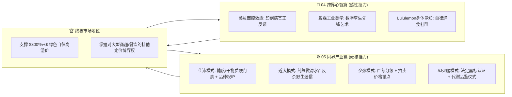

# 连锁数字化农业工厂：05_全球标杆农产品品牌工程与溢价启示录 (Global Agri-Food Benchmarks & Premium Engineering Playbook)

> **战略公理**：  
> 传统农产品之所以有 99% 沦为地摊大路货，并非因为“农业不能做品牌”，而是绝大多数农企缺乏**“严苛科学分级、品种专利垄断、心智价格锚定与击碎野生偏见”**的工业化系统工程能力。  
> 本专著与前篇《04_跨界品牌工程与消费心智启示录.md》（心智武器篇）构成**“产业双璧”**。  
> 我们深度扒皮全球四大顶级高端农产品与现代水产标杆的底层商业逻辑与生物控制工程，提炼出可以直接在数字化工厂落地的**品控出厂门禁、数字配方专利、价格锚点公关与主厨科研体验店战术工具箱**。

---

## 目录索引

- [一、 认知破局：解构农产品“高溢价垄断”的三大底层支柱](#一-认知破局解构农产品高溢价垄断的三大底层支柱)
  - [1.1 传统农产品“丰产不丰收”的产业死结](#11-传统农产品丰产不丰收的产业死结)
  - [1.2 高端农产品三要素：物理门禁、品种权力与心智锚点](#12-高端农产品三要素物理门禁品种权力与心智锚点)
  - [1.3 04篇（跨界情绪）与05篇（同界产业）的协同飞轮模型](#13-04篇跨界情绪与05篇同界产业的协同飞轮模型)
- [二、 深度解构一：新西兰佳沛（Zespri）—— 工业化干物质分级与品种权帝国](#二-深度解构一新西兰佳沛zespri--工业化干物质分级与品种权帝国)
  - [2.1 科学机理：为什么“干物质含量（Dry Matter）”是生鲜命门？](#21-科学机理为什么干物质含量dry-matter是生鲜命门)
  - [2.2 商业垄断：品种权（PVR）与全球单一出口控制权](#22-商业垄断品种权pvr与全球单一出口控制权)
  - [2.3 数字化农业工厂的可操作落地方案（数字配方资产与Brix门禁）](#23-数字化农业工厂的可操作落地方案数字配方资产与brix门禁)
- [三、 深度解构二：日本近大金枪鱼（Kindai Tuna）—— 击碎“野生优越论”的水产范式](#三-深度解构二日本近大金枪鱼kindai-tuna--击碎野生优越论的水产范式)
  - [3.1 水产行业的认知顽疾：野生盲从与人工歧视](#31-水产行业的认知顽疾野生盲从与人工歧视)
  - [3.2 近畿大学的科学反杀：水质零重金属与风味一致性超越野生](#32-近畿大学的科学反杀水质零重金属与风味一致性超越野生)
  - [3.3 渠道引爆点：大学水产研究所直营店排队神话](#33-渠道引爆点大学水产研究所直营店排队神话)
  - [3.4 数字化农业工厂的可操作落地方案（纯氧活水自证与主厨联盟体验店）](#34-数字化农业工厂的可操作落地方案纯氧活水自证与主厨联盟体验店)
- [四、 深度解构三：日本夕张甜瓜与晴王葡萄 —— 残酷淘汰制分级与价格锚点公关](#四-深度解构三日本夕张甜瓜与晴王葡萄--残酷淘汰制分级与价格锚点公关)
  - [4.1 一藤一瓜的淘汰哲学与红外无损四级法定理化分级](#41-一藤一瓜的淘汰哲学与红外无损四级法定理化分级)
  - [4.2 筑地/丰洲首拍天价：价格锚点的公关艺术](#42-筑地丰洲首拍天价价格锚点的公关艺术)
  - [4.3 数字化农业工厂的可操作落地方案（特秀级与首批采收竞拍）](#43-数字化农业工厂的可操作落地方案特秀级与首批采收竞拍)
- [五、 深度解构四：西班牙 5J 伊比利亚火腿 —— 生物代谢机理与文化品鉴仪式](#五-深度解构四西班牙-5j-伊比利亚火腿--生物代谢机理与文化品鉴仪式)
  - [5.1 国家法令四色标与橡木果油酸代谢故事](#51-国家法令四色标与橡木果油酸代谢故事)
  - [5.2 侍肉师（Cortador）仪式与感官资产沉淀](#52-侍肉师cortador仪式与感官资产沉淀)
  - [5.3 数字化农业工厂的可操作落地方案（黑标水产排腥与生食冷盘标准）](#53-数字化农业工厂的可操作落地方案黑标水产排腥与生食冷盘标准)
- [六、 科技农业同界落地四大实操战术工具箱](#六-科技农业同界落地四大实操战术工具箱)
  - [6.1 工具箱 1：农水产品出厂分级标准矩阵表（Grading Matrix）](#61-工具箱-1农水产品出厂分级标准矩阵表grading-matrix)
  - [6.2 工具箱 2：Crop Ontology 算法配方与知识产权保护清单](#62-工具箱-2crop-ontology-算法配方与知识产权保护清单)
  - [6.3 工具箱 3：首批采收“价格锚点公关拍卖会”执行 SOP](#63-工具箱-3首批采收价格锚点公关拍卖会执行-sop)
  - [6.4 工具箱 4：击碎“野生土塘偏见”的对比检测与主厨体验店指南](#64-工具箱-4击碎野生土塘偏见的对比检测与主厨体验店指南)

---

## 一、 认知破局：解构农产品“高溢价垄断”的三大底层支柱

### 1.1 传统农产品“丰产不丰收”的产业死结

传统农业受制于大宗商品定价模型，永远在**“价格周期律”**中痛苦轮回：
* **丰产踩踏**：当年天气优良导致产量大增，收购商残酷压价，甚至出现“菜烂在地里不够人工采收费”的惨剧；
* **品质离散**：没有工业级检测，一车货里好瓜坏瓜混杂，批发商只能按最低品质给出保守估价；
* **缺乏出海口**：散户各自为战，面对沃尔玛、大润发等大型商超毫无议价博弈筹码。

### 1.2 高端农产品三要素：物理门禁、品种权力与心智锚点

对比全球顶级农业标杆，凡是能摆脱低价宿命、享有 $300\%\sim 1000\%$ 暴利溢价的企业，无一例外建立在三大底层支柱上：

| 溢价支柱 | 传统农企的普遍做法 (低维溃败) | 全球高端标杆的核心策略 (高维垄断) |
| :--- | :--- | :--- |
| **支柱 1：物理质量门禁 (Gatekeeper)** | 凭工人肉眼和手感随意采收，好坏混卖 | **以传感器硬指标为门禁**：不到干物质/糖度/排腥标准，系统绝不放行出厂。 |
| **支柱 2：知识产权垄断 (IP Monopoly)** | 购买市场上公开流通的种子/鱼苗，毫无壁垒 | **专利品种/数字农艺配方强占**：通过植物新品种权（PVR）或算法加密锁定定价权。 |
| **支柱 3：心智价格锚点 (Anchoring PR)** | 被动等待采购商核算成本后讨价还价 | **主动制造天价公关事件**：用拍卖天价或高端直营店拉升全品类的奢侈品认知。 |

### 1.3 04篇（跨界情绪）与05篇（同界产业）的协同飞轮模型

---

## 二、 深度解构一：新西兰佳沛（Zespri）—— 工业化干物质分级与品种权帝国

### 2.1 科学机理：为什么“干物质含量（Dry Matter）”是生鲜命门？

早期的猕猴桃（奇异果）皮厚多毛、极易酸涩，消费者常买到“放硬如石头、软了已腐烂”的劣质品。佳沛攻克这一痛点的核心就是**将生化机理转化为量化指标**：
* **科学真相**：猕猴桃在树上积累的不是糖，而是淀粉与不溶性果胶为主的**干物质（Dry Matter, DM）**。采收后，只有 DM 足够高的果子，在后熟过程中才能被果实自身的淀粉酶充分水解为葡萄糖与果糖；
* **硬核出厂门禁（Taste Zespri Program）**：
  * 佳沛绝不允许果农凭肉眼采收，而是成立独立监测团队；
  * 采收前对全果园进行网格化取样，使用烘箱或近红外光谱仪测定干物质比；
  * **干物质阈值达标线**：绿果必须 $\text{DM} \ge 15.5\%$，阳光金果必须 $\text{DM} \ge 16.5\%$。达不到指标一律封园禁采，直至养分蓄积到位。
* **分级定价**：干物质每多出 $0.5\%$，佳沛向果农支付的收购价递增 $15\%$。用真金白银驱动全产业链把“好吃”做成了工业级标准。

### 2.2 商业垄断：品种权（PVR）与全球单一出口控制权

* **阳光金果（SunGold / G3）专利壁垒**：
  * 传统海沃德绿果是公用老品种，任何人都能种，利润极低；
  * 佳沛历时 10 年杂交育种筛选出 SunGold（G3），申请了全球植物新品种权（PVR）；
  * 果农必须向佳沛购买授权牌照才能种植，并在全球范围组建维权法务团。任何非授权私自种植或销售金果的行为，都会面临数千万巨额跨境索赔；
* **单一出海口（Single Desk System）**：
  * 新西兰立法规定，全国所有猕猴桃出口统一由 Zespri 品牌垄断运作，杜绝了果农之间互相杀价、以次充好的内耗，一致对外统筹全球商超渠道。

### 2.3 数字化农业工厂的可操作落地方案（数字配方资产与Brix门禁）

| 佳沛经验维度 | 佳沛传统做法 | 数字化农业工厂落地策略 (Our Action) |
| :--- | :--- | :--- |
| **品质硬门禁** | 人工取样测定干物质比（DM） | **基于 Brix 糖度与叶龄的自动化采收放行工单**：水培生菜必须达到 $\text{Brix} \ge 4.8^\circ$，且生长积分达标，MES 贴标系统才允许放行出厂。 |
| **品种知识产权** | 植物新品种权（PVR）专利垄断 | **Crop Ontology 数字农艺配方作为核心数字资产**：将微温差曲线、解耦加药比例、动态光配方加密打包，申请软件著作权与商业机密保护。 |
| **渠道排他性** | 单一出海口统一对外集采 | **加盟基地统购统销认证中枢**：所有加盟基地产品必须接入集团商贸门户，统一贴附【数字化认证标识】直供商超，严禁基地私自降价窜货。 |

---

## 三、 深度解构二：日本近大金枪鱼（Kindai Tuna）—— 击碎“野生优越论”的水产范式

### 3.1 水产行业的认知顽疾：野生盲从与人工歧视

在水产消费心智中，普遍存在一种近乎宗教的“野生优越论”：
* “水库天然鱼、江河野生鱼才是有灵气的顶级货”；
* “人工工厂养殖的鱼都是吃抗生素和化学颗粒饲料催肥的，肉质松垮、有一股土腥味，根本上不了台面”。

这一认知壁垒导致传统养殖水产永远只能以野生鱼 $1/5 \sim 1/10$ 的低价贱卖。

### 3.2 近畿大学的科学反杀：水质零重金属与风味一致性超越野生

日本近畿大学（Kindai University）历经 32 年攻关，成为全球首个跑通蓝鳍金枪鱼**“从卵孵化 $\to$ 陆基循环育苗 $\to$ 成鱼人工繁育闭环”**的机构。他们向“野生迷信”发起了教科书级别的科学反杀：

| 对比维度 | 传统野生蓝鳍金枪鱼 (Wild Tuna) | 近畿大学人工完全循环养殖金枪鱼 (Kindai Tuna) |
| :--- | :--- | :--- |
| **重金属与微塑料** | 海洋环境污染导致食物链顶端富集，汞与多氯联苯超标风险高 | **全物理微滤循环水与人工洁净饵料，实测汞与重金属 0 超标** |
| **寄生虫隐患** | 野生捕捞极易携带异尖线虫（Anisakis），必须深度冷冻灭虫 | **水体深层微滤紫外消毒，实测寄生虫检出率为 0**，支持顶级鲜切生食 |
| **肌间脂肪分布** | 野生觅食不稳定，不同季节捕捞的鱼体脂肪厚度离散度极大 | **全年恒温水流逆流锻炼，大理石状雪花肉（Toro）比例稳定在 45%** |

### 3.3 渠道引爆点：大学水产研究所直营店排队神话

近畿大学深知，光在学术期刊发论文无法改变公众偏见。他们采取了极具攻击性的**“餐饮直营体验杀”**：
1. **开辟直营试验餐厅**：在大阪梅田和东京银座开设“近畿大学水产研究所直营餐厅”；
2. **菜单即科研白皮书**：餐桌垫纸详细印制人工繁育与野生鱼的重金属比对曲线；
3. **主厨现切体验**：顶级主厨现场切分刺身，食客品尝后发现油脂比野生更细腻、口感更清纯，餐厅创下连续 5 年每日大排长龙的商业奇迹；
4. **从“替代品”变为“道德先锋”**：宣传“吃近大金枪鱼，是保护濒危野生海洋资源的环保高尚行为”，赋予其极高的道德优越感。

### 3.4 数字化农业工厂的可操作落地方案（纯氧活水自证与主厨联盟体验店）

我们的高密度循环水养殖（加州鲈/银鳕鱼）同样面临“土腥味/饲料鱼”的质疑。对标近大模式，我们制定以下战术：

| 战术环节 | 落地工程与执行标准 |
| :--- | :--- |
| **战术 1：排腥数据公开对决** | 制作《工厂纯氧活水鱼 vs 传统土塘鱼理化指标全景对决卡》，将 Geosmin（土味素 $<10\,\text{ng/kg}$）与抗生素 0 检出报告公开挂网。 |
| **战术 2：水动力塑形实验** | 鱼池配备环形激流喷嘴（$0.4\,\text{m/s}$ 流速），迫使鱼群全天巡游。实测证明红肌比例提升 $25\%$，蒜瓣肉质口感完全超越土塘静水鱼。 |
| **战术 3：旗舰基地微型直营日料/清蒸体验吧** | 在首期示范基地设立“透明微缩品鉴厨房”，邀请周边高端餐饮采购总厨盲测品尝清蒸鱼片（不加葱姜料酒），靠第一口纯净原味直接锁死大宗采购协议。 |

---

## 四、 深度解构三：日本夕张甜瓜与晴王葡萄 —— 残酷淘汰制分级与价格锚点公关

### 4.1 一藤一瓜的淘汰哲学与红外无损四级法定理化分级

日本夕张王甜瓜（Yubari King Melon）与晴王麝香葡萄（Shine Muscat）之所以能成为亚洲水果奢侈品，核心在于其**近乎冷酷的淘汰与分级体系**：
* **人工残酷截流**：一根藤蔓上结出多个幼瓜后，果农无情剪掉其他次品，**只留最中间形态完美的那一颗**，让整株植物的养分全额输送给这一颗果实；
* **红外光谱无损糖度透视**：夕张甜瓜采收后，通过日本农协（JA）专属检测流水线。每颗瓜必须经过红外无损传感器穿透扫描，计算果心固形物含量，严格划分为四大法定等级：

| 法定等级 | 占比比例 | 糖度指标 (Brix) | 网纹与外观标准 | 商业归宿 |
| :---: | :---: | :---: | :--- | :--- |
| **特秀 (Super Premium)** | **$< 0.15\%$** | **$\ge 13.0^\circ$** | 网纹覆盖率 $\ge 90\%$，网眼极度均匀，果形完全对称 | 顶级竞拍、国宾礼赠、最高奢华木盒包装 |
| **秀品 (Premium)** | **$\approx 10\%$** | **$\ge 12.0^\circ$** | 网纹细密，无瑕疵，果柄鲜绿T字形 | 高端百货礼品柜台（售价 $1.5\sim 3$ 万日元） |
| **优品 (High)** | **$\approx 65\%$** | **$\ge 11.0^\circ$** | 网纹完整，轻微形态不对称 | 普通精品商超盒装零售 |
| **良品 (Standard)** | **$\approx 25\%$** | **$\ge 10.0^\circ$** | 糖度及格，网纹略粗糙 | 面包房甜点原料或加工果酱 |

> **关键铁律**：只要糖度低于 $10.0^\circ$ Brix，哪怕外观再完美，也坚决销毁或降级为果汁，绝不允许冠以“夕张”品牌流向市场。

### 4.2 筑地/丰洲首拍天价：价格锚点的公关艺术

每年 5 月下旬，夕张甜瓜迎来当年第一批上市。日本农协会在东京丰洲市场（原筑地）举行隆重的**“首拍仪式”**：
* **天价公关事件**：首批采收的 2 颗“特秀级”甜瓜，往往由当地高级水果行或连锁超市以 **300 万 ~ 500 万日元（约 15 ~ 25 万人民币）** 的天价竞拍中标；
* **全球公关效应**：这一天价新闻会瞬间登顶日本 NHK、雅虎乃至全球各大外媒头条，引爆亿级社交声量；
* **价格锚点心理机制（Price Anchoring）**：
  * 大众消费者在心智深处被植入强烈锚点：“夕张甜瓜是价值百万日元的顶级天物”；
  * 当他们几天后在商超货架上看到售价 5000 日元（约 250 元人民币）的“优品级”夕张瓜时，不但不觉得贵，反而觉得“性价比极高、人人都能尝得起的平民贵族体验”。

### 4.3 数字化农业工厂的可操作落地方案（特秀级与首批采收竞拍）

| 落地策略 | 执行工程规范与商业动作 |
| :--- | :--- |
| **双层产品线分级** | **设立【特秀黑标 Super-Black】与【纯净绿标 Pure-Green】**： • 特秀黑标：采收前 Brix 糖度 $\ge 5.2^\circ$、单颗叶重 $180\pm 5\,\text{g}$，配备独立亚克力气调展盒； • 纯净绿标：Brix $\ge 4.5^\circ$，标准微孔气调保鲜盒。 |
| **年度首批新品“主厨竞拍会”** | 每年春季/秋季温室首批启动“大温差极致糖度跃升算法”的批次，邀请 20 位米其林/黑珍珠主厨举行内部认购盲品会，发布年度第一份 e-COA 质检单并制造行业公关新闻。 |

---

## 五、 深度解构四：西班牙 5J 伊比利亚火腿 —— 生物代谢机理与文化品鉴仪式

### 5.1 国家法令四色标与橡木果油酸代谢故事

西班牙生火腿（Jamón）依靠极其严密的国家原产地保护（DOP）和生化代谢叙事，打破了猪肉廉价的大宗属性：
* **四色标签法定准入**：西班牙王室颁布法令，火腿蹄部必须带有塑料密封扣环：
  * **白标**：集约圈养普通白猪；
  * **绿标**：在农场圈养并添加谷物饲料的伊比利亚杂交猪；
  * **红标**：75% 纯种、有橡木果放养周期的火腿；
  * **黑标（100% Bellota）**：**母系与父系均为 100% 纯种伊比利亚黑猪，且在德黑萨（Dehesa）原始橡树林中放养至少 60 天，增重全部来自天然橡木果**。
* **生物化学转化神话**：
  * 橡木果富含单宁酸与油酸。黑猪在山野间每日狂奔 10 公里觅食，运动使脂肪渗透进肌纤维之间，形成如同雪花牛肉的大理石纹理；
  * 代谢后的单不饱和脂肪酸（油酸）占比高达 $55\%$ 以上，**脂肪融化温度只有 $28^\circ\text{C}$，手心托住片刻即化**；
  * 营销上将其赞誉为：“**长在四条腿上的橄榄树**”，使吃高热量腌肉变成了“健康有益心血管的高雅享受”。

### 5.2 侍肉师（Cortador）仪式与感官资产沉淀

西班牙火腿绝不在工厂用切片机粗暴机器分切，而是诞生了专门的职业——**专业侍肉师（Cortador de Jamón）**：
* 专用弧形火腿架固定猪蹄，手持特制细长柔性刀；
* 以精确到毫米的厚度片下如蝉翼般透光的肉片，放在微温的白瓷盘上；
* 消费者用手指拈起直接送入口中，借助口腔体温将肉间油脂徐徐融化，感受橡木果香气在鼻腔回荡。

### 5.3 数字化农业工厂的可操作落地方案（黑标水产排腥与生食冷盘标准）

| 5J 火腿经验维度 | 5J 经典做法 | 数字化农业工厂落地规范 (Our Protocol) |
| :--- | :--- | :--- |
| **生化代谢故事** | 橡木果单宁酸转化为不饱和油酸 | **微纳米纯氧超速代谢与土味素（Geosmin）清排机理**：详细解构断食吊水期间，鱼体如何通过鳃血管将游离腥味分子释放至水体并经 UV 分解。 |
| **专业品鉴手势与工具** | 侍肉师手切透光薄片 | **“纯净刺身生滚仪轨”**：为合作高端餐厅设计标准《纯氧活水鱼清蒸与鱼生开鱼标准操作手卡》，要求切片厚度 $<1.5\,\text{mm}$，白瓷盘微冷藏陈列。 |
| **尊贵身份背书** | 蹄部不可拆卸黑标封环 | **鱼鳃部穿挂防伪易碎封签**：每一条合格出厂的特秀级鲜鱼，鳃盖固定一枚激光全息一物一码封环，上桌前由食客亲自核销。 |

---

## 六、 科技农业同界落地四大实操战术工具箱

### 6.1 工具箱 1：农水产品出厂分级标准矩阵表（Grading Matrix）

数字化农业工厂全面实行“两级出厂分级”，杜绝任何不合格品流入高端渠道：

| 农水产品类目 | 【特秀黑标级 (Super-Black)】 *(溢价率 300%+)* | 【纯净绿标级 (Pure-Green)】 *(溢价率 150%+)* | 【不达标降级品 (Off-Grade)】 *(禁止冠名销售)* |
| :--- | :--- | :--- | :--- |
| **水培奶油生菜** | • 糖度 $\text{Brix} \ge 5.2^\circ$ • 单颗重 $180\pm 10\,\text{g}$，冠幅完全对称 • 保留雪白呼吸微根 $10\pm 2\,\text{mm}$ • 断裂声频 $\ge 3.5\,\text{kHz}$（爆脆） | • 糖度 $\text{Brix} \ge 4.5^\circ$ • 单颗重 $160\sim 210\,\text{g}$ • 无黄叶烂边，免淘洗出厂 | • 糖度 $\text{Brix} < 4.0^\circ$ 或木质素超标 • 转为中央厨房榨汁/轻食沙拉代工原料 |
| **纯氧吊水加州鲈** | • 吊水时长 $\ge 120\,\text{h}$（微激流推流） • Geosmin $< 5\,\text{ng/kg}$ (绝对未检出) • 体型流线型，肌间脂肪比 $<8\%$ • 鱼肉可溶性游离谷氨酸 $\ge 12\,\text{mg/g}$ | • 吊水时长 $\ge 72\,\text{h}$ • Geosmin $< 10\,\text{ng/kg}$ • 鲜活或冰鲜三枚切鱼排 | • 吊水未满 72h 或检出微量土腥味 • 强制延长吊水或作为普通活鱼批发流转 |

### 6.2 工具箱 2：Crop Ontology 算法配方与知识产权保护清单

| 数字资产类别 | 具体技术内容 | 知识产权防护手段 | 商业防御价值 |
| :--- | :--- | :--- | :--- |
| **数字温差光配方** | 采收前 48h 阶梯式降温（$11^\circ\text{C}$ 温差）与蓝光/红光 PPFD 动态调优模型 | 软件著作权 ＋ 云端中央大脑算法加密不落地 | 防止加盟基地解约后私自克隆高糖度生产参数 |
| **水动力加药平衡模型** | 解耦调理池水力多环路螯合铁/微量元素物料守恒自治计算公式 | 发明专利布局 ＋ 工业核心商业机密 | 构筑软硬件一体化护城河，确立技术母品牌行业标准 |
| **鱼菜共生生物资产库** | 12 座试验舱累积的生菜/番茄/鲈鱼多表型数字孪生生长曲线 | 数据库版权登记 ＋ 区块链存证时间戳 | 支撑与农科院、地方国投合作时的无形资产作价 |

### 6.3 工具箱 3：首批采收“价格锚点公关拍卖会”执行 SOP

| 执行阶段 | 关键时间节点 | 核心动作与产出物 | 预期达成的公关效果 |
| :--- | :--- | :--- | :--- |
| **筹备期** | 首批上市前 15 天 | 选定 1 号温室 01 槽首批特秀级蔬菜与 1 号净化池首批 120h 活水鱼，锁定编号 | 制作带物理编号的限量版【首发封测礼盒】 |
| **竞拍发布会** | 首批采收当日清晨 | 在城市高空艺术中心举办“现代数字农业首批高品质生鲜品鉴竞拍会” | 邀请高端商超买手、黑珍珠餐厅主厨与科技媒体参会 |
| **价格锚点引爆** | 发布会现场 | **0001 号特秀级蔬菜盒与 0001 号活水鱼排公开竞拍**，由合资方或名厨高价拍下 | 制造“一盒生菜拍出千元天价”的行业新闻热搜 |
| **终端顺势收割** | 竞拍次日 | 盒马/Ole'全面上架日常版【纯净绿标】（标价 18~22 元/盒） | 消费者产生“花 20 元享受千元科技同源品质”的心智倾斜 |

### 6.4 工具箱 4：击碎“野生土塘偏见”的对比检测与主厨体验店指南

| 落地模块 | 具体执行标准与参数 | 现场话术与感官指引 |
| :--- | :--- | :--- |
| **物理微观对比台** | 设置高倍光学显微镜与紫外暗箱：一边展示普通土塘鱼鳃部附着的杂质与吸虫，一边展示微滤纯氧鱼鲜红无暇的鳃丝 | *“主厨，请看镜下纤维。土塘底泥有大量放线菌与寄生虫卵，而我们的微滤活水从物理上杜绝了杂质。”* |
| **清蒸原味双盲品鉴** | 准备两盘无葱姜、无料酒、纯净水清蒸的鱼片（A盘为市售水库鱼，B盘为工厂 120h 吊水鱼），让食客盲品评分 | *“不需要任何香料压味。请先喝一口清汤，再嚼一口鱼肉，立刻能感受到哪一边是纯净的清甜。”* |
| **即时质谱数据同屏显示** | 体验店大屏轮播当天晨检的 GC-MS 土味素分析折线与荧光 DO 在线监控数据 | 像近大金枪鱼一样，用绝对透明的实验室真实数据打碎传统经验玄学。 |

---

## 结语：以全球巨头为镜，走稳数字农业品牌之路

佳沛用干物质门禁打碎了“看天吃饭”的无奈，近畿大学用科学数据打碎了“野生盲从”的迷信，夕张甜瓜用残酷淘汰建立了顶级溢价，5J 火腿用生物代谢讲出了世界传奇。

这四大标杆告诉我们：**农业从来不是低端产业，生鲜完全可以承载极致的商业尊严与巨额利润。**

当我们的数字化农业工厂左手握紧《04 跨界心智篇》的感性情绪武器，右手扎稳《05 同界产业篇》的硬核工程战术，我们不仅是在种菜养鱼，更是在重塑中国现代农业工业化品牌的最强护城河。
