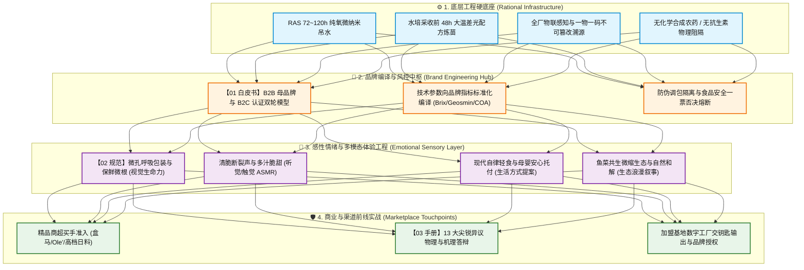

# 连锁数字化农业工厂：05_品牌战略、感性工程与营销实战知识库 (Brand Strategy, Emotional Engineering & Marketing Hub)

> **最高原则**：  
> 品牌不是浮于表面的广告营销或文案自嗨，而是**“物理、生物、数据与供应链系统运行后的必然技术结晶”**；  
> 同时，高科技农业必须**坚决破除“冷冰冰的化工厂/流水线”刻板印象**。我们通过**“感性情绪工程”**将严密的数据底座转化为多模态感官体验、生活方式认同与人与自然共生的生命诗意。  
> 简言之：**“工业数据隐于幕后守护底线，感性情绪立于台前打动人心。”**

---

## 🗺️ 模块导航与全景索引

本目录面向**集团品牌策略委员会、大客户与商超招商总监、终端销售与体验店团队、以及跨界工业设计/包装伙伴**，构建了从顶层战略、感性设计到前线实战防御的完整知识链条：

| 序号 | 核心文档 | 核心定位与解决的问题 | 核心受众 | 关联底层子系统 |
| :---: | :--- | :--- | :--- | :--- |
| **01** | [01_品牌战略与认知系统工程白皮书.md](01_品牌战略与认知系统工程白皮书.md) | **品牌系统工程纲领**：双轮驱动模型（Intel Inside 模式）、感性品牌承诺的技术编译矩阵、品牌全生命周期防伪与食品安全熔断防线。 | 决策层、投资人、品牌总监、大客户战略代表 | `03_system_architecture` `04/06_brand_traceability_crm` |
| **02** | [02_感性体验与多模态情绪设计规范.md](02_感性体验与多模态情绪设计规范.md) | **情绪与体验工程规范**：视触嗅听多模态感官体验（微孔呼吸包装、爽脆爆破 ASMR）、现代自律生活方式提案与生态共生叙事。 | 视觉/工业设计师、DTC运营、内容策划、社媒公关 | `04/05_supply_chain_and_commerce` `04/08_agronomy_knowledge_rnd` |
| **03** | [03_农水产品客户异议与品质答辩手册.md](03_农水产品客户异议与品质答辩手册.md) | **实战防御武器库**：面向盒马/Ole'买手与中产消费者的 13 大尖锐异议逐项击破（土腥味、水培寡淡、化肥致癌疑虑、高溢价答辩）。 | 一线销售、店长、社群运营、大客户拓展经理 | `04/01_aquaculture` `04/02_hydroponics` `04/07_quality_assurance_lab` |
| **04** | [04_跨界品牌工程与消费心智启示录.md](04_跨界品牌工程与消费心智启示录.md) | **跨界商业与心理启示 (心智武器篇)**：深度解构美妆面膜（即刻反馈/独处仪式/健康赎罪券）、戴森工业美学、依云水源神圣化与Lululemon身体觉知，提炼五大落地实操工具箱。 | 商业决策层、产品经理、品牌策划、包装设计、社媒运营 | `04/05_supply_chain_and_commerce` `04/06_brand_traceability_crm` |
| **05** | [05_全球标杆农产品品牌工程与溢价启示录.md](05_全球标杆农产品品牌工程与溢价启示录.md) | **同界高端农业标杆 (产业战术篇)**：深度解构新西兰佳沛干物质门禁与品种垄断、日本近大金枪鱼科学反杀野生迷信、夕张甜瓜价格锚点公关、西班牙5J火腿代谢叙事与四大落地工具箱。 | 集团战略层、农艺与水产总监、大客户销售、品控合规经理 | `04/01_aquaculture` `04/02_hydroponics` `04/07_quality_assurance_lab` |

---

## 🏛️ 品牌系统工程核心架构图

---

## 💡 品牌认知双轴定位法则 (The Dual-Axis Rule)

在全集团所有品牌与对外输出场景中，必须时刻自检是否遵循**“理性轴（X）与感性轴（Y）的交汇”**：

$$\text{品牌综合势能} = \underbrace{\text{理性确定性底座 (X)}}_{\text{无药/高糖/无腥/真溯源}} \times \underbrace{\text{感性情绪共鸣力 (Y)}}_{\text{五感触达/生活审美/温情托付}}$$

* **若 $X \to 0$（仅有情怀故事，缺乏工程交付）**：即传统农业的“虚假玄学”，一旦遇到商超买手抽检或消费者挑剔口感，品牌瞬间坍塌；
* **若 $Y \to 0$（仅有参数报表，缺乏感性设计）**：即高科技农业的“冰冷化工厂”，消费者心智产生排斥，无法建立深层偏爱，更难以支撑 $300\%+$ 的绿色高溢价；
* **双轴齐备 $(X \ge 1 \land Y \ge 1)$**：科技作为忠诚的沉默卫士，为每一口入口的鲜甜与安宁提供绝对庇护。

---

## 🔗 与其他知识域的关联路径

* **技术底层支撑**：
  * 水产生态与排腥工艺详见：[04_subsystems/01_aquaculture/README.md](../04_subsystems/01_aquaculture/README.md)
  * 糖度跃升与微气候控制详见：[04_subsystems/02_hydroponics/README.md](../04_subsystems/02_hydroponics/README.md)
  * 溯源防伪与社媒舆情中台详见：[04_subsystems/06_brand_traceability_crm/README.md](../04_subsystems/06_brand_traceability_crm/README.md)
  * 实验室抽检标准与比对详见：[04_subsystems/07_quality_assurance_lab/README.md](../04_subsystems/07_quality_assurance_lab/README.md)
* **顶层宏观对齐**：
  * 企业终极使命与愿景详见：[01_introduction_and_glossary/01_企业使命愿景与核心价值观.md](../01_introduction_and_glossary/01_企业使命愿景与核心价值观.md)
