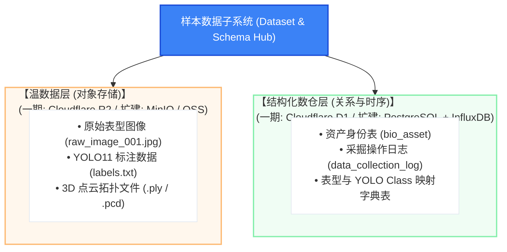
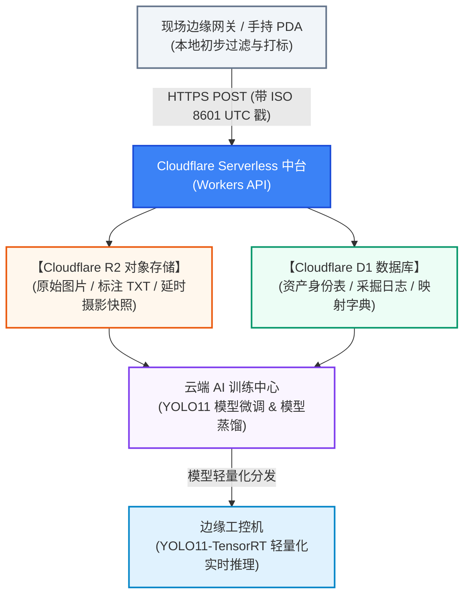

# 连锁数字化农业工厂：01_YOLO11活体生物数据集构建规范 (YOLO11 Biological Dataset Construction Specification)

在数字化工厂建设的初期，活体生物数据集与数据库模型的设计至关重要。它的核心目标是：**“防呆、结构化、高可信度”**地将现场采集到的生物表型图像与特征，转化为格式统一、时空对齐且便于 YOLO11 及视觉大模型（VLM）训练的标准数据集（参见《[白皮书 4.3 传统农业数据荒漠破解](../01_introduction_and_glossary/03_鱼菜共生数字工业化白皮书.md)》）。

本规范构建了一套严谨的“多学科因果链条数据架构”，结合云原生冷热存储策略（参见《[白皮书 5.2 数据协同与传输层](../01_introduction_and_glossary/03_鱼菜共生数字工业化白皮书.md)》），为实现高确定性的数字精密工业沉淀核心数据资产。

---

## 1. 活体生物数据模型架构蓝图

所有现场采集的生物样本图像与表型数据，必须以 **“严格 ISO 8601 UTC 毫秒时间戳 (`YYYY-MM-DDTHH:mm:ss.000Z`) + 生物资产 ID (`asset_id`) + 物理区域码 (`zone_id`)”** 作为全局绝对主键索引：



---

## 2. 数据库 Schema 规范与 DDL 定义

系统在云端与边缘端维护两套对齐的 DDL 定义（支持 Cloudflare D1 / SQLite 与标准 PostgreSQL）：

### 2.1 资产主表与采掘日志表 (The Source of Truth)

```sql
-- 适配 Cloudflare D1 (SQLite) 与 PostgreSQL 规范

-- 1. 资产主表 (定义生物归属批次、所在物理区域)
CREATE TABLE bio_asset (
    asset_id      TEXT PRIMARY KEY,                            -- 资产全局唯一 UUID (如 550e8400-e29b-41d4-a716-446655440000)
    asset_type    TEXT NOT NULL CHECK (asset_type IN ('fish', 'plant')),
    batch_id      TEXT NOT NULL,                               -- 供应链批次编号 (Batch ID)
    zone_id       TEXT NOT NULL,                               -- 物理车间/池号编码 (如 tank_01, raceway_03)
    created_at    TEXT NOT NULL                                -- 严格 ISO 8601 UTC 毫秒格式 (YYYY-MM-DDTHH:mm:ss.000Z)
);

-- 2. 采掘与抽样日志表 (记录每一次现场采掘的因果时间戳)
CREATE TABLE data_collection_log (
    log_id        TEXT PRIMARY KEY,                            -- 日志 UUID
    asset_id      TEXT REFERENCES bio_asset(asset_id),
    worker_id     TEXT NOT NULL,                               -- 采集人工号
    device_id     TEXT NOT NULL,                               -- 采集设备 ID (PDA / 固定相机)
    image_r2_url  TEXT NOT NULL,                               -- Cloudflare R2 对象存储访问路径
    collected_at  TEXT NOT NULL                                -- 严格 ISO 8601 UTC 毫秒格式 (YYYY-MM-DDTHH:mm:ss.000Z)
);
```

---

## 3. 生物表型分类标签与 YOLO11 映射字典 (The AI Interface)

本数据字典定义了企业内部活体生物健康度与病害表型的统一映射体系（参见《[白皮书 7.1 计算机视觉与异常初筛](../01_introduction_and_glossary/03_鱼菜共生数字工业化白皮书.md)》）：

```sql
-- 表型 Class ID 映射主表 (对齐 YOLO11 TXT 格式的 Class ID)
CREATE TABLE phenotype_class_mapping (
    class_id      INTEGER PRIMARY KEY,                         -- YOLO 格式类别整数索引 (0, 1, 2...)
    class_name    TEXT UNIQUE NOT NULL,                        -- 视觉表型标签英文标识
    description   TEXT NOT NULL,                               -- 农艺/动保专家标定的特征描述
    target_object TEXT NOT NULL CHECK (target_object IN ('plant', 'fish', 'general'))
);

-- 预置核心表型 Class 字典
INSERT INTO phenotype_class_mapping (class_id, class_name, description, target_object) VALUES
(0, 'healthy_plant',    '叶片翡翠绿，冠层饱满，无病斑',              'plant'),
(1, 'deficient_plant',  '叶片发黄、缺铁/缺氮斑点或叶缘干枯',          'plant'),
(2, 'pest_infestation', '可见蚜虫、红蜘蛛群聚或真菌霉斑',            'plant'),
(3, 'normal_fish',      '游姿平稳，体表鳞片完整自然，摄食欲望正常',    'fish'),
(4, 'floating_fish',    '鱼头密集浮于水面张口呼吸 (浮头缺氧先兆)',    'fish'),
(5, 'surface_lesion',   '鱼体表面出现白斑、水霉或局部溃烂充血',        'fish');
```

---

## 4. YOLO11 标注格式与目录组织规范

训练数据集统一采用 Ultralytics YOLO11 标准标注格式：

### 4.1 YOLO11 目标检测与分割标签格式
* **目标检测 (`.txt`)**：
  `<class_id> <x_center> <y_center> <width> <height>` (归一化浮点数 $0.0 \sim 1.0$)
* **实例分割 (`.txt`)**：
  `<class_id> <x1> <y1> <x2> <y2> ... <xn> <yn>` (归一化轮廓多边形坐标)

### 4.2 数据集文件系统组织
```text
dataset_yolo11/
├── dataset.yaml                         # 数据集配置文件 (类别与路径定义)
├── train/
│   ├── images/                          # 训练集图像 (如 raw_0001.jpg)
│   └── labels/                          # 训练集标注 (如 raw_0001.txt)
├── val/
│   ├── images/
│   └── labels/
└── test/
    ├── images/
    └── labels/
```

---

## 5. 存储架构与数据流转



> [!IMPORTANT]
> **【数据规范红线】**：
> 1. 所有上传的数据记录，其时间字段必须使用标准格式 `YYYY-MM-DDTHH:mm:ss.000Z`。
> 2. 图像文件名必须遵循 `{batch_id}_{zone_id}_{timestamp_ms}.jpg` 命名规则，保证时空溯源闭环。