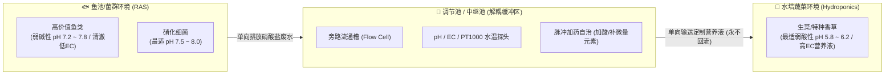
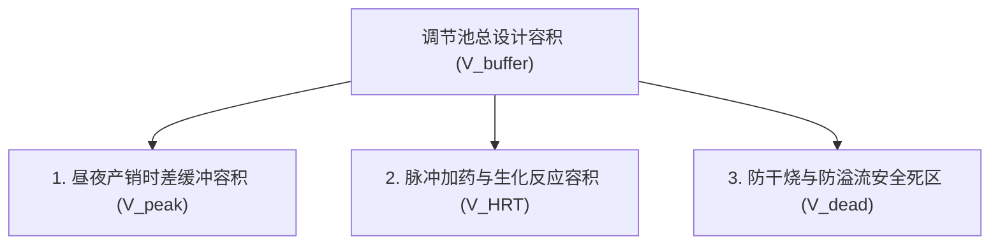

# 连锁数字化农业工厂：02_调节池水力计算与加药自治规范 (Buffer Tank Hydraulic Calculation & Dosing Control Specification)

在解耦式鱼菜共生数字化工厂（Decoupled Aquaponics）中， **调节池（又称水质调理池 / 中继中转池，Mixing & Buffering Tank）** 是连接“水产养殖子系统（生产者）”与“水培种植子系统（消费者）”的核心物理中枢与生化反应器。

本规范详述了调节池在生态解耦架构下的物理定位、水力物料守恒计算模型、容积与流量工程公式、硬件与传感器选型、PLC 脉冲加药自治算法及工程实战算例。

---

## 1. 系统定位与生态解耦机理



### 1.1 生产者-消费者解耦模型
* **生产者（鱼端 RAS）**：鱼类摄食排泄经生物滤池硝化反应转化为硝酸盐水体，定期单向排入调节池。
* **中间缓冲区（调节池）**：在此独立完成调酸（pH 降至 $5.8 \sim 6.2$）、补充植物必需的螯合铁（Fe-EDDHA/Fe-DTPA）及钙镁微量元素、均质化恒温。
* **消费者（菜端水培）**：水培温室根据作物蒸腾速率按需从调节池单向抽取营养液。
* **铁律红线**：**水体单向流动，调理后的弱酸高营养水体永远禁止回流鱼池**，从物理上隔离两端生物环境冲突，保护高价值鱼群生物资产。

---

## 2. 调节池流量计算公式体系 ($Q$)

### 2.1 基于植物蒸腾蒸发 ($ET_c$) 的基准日流量公式

水培作物吸收的水分 $95\%$ 以上通过叶片气孔蒸腾排入温室大气。因此，调节池的日均出水流量 $Q_{\text{daily}}$ 首先由种植区的**作物蒸腾蒸发总量**决定：

$$Q_{\text{daily}} = A_{\text{plant}} \times ET_c \times (1 + \eta_{\text{loss}})$$

* **$Q_{\text{daily}}$**：调节池每日需向菜池供给的总水量（$\text{L/day}$ 或 $\text{m}^3\text{/day}$）。
* **$A_{\text{plant}}$**：水培种植槽有效净栽培面积（$\text{m}^2$）。
* **$ET_c$**：作物日蒸腾蒸发速率（$\text{L}/(\text{m}^2\cdot\text{day})$ 或 $\text{mm/day}$）：
  * 夏季强光通风期：$4.0 \sim 6.0\,\text{L}/(\text{m}^2\cdot\text{day})$；
  * 春秋温和生长期：$2.5 \sim 4.0\,\text{L}/(\text{m}^2\cdot\text{day})$；
  * 冬季弱光低温期：$1.5 \sim 2.5\,\text{L}/(\text{m}^2\cdot\text{day})$。
* **$\eta_{\text{loss}}$**：清洗、采收带水及管路挥发损耗系数（工程上取 $0.05 \sim 0.10$）。

---

### 2.2 基于“鱼-菜”氮素物料守恒的供需校验公式

鱼池产生的硝酸盐总量需与蔬菜吸收需求保持动态平衡：

$$Q_{\text{daily}} = \frac{M_{\text{fish}} \times R_{\text{feed}} \times C_{\text{protein}} \times 0.16 \times \eta_{\text{excr}} \times \eta_{\text{nitrif}}}{C_{\text{NO}_3^--\text{N, target}}}$$

* **$M_{\text{fish}}$**：鱼池存塘鱼群总生物量（$\text{kg}$）。
* **$R_{\text{feed}}$**：日投喂率（$\%/\text{day}$，成鱼一般为 $1.0\% \sim 2.0\%$）。
* **$C_{\text{protein}}$**：饲料粗蛋白比例（如高蛋白饲料为 $40\% \sim 45\%$）。
* **$0.16$**：蛋白质中氮元素的化学平均质量占比（$16\%$）。
* **$\eta_{\text{excr}}$**：鱼类摄入氮转化为排泄氨氮的转化率（通常取 $60\% \sim 75\%$）。
* **$\eta_{\text{nitrif}}$**：生物滤池硝化转化率（工业滤池为 $90\% \sim 95\%$）。
* **$C_{\text{NO}_3^--\text{N, target}}$**：供给菜池的目标硝酸盐氮浓度（$\text{mg/L}$，绿叶菜一般设为 $100 \sim 150\,\text{mg/L}$）。

> **水力平衡法则**：
> * 若氮素转化水量 **$<$** 蒸腾耗水量：系统出现水分亏缺，需在调节池配置自来水/纯水**电动补水阀**自动补齐；
> * 若氮素转化水量 **$>$** 蒸腾耗水量：系统富营养，需在前端加大物理排泥脱水或扩大后级水培种植面积。

---

### 2.3 瞬时供水泵额定流量选型公式

$$q_{\text{pump}} = \frac{Q_{\text{daily}}}{t_{\text{irrigation}}} \times K_{\text{peak}}$$

* **$q_{\text{pump}}$**：中继供水泵或脉冲输送泵的额定流量（$\text{m}^3\text{/h}$ 或 $\text{L/min}$）。
* **$t_{\text{irrigation}}$**：每日计划输水窗口时间（小时，通常集中在白天光照时段 $8 \sim 10$ 小时）。
* **$K_{\text{peak}}$**：正午峰值蒸腾不均匀系数（取 $1.3 \sim 1.5$）。

---

## 3. 调节池有效容积计算公式体系 ($V_{\text{buffer}}$)

调节池需同时满足**“生化反应停留”**、**“昼夜产销错峰”**与**“安全防干烧”**三大工程约束：



### 3.1 综合设计容积公式

$$V_{\text{buffer}} = \frac{\max\Big(V_{\text{peak}},\, V_{\text{HRT}}\Big) + V_{\text{batch}}}{1 - \beta_{\text{dead}}}$$

#### 分项参数定义与计算：

1. **昼夜产销时差缓冲容积 ($V_{\text{peak}}$)**：
   * 鱼池排污换水常在夜间或清晨集中进行，而蔬菜吸水高峰集中在白天（8:00~17:00 消耗全天的 $85\%$）。
   * 调节池必须储备大半天的用水量以平抑供需峰谷：
     $$V_{\text{peak}} = Q_{\text{daily}} \times (1 - \gamma_{\text{day\_ratio}})$$
     *(通常 $V_{\text{peak}} \approx 0.6 \sim 0.8 \times Q_{\text{daily}}$)*
2. **生化反应与水力停留容积 ($V_{\text{HRT}}$)**：
   * 蠕动泵加入稀酸与微量元素后，需经潜水循环泵充分搅拌混合，水力停留时间 $\text{HRT}_{\text{min}} \ge 2.0\,\text{小时}$：
     $$V_{\text{HRT}} = q_{\text{pump, max}} \times \text{HRT}_{\text{min}}$$
3. **单批次排污纳污容积 ($V_{\text{batch}}$)**：
   * 鱼池反冲洗或集中排污单次进入的最大脉冲体积（一般为单鱼池水体的 $5\% \sim 10\%$）。
4. **死水与防溢安全系数 ($\beta_{\text{dead}}$)**：
   * 包含池底防沉淀杂质吸入死水位、潜水泵最小淹没高度及池顶防溢流干舷空间（取 $0.20 \sim 0.25$）。

---

### 3.2 工业工程速算公式（经验法则）

在连栋温室的标准工程选型中，调节池总容积可按 **$1.2 \sim 1.5$ 倍日耗水量** 快速标定：

$$V_{\text{buffer}} \approx (1.2 \sim 1.5) \times Q_{\text{daily}}$$

---

## 4. 硬件选型与感知集成规范

| 设备/组件 | 规格型号与选型推荐 | 物理安装与集成规范 | 核心功能与业务价值 |
| :--- | :--- | :--- | :--- |
| **旁路流通槽总成 (Flow Cell)** | 透明亚克力/PVC 旁路槽 (带 1/2" 快插接口) | 从中继循环管路引出一小股平稳水流经过小槽，消灭水流气泡与大颗粒杂质冲刷 | 为 pH/EC/温度传感器提供稳定的测试环境，消灭气泡干扰与读数漂移 |
| **工业级 pH 传感器** | 双盐桥工业玻璃 pH 电极 + RS-485 变送器 | 插入旁路流通槽，带 PTFE 抗污染隔膜，每 2 周使用标准缓冲液校准 | 实时监测调节池 pH 是否稳定在 5.8~6.2 目标区间 |
| **工业级 EC 传感器** | 四电极电导率仪 ($0 \sim 10\,\text{mS/cm}$) + 变送器 | 插入旁路流通槽，RS-485 接入 PLC | 监控调理后营养液总盐分浓度，防止养分亏缺或烧根 |
| **中继水温传感器** | PT1000 316L 不锈钢护套探头 | 插入旁路流通槽，以 $0.1^\circ\text{C}$ 高精度采集 | 监控进入菜池前的水温，评估温室根区热应激 |
| **高低液位开关** | 316L 不锈钢浮球液位开关 (24V DI) | 调节池高液位/低液位各 1 个，直连 PLC 输入点 | 溢流报警切断进水，低液位硬件熔断供水泵供电 |
| **脉冲加药蠕动泵** | 工业级高精度步进蠕动泵 (24V DC / RS485) | 进料端接入酸液罐/微量元素罐，出料管接入调节池进水跌水处 | 毫升级精细加酸加肥，响应 PLC 脉冲控制指令 |

---

## 5. PLC 本地控制与脉冲加药自治算法

### 5.1 脉冲加药自治逻辑
植物根系对酸碱度的剧烈突变极度敏感。PLC 固件中严禁采用连续加药逻辑，必须执行**“小步长、长间隔”**的脉冲自适应调节算法：

```text
[PLC 加药控制周期 (每 15 分钟触发一次)]:
1. 读取旁路流通槽当前实时 pH 均值 (取 10s 滑动平均);
2. 计算偏差: ΔpH = 实时 pH - 目标 pH (5.80);
3. IF ΔpH > 0.30 THEN:
     启动加酸蠕动泵运行 5 秒 (脉冲下料);
     启动水下循环泵搅拌 10 分钟 (充分均质混合);
     静置 5 分钟后进入下一个判定周期;
   ELSE IF ΔpH < -0.20 THEN:
     触发加碱/补水稀释逻辑;
   ELSE:
     保持待机 (处于死区范围内，不执行加药).
```

### 5.2 严格防回流与防干烧硬互锁
* **防干烧互锁**：当低液位浮球触发（有效容积 $<25\%$）时，PLC 梯形图硬件级切断供水泵供电，并开启自来水补水阀；
* **物理防回流**：进水管路加装机械止回阀与单向电磁阀，PLC 严禁配置任何向鱼池方向泵水的输出触点。

---

## 6. 典型工程实战算例

以 **1 栋 $1000\,\text{m}^2$ 连栋温室（深水浮板水培生菜）+ 配套 RAS 养鱼车间** 为例：

### 6.1 基础参数
* 有效水培种植面积 $A_{\text{plant}} = 800\,\text{m}^2$；
* 夏季设计最大蒸腾速率 $ET_c = 5.0\,\text{L}/(\text{m}^2\cdot\text{day})$；
* 管路与采收损耗系数 $\eta_{\text{loss}} = 0.05$。

### 6.2 计算推导
1. **计算日均需求流量 $Q_{\text{daily}}$**：
   $$Q_{\text{daily}} = 800\,\text{m}^2 \times 5.0\,\text{L}/(\text{m}^2\cdot\text{day}) \times 1.05 = 4,200\,\text{L/day} = 4.2\,\text{m}^3\text{/day}$$
2. **计算供水泵额定流量 $q_{\text{pump}}$**（按白天 8 小时均匀补水，峰值系数 $K_{\text{peak}} = 1.3$）：
   $$q_{\text{pump}} = \frac{4.2\,\text{m}^3}{8\,\text{h}} \times 1.3 \approx 0.68\,\text{m}^3\text{/h} \approx 11.3\,\text{L/min}$$
3. **计算调节池设计容积 $V_{\text{buffer}}$**（采用工业速算法，安全裕量系数 1.35）：
   $$V_{\text{buffer}} = 4.2\,\text{m}^3 \times 1.35 \approx 5.67\,\text{m}^3$$
   *工程选型*：选用 **$6.0\,\text{m}^3$（6 吨级）食品级抗 UV 聚乙烯 (PE) 立式水箱** 或 304 不锈钢保温调节水箱。

---

## 7. 反复调整成功的经验教训（【备注与防护墙】）

> [!IMPORTANT]
> **【经验教训备注 1：加药局部死区防护】**
> 严禁将加酸/加肥蠕动泵出料管直接贴近给菜池供水的水泵吸水口。加药点必须设在调节池**进水跌水处或水下曝气搅拌器正上方**，并保证至少 15 分钟的机械混合循环，否则未稀释的浓酸脉冲会直接随泵进入水培槽，导致数米范围内的生菜幼苗在 2 小时内烂根死亡。
>
> **【经验教训备注 2：液位硬互锁保护】**
> 调节池必须在 PLC 中设置 **“双浮球低液位连锁”**：当液位降至 $25\%$ 警界线时，PLC 必须硬件级切断供水泵供电（防干烧烧毁电机），同时触发自来水电动补水阀强制补水，直到恢复至 $60\%$ 安全水位。
>
> **【经验教训备注 3：严格 ISO 8601 时空对齐标签】**
> 调节池作为水流流经的中继点，边缘网关每 5 秒打包宽表上传时，必须计算并附加 `lag_seconds`（流体流动时滞），并生成 `water_origin_timestamp`，确保云端 AI 因果分析模型具备高置信度。
