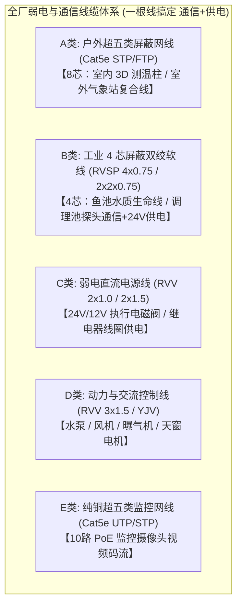
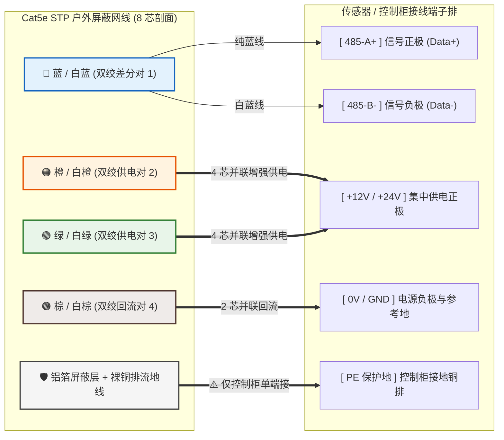
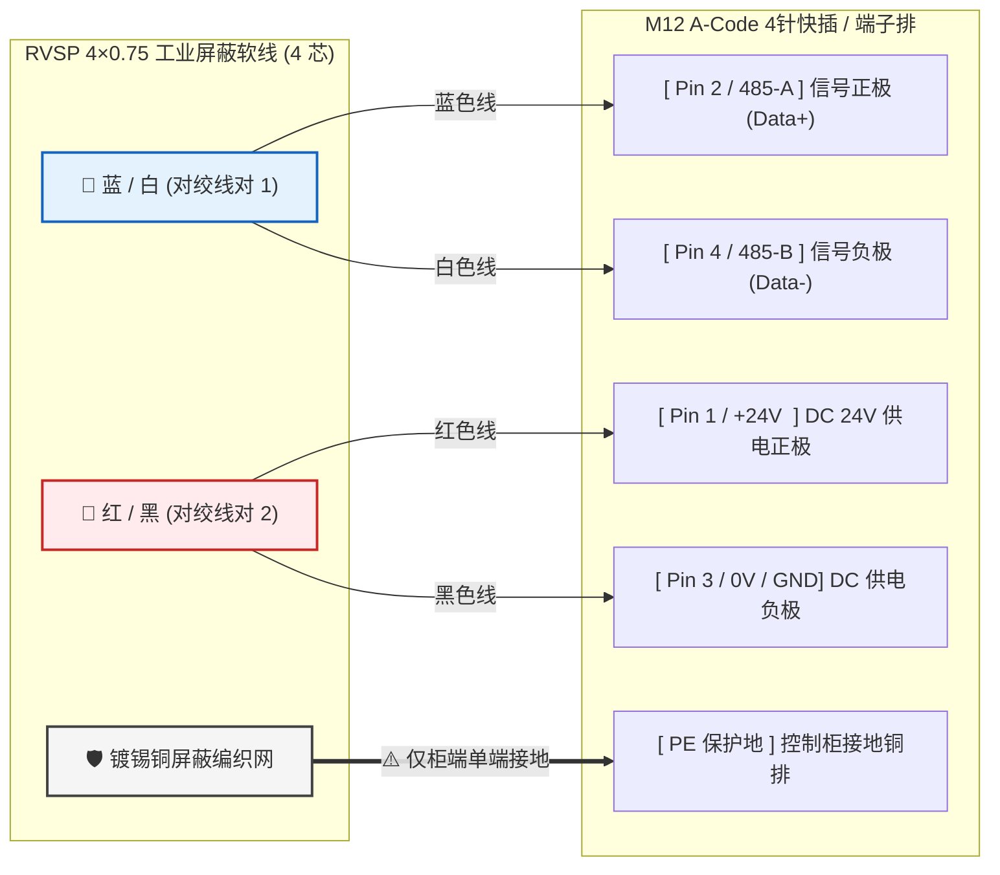
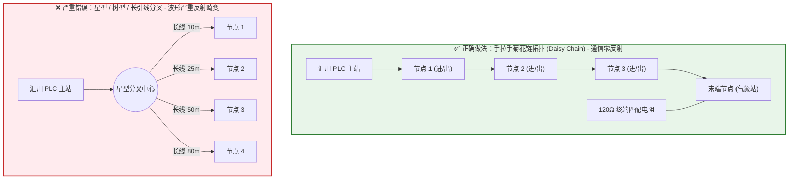
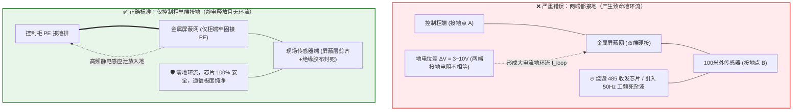
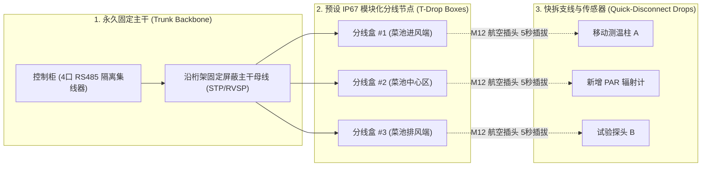

# 连锁数字化农业工厂：05_现场弱电线缆选型与布线施工规范 (Field Low-Voltage Cabling Selection & Wiring Construction Specification)

在大型鱼菜共生与设施水培农业工厂（长 $116\,\text{m} \times$ 宽 $48\,\text{m} \times$ 高 $8.1\,\text{m}$，占地超 $5,500\,\text{m}^2$）中，高湿度（$\ge 90\%RH$ 且易结露冷凝）、强电磁脉冲（大功率水泵变频器、曝气机大电流接触器、温室电动开窗电机、高频植物补光灯）以及室外雷电浪涌构成了极其恶劣的工业电气环境。

现场因“线缆选型错误、拓扑结构随意、强弱电共管同槽、屏蔽层双端接地产生地环流、未做端子冷压导致虚接”等低级施工失误，会导致高达 $80\%$ 的现场通信超时、数据跳变、探头漂移甚至 PLC 串口烧毁事故。

本规范详述了温室现场全部弱电通信线、传感线、直流供电线与网络视频线的选型标准、超五类网线复合走线线序、手拉手菊花链拓扑法则、接地与防雷工艺以及施工验收自检红线。

---

## 1. 现场线缆选型标准矩阵 (Cable Selection Matrix)

根据温室各物理区域的电气特征与信号类型，全厂线缆划分为 5 大标准规格：



| 线缆类别 | 推荐规格型号 | 导体材质与截面 | 护套与屏蔽要求 | 适用工程场景 | 核心选型考量 |
| :--- | :--- | :--- | :--- | :--- | :--- |
| **A类：环境传感复合线** | **Cat5e / Cat6 STP**<br>(屏蔽超五类/六类) | 8 芯纯无氧铜<br>(AWG24 $\approx 0.2\,\text{mm}^2$) | 铝箔屏蔽 + 编织网<br>黑色耐候抗 UV 阻水护套 | • 室内 6 根立体测温柱走线<br>• 室外超声波气象站通信+供电 | **1 根线搞定 Modbus 通信与 12V 供电**；8 芯线对多、高空布线经济。 |
| **B类：工业水质传感总线** | **RVSP 4×0.75**<br>(或 RVSP 2×2×0.75<br>4 芯屏蔽双绞软线) | 4 芯多股无氧铜<br>截面 $4 \times 0.75\,\text{mm}^2$<br>(两两成对双绞) | 镀锡铜网屏蔽率 $\ge 85\%$<br>阻燃耐磨 PVC 护套 | • 鱼池荧光法 DO 探头<br>• 调理池 pH / EC / PT1000 探头 | **【强烈推荐】1 根线同时搞定 485 通信 (A/B) + 24V 供电**；多股软铜线极其耐折抗振、抗电磁干扰，完美匹配 M12 4针航插！ |
| **C类：直流供电线** | **RVV 2×1.0 / 2×1.5**<br>(双芯护套线) | 2 芯多股铜线<br>截面 $1.0 \sim 1.5\,\text{mm}^2$ | 阻燃 PVC 双层护套<br>(红正/黑负) | • 24V 气动吹扫电磁阀<br>• 微型吹扫空压机供电<br>• 中继水质流通槽电磁阀 | 承受电磁阀启动瞬间浪涌电流，避免远距离线损压降过大导致阀门吸合无力。 |
| **D类：强电控制与动力** | **RVV 3×1.5 / 4×2.5** | 3/4 芯铜线<br>截面 $1.5 \sim 2.5\,\text{mm}^2$ | 工业阻燃电力电缆 | • 曝气机 / 中继补水泵<br>• 电动天窗开窗电机 (220V/380V) | 必须与 A/B/C/E 类弱电线缆**物理分槽敷设**。 |
| **E类：视频监控网线** | **Cat5e / Cat6 (PoE)** | 4 对 8 芯无氧铜<br>(单芯电阻 $<9.5\,\Omega/100\text{m}$) | 高密度 PVC / PE 外皮 | • 10 路海康 PoE IP 摄像头连接至 PoE 交换机 | 保证 $48\,\text{V}$ PoE 远距离供电无压降，保障 1080P H.265 高清码流不丢包。 |

---

## 2. 超五类屏蔽网线（Cat5e STP）用于 Modbus + 供电的标准化接线图

使用超五类屏蔽网线进行 **RS485 数据传输 + DC 12V/24V 集中供电** 时，必须严格执行以下接线线序，**严禁现场施工人员随意挑线配对**：

```
+-------------------------------------------------------------------------------+
|                    Cat5e STP 超五类屏蔽网线 8 芯分配标准                      |
+-------------------------------------------------------------------------------+
|  【线对 1：蓝 / 白蓝】     =========>  RS485-A (Data+) / RS485-B (Data-)      |
|  【线对 2：橙 / 白橙】 \                                                      |
|  【线对 3：绿 / 白绿】  } ========>  并联接入 DC 12V/24V 电源正极 (V+)        |
|  【线对 4：棕 / 白棕】     =========>  并联接入 DC 12V/24V 电源负极 / 信号地 (GND)|
|  【铝箔屏蔽层 + 裸铜地线】 =========>  控制柜侧单端接入保护地 (PE)              |
+-------------------------------------------------------------------------------+
```

#### 🎨 实物线色与端子接线直观对应图 (Wire Color to Terminal Visual Map)



### 2.1 线序与功能定义详解

| 线对编号 | 芯线颜色 | 信号/电源定义 | 为什么必须这样接？（物理机理与工程价值） |
| :---: | :--- | :--- | :--- |
| **对 1** | **纯蓝 (Blue)**<br>**白蓝 (White/Blue)** | **RS485-A (Data+)**<br>**RS485-B (Data-)** | **铁律**：A 与 B 必须在**同一缠绕线对**内。利用原生双绞差分对消除外部共模电磁噪声。**严禁拆分使用！** |
| **对 2 + 对 3** | **白橙 + 纯橙**<br>**白绿 + 纯绿** | **DC 供电正极 (V+)**<br>(4 根芯线并联) | 4 根 AWG24 并联后，等效截面积提升至 **$0.8\,\text{mm}^2$**，将 $100\,\text{m}$ 走线的回路压降降低 $75\%$，保证末端传感器供电充足。 |
| **对 4** | **白棕 + 纯棕** | **DC 供电负极 (GND / 0V)**<br>(2 根芯线并联) | 2 根 AWG24 并联作为公共电源回流线，等效截面积达 **$0.4\,\text{mm}^2$**，提供低阻抗参考电位。 |
| **屏蔽** | **铝箔屏蔽层 + 排流线** | **屏蔽地 (Shield / PE)** | 将外部高频感应电流导入大地。**仅在控制柜侧单端接地，现场传感器端必须绝缘悬空！** |

---

### 2.2 工业 4 芯屏蔽双绞软线（RVSP 4×0.75）接线图 (4-Core Industrial Flexible Cable)

针对经常需要手提清洗标定的鱼池溶氧与 pH 探头，采用 **RVSP 4×0.75（4 芯软线）** 实现一根线集成“通信 + 供电”，并与工业 **M12 4芯 A-Code 快插航插** 100% 引脚直通：



---

## 3. 施工工艺硬性红线 (Field Wiring Rules)

### 3.1 必须压接“管型冷压端头”（严禁裸线直拧）

#### 🔍 正确压接工艺 vs 错误裸线直拧对比图

```
【❌ 错误做法：剥皮裸线直接锁入端子】
  螺丝压紧  ──────>  ▼ [ 螺丝直接碾压裸铜丝 ]
                       ├──> 细铜丝被螺丝边缘切断（截面变细）
                       └──> 温室风机震动导致铜丝散开、松脱、接触不良虚接！

【✅ 正确做法：必须穿入冷压端头并成型压紧】
   [ 剥线 8mm ]  ==>  [ 穿入 VE0508 铜管端头 ]  ==>  [ 专用钳压成密实方柱 ]  ==>  [ 锁入螺丝端子排 ]
        │                       │                             │                       │
      铜丝完整              绝缘塑料套保护             铜管与铜丝冷焊咬合           大接触面永久紧固
```

* **隐患**：超五类网线芯线细（AWG24），剥皮后直接拧入 PLC 或传感器的螺丝压线框，极易压断铜芯或因温室风机振动产生接触不良虚接。
* **工艺标准**：
  1. 剥线长度控制在 $8 \sim 10\,\text{mm}$，不得切伤内部导体；
  2. 多股铜线或单股细线必须套入 **管型预绝缘冷压端头 (如 VE0508 / VE1008)**；
  3. 使用四边压接钳（六角或梯形压线钳）压紧后，再插入接线端子排紧固。

---

### 3.2 RS485 手拉手菊花链拓扑（严禁星型/树型分叉）

#### 🔍 正确手拉手菊花链 vs 错误星型/树型分叉 对比图



* **隐患**：现场施工人员为图省事，将多路 485 传感器接成“星型（Star）”或从主干线上拉出数米长的“T型长引线（Long Stub）”，会导致高频信号在分叉点产生严重阻抗突变与回波反射，造成通信暴增 CRC 校验错误。
* **工艺标准**：
  1. 严格死守 **“手拉手菊花链（Daisy Chain）”** 拓扑：总线从主站出发，依次串入 1 号传感器、2 号传感器……直至末端；
  2. 节点引出分支长度（Stub Length）**严禁超过 $30\,\text{cm}$**；
  3. 在总线物理最末端的一个传感器的 A/B 端子之间，**必须并联一颗 $120\,\Omega$ 金属膜终端匹配电阻（$0.25\,\text{W}$）**。

---

## 4. 强弱电隔离、敷设路径与防雷接地规范

### 4.1 强电与弱电物理分槽走线（防变频干扰）

#### 🔍 强弱电立体空间隔离与交叉敷设图解

```
+-------------------------------------------------------------------------------+
|             温室桁架与立柱：强电动力电缆 vs 弱电信号线 空间排布图             |
+-------------------------------------------------------------------------------+
|                                                                               |
|   ┌────────────────────────────────────────────────────────┐                  |
|   │ 🔴 380V / 220V 动力金属桥架 (水泵/风机变频器/补光灯电源) │ (高位敷设)      |
|   └────────────────────────────────────────────────────────┘                  |
|                               │                                               |
|                               ▼ 垂直净间距必须 ≥ 30cm (严禁贴身平行捆绑)       |
|                               │                                               |
|   ┌────────────────────────────────────────────────────────┐                  |
|   │ 🟢 RS485 传感线 / 视频网线 / 24V弱电桥架 (金属隔板屏蔽)   │ (低位敷设)      |
|   └────────────────────────────────────────────────────────┘                  |
|                                                                               |
|   【必须交叉时的规范】: 强电与弱电必须成 90° 垂直十字交叉，严禁小角度斜跨！     |
|              380V 强电电缆  ───────┼───────>                                  |
|                                    │ (90° 垂直穿过)                           |
|              RS485 弱电网线 ───────▼                                          |
+-------------------------------------------------------------------------------+
```

* **间距要求**：
  * RS485 弱电传感线与 220V/380V 动力电缆（如变频器、大水泵、开窗电机）**严禁同穿一根 PVC 管或放置在同一金属桥架槽内**；
  * 平行敷设时，强弱电金属桥架或穿线管的净间距必须 **$\ge 30\,\text{cm}$**；
  * 强弱电管线必须交叉时，必须成 **$90^\circ$ 垂直交叉跨越**，绝不允许长距离贴身捆绑平行走线。

---

### 4.2 屏蔽层“单端接地”铁律（防地环流烧毁芯片）

#### 🔍 为什么双端接地会烧板？（单端接地 vs 双端接地原理图解）



* **物理机理**：温室内部与室外气象站跨越 100 多米，两端的地电位并不相等（存在几伏甚至十几伏的对地电位差 $\Delta V$）。如果屏蔽层两端都接地，就会在屏蔽网内形成巨大的“地环流”，直接将工频电磁噪声耦合进信号线。
* **接地施工铁律**：
  * **控制柜端**：所有 RS485 屏蔽双绞线与网线的金属屏蔽层集中汇拢，统一压接铜接线鼻，**牢固接入控制柜专用保护接地排（PE）**；
  * **现场传感器端**：屏蔽层**必须剪齐、用热缩管或绝缘胶布包裹封死，严禁与现场机械金属支架或传感器外壳接触！**

### 4.3 室外高杆防雷与进柜浪涌隔离 (Surge Protection)
* **室外立杆防雷**：气象站 3 米金属立杆底部法兰必须连接专用接地扁铁，接地电阻 **$\le 4\,\Omega$**；
* **信号防雷器 (SPD)**：室外 RS485 信号线进入室内控制柜前，必须在导轨上串接 **RS485 专用信号浪涌保护器（如 24V/5V SPD）**，SPD 接地端用 $\ge 2.5\,\text{mm}^2$ 黄绿双色线短直连接至主接地排。

---

## 5. 施工验收与自检测试清单 (Field Acceptance Checklist)

施工班组布线接线完毕后，在通电联调前必须使用万用表完成以下 **4 项静态物理测试** 并记录验收表：

| 序号 | 测试项目 | 测试工具与测量点 | 合格指标与验收标准 | 故障排查与整改对策 |
| :---: | :--- | :--- | :--- | :--- |
| **1** | **端子通断与线序核对** | 万用表通断挡 (蜂鸣挡)<br>测试各节点 A/B 与 V+/GND | 蜂鸣声清脆，**线序颜色与接线表 100% 一致** | 发现线色颠倒或断线，必须重新核对并重新压接冷压头。 |
| **2** | **线间与对地绝缘测试** | 兆欧表 (500V 摇表) 或万用表高阻挡<br>测试 A-B、A-PE、V+-PE | 绝缘电阻 **$> 20\,\text{M}\Omega$**（高湿环境最低不小于 $5\,\text{M}\Omega$） | 若阻值偏低，说明线缆穿管时外皮被毛刺刮破或接头受潮进水，必须抽换线缆。 |
| **3** | **总线直流终端阻抗测试** | 万用表电阻挡<br>控制柜端断电测量 $A+$ 与 $B-$ 之间 | 阻值应处于 **$55 \sim 65\,\Omega$**（主站内置 $120\,\Omega$ 与末端 $120\,\Omega$ 并联） | • 若为 $\approx 120\,\Omega$：末端漏接终端电阻；<br>• 若为 $< 40\,\Omega$：中间多接了终端电阻。 |
| **4** | **末端供电压降测试** | 万用表直流电压挡<br>测量最远端传感器供电端子 | 电压 **$\ge 11.5\,\text{V}$** (对12V系统) 或 **$\ge 23.0\,\text{V}$** (对24V系统) | 若电压过低，检查是否未按规范将电源线多芯并联，或加粗供电线径。 |

---

---

## 7. 模块化快拆与高频变更低成本设计 (Modular & Low-Cost Reconfiguration Design)

在数字化农业工厂的实验迭代、扩产及日常轮作中，**水培种植床移动、传感器测点增减、试验区局部重构属于高频常态**。如果采用传统“打胶硬管敷设、螺丝死拧端子”的刚性布线方式，每次微调都需耗费大量电工工时、重新抽线剪线并面临整网停机风险。

为将后期更新、维护与扩容施工成本**降低 $80\%$ 以上**，系统推行以下 5 项模块化低成本布线方案：



### 7.1 方案 1：“主干母线 + 预设 IP67 节点盒” 架构（Trunk-and-Drop）
* **做法**：
  1. 沿温室主梁桁架一次性铺设 1 条高品质、不可拆卸的 **固定主干母线（Trunk Cable）**；
  2. 每隔 $15 \sim 20\,\text{m}$ 预设一个 **IP67 防水模块化分线接线盒（T-Tap Junction Box）**；
  3. 现场所有传感器测柱均通过 **$\le 2\,\text{m}$ 的短分支线（Drop Cable）** 接入最近的分线盒。
* **降本效益**：后期移动或增减测温柱时，**主干线零拆动、零重拉**，仅需更换 2 米短跳线，单点改造成本由原本的数百元人工缩减至几分钟操作。

### 7.2 方案 2：全线快拆接插件（M12 航空插头 / 防水 RJ45 快速对接）
* **做法**：
  * 现场传感器与短分支线之间统一采用 **工业级 M12 A-Code 4芯/8芯 螺纹防松防水航空插头** 或 **IP68 旋扣式 RJ45 快速对接头**；
  * 分线盒引出端均为预制母座，传感器端为预制公头。
* **降本效益**：
  * 普通农艺工或操作员 **5 秒即可徒手完成探头插拔换位**；
  * 彻底免除现场带螺丝刀剥线、压端子、锁端子的繁琐过程，**杜绝 100% 现场错接线烧板风险**。

### 7.3 方案 3：易开合悬挂走线通道（放弃胶水硬管，改用悬挂钢丝绳 + 魔术贴扎带）
* **做法**：
  * **高空挑高区（3m~8m）**：沿温室桁架下拉设 **$\Phi 4\,\text{mm}$ 镀锌不锈钢涂塑钢丝绳** 作为承重主索，线缆使用 **工业尼龙魔术贴扎带（Reusable Hook-and-Loop Ties）** 悬挂捆扎，每隔 $40\,\text{cm}$ 一道；
  * **栽培槽边缘地面区**：采用 **带卡扣可拆卸阻燃 PVC 行线槽（Slotted Wire Duct）** 或 **开口自卷阻燃编织网管（Split Braided Sleeving）**。
* **降本效益**：需要挪动线缆或新增线路时，只需徒手撕开魔术贴或掀开线槽盖板，放线后重新压扣，**零耗材浪费、零破坏性拆卸**。

### 7.4 方案 4：可复用卡扣式线号与动态数字标签（Snap-on Markers & QR）
* **做法**：
  * 放弃一次性加热缩管打码方式，改用 **C型可拆卸卡扣式数字线号夹（Snap-on Cable Markers）**；
  * 每个快拆接头贴附耐刮擦覆膜 **设备二维码资产标签**。
* **降本效益**：传感器调换位置后，线号夹可随时抠下重新扣装；通过手机或大屏扫码直接在 Web 软件端更新点位与坐标绑定，无需重新打印物理套管。

### 7.5 方案 5：RS485 光电隔离 4 口集线器（Hub 分区物理故障隔离）
* **做法**：
  * 在控制柜内配置 **1 进 4 出工业 RS485 隔离集线器（Hub/Repeater）**，将全厂划分为 4 个物理独立子网：
    * **通道 1**：【鱼池水质生命线】（荧光 DO / 调理池 pH / EC，严禁任何扰动）
    * **通道 2**：【水培区 3D 测温网】（高频变更区）
    * **通道 3**：【室外气象站】（高浪涌防雷区）
    * **通道 4**：【预留试验扩展区】（供临时增设的传感器接入）
* **降本与防灾效益**：
  * 试验区或水培区工人调整、剪断或不慎短路某根线缆时，**仅该分支受影响，其他三个分区的生命监测与数据采集 100% 正常运行**；
  * 彻底消除了“一人改线，全厂掉线”的系统性瘫痪风险。

---

## 8. 施工线缆与快拆辅材采购规格明细表

| 材料名称 | 推荐品牌/型号 | 关键技术规格 | 包装规格 | 单位 | 模块化用途 |
| :--- | :--- | :--- | :--- | :--- | :--- |
| **户外屏蔽超五类网线** | 一舟 / 康普 / 海康威视 | 纯无氧铜、铝箔屏蔽+地线、黑色抗 UV 双护套 | 305米 / 箱 | 箱 | 8芯复合线：桁架固定主干母线与分线盒走线 |
| **工业 4芯屏蔽双绞软线** | 远东 / 起帆 **RVSP 4×0.75**<br>(或 RVSP 2×2×0.75) | 4 芯多股纯铜软线、镀锡铜屏蔽网 $\ge 85\%$、双绞阻燃 PVC | 100米 / 卷 | 卷 | **4芯复合线：鱼池水质生命线 (通信+24V供电一根搞定)** |
| **IP67 模块化分线盒** | 工业级防水接线盒 | 含 1进3出 阻燃螺钉端子排 + PG9 防水接头 | 80×130×70mm | 个 | 预设温室桁架 T 型节点，供支路就近接入 |
| **M12 A-Code 航空插头** | 宾德 / 施耐德 / 国产正品 | 4芯螺丝快速接线型，公头+母头，IP67 | 公母配套 | 套 | 水质传感器端 5 秒快拆快拔 (1:+24V, 2:A, 3:0V, 4:B) |
| **工业尼龙魔术贴扎带** | 3M / 工业级 | 宽 $15\,\text{mm}$，黑色耐候抗老化，可反复撕开 1000 次 | 50米 / 卷 | 卷 | 钢丝绳快速挂线与拆线（取代一次性塑料扎带） |
| **涂塑承重钢丝绳** | 304 不锈钢 / 镀锌包胶 | $\Phi 4\,\text{mm}$ (7×7股)，外覆透明 PVC 胶皮 | 100米 / 卷 | 卷 | 8米大空间空中桁架快速走线悬挂承重 |
| **C型卡扣式线号夹** | 组合拼字线号夹 | 适用线径 $2.0 \sim 3.2\,\text{mm}$，数字 $0\sim 9$ 与字母 | 1000粒 / 盒 | 盒 | 免工具快速扣线与可逆更换线号 |
| **RS485 四口隔离集线器** | 研华 / 宇泰 UT-5204 | 1路主站转4路隔离从站，3000V 光电隔离 | 导轨式安装 | 台 | 控制柜分区物理故障隔离，防改线影响全厂 |

---

## 9. 工业线缆与芯线分层两级编码规范 (Two-Tier Wire & Cable Labeling Standard)

为了在全厂 $5,500\,\text{m}^2$ 空间、120+ 物理信号点的复杂网络中，实现**“拿线即知来源、接线绝不混淆、排障秒级定位”**，全厂统一推行**分层两级编码体系**：

```
+-----------------------------------------------------------------------------------+
|                   分层两级线缆与线号编码架构 (Two-Tier Labeling)                  |
+-----------------------------------------------------------------------------------+
|                                                                                   |
|  【第一级：线缆外皮标签 (Cable ID)】 贴在线缆两端外护套上，标明物理位置与设备归属   |
|   格式： [物理区域代号] - [信号/介质类型] - [设备/测点编号]                        |
|   范例：      VEG     -       BUS       -       01          => 菜池 1号 测温柱总线 |
|              FISH    -       BUS       -       DO1         => 鱼池 1号 溶氧探头线 |
|              OUT     -       BUS       -       WS          => 室外气象站总线      |
|                                                                                   |
|  【第二级：端子芯线线号 (Core Marker)】 套在每个冷压端子根部，标明针脚极性与电气功能|
|   格式： [标准信号缩写] 或 [电气符号]                                             |
|   范例：   485-A / 485-B (通信差分)  |  +12V / +24V (电源正)  |  GND / 0V (电源负)   |
+-----------------------------------------------------------------------------------+
```

### 9.1 第一级：线缆外皮标签字段字典 (Cable ID Dictionary)

线缆外皮标签固定贴在线缆**控制柜端**与**现场传感器端**距接头 $10\,\text{cm}$ 处，由 3 段组成：`[区域]-[类型]-[编号]`。

#### 1. 物理区域代号 (Zone Code)
| 区域代码 | 物理空间名称 | 涵盖主要设备与系统 |
| :---: | :--- | :--- |
| **`CTRL`** | **控制中枢区** | PLC、研华工控机、明纬开关电源、NVR 硬盘录像机、485 集线器 |
| **`FISH`** | **鱼池养殖 RAS 区** | 鱼池荧光 DO 探头、液氧急救阀、自动投喂机熔断继电器、防干烧浮球 |
| **`BUFF`** | **调理池中继加药区** | 双盐桥 pH、四电极 EC、PT1000 水温、中继补水泵、加药计量泵 |
| **`VEG`** | **水培蔬菜与温室大空间** | 6 根 3D 垂直分层测温柱 (L1/L2/L3)、PAR 光量子辐射计、水培槽浮球 |
| **`OUT`** | **室外气象监测区** | 超声波风速风向仪、室外温湿压、总辐射计、光学雨雪硬互锁触点 |

#### 2. 信号与介质类型代号 (Media / Signal Type)
| 类型代码 | 传输信号与介质 | 典型电压与标准线缆 |
| :---: | :--- | :--- |
| **`BUS`** | **RS485 Modbus-RTU 数据总线** | 差分数字信号，Cat5e STP 屏蔽网线 / RVSP 2×0.75 |
| **`PWR`** | **DC 弱电直流供电回路** | DC 24V / DC 12V，RVV 2×1.0 |
| **`NET`** | **以太网 TCP/IP 与 PoE 视频流** | RJ45 纯铜超五类 / 六类网络线 |
| **`DI`** | **数字量开关输入信号** | 浮球液位开关、雨雪常闭 NC 触点 (24V DC 开关量) |
| **`DO`** | **数字量继电器输出控制** | 电磁阀吸合线圈、接触器控制端 (24V DC / 220V AC) |

---

### 9.2 第二级：端子芯线线号编码规则 (Core Wire Marker Rules)

每根芯线剥皮压接冷压端头时，必须套上 **C型卡扣式线号夹**，按以下电气标准打码：

#### 1. RS485 差分通信芯线
* **RS485-A (Data+)**：统一打码 **`485-A`**（或简写 **`A`**）
* **RS485-B (Data-)**：统一打码 **`485-B`**（或简写 **`B`**）

#### 2. 直流供电与参考地芯线
* **DC 24V 正极**：打码 **`+24V`**（线皮建议为红色或橙色）
* **DC 12V 正极**：打码 **`+12V`**
* **公共负极 / 信号地 (0V/GND)**：打码 **`GND`** 或 **`0V`**（线皮建议为黑色或棕色）

#### 3. PLC 开关量与继电器触点芯线
* **PLC 输入触点 (DI)**：按 PLC 硬件点位打码，如 **`PLC-X01`**、**`PLC-X02`**
* **PLC 输出触点 (DO)**：按 PLC 硬件输出打码，如 **`PLC-Y01`**、**`PLC-Y02`**

#### 4. 屏蔽接地线
* **金属屏蔽层引出线**：统一套黄绿双色线号管或打码 **`PE`**

---

### 9.3 全厂典型设备与回路打码速查表 (Master Labeling Lookup Table)

| 被控/监测物理设备 | 线缆外皮总标签 (Cable ID)<br>【两端一致】 | 芯线冷压端子线号 (Core Marker)<br>【压接在各个端子上】 | 线缆选型规格 |
| :--- | :--- | :--- | :--- |
| **菜池 1号 3D 测温柱**<br>(Cat5e STP 走 485+12V) | **`VEG-BUS-01`** | • 纯蓝线：`BUS-A`<br>• 白蓝线：`BUS-B`<br>• 橙/白橙/绿/白绿（4芯并联）：`+12V`<br>• 棕/白棕（2芯并联）：`GND`<br>• 铝箔地线：`PE` (仅控制柜侧接) | 户外屏蔽超五类<br>(Cat5e STP) |
| **菜池 2号 3D 测温柱** | **`VEG-BUS-02`** | 同上（`BUS-A`, `BUS-B`, `+12V`, `GND`） | Cat5e STP |
| **鱼池 1号 荧光 DO 探头**<br>(RVSP 4×0.75 走 485+24V) | **`FISH-BUS-DO1`** | • 蓝线：`485-A`<br>• 白线：`485-B`<br>• 红线：`+24V`<br>• 黑线：`0V`<br>• 编织网：`PE` (仅柜侧) | **工业 RVSP 4×0.75**<br>(4芯双绞屏蔽软线) |
| **调理池 pH 传感器** | **`BUFF-BUS-PH`** | • 蓝/白线：`PH-A` / `PH-B`<br>• 红/黑线：`+24V` / `0V` | RVSP 4×0.75 |
| **调理池 EC 传感器** | **`BUFF-BUS-EC`** | • 蓝/白线：`EC-A` / `EC-B`<br>• 红/黑线：`+24V` / `0V` | RVSP 4×0.75 |
| **室外超声波气象站** | **`OUT-BUS-WS`** | • 通信端：`WS-A` / `WS-B`<br>• 供电端：`+12V` / `GND`<br>• 屏蔽网：`PE` | 户外屏蔽超五类<br>(Cat5e STP) |
| **室外雨雪硬触点**<br>(常闭 NC 触点直连 PLC) | **`OUT-DI-RAIN`** | • 触点端 1：`+24V`<br>• 触点端 2：`PLC-X01` (直入 PLC X1 点) | RVSP 2×0.5 |
| **鱼池 1号 防溢/防干烧浮球** | **`FISH-DI-LV01`** | • 信号端 1：`+24V`<br>• 信号端 2：`PLC-X04` | RVV 2×0.75 |
| **调理池 1号 补水泵继电器** | **`BUFF-DO-PUMP1`** | • 控制端 1：`PLC-Y01`<br>• 控制端 2：`PUMP-RUN` (接交流接触器 A1) | RVV 2×1.0 |
| **鱼池 1号 液氧急救电磁阀** | **`FISH-DO-O201`** | • 正极：`PLC-Y02`<br>• 负极：`0V` (直接驱动 24V 阀) | RVV 2×1.5 |

---

### 9.4 现场标签施工工艺与防错规范

#### 🔍 两级标签现场实物装配示意图 (Physical Labeling Assembly Visual)

```
========================================================================================
                               两级线号现场装配实物效果图
========================================================================================

                         【第一级：线缆外皮标签 (Cable ID)】
                              ┌────────────────────┐
                              │  VEG-BUS-01        │ <─── 防水耐磨覆膜旗形标签
                              └─────────┬──────────┘      (距剥线根部 10cm 处紧密缠绕)
                                        │
[ 黑色屏蔽外护套 ] ═════════════════════╪══════════════════╗ (剥外皮 50mm)
                                                           ║
                                    【第二级：端子芯线线号】 ║
                                      ┌────────┐           ╠══ 🔵 纯蓝线 ──── [ 485-A ] ─── [VE0508端头] ──> A+
                                      │ C型卡扣│           ╠══ ⚪ 白蓝线 ──── [ 485-B ] ─── [VE0508端头] ──> B-
                                      │ 线号夹 │           ╠══ 🟠 橙/绿并联 ── [ +12V  ] ─── [VE1008端头] ──> V+
                                      └────────┘           ╠══ 🟤 棕/白棕并联 ─ [  GND  ] ─── [VE1008端头] ──> 0V
                                                           ╚══ 🛡️ 屏蔽地线 ─── [  PE   ] ─── [铜接线鼻] ───> 地排 (仅柜侧)
========================================================================================
```

1. **两端打码绝对一致性**：
   * 严禁只在线缆的一端贴标签。每根线缆在**控制柜出线端**与**现场设备接线盒端**，必须贴附完全相同的 Cable ID，杜绝“两头对不上”的排障地狱。
2. **免工具卡扣式线号夹操作**：
   * 必须选用内径 $2.0 \sim 3.5\,\text{mm}$ 的 **C型拼字卡扣线号夹（Clip-on Ferrules）**；
   * 后期挪动传感器或更换测点时，直接用指甲或小字螺丝刀将线号夹抠下重新卡入新线，**严禁使用一次性热缩套管导致必须剪线重做**。
3. **外皮标签防水覆膜**：
   * 线缆外皮总标签采用 **旗形/包裹型防水抗油污自覆膜标签纸（Vinyl Self-Laminating Labels）**；
   * 粘贴时先贴好文字部分，再将透明尾膜紧密缠绕 2 圈包裹住字迹，彻底防御温室高湿喷淋与水汽凝露腐蚀。


