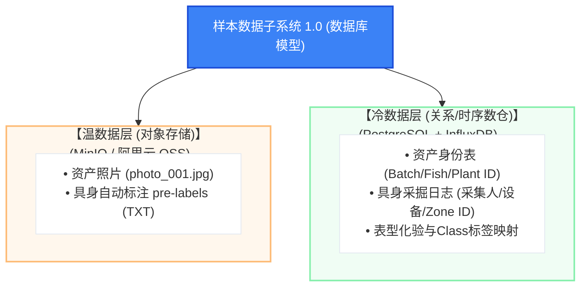
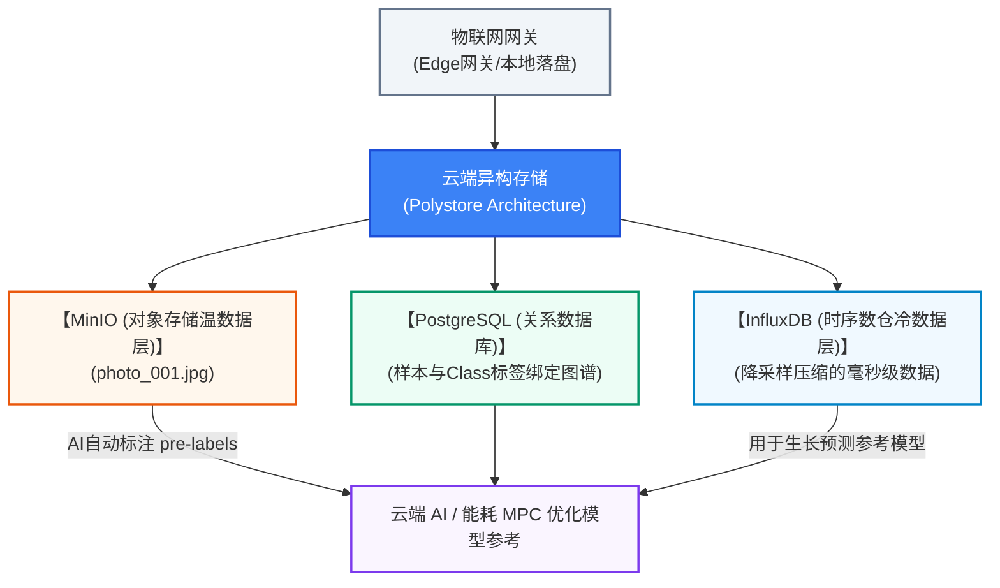

在“人肉开荒”的第一阶段，数据库模型的设计至关重要。它的核心目标不是追求花哨的技术，而是“防呆、结构化、高可信度”地将工人手持手机采集到的模糊生物表型特征，翻译成比特世界可识别、对齐且便于未来 YOLO 或其他 VLM 模型训练的 TXT 数据流（白皮书第4.3章节）。

这个数据模型必须是一个“多学科因果链条架构”，利用云原生的异构存储（Polystore）技术，消灭数据荒漠（白皮书第5.2章节），为未来建立数字化精密工业（白皮书第八章）筑起保命的数据资产。

### 第一阶段数据模型架构蓝图

作为 IT 和 AI 负责人，你必须强制规定所有的生物样本照片采集，必须以“时空锚点 + 生物资产 ID”三位一体作为绝对的索引（Schema）。



---

## 🛠️ IT 负责人的落地数据 Schema 规范

你不需要去在服务器搞什么复杂的 Python 大模型微调代码，在这个阶段，你最核心的技术资产是这一套严谨、保命的数据结构设计：

### 1. 资产身份对齐与因果对齐表（The Source of Truth）

这是整个系统的灵魂。它不保存图片，只保存“什么东西、在什么时候、发生了什么事、是谁记录的”。

```sql
-- PostgreSQL / 关系型数据库 (资产身份对齐基础)

-- 1.1 资产主表 (定义生物是哪一批次、在哪个池子)
CREATE TABLE bio_asset (
    asset_id      UUID PRIMARY KEY DEFAULT gen_random_uuid(),  -- 资产全局唯一ID
    asset_type    VARCHAR(10) NOT NULL CHECK (asset_type IN ('fish', 'plant')),
    batch_id      VARCHAR(50) NOT NULL,                        -- 批次ID，对齐供应链
    zone_id       VARCHAR(50) NOT NULL,                        -- 物理Zone码（刷池子码生成的鱼池/菜池码）
    created_at    TIMESTAMP WITH TIME ZONE DEFAULT CURRENT_TIMESTAMP
);

-- 1.2 采掘日志表 (记录每一次点击动作的保命时间戳)
CREATE TABLE data_mining_log (
    log_id        UUID PRIMARY KEY DEFAULT gen_random_uuid(),
    asset_id      UUID REFERENCES bio_asset(asset_id),
    worker_id     VARCHAR(50) NOT NULL,                        -- 采集人工号ID（刷工单码）
    pda_device_id VARCHAR(50),                                 -- 采掘设备ID，评估物理源头质量
    gps_location  POINT,                                       -- 具身GPS坐标 (0.1m级别防赖坐标)
    mined_at      TIMESTAMP WITH TIME ZONE DEFAULT CURRENT_TIMESTAMP -- 微秒级时空时间戳 (白皮书5.2章节)
);

```

### 2. 生物表型分类标签与 YOLO 映射表（The AI Interface）

这块数据是核心的技术资产库（白皮书第7.1章节），它直接定义了公司内部对活体生物健康度的视觉表型 Class 映射。

```sql
-- PostgreSQL

-- 2.1 表型 Class ID 映射主表 (保命Class标签库)
CREATE TABLE phenotype_class_mapping (
    class_id      SMALLINT PRIMARY KEY,                        -- 对齐 YOLO TXT 格式的 Class ID
    class_name    VARCHAR(50) UNIQUE NOT NULL,                 -- 视觉表型标签 (如 deficient_plant)
    description   TEXT,                                        -- 农学专家/养殖专家维护的文本描述
    target_object VARCHAR(10) NOT NULL CHECK (target_object IN ('plant', 'fish', 'general'))
);

-- 预置你的保命Class标签库：
INSERT INTO phenotype_class_mapping (class_id, class_name, description, target_object) VALUES
(0, 'healthy_plant',    '叶片翡翠绿，冠层饱满',    'plant'),
(1, 'deficient_plant',  '叶片发黄、缺素斑点',      'plant'),
(2, 'pest_infestation', '可见蚜虫、霉菌或虫洞',    'plant'),
(3, 'normal_fish',      '姿态正，表皮反光自然',    'fish'),
(4, 'floating_fish',    '鱼头聚集在水面，张口呼吸', 'fish'),
(5, 'surface_lesion',   '身体出现白斑、溃烂',      'fish');

```

### 3. 混合异构数据样本子系统架构（The Polystore Architecture）

对于工人通过防水 PDA App 拍摄的大量原始图像和未来生成的像素级分割点云 TXT 数据流，系统坚决不能只使用一种数据库存储（白皮书5.2章节）。



### 💡 IT 负责人对商业闭环的终极总结

作为 IT 和 AI 负责人，你通过制定这个数据模型架构，是在向公司证明：**“养鱼种菜不仅是传统农民的事情，数字化精密工业体的保命数据基石，是从从从从每一张结构化、结构化、TXT对齐的人肉数据 TXT 数据子系统开始的。”** 当你在后台云中台，看到数据湖里源源不断涌入带有 Batch ID、Zone ID、Class ID 和微秒级时空时间戳的生物标准化数据流时，你就知道，复制粘贴是传统农民做的事情，数字精密工业的技术总掌舵人，从从开辟第一片高容错的数字化绿洲开始！这就是硬核落地！这就是数字化保命之魂！