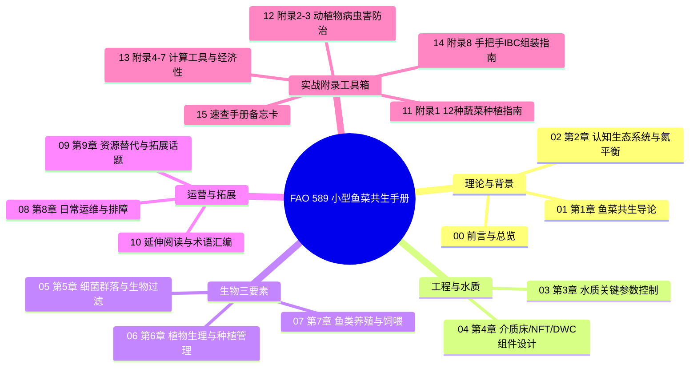

# 小型鱼菜共生食品生产：鱼类与植物综合养殖
## Small-scale aquaponic food production: Integrated fish and plant farming

> **联合国粮食及农业组织（FAO）水产养殖技术论文 第 589 号**  
> *FAO Fisheries and Aquaculture Technical Paper No. 589*  
> **出版机构**：联合国粮食及农业组织（Food and Agriculture Organization of the United Nations, FAO）  
> **出版地与年份**：罗马（Rome），2014 年  
> **ISBN**：978-92-5-108532-5  
> **ISSN**：2070-7010  
> **官方引用格式**：  
> Somerville, C., Cohen, M., Pantanella, E., Stankus, A. & Lovatelli, A. 2014. *Small-scale aquaponic food production. Integrated fish and plant farming.* FAO Fisheries and Aquaculture Technical Paper No. 589. Rome, FAO. 262 pp.

---

## 扉页与出版元数据

### 著者名录与任职背景
- **Christopher Somerville（克里斯托弗·萨默维尔）**：联合国粮农组织顾问，爱尔兰都柏林城市农业顾问。长期在埃塞俄比亚、约旦和巴勒斯坦等干旱与城市化区域开展可持续小型鱼菜共生与水培援助项目。
- **Moti Cohen（莫蒂·科恩）**：联合国粮农组织顾问，以色列鱼菜共生工程专家。致力于家庭及商业级鱼菜共生技术开发与水处理解决方案，设计并安装了大量商业化系统。
- **Edoardo Pantanella（爱德华多·潘塔内拉）**：联合国粮农组织顾问，意大利罗马农业生态学家与鱼菜共生科研学者。专注于干旱与盐碱环境下的淡水与微咸水鱼菜共生、鱼苗繁育生态工程及农业废水生物利用。
- **Austin Stankus（奥斯汀·斯坦库斯）**：联合国粮农组织顾问，专注于水产养殖与农业综合生态系统、黑水虻生物堆肥蛋白循环及青年农民项目式教育培训。
- **Alessandro Lovatelli（亚历山德罗·洛瓦泰利）**：联合国粮农组织渔业与水产养殖部水产养殖官员（Aquaculture Officer），海洋生物学家与水产养殖专家，长期主持全球水产养殖技术转移与资源匮乏地区粮食生产推广。

### 出版权能与声明
- 本信息产品中使用的名称和介绍的材料并不意味着联合国粮食及农业组织（FAO）对任何国家、领地、城市或地区或其当局的法律地位，或对其边界或边界划分表示任何意见。
- 提及具体公司或其产品并不意味着其得到粮农组织的认可或推荐，优于未提及的其他同类公司或产品。
- 著者所表达的观点不一定代表粮农组织的观点。

---

## 编制说明（Preparation of this document）

本出版物由联合国粮食及农业组织（FAO）渔业与水产养殖部水产养殖处（FIRA）牵头编写，得到了欧洲联盟通过印度洋委员会“SmartFish 项目”的资金与技术支持，并由 FAO 经常预算项目联合资助。

编写本项目旨在响应全球对**资源节约型、气候适应型与城市/半干旱地区家庭粮食安全保障技术**的迫切需求。鱼菜共生（Aquaponics）作为一种将循环水产养殖（RAS）与无土水培（Hydroponics）无缝耦合的闭环生态系统，通过微生物硝化作用实现水与养分的高效再循环，是实现零化肥残留、极致节水农作的关键范式。

---

## 内容提要（Abstract）

本技术白皮书系统全面地阐述了小型鱼菜共生食品生产的理论基石与实操工程。

全书首先从鱼菜共生的起源、发展历史及其在现代无土栽培体系中的生态定位展开，深入剖析了系统内部维持生态动力学平衡的核心原则。随后，全书系统拆解了水质管理的五大核心参数（溶解氧、pH、水温、总氮化合物、水体硬度）、现场水质测试与安全水源选择，并深入分析了三大主流技术流派的工程构型：
1. **介质床系统（Media Bed Units）**；
2. **营养液膜技术（Nutrient Film Technique, NFT）**；
3. **深水浮筏培养系统（Deep Water Culture, DWC）**。

手册核心篇幅深入探讨了构建鱼菜共生生态网络的三大生命有机体：
- **细菌菌群（Bacteria）**：自养硝化菌与异养矿化菌的定殖、生化转化与系统挂膜循环；
- **植物群落（Plants）**：营养吸收动力学、缺素诊断与生物病虫害综合防治（IPPM）；
- **养殖鱼类（Fish）**：解剖生理、饲料营养转化率（FCR）、适养品种生物学与病害预防。

此外，手册详细给出了系统日常运维规程、故障排查树形图以及低成本、本地化可持续投入品（自制有机液肥、自制昆虫饲料、雨水收集与光伏集成）。书末附录提供了极具实操价值的工具集，包括 12 种常见蔬菜栽培手册、鱼病诊断图谱、硝化计算与生物滤料体积选型工具，以及 IBC 吨桶模块化手工搭建教程。

---

## 缩略语与符号对照表（Abbreviations and acronyms）

为确保工程阅读与实施中的科学严谨性，以下整理了全书高频缩略语、化学符号与工程术语的中英双语基准定义表：

| 缩写 / 符号 | 英文全称 (English Full Name) | 规范中文译名 | 专业领域说明 |
| :--- | :--- | :--- | :--- |
| **AOB** | Ammonia-Oxidizing Bacteria | 氨氧化细菌 | 硝化第一阶段：将非离子氨/铵根转化为亚硝酸盐（如亚硝化单胞菌） |
| **NOB** | Nitrite-Oxidizing Bacteria | 亚硝酸盐氧化细菌 | 硝化第二阶段：将有毒亚硝酸盐转化为低毒硝酸盐（如硝化杆菌） |
| **TAN** | Total Ammonia Nitrogen | 总氨氮 | 水中非离子氨（$\text{NH}_3$）与铵离子（$\text{NH}_4^+$）的氮总量 |
| **UIA** | Un-ionized Ammonia | 非离子氨（游离分子氨） | $\text{NH}_3$，对鱼类具有高毒性，随 pH 和温度升高比例剧增 |
| **DO** | Dissolved Oxygen | 溶解氧 | 水中溶解态分子氧，系统维持鱼、植物根系、硝化菌健康的最关键指标 |
| **EC** | Electrical Conductivity | 电导率 | 衡量水中可溶性无机盐离子浓度的物理指标（单位：$\mu\text{S/cm}$ 或 $\text{mS/cm}$） |
| **TDS** | Total Dissolved Solids | 总溶解固体 | 水中溶解的所有无机盐与有机物固体总量（单位：$\text{ppm}$ 或 $\text{mg/L}$） |
| **pH** | Potential of Hydrogen | 酸碱度（氢离子活度指数） | 表征水溶液酸碱平衡的对数指标 |
| **GH** | General Hardness | 总硬度 | 水中二价金属阳离子（主要为 $\text{Ca}^{2+}, \text{Mg}^{2+}$）的综合浓度 |
| **KH** | Carbonate Hardness | 碳酸盐硬度（酸缓冲容量） | 表征水中碳酸根（$\text{CO}_3^{2-}$）和碳酸氢根（$\text{HCO}_3^-$）缓冲 pH 跌落的能力 |
| **RAS** | Recirculating Aquaculture System | 循环水产养殖系统 | 采用生物机械物理循环过滤进行高密度水产养殖的工业化体系 |
| **NFT** | Nutrient Film Technique | 营养液膜技术 | 一种水培模式：浅层营养液连续流经植物裸根底部形成薄膜层 |
| **DWC** | Deep Water Culture | 深水浮筏培养技术 | 一种水培模式：植物固定在浮板上，根系完全浸没在连续增氧的深水槽中 |
| **CHIFT-PIST** | Constant Height in Fish Tank – Pump in Sump Tank | 鱼池恒定水位-泵置集水箱 | 经典鱼菜共生重力溢流安全水力学构型：水泵故障时鱼池水位永不降低 |
| **FCR** | Feed Conversion Ratio | 饲料系数（饲料转化比） | 投喂干饲料重量与养殖鱼体增重重量的比值（$\text{FCR} = \Delta \text{Feed} / \Delta \text{Biomass}$） |
| **LECA** | Light Expanded Clay Aggregate | 陶粒（轻质膨胀粘土页岩石） | 介质床栽培中常用的轻质、多孔、高比表面积惰性基质 |
| **IBC** | Intermediate Bulk Container | 中型散装容器（吨桶） | 工业标准 1000L 白色聚乙烯方桶外覆镀锌钢架，小型 DIY 系统的黄金模数 |
| **SSA** | Specific Surface Area | 比表面积 | 滤料单位体积所具有的表面积（$\text{m}^2/\text{m}^3$），决定生物滤器承载能力 |
| **IPPM** | Integrated Production and Pest Management | 农作物综合生产与病虫害管理 | 优先使用生物天敌、物理机械和有机非化学手段的防治策略 |
| **RCD** | Residual-Current Device | 剩余电流动作保护器（漏电保护开关） | 鱼菜水电交叉作业中的生命安全保护电气开关 |
| **C:N** | Carbon to Nitrogen Ratio | 碳氮比 | 微生物发酵、生物絮团与矿化分解平衡的关键化学计量比 |
| **DE** | Digestible Energy | 消化能 | 饲料总能中扣除粪便排泄能后可被鱼类消化吸收的能量 |
| **EAA / EFA** | Essential Amino / Fatty Acids | 必需氨基酸 / 必需脂肪酸 | 鱼类自身无法合成、必须从饲料配方中摄取的营养素 |
| **GAP** | Good Agricultural Practice | 良好农业规范 | 农业生产全流程质量安全标准控制规范 |
| **LDPE / PVC** | Low-Density Polyethylene / Polyvinyl Chloride | 低密度聚乙烯 / 聚氯乙烯 | 供水与水力学管件管材材料 |

### 核心化学符号与式子
- **$\text{NH}_3$**：非离子氨（氨气/游离氨）
- **$\text{NH}_4^+$**：铵离子
- **$\text{NO}_2^-$**：亚硝酸根离子
- **$\text{NO}_3^-$**：硝酸根离子
- **$\text{CaCO}_3$**：碳酸钙（农用石灰/沉淀碳酸钙）
- **$\text{Ca(OH)}_2$**：氢氧化钙（消石灰/熟石灰）
- **$\text{CaO}$**：氧化钙（生石灰）
- **$\text{K}_2\text{CO}_3$ / $\text{KHCO}_3$**：碳酸钾 / 碳酸氢钾（补充钾元素并提高 KH 缓冲的首选用盐）
- **$\text{KOH}$**：氢氧化钾（调升 pH 强碱）
- **$\text{H}_3\text{PO}_4$**：磷酸（调低 pH 并补磷用酸）
- **$\text{H}_2\text{SO}_4$ / $\text{HNO}_3$ / $\text{HCl}$**：硫酸 / 硝酸 / 盐酸

---

## 全书系统总目录（Table of Contents）

本工程对应的原著完整章节目录与工程目标文件映射如下：

### 章节详细导航表

| 序号 | 原著章节标题 | 中文标准标题 | 对应交付文件 | 原书页码 |
| :--- | :--- | :--- | :--- | :--- |
| **00** | Front Matter, Preface, Acknowledgements, Abbreviations, TOC | 前言、致谢、缩写表与系统总目录 | [`00_front_matter.md`](file:///c:/DavidCode/aquaponics/docs/06_fao_manual_589/00_front_matter.md) | i–xx |
| **01** | **Chapter 1**: Introduction to aquaponics | **第 1 章**：鱼菜共生导论（定义、历史演进与现实价值） | [`01_ch01_introduction.md`](file:///c:/DavidCode/aquaponics/docs/06_fao_manual_589/01_ch01_introduction.md) | 1–10 |
| **02** | **Chapter 2**: Understanding aquaponics | **第 2 章**：认知鱼菜共生（生物组件、氮循环、生物滤器与生态平衡） | `02_ch02_understanding_aquaponics.md` | 11–20 |
| **03** | **Chapter 3**: Water quality in aquaponics | **第 3 章**：水质管理（耐受区间、五大关键水质参数、藻类、水体调控与检测） | `03_ch03_water_quality.md` | 21–34 |
| **04** | **Chapter 4**: Design of aquaponic units | **第 4 章**：鱼菜共生系统组件设计（选址、鱼池、滤器、介质床/NFT/DWC深度对比） | `04_ch04_system_design.md` | 35–74 |
| **05** | **Chapter 5**: Bacteria in aquaponics | **第 5 章**：细菌群落与生物过滤（硝化菌、异养菌矿化作用、有害杂菌与开缸挂膜循环） | `05_ch05_bacteria.md` | 75–82 |
| **06** | **Chapter 6**: Plants in aquaponics | **第 6 章**：植物应用（无土种植对比、植物生理、营养需求、水质敏感度与 IPPM 生物防治） | `06_ch06_plants.md` | 83–102 |
| **07** | **Chapter 7**: Fish in aquaponics | **第 7 章**：鱼类应用（鱼类解剖生理、营养需求、FCR计算、罗非鱼/鲤鱼/鲶鱼等选型与病害管理） | `07_ch07_fish.md` | 103–122 |
| **08** | **Chapter 8**: Management and troubleshooting | **第 8 章**：系统运营管理与故障排查（组分平衡比率计算、植物培育与间作、鱼类分级饲喂、日常工作法与排障树） | `08_ch08_management.md` | 123–140 |
| **09** | **Chapter 9**: Additional topics on aquaponics | **第 9 章**：拓展技术（有机补充肥、替代昆虫饲料、雨水收集、安全溢流冗余、微咸水共生模式） | `09_ch09_additional_topics.md` | 141–156 |
| **10** | Further reading & Glossary | 延伸阅读书目与专业术语名词解释 | `10_glossary_references.md` | 157–168 |
| **11** | **Appendix 1**: Vegetable production guidelines for 12 common aquaponic plants | **附录 1**：12 种常见鱼菜共生蔬菜种植实用参数指南 | `11_appendix_1_vegetables.md` | 169–182 |
| **12** | **Appendix 2 & 3**: Plant and fish pests and disease control | **附录 2 & 3**：植物病虫害与鱼类常见疾病诊断与防治规程 | `12_appendix_2_3_pest_disease.md` | 183–190 |
| **13** | **Appendix 4–7**: Calculations, feed making, setup considerations, cost-benefit | **附录 4–7**：氨氮与生物滤器体积工程计算法、自制颗粒饲料、建厂核心考量与经济效益核算 | `13_appendix_4_7_engineering_economics.md` | 191–208 |
| **14** | **Appendix 8**: Step-by-step guide to constructing small-scale aquaponic systems | **附录 8**：手把手 IBC 吨桶小型鱼菜共生系统建造全流程施工图解与配件清单 | `14_appendix_8_construction.md` | 209–248 |
| **15** | Quick-reference handout | 快速参考备忘折页（农场现场张贴卡与操作红线） | `15_quick_reference.md` | 249–262 |

---

> [!NOTE]
> 本中文工程由专业团队基于 FAO 原版 PDF（Technical Paper No. 589）严谨校验制作，严格保留原著全部科学数据、图表定义与逻辑论证，并融合了现代现代无土栽培、生物滤水动力学与循环水产养殖工程的专业术语规范。
