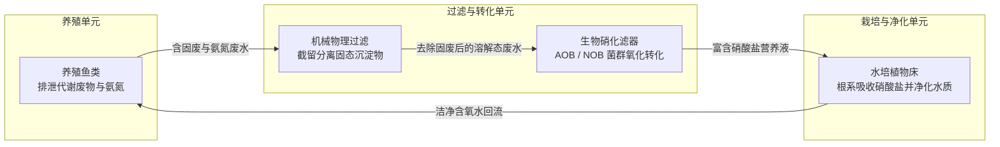
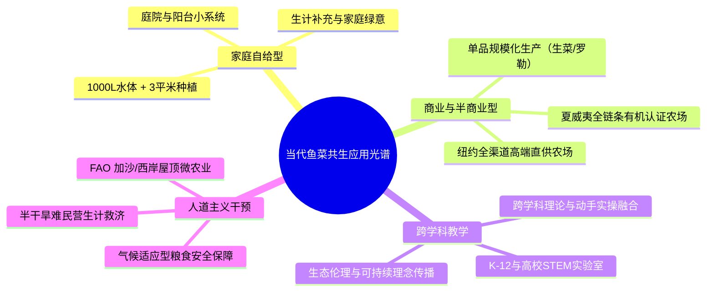

# 第 1 章 鱼菜共生导论
## Chapter 1: Introduction to aquaponics

---

> [!NOTE]
> **本章核心导读**：  
> 鱼菜共生（Aquaponics）是循环水产养殖技术（RAS）与无土水培技术（Hydroponics）在同一闭环循环系统中的生态整合。本章系统阐述无土栽培与现代水产养殖的演进历程，深度剖析鱼菜共生如何通过微生物硝化作用实现废弃物资源化，全面权衡该生产模式的综合效益与技术局限，并介绍其在全球家庭自给、商业农场、跨学科教育及人道主义粮食安全干预中的典型实践。

---

---

## 1.1 无土栽培（Hydroponics）

无土栽培（Hydroponics）是指在不利用天然土壤作为支撑和养分介质的环境中培育植物的技术。在无土栽培体系中，植物通常定植于惰性基质（如砾石、砂粒、泥炭苔、浮石、椰糠、岩棉或陶粒）中，或者直接将裸根悬浮于富含植物必需无机离子的营养水溶液之中。

人类对水培技术的系统研究最早可追溯至 17 世纪末英格兰学者约翰·伍德沃德（John Woodward）关于植物营养源的经典实验。19 世纪 60 年代，德国植物生理学家萨克斯（Julius von Sachs）与诺普（Wilhelm Knop）通过人工配制无机盐营养液成功培育植物，确立了植物矿质营养理论。20 世纪 30 年代，美国加州大学伯克利分校的威廉·格里克（William Gericke）首次将营养液栽培推向大规模农业应用，并正式创造了“水培（Hydroponics）”这一术语（源自希腊语 *hydros* 水 与 *ponos* 劳作）。现代无土栽培主要衍生出三大分支：
1. **基质栽培（Substrate Culture）**：利用固体多孔惰性材料提供根系锚固与水分缓冲；
2. **水培（Water Culture / Hydroponics）**：包含营养液膜技术（NFT）与深水浮筏栽培（DWC）；
3. **气雾培（Aeroponics）**：将高压雾化的微细营养液直接定时喷射至植物悬垂根系。

当前全球无土栽培技术蓬勃发展的核心驱动力，源于传统露地土壤农业正面临前所未有的资源与生态约束：
- **可耕地资源枯竭与土壤退化**：全球优质耕地因集约化耕作、不合理灌溉、化学污染及城镇化侵占而急剧缩减，土壤板结、次生盐渍化与连作重茬障碍（土壤传播性病原真菌、线虫）日益严重；
- **全球淡水危机**：农业用水占全球淡水总消耗量的 70% 以上，传统土壤灌溉渗漏蒸发严重，水分利用率极低；
- **化肥生产的生态足迹与矿产瓶颈**：现代工业农业高度依赖合成化肥。合成氮肥的哈伯法（Haber-Bosch Process）是高耗能、高碳排放过程；而不可再生的磷矿（Phosphate Rock）储量正快速消耗，面临未来数十年内的全球供应告警。

无土栽培通过提供完全可控的根区水肥气热环境，展现出显著优势：
1. **阻断土传病虫害**：脱离土壤介质后，免除了土壤熏蒸与剧毒化学农药使用；
2. **环境精准调控与高产出**：营养液配比与微环境可根据作物生长阶段精确调谐，单产可达土壤种植的数倍；
3. **极端节水省肥**：闭环循环水培系统的水肥利用效率显著高于传统漫灌或滴灌；
4. **突破地理空间限制**：使在盐碱地、沙漠海岛、废弃工矿区、城市屋顶及室内高密度立体农场进行农业生产成为现实。

---

## 1.2 现代水产养殖（Aquaculture）

水产养殖（Aquaculture）是指在人工受控水体环境中对鱼类、甲壳类、软体动物及水生植物等水生生物进行人工繁育、养殖与收获的生产活动。随着全球野生捕捞渔业资源逼近生物承载极限，水产养殖已跃升为全球优质动物蛋白供应增长最核心的来源。

目前全球主流的水产养殖工程模式主要涵盖四大流派：
1. **开放水域网箱养殖（Open Water Cages / Pens）**：利用天然湖泊、水库或近海潮汐自然换水，基建投资低但对水域生态环境溢出风险大；
2. **传统静水池塘养殖（Pond Culture）**：依赖水体自身初级生产力与人工投饵，占地面积巨大且水体蒸发渗漏严重；
3. **流水水槽养殖（Flow-Through Raceways）**：依赖持续引入外部大量新鲜地表水或冷泉水排出代谢废物，水资源消耗强度极高；
4. **工厂化循环水产养殖系统（Recirculating Aquaculture Systems, RAS）**：通过物理微滤固液分离、生物硝化转盘/流化床脱氮、蛋白分离、脱气增氧及紫外/臭氧消毒等一系列工业化水处理单元，使养殖尾水经过深度净化后循环复用率达到 90%~99%。

虽然 RAS 模式因高昂的初期基建投入、设备折旧和泵送曝气电力成本而推高了生产门槛，但其具有单位占地单产极高、水资源消耗极致节约、养殖环境全年恒温恒质、病原物理隔离等战略优势。

> [!WARNING]
> **现代水产养殖的可持续性挑战**：  
> 1. **高浓度富营养化尾水排放**：未经处理的高浓度鱼类排泄物直接排放会导致受纳水体发生富营养化（Eutrophication）、藻华爆发与水体缺氧（Hypoxia），甚至造成沿海珊瑚礁与湿地生态系统瓦解；  
> 2. **鱼粉依赖性（Fishmeal Dependency）**：高营养级肉食性养殖鱼类高度依赖海洋低营养级野生小杂鱼制成的鱼粉与鱼油，在生态学上存在“以鱼养鱼”的资源悖论。

鱼菜共生的诞生，正是为了**将 RAS 排放的高营养负荷尾水直接转化为蔬菜生产的优质肥源**，彻底扭转水产养殖的环境负外部性。

---

## 1.3 什么是鱼菜共生（Aquaponics）

鱼菜共生是将 **循环水产养殖（RAS）** 与 **无土水培栽培（Hydroponics）** 深度耦合在同一个连续循环水回路中的综合生态农业系统。

### 系统生态动力学闭环
在一个典型的鱼菜共生系统内，包含三个协同演化、相互依存的核心生命群体：
1. **水生动物（鱼类/虾类）**：摄入高蛋白饵料，通过鳃部排泄非离子氨（$\text{NH}_3$）和尿素，并通过排便释放大量富含氮磷钾及微量元素的有机颗粒废弃物；
2. **有益微生物群落（异养菌与自养硝化菌）**：
   - **异养细菌（Heterotrophic Bacteria）**分解固态粪便，将其矿化为游离无机盐离子；
   - **氨氧化细菌（AOB，如 *Nitrosomonas*）**将具有高度水生毒性的氨氮氧化为亚硝酸盐（$\text{NO}_2^-$）；
   - **亚硝酸盐氧化细菌（NOB，如 *Nitrobacter* / *Nitrospira*）**将亚硝酸盐进一步氧化为低毒且易被植物根系同化的硝酸盐（$\text{NO}_3^-$）；
3. **经济植物（蔬菜/果瓜/草本花卉）**：植物悬垂的根系自水体中吸收硝酸盐及其他微量元素作为生长养分，吸收作用同时完成了对水质的生物深度脱氮与净化，净化后的低氮富氧清水通过重力或水泵回流至鱼池，维系水生动物的健康生存环境。

通过这种自维持的内循环体系，水产养殖的“排污负债”被完全转化为水培植物的“生产资料”，消除了传统水培对昂贵人造化学合成配方肥料的绝对依赖，达成了生态农业的高阶协同。

---

## 1.4 鱼菜共生食品生产的优势与劣势权衡

任何农业技术都具有明确的适应场景与技术边界。理性评估鱼菜共生的工程价值，必须客观权衡其正向收益与潜在风险：

### 核心优势（Benefits）
- **极限节水率**：由于水分仅在系统内部闭路循环，水分损失仅限于植物蒸腾（Transpiration）及少量水面自然蒸发。在实际运行中，系统总耗水量仅为传统露地土壤灌溉农业的 2%~10%，仅为传统淡水池塘养殖换水量的 5% 左右，在缺水干旱地区具有不可替代的战略价值；
- **全流程无化学农药与除草剂残留**：鱼菜系统内部存在鱼类和硝化菌群等脆弱的生物指示物种，常规化学杀虫剂、杀真菌剂和广谱抗生素的施用会直接导致鱼群死亡或生物滤器崩溃，因此迫使生产者采用生物防治（IPPM）、物理防虫网与纯天然制剂，从源头确保食品绝对安全；
- **双重经济产出与复合抗风险能力**：同一单元能够协同产出鲜活水产品与高品质绿叶/果菜，优化了农业家庭的膳食营养结构（补充优质动物蛋白与微量维生素），并在农贸市场上形成复合收益壁垒；
- **摆脱耕地与土传病害限制**：系统可架设于荒漠、重金属污染土地、海岛沙地、建筑平顶或家庭后院，有效规避土壤连作障碍与土传线虫病原；
- **社会经济效益与女性赋权**：系统操作无需重体力翻耕开荒、除草或挑水漫灌，劳动强度低且作业高度友好，在广大发展中国家成为支持妇女居家就业、保障小农生计与增加家庭微收入的典范工程。

### 局限性与工程挑战（Weaknesses）
- **高昂的初始基建投入**：与传统露地开垦相比，系统必须配置专用养殖缸体、管道阀门、沉淀分离器、生化滤槽、水泵曝气机及水培床架，资本性开支（CAPEX）显著偏高；
- **多学科交叉复合的认知门槛**：操作者必须同时精通水产养殖学（鱼类摄食、缺氧防病）、微生物生态学（硝化挂膜、酸碱缓冲）及植物营养生理学（光周期、缺素症诊断），任何维度的知识短板都可能导致管理失衡；
- **环境偏好不完全兼容的内在妥协**：鱼类、植物与硝化细菌各自的最佳生长工况并不完全重合。例如：植物吸收硝酸盐的最佳根区 pH 为 5.5~6.5，而硝化细菌的最佳生化活性 pH 为 7.5~8.2，鱼类偏好 6.5~8.0。操作者必须常年将系统水体动态锁定在三者妥协的狭窄黄金区间（pH 6.8~7.0）；
- **对稳定电力的致命依赖性**：循环泵与曝气充氧机必须 24 小时不间断运行。突发停电若超过数十分钟，高密度鱼群可能在短时间内因缺氧而窒息发生不可逆的“翻塘”灾难；
- **难以满足全谱系热量自给**：鱼菜共生主要产出为绿叶蔬菜、浆果香草与鲜鱼，无法经济高效地替代小麦、水稻、玉米、块茎类等高热量大田粮食作物。

### 表 1.1：鱼菜共生生产模式核心技术特性综合对比

| 评估维度 | 鱼菜共生系统 (Aquaponics) | 传统露地土壤农业 (Soil Farming) | 独立水培系统 (Hydroponics) | 独立循环水产养殖 (RAS) |
| :--- | :--- | :--- | :--- | :--- |
| **淡水消耗强度** | **极低**（仅补充蒸腾蒸发损耗） | **极高**（大量深层渗漏与蒸发） | **极低**（定期需整体排空换液） | **低至中等**（需持续换水稀释硝酸盐） |
| **外源养分依赖** | **仅投入高品质鱼饲料** | 依赖外源化肥/有机农家肥 | 完全依赖工业级浓缩化学矿质母液 | 投入鱼饲料，养分随尾水废弃 |
| **尾水环境影响** | **零排放/趋零排放** | 农田面源污染、地下水硝酸盐超标 | 废弃营养液直接排放污染受纳水体 | 需配套复杂的专业污水脱氮除磷工程 |
| **土地与空间要求**| 极小，支持高密度立体架设 | 庞大，完全受制于土地肥力与地形 | 极小，支持立体种植 | 较小，受限于鱼池占地 |
| **劳动力强度** | 低（免翻耕、免除草、人工位符合人体工程学） | 高（需机械深翻、中耕除草、繁重灌溉）| 低 | 中等（需定期清洗机械滤网与排污） |
| **技术敏感度与风险** | **极高**（生物三元共生，生态连动性强） | 中等（受气候干旱洪涝与病虫害驱动） | 中等（全自动化营养液配比，参数独立） | **高**（停电与生化系统崩溃易致死鱼） |
| **食品安全信誉** | **极高**（无农残、无抗生素、纯生态循环） | 易受农药漂移与重金属污染 | 纯净，但部分市场排斥无机化肥概念 | 优质水产蛋白 |

---

## 1.5 现代鱼菜共生技术演进历程

将鱼类水生代谢废物用于滋养农作物的朴素生态思想已有数千年历史：
- **东方传统桑基鱼塘与稻鱼共生**：中国华南地区的桑基鱼塘以及亚洲广泛分布的稻田养鱼系统，充分体现了水土交融的原始养分梯级利用；
- **阿兹特克奇南帕农业（Chinampas）**：墨西哥古代阿兹特克人在浅水湖泊中用泥土和芦苇构筑人工漂浮岛栽培作物，作物根系穿透岛床吸收湖中丰富养分。

### 现代科学体系的确立（1970s–1990s）
1. **新炼金术研究所（New Alchemy Institute, 1970s）**：美国马萨诸塞州的先锋科学家首次将太阳能温室、闭环水产养殖与室内水培蔬菜系统进行工程级集成，开启了现代鱼菜共生工程化研究的序幕；
2. **北卡罗来纳州立大学（NCSU, 1980s）**：Mark McMurtry 等学者发明了“流水式基质床与罗非鱼养殖联动系统”，首次在严格科研试验中证实：集成系统的耗水量**仅为传统池塘养殖罗非鱼的 5%**，确立了鱼菜共生在水资源匮乏地区的无可匹敌的节水地位；
3. **维尔京群岛大学的里程碑突破（UVI, James Rakocy 团队）**：从 20 世纪 80 年代起，詹姆斯·拉科西（James Rakocy）博士在维尔京群岛大学（UVI）主持进行了长达近三十年的系统定量研究。Rakocy 团队确立了现代鱼菜共生领域的黄金技术基石：
   - 提出了著名的**“投饵量与种植面积平衡比率”（Feed Rate Ratio）**，建立了科学量化的工程计算模型；
   - 奠定了工业级深水浮筏培养系统（DWC）的设计规范与固液微滤沉淀工艺；
4. **全球科研拓展与深化（2000s 至今）**：
   - **澳大利亚 Wilson Lennard 博士**：深入解析了 NFT 管道式鱼菜共生的水力学参数与商业化系统设计模型；
   - **加拿大 Nick Savidov 博士**：在阿尔伯塔进行了为期两年的对比试验，证实成熟稳定的鱼菜共生微生态系统在满足特定微量元素水平下，**番茄和黄瓜的坐果率与产量显著优于传统商业无机水培系统**（得益于微生态促生菌群的免疫激活机制）；
   - **孟加拉国农业大学 Mohammad Abdus Salam 教授**：推动低成本本土化材料鱼菜系统在发展中国家赤贫农户中的生计转化。

---

## 1.6 鱼菜共生的当代应用场景

鱼菜共生技术展现出极高的模块化可扩展性，涵盖了从极微型家庭自给到跨国现代商业设施的完整光谱：

### 1.6.1 庭院与家庭微型系统（Domestic / Small-scale Aquaponics）
- **工程规模型号**：以单个 **1000 升储水吨桶（IBC）** 搭配约 **3 平方米（$\text{m}^2$）** 的种植床为典型黄金组合（图 1.6）；
- **核心定位**：家庭副业粮食生产与蔬菜自给，能够常年连续产出丰富品类的绿叶沙拉蔬菜、新鲜香草与健康鱼肉，也是全球各类鱼菜共生爱好者社区与技术论坛最为活跃的应用层。

### 1.6.2 半商业化与大型商业系统（Commercial Aquaponics）
- **产业现状**：受制于高昂的初期重资产投资以及对多学科管理经验的严苛要求，目前大型盈利性商业项目在全球范围内仍处于技术探索与范式确立阶段；
- **成功商业模式的典型特征**：
  - **高周转经济单品策略**：大部分盈利农场专注于高溢价、超短生长周期蔬菜单品的标准化单作（如水培生菜、甜罗勒）；
  - **有机溢价认证壁垒**：例如美国夏威夷的标杆鱼菜共生企业，成功攻克了水培系统难以获取美国农业部（USDA）有机认证的政策壁垒，斩获全美首批鱼菜共生**有机产品认证（Organic Certification）**，获取极高市场溢价；
  - **多元复合盈利流与本地化直供**：如美国纽约州纽堡（Newburgh）的商业农场，通过组合养殖特色淡水鱼与高档特种蔬菜，与高端米其林餐厅、精品有机超市及农夫市集建立点对点直供渠道，构建了抗周期波动能力。

### 1.6.3 综合教育与 STEM 课程载体（Education）
- 小型鱼菜共生设备正迅速进驻全球各类小学、中学、农林职业院校与综合性大学。作为闭环活体生态沙盒，鱼菜共生完美串联了多门学科的核心知识点：
  - **生物与植物学**：植物解剖、光合作用、根系渗透与养分吸收；
  - **动物学与解剖生理**：鱼类呼吸、代谢循环、排泄与营养同化；
  - **化学与物理学**：氮化合物氧化还原反应、水质酸碱离解平衡、流体虹吸原理与水电安全；
  - **人文与生态伦理**：现代农业节水理念、物质循环再利用与生态文明责任感。

### 1.6.4 人道主义救援与全球粮食安全干预（Humanitarian Relief）
- 在极端干旱、水土资源极度匮乏或地缘政治严峻的受灾冲突区域，鱼菜共生展现出惊人的生命力。
- **联合国粮农组织（FAO）在加沙与约旦河西岸的屋顶示范工程**：针对当地长期面临的严峻粮食与营养安全危机，FAO 牵头在城市难民区建筑平顶上推广模块化小型鱼菜共生单元（图 1.10），在完全没有可用农用土地与洁净灌溉水的恶劣环境下，为弱势贫困家庭提供了持续可靠的鲜鱼蛋白与新鲜绿叶蔬菜来源；
- **理性审慎的政策建议**：国际发展机构必须清醒地认识到，部分盲目落地的鱼菜共生援助项目因缺乏当地技术培训、稳定电力保障或零配件供应链而陷入废弃。人道主义鱼菜共生绝非“立竿见影的万灵药”，必须严格评估当地的电网稳定性、耗材可获得性及农户的长期自主维保能力。

---

## 1.7 本章小结（Chapter Summary）

- **技术本质**：鱼菜共生是循环水产养殖系统（RAS）与无土水培技术（Hydroponics）的高阶融合，通过水产养殖尾水循环利用，彻底规避了高浓度废水的环境污染，同时免除了人工化学合成肥料的消耗。
- **生态核心**：鱼菜共生并非简单的机械物理组合，而是一个由**水生动物（鱼类）、微生物群落（自养硝化菌与异养矿化菌）以及经济植物（根系净水）**共同编织的动态自平衡生命微生态系统。
- **核心工程指标**：在干旱半干旱及土壤恶劣区域具有无可比拟的节水（节水率 >90%）与高密单产优势，但必须警惕其高初始建造成本、连续供电依赖性及复合型多学科管理复杂度的内在局限。
