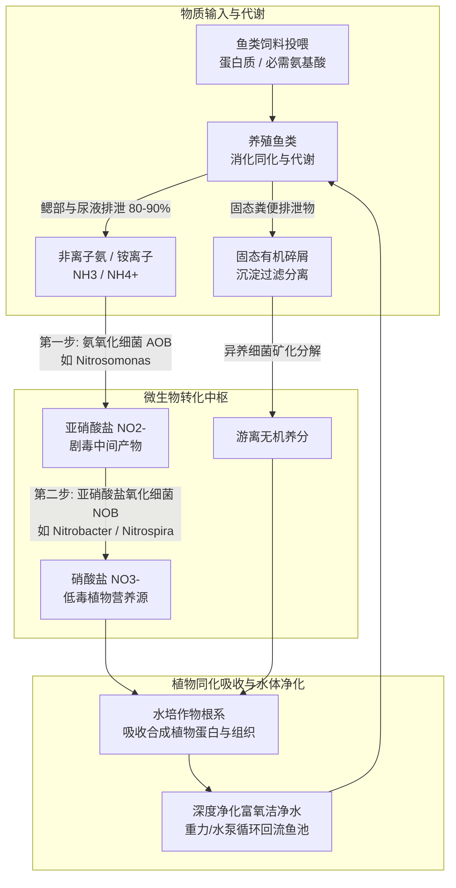
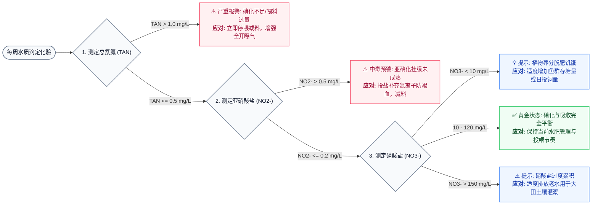

# 第 2 章 认知鱼菜共生：生态系统与物质循环
## Chapter 2: Understanding aquaponics

---

> [!NOTE]
> **本章核心导读**：  
> 鱼菜共生系统的稳定运行依赖于**水生动物（鱼类）、植物群落与微生物群落**三者构建的动态平衡。本章深入剖析驱动系统运转的核心生命纽带——**氮循环（Nitrogen Cycle）与两步生化硝化作用**，系统拆解生物滤器（Biofilter）的设计基理与维护健康细菌菌群的五大环境要素（比表面积、pH、温度、溶解氧、紫外线避光），并提出以**投饵量比率（Feed Rate Ratio）** 为核心的系统动态平衡计算模型。

---

---

## 2.1 鱼菜共生的关键生物组件

如第 1 章所述，鱼菜共生并非简单的水管拼接，而是一个高度精密的复合微生态循环系统。在连续循环回路中，养殖水体自鱼池流出，携带鱼类的代谢排泄物依次流经：
1. **机械过滤单元（Mechanical Filter）**：物理沉淀并截留沉降固态粪便与残饵碎屑；
2. **生物过滤单元（Biofilter）**：依靠附着生长在填料表面的硝化细菌菌膜，将水溶性氨氮氧化为低毒且易吸收的硝酸盐；
3. **植物水培床（Grow Beds）**：植物根系直接自水体中吸收硝酸盐及其他微量矿质元素，完成水质深度生物净化；
4. **回流单元（Return Flow）**：净化后的富氧水体回流至养殖池，保障鱼类在洁净水体中健康生长。

在这一闭环中，**生物滤器为微生物提供了稳定的物理附着界面**。微生物负责将高毒性的鱼类排泄废物转化为植物可以直接吸收的离子态养分。植物对养分的吸收移除阻断了有毒氮化合物在水体中的蓄积，从而确保鱼类、植物与细菌三者互利共生。

---

### 2.1.1 氮循环（The Nitrogen Cycle）与硝化生化反应

鱼菜共生系统中最重要的生物化学驱动力是**硝化反应（Nitrification）**，它是地球生物圈宏观氮循环的关键分支。

氮元素（$\text{N}$）是一切生命结构不可或缺的核心基石。它是构成氨基酸、蛋白质、核酸（DNA/RNA）及酶系统的核心成分。虽然大气中约 78% 的组分是分子态氮气（$\text{N}_2$），但由于两个氮原子间存在极强的共价三键（$\text{N}\equiv\text{N}$），绝大多数高等植物无法直接吸收利用，必须经过**生物固氮**或工业哈伯法固氮转化为化合态氮。

在养殖水体中，鱼类摄入饲料蛋白后，通过鳃上皮细胞排泄大量的**非离子氨（$\text{NH}_3$）** 与尿素。在水中，非离子氨与水分子建立解离平衡，形成游离氨与铵根离子（$\text{NH}_4^+$）：

$$\text{NH}_3 + \text{H}_2\text{O} \rightleftharpoons \text{NH}_4^+ + \text{OH}^-$$

> [!WARNING]
> **非离子氨（$\text{NH}_3$）与铵离子（$\text{NH}_4^+$）的毒性差异**：  
> - **非离子氨（$\text{NH}_3$）** 属于脂溶性非电离分子，极易穿透鱼类鳃小片细胞膜进入血液组织，破坏红细胞中枢、引起鳃丝肿胀与组织坏死，即使在极低浓度（$> 0.05\text{ mg/L}$）下也会对鱼类产生强烈的神经与呼吸毒性；  
> - **铵离子（$\text{NH}_4^+$）** 带有正电荷，难以被动扩散穿过生物膜，毒性显著低于 $\text{NH}_3$；  
> - 两者的解离平衡强烈受水温与 pH 驱动：**水体 pH 越高、水温越高，剧毒游离氨 $\text{NH}_3$ 的占比呈指数级攀升**。

在成熟的鱼菜共生系统中，两类专性化能自养细菌主导了至关重要的两步好氧硝化反应：

#### 第一步：氨氧化过程（Ammonia Oxidation）
由**氨氧化细菌（Ammonia-Oxidizing Bacteria, AOB，如亚硝化单胞菌 *Nitrosomonas* 属）** 主导，在充足溶解氧条件下将氨氧化为具有水生毒性的亚硝酸盐（$\text{NO}_2^-$）：

$$2\text{NH}_3 + 3\text{O}_2 \xrightarrow{\text{AOB}} 2\text{NO}_2^- + 2\text{H}^+ + 2\text{H}_2\text{O} + \text{能量}$$

#### 第二步：亚硝酸盐氧化过程（Nitrite Oxidation）
由**亚硝酸盐氧化细菌（Nitrite-Oxidizing Bacteria, NOB，如硝化杆菌 *Nitrobacter* 属与硝化螺菌 *Nitrospira* 属）** 主导，将亚硝酸盐迅速进一步氧化为相对安全的硝酸盐（$\text{NO}_3^-$）：

$$2\text{NO}_2^- + \text{O}_2 \xrightarrow{\text{NOB}} 2\text{NO}_3^- + \text{能量}$$

#### 全系统硝化总反应方程
综合两步反应，完整的硝化生化总方程可表示为：

$$\text{NH}_4^+ + 2\text{O}_2 \rightarrow \text{NO}_3^- + 2\text{H}^+ + \text{H}_2\text{O}$$

> [!IMPORTANT]
> **硝化反应的工程启示**：  
> 1. **高耗氧反应**：每氧化 $1\text{ mg}$ 氨氮（以 $\text{N}$ 计）需要消耗约 $4.57\text{ mg}$ 的溶解氧（$\text{O}_2$）。生物滤池必须维持强劲的曝气增氧；  
> 2. **持续酸化产氢离子**：反应持续释放氢离子（$\text{H}^+$），不断中和消耗水体中的碳酸盐碱度（$\text{KH}$）。若无外源缓冲剂补充，水体 pH 会不可逆地急剧下跌，导致硝化停滞甚至倒缸。

---

## 2.2 生物滤器（The Biofilter）

生物滤器（Biofilter）是鱼菜共生系统中最关键却最容易被忽视的“隐形心脏”。它并非物理筛除颗粒的滤网，而是**专门为数以亿计的硝化细菌提供极高微孔表面积与优渥生境的人工生化反应器**。

在基质床鱼菜系统（Media Bed Units）中，多孔火山岩或膨胀陶粒填充的种植床本身兼具了机械过滤与生物滤器的复合功能；而在深水浮筏（DWC）和管道营养液膜（NFT）系统中，由于水体中植物根系的表面积不足以承载整个系统的硝化负荷，必须在鱼池和种植槽之间串联独立的专用生物滤槽（Biofilter Tank），内装高比表面积的生物球（Bio-balls）、K1/K3 流化床填料或波纹塑料板。

---

## 2.3 维系高效菌群的关键环境要素

硝化细菌属于化能自养微生物，繁殖分裂周期极长（AOB 分裂周期约为 7~8 小时，NOB 约为 13 小时，远慢于分裂周期仅需 20 分钟的常规异养腐生菌）。维持生物滤膜的旺盛活性与种群稳定，必须严密调控以下五大环境基准：

### 2.3.1 比表面积（Specific Surface Area, SSA）
硝化菌属于专性附着生长型生物，无法游离悬浮在纯水中生存，必须牢固附着在固体基底表面形成黏性生物被膜（Biofilm）。
- **比表面积（SSA）** 定义为单位体积填料所具有的总有效表面积（单位：$\text{m}^2/\text{m}^3$）；
- 填料的比表面积越大，同等体积滤槽内能定殖的硝化菌总生物量就越高；
- 小型系统常用的介质床陶粒（LECA）比表面积约为 $250\sim 300\text{ m}^2/\text{m}^3$；专用工程塑料生化填料（如 K1 环、生化棉）可达 $500\sim 1000\text{ m}^2/\text{m}^3$。

### 2.3.2 水体酸碱度（Water pH）
- **细菌适宜区间**：AOB 与 NOB 的生理最佳 pH 均偏弱碱性：
  - 氨氧化菌（*Nitrosomonas* spp.）：最佳 pH 为 **7.2–7.8**；
  - 亚硝酸氧化菌（*Nitrobacter* spp.）：最佳 pH 为 **7.2–8.2**。
- **系统生态妥协**：当系统水体 pH 降至 6.0 以下时，硝化菌活性呈断崖式下跌，硝化反应基本停滞；但当 pH 高于 7.5 时，植物对铁、磷、锰等关键微量元素的吸收受阻，同时水中高毒非离子氨比例激增。因此，工程运营中通常将水体锁定在 **6.8–7.0** 这一三方妥协的黄金平衡点。

### 2.3.3 水温（Water Temperature）
- 硝化细菌的最适生长与生化代谢温度区间为 **17–34 °C**；
- 当水温跌破 17 °C 时，细菌酶活性逐渐受到抑制；
- 当水温降至 **10 °C 以下**时，硝化效率将锐减 50% 以上；在 4 °C 极端低温下硝化基本停摆。冬季或高寒地区必须通过大棚保温、水体加热或调整投喂量进行代偿。

### 2.3.4 溶解氧（Dissolved Oxygen, DO）
- 硝化反应本质是强好氧生化氧化过程，氧气是反应底物；
- 生物滤器内的溶解氧必须恒定保持在 **4–8 mg/L**；
- 若局部流速过慢或死水导致 DO 跌破 **2.0 mg/L**，硝化反应将遭受严重抑制；
- 若滤料发生有机淤泥堵塞形成长期厌氧死区，**反硝化细菌（Denitrifying Bacteria）** 将在无氧条件下滋生，将宝贵的硝酸盐转化为一氧化二氮或分子态氮气（$\text{N}_2$）逸散至空气中，造成系统宝贵植物养分的净流失。

### 2.3.5 紫外线防护（Ultraviolet Light, UV）
- 硝化细菌具有天然的强烈**光敏性（Photosensitivity）**，太阳光中的紫外线对未成熟的菌株具有极强的杀灭破坏作用；
- 尤其在新建系统挂膜开缸的前两周，若生物滤槽暴露在直射阳光下，有益菌膜将极难建立；
- 工程规范要求：**所有生化过滤容器与沉淀槽体必须采用遮光盖板或黑色抗紫外线材质避光密封**。

---

### 表 2.1：硝化细菌群落水质耐受与最适运行参数基准

| 环境参数 | 生理耐受极限区间 (Tolerance Range) | 工程最佳控制区间 (Optimal Range) | 超标/越界生态后果与风险 |
| :--- | :--- | :--- | :--- |
| **水温** | $10 \sim 38\text{ }^\circ\text{C}$ | **$24 \sim 28\text{ }^\circ\text{C}$** | $< 15\text{ }^\circ\text{C}$ 硝化速率腰斩；$> 40\text{ }^\circ\text{C}$ 菌膜热灭活 |
| **pH 指数** | $6.0 \sim 8.5$ | **$7.2 \sim 7.8$**（系统平衡取 **$6.8 \sim 7.0$**） | $< 6.0$ 硝化反应彻底停摆，氨氮急剧累积；$> 8.0$ 易致游离氨鱼毒 |
| **溶解氧 (DO)**| $> 2.0\text{ mg/L}$ | **$4.0 \sim 8.0\text{ mg/L}$** | $< 2.0\text{ mg/L}$ 硝化受阻，诱发厌氧区产生反硝化脱氮与硫化氢 |
| **总氨氮 (TAN)**| $< 5.0\text{ mg/L}$ | **$< 1.0\text{ mg/L}$**（成熟系统要求趋近 $0$）| 浓度过高对鱼类产生不可逆神经损伤与急性死亡 |
| **亚硝酸盐 ($\text{NO}_2^-$)**| $< 3.0\text{ mg/L}$ | **$< 0.2\text{ mg/L}$**（成熟系统要求趋近 $0$）| 引起鱼类血液亚硝酸盐中毒（褐血病/高铁血红蛋白症） |
| **硝酸盐 ($\text{NO}_3^-$)**| $< 400\text{ mg/L}$ | **$20 \sim 120\text{ mg/L}$** | $< 10\text{ mg/L}$ 植物缺素饥饿；$> 150\text{ mg/L}$ 鱼类慢性生长抑制，需排换水 |
| **光照条件** | 避光或弱漫射光 | **完全遮光（避光黑暗）** | 强紫外光直接导致游离硝化菌致死，生化滤池内滋生绿藻堵塞孔隙 |

---

## 2.4 维持鱼菜共生生态系统的动态平衡

“系统平衡（Balancing）”是鱼菜共生运维中最重要的工程原则。它本质上是**鱼类排泄负荷、微生物生物转化通量与植物养分吸收速率三者之间的化学计量学匹配**。

```mermaid
flowchart LR
    subgraph Left["左盘：需肥与排泄源（负荷端）"]
        Fish["养殖鱼群总生物量 Biomass<br/>日投饵饲喂负荷 (Feed Rate)"]
        Waste["排泄代谢废物<br/>非离子氨与总氨氮 TAN"]
        Fish --> Waste
    end

    subgraph Pivot["中央支点：生化转化中枢"]
        Bio["生物滤器有效表面积 SSA<br/>硝化细菌菌膜群落 (AOB / NOB)"]
        Reaction["两步生化硝化氧化<br/>TAN → NO2- → NO3-"]
        Bio --> Reaction
    end

    subgraph Right["右盘：耗肥与净化端（吸收端）"]
        Plants["水培作物有效种植面积<br/>健康叶菜/果菜吸肥通量"]
        Clean["同化吸收硝酸盐<br/>深度净化并回流富氧洁净水"]
        Plants --> Clean
    end

    Waste ==>|"等量负荷匹配<br/>(40~50 g饲料/m²/天)"| Bio
    Reaction ==>|"等量养分同化<br/>(维持动态零积聚)"| Plants

    classDef leftBox fill:#f0f9ff,stroke:#0284c7,stroke-width:1.5px,color:#0c4a6e;
    classDef centerBox fill:#fefce8,stroke:#ca8a04,stroke-width:1.5px,color:#713f12;
    classDef rightBox fill:#f0fdf4,stroke:#16a34a,stroke-width:1.5px,color:#14532d;
    
    class Left leftBox;
    class Pivot centerBox;
    class Right rightBox;
```

### 2.4.1 天平模型与失衡场景分析

如果将系统比作一架天平：左端是鱼类排泄物（需肥源），右端是植物吸收吸收（耗肥源），而支撑天平横梁的支点与杠杆本身则是**硝化细菌群落**：

#### 场景 1：生物滤器不足（杠杆断裂型失衡）
- **表征**：鱼类存塘量很大但生化过滤体积偏小（填料不足或比表面积匮乏）；
- **后果**：鱼类产生的氨氮无法被完全消化，水体中游离氨（$\text{NH}_3$）和亚硝酸盐（$\text{NO}_2^-$）迅速飙升（$> 1\text{ mg/L}$），鱼群发生急性中毒死亡。

#### 场景 2：植物配比不足（养分过度富集型失衡）
- **表征**：鱼类充足且生物过滤强劲，但种植槽面积狭小或植物株数太少；
- **后果**：氨氮被全部转化为硝酸盐，但植物无法完全同化吸收。水体中的硝酸盐浓度逐渐累积至超高水平（$> 150\sim 200\text{ mg/L}$），造成养分浪费，并对水质渗透压产生不良压力。

#### 场景 3：鱼类配比不足（作物脱肥饥饿型失衡）
- **表征**：新手种植者最常犯的错误——在巨大的种植床中种植大量绿叶菜，但鱼池中仅养殖几条小鱼；
- **后果**：硝化系统虽然水质极佳，但由于总投饲量过小，生成的硝酸盐及钾、钙、铁等元素极度匮乏（$\text{NO}_3^- < 5\text{ mg/L}$），植物长期处于营养不良状态，出现黄叶、僵苗及植株矮化。

---

### 2.4.2 投饵量比率（Feed Rate Ratio）：系统工程配比设计的金标准

早期鱼菜共生设计往往依赖“水体容积比”或“鱼与植物的重量比”，但在实际运营中，鱼体规格会持续增长，不同鱼种的新陈代谢率也完全不同。经维尔京群岛大学（UVI）等科研机构多年的系统试验，业界确立了**以“日投饵量与种植面积比率（Feed Rate Ratio）”作为全系统容量规划的唯一科学基准**。

> [!TIP]
> **FAO 推荐的日常投饵量基准比率**：  
> - **种植常规绿叶蔬菜（如生菜、小白菜、瑞士甜菜、香草草本）**：  
>   $$\mathbf{40 \sim 50 \text{ 克饲料 / 平方米种植面积 / 每天}}$$  
> - **种植茄果瓜类蔬菜（如番茄、黄瓜、辣椒、茄子、草莓）**：  
>   $$\mathbf{50 \sim 80 \text{ 克饲料 / 平方米种植面积 / 每天}}$$

**核心设计逻辑**：
1. 先根据家庭或商业需求确定**种植床的实际有效采光生产面积（$\text{m}^2$）**；
2. 依据作物类型（绿叶菜或果菜），计算每天系统所需的总饲料投入重量（$\text{g/天}$）；
3. 按照成年鱼每日健康摄食率为自身体重的 **1%~2%**，反推鱼池内所需的健康**鱼类总存塘生物量（Biomass）**；
4. 依据每日总投饵量中蛋白质含量的转化率，计算所需填料的**总比表面积**，从而确定生物滤槽体积。

---

### 2.4.3 动植物生理表征现场巡检法（Health Check）

日常运维中，动植物的生理表征是比化学试剂更敏锐直观的“生物传感器”：

1. **植物异常表征与诊断**：
   - **下位老叶整体发黄、脉间失绿**：氮素缺乏（$\text{NO}_3^-$ 供应不足），需适度提高投饵量或排查生物过滤活性；
   - **新生幼叶边缘焦枯、卷曲呈杯状**：缺钙征兆（新叶细胞壁发育不良），需补充碳酸氢钙或调整根区水流；
   - **老叶边缘灼伤、呈红褐色斑点**：缺钾征兆，需补充碳酸氢钾；
   - **新叶心叶大面积黄白化但叶脉保持绿色**：缺铁失绿症（在 pH $> 7.0$ 条件下尤其高发），需定期叶面喷施或水体添加螯合铁（Fe-EDDHA / Fe-DTPA）。

2. **鱼类应激与异常表征**：
   - **水面浮头与张口喘息（Piping）**：水体严重缺氧（$\text{DO} < 2\text{ mg/L}$）或氨氮/亚硝酸盐过高损伤鳃部呼吸功能；
   - **在池壁、池底管件上剧烈摩擦身躯（Flashing）**：外部寄生虫滋生或水质 pH 剧烈波动引起体表粘液应激；
   - **体表充血、鳍条基部红肿发炎、眼球突起**：亚硝酸盐过高导致血液运氧衰竭或细菌性全身感染；
   - **食欲显著骤降甚至完全废食**：水质水温恶化、氨氮超标或疾病爆发的前驱信号。

---

### 2.4.4 水质化验测试与动态干预红线（Nitrogen Testing）

建立每周至少一次的标准化试剂滴定化验制度是保障系统长治久安的底线工作：

---

## 2.5 本章小结（Chapter Summary）

- **共生本质**：鱼菜共生是在同一水循环体系中，将高密度水产养殖与无土植物栽培紧密咬合的闭环农业工程；
- **微生物核心纽带**：自养硝化细菌负责将鱼类排泄的剧毒非离子氨依次氧化为亚硝酸盐和相对安全的硝酸盐，完成了废弃物向肥料的化学转化；
- **菌群健康四大支柱**：比表面积充足的避光附着载体、充沛的溶解氧（$4\sim 8\text{ mg/L}$）、温暖的水温（$17\sim 34\text{ }^\circ\text{C}$）以及稳定的弱碱/中性环境（pH $6.8\sim 7.2$）；
- **动态平衡的核心指标**：系统容量必须以**投饵量比率（Feed Rate Ratio）** 进行正向校核与设计：绿叶类作物按 $40\sim 50\text{ g/m}^2/\text{天}$，茄果类作物按 $50\sim 80\text{ g/m}^2/\text{天}$；
- **三元预警机制**：日常运维需将**动植物外观病理巡检**与**每周水质理化测试**相结合，确保氨氮与亚硝酸盐始终压制在 $1.0\text{ mg/L}$ 以下的安全阈值内。
