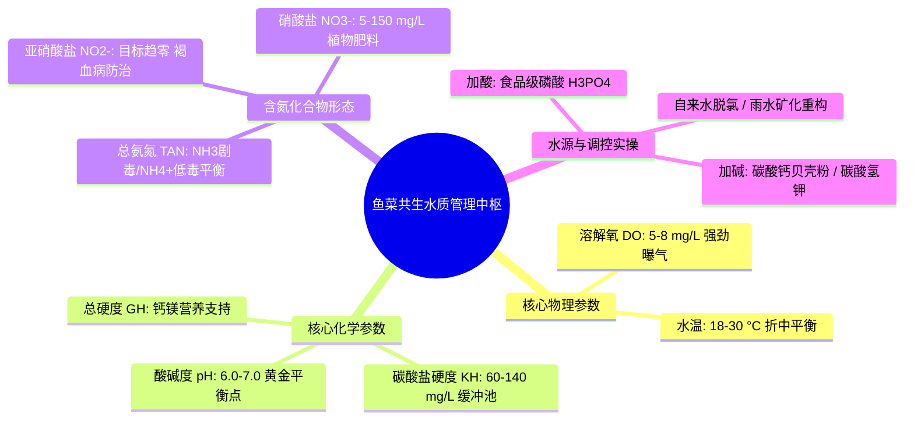
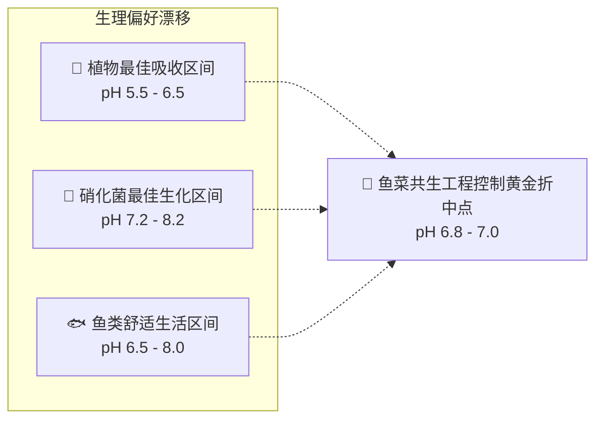
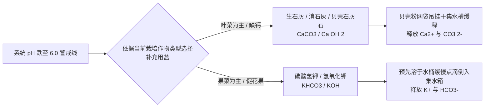

# 第 3 章 鱼菜共生中的水质管理
## Chapter 3: Water quality in aquaponics

---

> [!NOTE]
> **本章核心导读**：  
> 水是鱼菜共生系统的生命血液与生化介质。水体既承载着鱼类的呼吸排泄，又是微生物硝化的生化溶剂，同时向植物根系输送全部营养离子。本章深入剖析影响系统生存的**五大核心水质参数**（溶解氧、pH、水温、总氮化合物、总硬度与碳酸盐硬度），揭示水体 pH 与碳酸盐碱度（KH）的酸缓冲力学机制，阐明游离毒氨（$\text{NH}_3$）在不同 pH/温度下的离解规律，并提供严谨的现场水源预处理、pH 安全调控（酸碱缓冲剂选择）与水质滴定化验实战规程。

---

---

## 3.1 生物耐受极限与系统综合妥协

在独立的水产养殖或商业无土水培中，管理者可以根据单一物种的生理嗜好将水质指标调节至绝对极限最佳工况。然而在鱼菜共生系统中，管理者必须同时服务于三个生物学特性截然不同的生物界：
1. **鱼类（水生脊椎动物）**：偏好中性至弱碱性水质（pH 6.5–8.0），极度依赖高溶氧，对非离子氨与亚硝酸盐极度敏感；
2. **植物（高等自养绿色植物）**：偏好微酸性根区环境（pH 5.5–6.5），以保证铁、磷、锰、锌等微量阳离子处于游离螯合态以利于吸收；
3. **硝化细菌（化能自养微生物）**：偏好弱碱性环境（pH 7.2–8.2）与温暖水温（24–28 °C），耐受低 pH 能力极差。

系统运维的核心艺术，在于**寻找到令三者皆处于健康安全生长区间内的“生态折中黄金平衡点”**。

---

## 3.2 五大关键水质参数深度解析

### 3.2.1 溶解氧（Dissolved Oxygen, DO）
溶解氧指以分子状态溶解在水中的游离氧量（单位：$\text{mg/L}$ 或 $\text{ppm}$）。它是整个系统生命维持系统中**最紧迫、最具系统灾难性风险的单点瓶颈**。

- **各生物对 DO 的生理底线**：
  - **鱼类**：大多数温水鱼（罗非鱼、鲤鱼）在 $\text{DO} < 3\text{ mg/L}$ 时即发生食欲骤降、浮头喘息；若长时期低于 $2\text{ mg/L}$ 将发生急性缺氧死亡；冷水鱼（如虹鳟）对溶氧要求极高，要求常年维持在 $> 6\text{ mg/L}$；
  - **植物根系**：根系的有氧呼吸对主动吸收矿质离子至关重要。若根区缺氧（$\text{DO} < 3\text{ mg/L}$），植物根毛细胞迅速窒息并诱发厌氧病原菌（如腐霉菌 *Pythium*）入侵，引发致命的**根腐病（Root Rot）**；
  - **硝化细菌**：每氧化 $1\text{ mg}$ 氨氮需要消耗约 $4.57\text{ mg}$ 溶解氧。当生物滤池内 $\text{DO} < 2\text{ mg/L}$ 时，硝化进程几乎停摆。

> [!IMPORTANT]
> **水温与溶氧的逆向热力学矛盾**：  
> 水中氧气的物理饱和溶解度随水温升高而显著下降。例如在 1 个标准大气压下：  
> - 水温 $15\text{ }^\circ\text{C}$ 时，纯水饱和溶氧约为 $10.1\text{ mg/L}$；  
> - 水温升至 $30\text{ }^\circ\text{C}$ 时，饱和溶氧骤跌至 $7.5\text{ mg/L}$。  
> 
> 与此同时，水生冷血动物（鱼类）与微生物在新陈代谢动力学规律（$Q_{10}$ 效应）驱使下，**温度越高其呼吸耗氧速率越快**。因此，在夏季高温期，系统极易发生“耗氧需求飙升与物理溶氧能力萎缩”的双重剪刀差，必须配置强化气泵曝气与水流文丘里喷管（Venturi injectors）。

---

### 3.2.2 水体酸碱度（pH）
pH 是水中氢离子（$\text{H}^+$）活度的负对数度量（$\text{pH} = -\log[\text{H}^+]$），是整个系统生物化学反应的“总阀门”。

1. **pH 偏高（$> 7.5$）的系统灾害**：
   - **养分沉淀与缺素**：微量营养阳离子（$\text{Fe}^{2+}, \text{Mn}^{2+}, \text{Zn}^{2+}, \text{Cu}^{2+}$）与磷酸根离子形成不溶性沉淀，导致植物表现出严重的顶芽失绿黄化与落花落果；
   - **非离子氨毒性激增**：促使水体中的无毒铵离子（$\text{NH}_4^+$）快速转化为剧毒的游离非离子氨（$\text{NH}_3$）。
2. **pH 偏低（$< 6.0$）的系统灾害**：
   - **硝化系统完全崩溃**：硝化酶活性受到不可逆破坏，氨氮开始急剧累积；
   - **鱼类鳃丝烧伤**：水体酸性直接侵蚀鱼体黏膜，引发渗透压调节衰竭。
3. **工程目标值**：在日常运营中，**强行将 pH 稳定在 6.0–7.0（最佳 6.8–7.0）**是唯一能同时兼顾动植物与菌群的可行区间。

---

### 3.2.3 水温（Temperature）
水温直接制约鱼类的摄食消化速率、植物的光合代谢与微生物的硝化增殖速率。

1. **适养鱼种温区分类**：
   - **暖温水性鱼类（Warm-water species）**：
     - **罗非鱼（Tilapia）**：最适水温 $24\sim 30\text{ }^\circ\text{C}$，停止摄食点 $< 16\text{ }^\circ\text{C}$，致死水温 $< 12\text{ }^\circ\text{C}$；
     - **鲤鱼与金鱼（Carp & Goldfish）**：耐受范围宽广（$4\sim 32\text{ }^\circ\text{C}$），最适生长温区 $20\sim 28\text{ }^\circ\text{C}$；
     - **非洲胡子鲶（Channel Catfish / Clarias）**：适应高温（$24\sim 30\text{ }^\circ\text{C}$），极耐低氧。
   - **冷水性鱼类（Cold-water species）**：
     - **虹鳟（Rainbow Trout）**：最适水温 $12\sim 18\text{ }^\circ\text{C}$，超过 $21\text{ }^\circ\text{C}$ 即产生严重热应激并伴随高死亡率。
2. **植物根温效应**：
   - 绝大多数绿叶蔬菜（如生菜、羽衣甘蓝）偏好冷凉根区环境（水温 $16\sim 22\text{ }^\circ\text{C}$）。水温若长期持续 $> 26\text{ }^\circ\text{C}$，生菜将出现提早抽薹（Bolting）、叶片变苦以及叶缘焦枯。

---

### 3.2.4 总氮化合物：氨、亚硝酸盐与硝酸盐

在养殖水体中，氮化合物以三种生化氧化还原态依次转化流转：

#### 1. 总氨氮（Total Ammonia Nitrogen, TAN）
TAN 包括水溶液中存在的两种动态平衡分子与离子形态：
$$\text{TAN} = [\text{NH}_3] + [\text{NH}_4^+]$$

- **非离子氨（$\text{NH}_3$）**对鱼类具有高毒性，能直接穿透鳃表皮侵入鱼体内循环；
- 两者的比例严格取决于水体的 **pH** 和 **水温**。

下表清晰揭示了随着 pH 与温度上升，剧毒 $\text{NH}_3$ 在总氨中所占的百分比剧烈激增的客观物理化学规律：

| 水温 (°C) | pH 6.0 | pH 6.5 | pH 7.0 | pH 7.5 | pH 8.0 | pH 8.5 | pH 9.0 |
| :---: | :---: | :---: | :---: | :---: | :---: | :---: | :---: |
| **16 °C** | 0.01% | 0.04% | 0.13% | 0.40% | 1.24% | 3.82% | 11.2% |
| **20 °C** | 0.02% | 0.06% | 0.18% | 0.57% | 1.77% | 5.38% | 15.3% |
| **24 °C** | 0.02% | 0.08% | 0.25% | 0.80% | 2.50% | 7.46% | 20.3% |
| **28 °C** | 0.03% | 0.11% | 0.36% | 1.13% | 3.49% | 10.21% | 26.3% |

> [!CAUTION]
> **解读关键**：在水温 28 °C 下，若水质 pH 从 7.0 漂移至 8.0，水中剧毒游离氨的实际浓度将**瞬间暴增近 10 倍**！这就是为什么在碱性水质下极低的总氨氮也能迅速毒死鱼群。  
> **工程安全红线**：成熟系统的 TAN 应常态化控制在 **$< 0.5\text{ mg/L}$**（理想状况趋近于 0），游离氨 $\text{NH}_3$ 必须控制在 **$< 0.05\text{ mg/L}$**。

#### 2. 亚硝酸盐（Nitrite, $\text{NO}_2^-$）
- **生化本质**：硝化第一阶段的中间产物，毒性极高；
- **褐血病中毒机理（Brown Blood Disease）**：亚硝酸根离子通过鱼鳃主动运输吸收进入血液，将血红蛋白中的二价铁（$\text{Fe}^{2+}$）强氧化为三价铁（$\text{Fe}^{3+}$），生成高铁血红蛋白（Methemoglobin）。高铁血红蛋白失去携带氧气的能力，导致鱼类血液呈现黑褐色，鱼群因组织内窒息而死亡；
- **应急解毒手段**：向水体中按比例投加**氯化钠（$\text{NaCl}$，食盐）**。水中的氯离子（$\text{Cl}^-$）能与亚硝酸根离子在鱼鳃上皮受体发生竞争性吸附，阻断亚硝酸根侵入血液；
- **工程安全红线**：亚硝酸盐常态下必须 **$< 0.2\text{ mg/L}$**，若持续 $> 1.0\text{ mg/L}$ 将造成批量鱼类死淘。

#### 3. 硝酸盐（Nitrate, $\text{NO}_3^-$）
- **生化本质**：完全硝化的终产物，是植物根系同化合成蛋白质的最核心氮肥源；
- **耐受阈值**：鱼类对硝酸盐具有极宽容的生理抗性，许多淡水鱼能耐受高达 $400\text{ mg/L}$ 的硝酸盐；
- **工程目标区间**：系统正常维持在 **$20 \sim 120\text{ mg/L}$**。低于 $10\text{ mg/L}$ 说明植物缺肥脱氮；若累积超过 **$150\text{ mg/L}$**，应适度放水稀释，将富营养水用于浇灌土壤园艺。

---

### 3.2.5 水体硬度：总硬度（GH）与碳酸盐硬度（KH）

水质硬度是养殖者极易混淆但对系统长期抗风险能力起决定作用的隐形屏障：

#### 1. 总硬度（General Hardness, GH）
- **定义**：水体中全部二价阳离子的总摩尔浓度，主要反映**钙离子（$\text{Ca}^{2+}$）与镁离子（$\text{Mg}^{2+}$）**的丰度；
- **生态价值**：钙是构建鱼骨、鳞片以及植物细胞壁果胶质不可替代的元素（防植物烧心病）；镁是叶绿素分子的核心螯合中心。系统推荐 GH 维持在 **$60\sim 140\text{ mg/L}$**（等同于 $3.5\sim 8.0\text{ }^\circ\text{dGH}$）。

#### 2. 碳酸盐硬度 / 碱度（Carbonate Hardness / Alkalinity, KH）
- **定义**：水中**碳酸氢根（$\text{HCO}_3^-$）与碳酸根（$\text{CO}_3^{2-}$）**的总浓度；
- **核心职能：pH 缓冲酸性保护伞**。前文已证明，硝化细菌氧化氨氮的过程本质上是在向水中持续释放强酸性氢离子（$\text{H}^+$）：

$$\text{NH}_4^+ + 2\text{O}_2 \rightarrow \text{NO}_3^- + \mathbf{2H^+} + \text{H}_2\text{O}$$

每氧化 $1\text{ mg}$ 氨氮，在理论上将永久性消耗中和约 **$7.14\text{ mg}$ 的碳酸钙碱度当量**。

若水中碳酸盐硬度枯竭（$\text{KH} < 20\text{ mg/L}$），水体将瞬间丧失缓冲外源氢离子的能力，引发灾难性的**“pH 暴跌崩溃（pH Crash）”**——水质 pH 会在数小时内从 6.8 垂直砸落至 4.5 以下，引发全缸硝化菌群体死亡与鱼类急性酸中毒休克。

> [!TIP]
> **KH 工程控制底线**：系统日常必须储备 **$60 \sim 140\text{ mg/L}$**（约 $3.5\sim 8\text{ }^\circ\text{dKH}$）的碳酸盐硬度，充当持续抗酸化的蓄水池缓冲垫。

---

### 表 3.1：鱼菜共生系统全要素水质参数目标与耐受总表

| 水质指标 | 养殖鱼类适宜区间 | 水培植物适宜区间 | 硝化细菌最适区间 | **鱼菜系统工程控制折中目标** |
| :--- | :--- | :--- | :--- | :--- |
| **水温 (°C)** | $22\sim 28$（温水）/ $14\sim 18$（冷水）| $16\sim 24$（温和凉爽）| $24\sim 28$ | **$18 \sim 26\text{ }^\circ\text{C}$** |
| **pH 指数** | $6.5 \sim 8.0$ | $5.5 \sim 6.5$ | $7.2 \sim 8.2$ | **$6.0 \sim 7.0$（黄金值 6.8）** |
| **溶解氧 (DO)**| $> 5.0\text{ mg/L}$ | $> 3.0\text{ mg/L}$ | $> 4.0\text{ mg/L}$ | **$5.0 \sim 8.0\text{ mg/L}$** |
| **氨氮 (TAN)** | $< 1.0\text{ mg/L}$（$\text{NH}_3 < 0.05$）| 可吸收，无不良反应 | 反应底物 | **$< 0.5\text{ mg/L}$（理想 0）** |
| **亚硝酸盐 ($\text{NO}_2^-$)**| $< 0.5\text{ mg/L}$ | 无害 | 反应中间体 | **$< 0.2\text{ mg/L}$（理想 0）** |
| **硝酸盐 ($\text{NO}_3^-$)**| $< 150\text{ mg/L}$ | $50 \sim 150\text{ mg/L}$ | 产物，无影响 | **$20 \sim 120\text{ mg/L}$** |
| **碳酸盐硬度 (KH)** | 宽容 | 影响根系环境 | 必需中和底物 | **$60 \sim 140\text{ mg/L}$** |

---

## 3.3 水体中的次级生物群：藻类与寄生微生物

### 3.3.1 绿藻对水质化学环境的双向昼夜震荡
在光照充足的明渠、深水浮筏或未加遮盖的鱼池表面，单细胞绿藻和丝状藻类极易爆发性滋生：
- **昼间正效应与风险**：在白天光合作用下，藻类吸收 $\text{CO}_2$ 并向水中释放巨量氧气，常使下午水体溶氧达到超饱和（$> 10\text{ mg/L}$）。但吸收碳酸导致碳酸氢根解离，会**拉高白天的水体 pH**；
- **夜间剧毒反转**：日落之后，全池藻类终止光合作用，转化为纯呼吸耗氧。水体内原本巨大的藻群在后半夜剧烈与鱼类、细菌抢夺溶解氧，同时呼出大量二氧化碳，导致**黎明前水体溶氧断崖式暴跌至窒息水平，且 pH 呈周期性酸性下跌**；
- **防治红线原则**：鱼菜共生工程必须坚持**“全系统遮光避光设计”**（鱼池、管道、生化仓全密封遮光），彻底断绝浮游藻类的光照通道。

---

## 3.4 系统补给水源特性与前置处理

| 水源类型 | 主要水化学特征 | 潜在风险与缺点 | 进水前工程预处理要求 |
| :--- | :--- | :--- | :--- |
| **天然雨水** | 纯净无矿质，$\text{GH}\approx 0, \text{KH}\approx 0$，pH 弱酸（$5.0\sim 6.0$） | 完全缺乏硬度缓冲，进水后易加速 pH 暴跌 | 必须额外向系统添加碳酸钙/贝壳粉以建立 KH 缓冲 |
| **深井水/承压地下水**| 矿物质丰富，通常具有极高硬度（高 GH/KH）与偏碱 pH | 极度缺氧，可能含有害游离硫化氢（$\text{H}_2\text{S}$）或过量铁离子 | 必须经过**外置曝气沉淀水箱**预曝气 24 小时进行除铁脱气与充分充氧 |
| **市政自来水** | 水质卫生稳定，理化指标透明 | **含强氧化性游离余氯或氯胺（Chloramine）**，直接注入会瞬间杀灭生物滤膜与灼烧鱼鳃 | 必须通过**强力曝气暴晒 48 小时（去除游离氯）**或通过**柱状活性炭微滤吸附（脱除氯胺）**，确认余氯为 0 后方可补水 |
| **反渗透（RO）超滤水** | 彻底去离子，纯净度极高 | 制备能耗高，完全失去有益微量矿物质 | 需人工二次回矿化添加钙镁微量元素 |

---

## 3.5 水体 pH 调控实战指南

由于硝化作用持续产酸，**成熟鱼菜共生系统在日常运行中呈现天然的持续酸化趋势**。因此，日常操作以“加碱防酸”为主，仅在以深井高碱水开缸时才偶发需要“加酸”。

### 3.5.1 降低 pH（酸化调节规程）
- **推荐药剂**：**食品级磷酸（$\text{H}_3\text{PO}_4$）**。它是一种相对温和的三元中强酸，在释放氢离子调低 pH 的同时，解离出的磷酸根为植物花果期提供了极其宝贵的大量元素磷（$\text{P}$）；
- **备用药剂**：工业级浓硫酸（$\text{H}_2\text{SO}_4$）腐蚀性极强，操作危险度极高，仅由专业人员稀释使用；工业硝酸（$\text{HNO}_3$）也可用于酸化并补充氮源；
- **绝对禁止使用的药剂**：**严禁使用食品级柠檬酸（Citric Acid）**！有机酸在水中是强抑菌防腐剂，会直接渗透并瓦解生物滤膜中的自养硝化细菌；
- **安全操作规范**：**绝对严禁将原浓酸直接倾倒入鱼池中**！必须在外部备用补水桶中先注入足量清水，将适量稀酸**“酸入水”**缓缓搅拌混匀后，再缓慢点滴补入系统。

### 3.5.2 提升 pH 与恢复碱度（补碱与增 KH 规程）
当系统 pH 逼近 $6.0$ 红线时，必须立即介入提高碱度：

- **天然安全缓释法（强烈推荐）**：将洗净并敲碎的**牡蛎壳（贝壳粉）、蛋壳或农用粗石灰石粒（$\text{CaCO}_3$）**装入透水网袋，悬挂在集水箱（Sump Tank）的高流速回水区。水体在微酸性下会自动温和溶解碳酸钙，既补充了钙离子又缓慢提升了 KH 与 pH，当 pH 达到 7.0 时溶解自发终止，完全杜绝了过量烧根死鱼的风险；
- **速效可溶性无机盐法**：交替使用**碳酸氢钾（$\text{KHCO}_3$）**与**氢氧化钙（$\text{Ca(OH)}_2$）**。钾与钙均属植物关键大量元素，轮换添加可维持养分均衡；
- **致命禁忌警告**：**严禁使用碳酸氢钠（食用小苏打，$\text{NaHCO}_3$）**！虽然小苏打在单纯水产养殖中常用，但在封闭鱼菜共生系统中，钠离子（$\text{Na}^+$）无法被植物吸收且无法挥发，长久累积会导致渗透压失衡引发植物严重盐害中毒。

---

## 3.6 水质化验规程与台账制度

| 监测频次 | 必测核心水质项目 | 推荐测试仪器与方法 | 判定标准与干预阈值 |
| :--- | :--- | :--- | :--- |
| **每天 1 次** | 水温、鱼类摄食状态、水泵运转与气石冒泡 | 水温计、目视观察 | 水温异常需遮阳或加温；曝气停转须在 30 分钟内恢复 |
| **每周 1 次** | **pH、碳酸盐硬度（KH）、硝酸盐（$\text{NO}_3^-$）** | 液体试剂滴定盒（推荐 API Freshwater Kit）或高精度数字探针 | pH 偏离 6.5–7.0 需调控；$\text{KH} < 50$ 补贝壳粉；$\text{NO}_3^- > 150$ 适度排灌 |
| **系统建立期或故障时** | **总氨氮（TAN）、亚硝酸盐（$\text{NO}_2^-$）** | 比色滴定法 | 若 $\text{TAN} > 1.0$ 或 $\text{NO}_2^- > 0.5$，立即减少投饵 50% 并启动强化曝气 |

必须在农场现场建立物理纸质或数字台账，详实登记每次测量数值、投饵重量及酸碱调节剂添加量，以便掌握水质季节性波动演进趋势。

---

## 3.7 本章小结（Chapter Summary）

- **五大参数基准**：日常运维中牢记六大核心控制数字：**pH 6.0–7.0**、**水温 18–26 °C**、**溶氧 DO 5–8 mg/L**、**氨氮与亚硝酸盐趋近 0**、**硝酸盐 20–120 mg/L**、**KH 60–140 mg/L**。
- **酸化的内在必然性**：硝化反应具有天然的产酸消耗碱度特性，操作者必须常态化储备碳酸氢钾或贝壳石灰石以持续维持碳酸盐硬度缓冲区。
- **水源安全与防氯防藻**：市政自来水必脱氯，地下水必曝气除硫除铁，全系统养殖仓与生化管件必须 100% 避光遮阴以彻底压制绿藻昼夜溶氧震荡。
