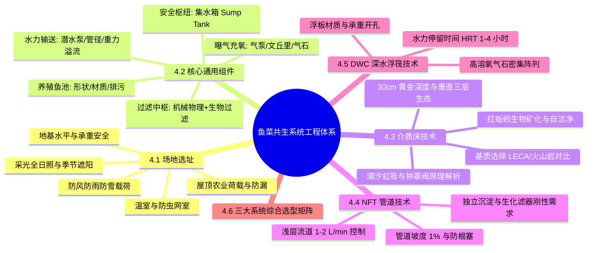
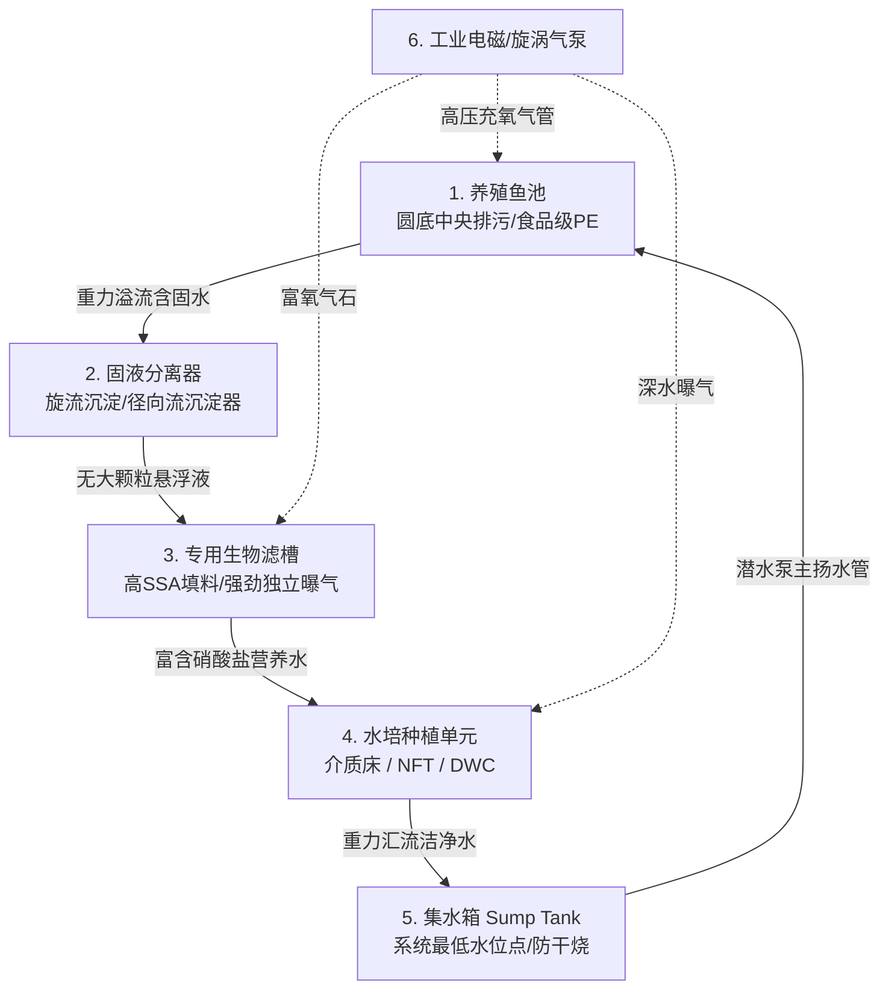
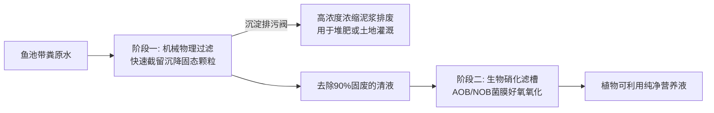
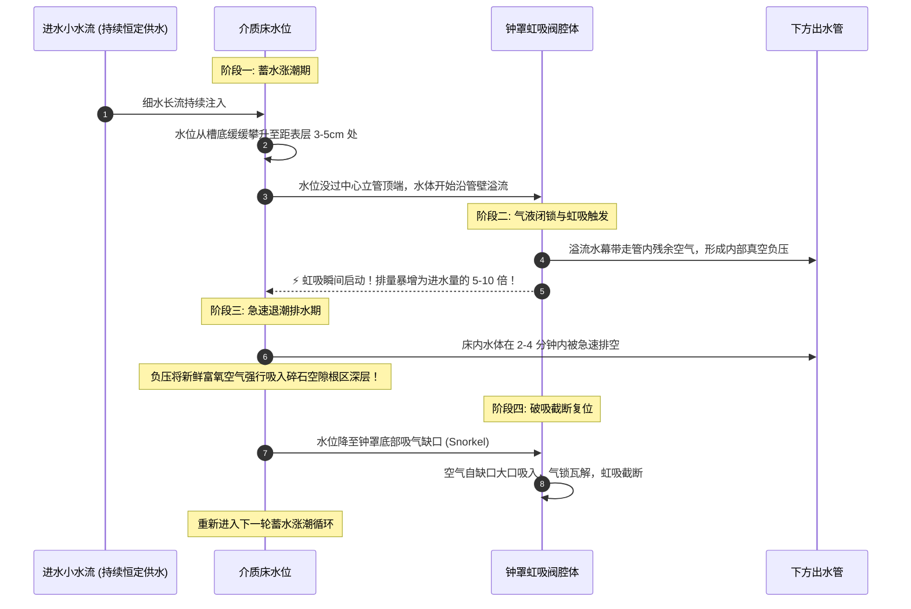
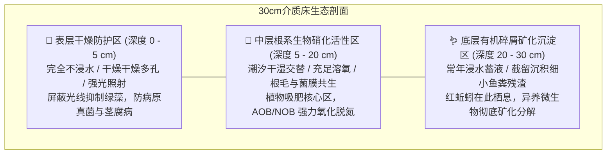
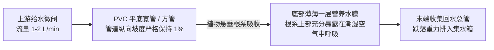
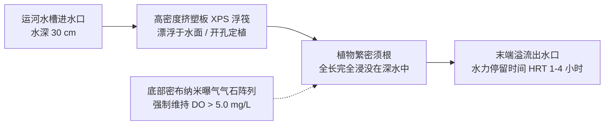

# 第 4 章 鱼菜共生系统组件设计与构建
## Chapter 4: Design of aquaponic units

---

> [!NOTE]
> **本章核心导读**：  
> 本章系统阐述鱼菜共生设施的工程物理架构与水力学生态设计。从场地选址勘验（地基承重、光照遮荫、风雪防护及屋顶特殊荷载）、系统核心八大硬件组件（鱼池、固液分离沉淀器、生化滤槽、水培槽床、水泵管路、曝气充氧机、集水箱及管阀配件），到三大主流技术流派——**介质床潮汐虹吸系统（Media Bed / Ebb-and-Flow）**、**管道营养液膜系统（NFT）** 与 **深水浮筏栽培系统（DWC）** 的水流动力学、结构建造、基质选型、截污排污机制及生态分层进行了工程级深度剖析，并提供详尽的三大流派技术经济特性横向评估矩阵。

---



---

## 4.1 选址规划与环境适配考量（Site Selection）

合理的空间选址是确保鱼菜共生系统实现低能耗、长周期稳定运行的前提条件。

### 4.1.1 地基稳定性与承重极限（Stability）
水具有极大的单位质量（$1\text{ m}^3\text{ 水} = 1000\text{ kg} = 1\text{ 吨}$）。一个典型的 1000 升小型家用水产养殖单元，加上鱼池自重、支架、管道以及灌满水的种植床，其地面静荷载往往达到数吨之重：
- **地基沉降风险**：必须选择坚实、平整且未扰动的硬化混凝土地面或夯实平整地基。若在松软泥土上安装，随着水体注入，地基不均匀沉降将导致管道接头开裂扭曲、自吸虹吸阀失灵以及鱼池倾覆；
- **水平校准**：所有水培床和管道在安装前必须使用水平仪严格找平。在 NFT 或 DWC 系统中，仅数厘米的倾斜度差就会导致局部槽段干涸或水体外溢。

### 4.1.2 风、雨、雪极端气象暴露（Exposure to Wind, Rain and Snow）
- **强风威胁**：强风不仅会撕裂温室棚膜、吹翻高大果菜（如番茄、黄瓜），还会加速水面水分与热量蒸发，并在水培架上产生巨大侧向风阻荷载；
- **暴雨冲击**：在室外敞口系统中，突发暴雨会稀释系统养分浓度，剧烈冲刷种植床，更严重的是雨水大量涌入会迫使未经中和的弱酸性软水置换系统水质，稀释碳酸盐硬度（KH）；
- **积雪荷载**：温室顶部必须计算当地百年一遇雪荷载，棚顶坡度应有利于积雪滑落。

### 4.1.3 日照辐射与遮荫管理（Sunlight and Shade）
- **植物光照窗口**：绝大多数绿叶与茄果蔬菜每天需要至少 **4~8 小时** 的直射阳光以维持旺盛的光合作用；
- **鱼池避光硬性红线**：鱼类自身并不需要强光照射，直射阳光照射鱼池会促使池水温度急剧飙升并诱发单细胞绿藻疯长。因此，**养殖鱼池必须 100% 处于全遮荫遮阳网或硬质顶棚保护之下**。

### 4.1.4 水电配套、周界防护与人体工程学可达性
- **可靠供电与水源**：系统附近必须有接地良好的防雨电源插座（且回路必须受 RCD 漏电保护器保护）以及稳定水压的补给水源；
- **防害围栏**：户外系统必须加装物理防虫网或家禽野兽围栏，防范鸟类、老鼠、家猫、流浪狗等入侵捕食鱼类或污染蔬菜；
- **人行维护通道**：种植床与鱼池之间应预留至少 $60\sim 80\text{ cm}$ 的无障碍通道，以方便日常巡检、推车转运、采收蔬菜与捞鱼作业。

### 4.1.5 屋顶农场特殊设计考量（Rooftop Aquaponics）
在寸土寸金的城市建筑平顶架设鱼菜系统具有广阔前景，但必须严格执行建筑结构核验：
- **结构荷载（Structural Load）**：普通居民楼非上人平屋顶的设计活荷载通常仅为 $1.5\sim 2.0\text{ kN/m}^2$（约 $150\sim 200\text{ kg/m}^2$），完全无法承受深水池和重质碎石介质床。在屋顶建设时：
  1. 必须将重型蓄水桶尽量布置在**承重墙或承重梁柱**的正上方；
  2. 严禁使用重达数百公斤的碎石，必须改用超轻质水培技术（如 NFT 管道）或超轻陶粒；
- **防渗防漏双重保障**：屋顶必须具备优良的防水阻根卷材，并在鱼菜设备底面增设紧急接水排水平底托盘；
- **风荷载锚固**：高空阵风风速极大，所有管架必须与屋面基座进行刚性钢索膨胀栓锚固。

### 4.1.6 设施大棚与遮阳防虫网（Greenhouses and Net Structures）
在气候剧烈波动的温带或干旱沙漠地带，配备保护性外构建筑不可或缺：
- **聚乙烯双层充气膜温室**：在冬季提供优异的被动保温增温，阻隔严寒霜冻；
- **高密度防虫遮阳网室（Shade/Insect Nets）**：采用 30%~50% 遮光率的银色或黑色聚乙烯网，既能削减盛夏极端灼伤性辐射峰值、平抑水温，又能物理阻绝蚜虫、粉虱、甘蓝夜蛾等害虫入侵。

---

## 4.2 鱼菜共生核心通用工程组件（Essential Components）



### 4.2.1 养殖鱼池（Fish Tank）
1. **材质选型**：必须采用**惰性、无毒、食品级**材质。强烈推荐高密度聚乙烯（HDPE）、聚丙烯（PP）、食品级玻璃钢（FRP）或带有饮用水级聚氯乙烯内衬（PVC Liner）的储水容器。严禁使用回收旧化工桶或镀锌铁桶（锌元素溶出会直接毒死鱼类）；
2. **几何构型**：
   - **圆形平底/微锥底（最佳）**：水流在圆桶内受推水切向流作用自发形成温和的“茶杯涡流效应（Teacup Effect）”，带动鱼粪和残饵自动向中央最低点汇聚，通过中央排污管（Sloppy / Bottom Drain）排出，彻底消除了死角；
   - **矩形方池**：若必须使用方池，应在四角用 PVC 板或水泥倒角制成弧形圆角，防止死角积粪发黑发臭。
3. **色彩管理**：推荐内壁选用**浅灰色或白色**。浅色便于巡检者清晰观察池底清洁度、鱼群摄食体表病变，且在夏季具有优异的日光反光降温效果。

---

### 4.2.2 机械固液分离与生物过滤中枢（Filtration）

鱼菜共生运维中“成也过滤，败也过滤”。未经处理的固态鱼粪若直接进入植物根区或细管道，会迅速引发烂根缺氧与管道堵塞。



#### 1. 机械物理过滤器（Mechanical Filters）
用于在固态排泄物腐烂释放游离有机物之前将其物理拦截：
- **旋流沉淀器（Swirl Separator）**：水流从筒体侧壁切向切入，在离心力与重力共同驱动下，比重较大的固态杂质被甩至筒壁滑落入底部锥形污泥斗，上层澄清液自顶部中心溢流出水；
- **径向流沉淀器（Radial Flow Filter, RFF）**：近年来公认最高效的小型沉淀器。水流自中央向上涌入导流套筒，经由顶部向四周径向水平扩散，流速骤降，极微小的悬浮颗粒在重力作用下静止沉降，截留率显著优于传统旋流分离器；
- **机械滤垫与沉淀隔板（Settling Basins & Filter Mats）**：在箱体内交替布置粗孔海绵滤垫（Filter Matting）、毛刷（Filter Brushes）或倾斜阻流隔板，强制拦截漂浮颗粒。

#### 2. 生物滤槽（Biological Biofilters）
- 当系统采用无基质水培（NFT 或 DWC）时，生物滤槽必须独立设置；
- **活动床生物滤器（MBBR, Moving Bed Biofilm Reactor）**：在曝气水槽中投入占水体积 40%~60% 的悬浮填料（如 K1 / K3 生化齿轮环），底部由强力气石曝气驱动填料不停剧烈翻滚碰撞。翻滚一方面提供了高达 $800\text{ m}^2/\text{m}^3$ 的有效气液接触硝化比表面积，另一方面使老旧衰亡菌膜自动剥落脱落，永远保持高活性薄层菌膜。

---

### 4.2.3 水培组件类型速查（Hydroponic Components）
- **介质床（Media Beds）**：兼作生化与物理滤器，适宜全品类作物与初学者；
- **管道液膜（NFT）**：管道轻便立体，适宜矮生绿叶蔬菜与香草；
- **深水浮筏（DWC）**：水体热惰性大，极其适宜大宗生菜规模化周转。

---

### 4.2.4 水流动力学与水力学循环构型（Water Movement）

整个闭合回路中，水流的驱动与输送方式决定了系统的安全冗余度：

```mermaid
flowchart TD
    subgraph CHIFT-PIST 经典黄金水力安全回路
        FishTank[🐟 鱼池 (最高水位点)] -->|重力自然溢流| Swirl[旋流沉淀池]
        Swirl -->|重力自然溢流| Bio[生物滤槽]
        Bio -->|重力自然溢流| GrowBeds[🥬 水培床 (介质床/NFT/DWC)]
        GrowBeds -->|重力排空汇流| Sump[💧 集水箱 Sump (全系统最低水位点)]
        Sump -->|⚡ 潜水泵单向强力抽送| FishTank
    end
```

> [!IMPORTANT]
> **CHIFT-PIST 黄金水力学准则（Constant Height In Fish Tank – Pump In Sump Tank）**：  
> - **永远不要把循环水泵直接置于主鱼池内部**！若水泵放在鱼池内，一旦下游水培床或管道发生脱扣泄漏，水泵会在数十分钟内将鱼池抽干，导致所有鱼群因干涸暴晒而全部死亡；  
> - **正确构型**：鱼池处于高位，鱼池的水依靠表面**溢流管**以重力自流方式流向沉淀器、水培床，最终全部回流到处于地势最低处的**集水箱（Sump Tank）**。潜水泵只安装在集水箱内，负责将水抽回鱼池。  
> - **安全防线**：即使集水箱或管路破裂，水泵最多只能将集水箱内部有限的水抽干，鱼池由于采用高位溢流出水，其水位将**永远恒定不变**，鱼池内的生命得到绝对安全保障。

- **循环水流量计算**：工程经验要求，**小型系统的水泵实际净流量，应能做到每 1~2 小时将养殖鱼池总水体完整循环过滤一遍**（即每小时流量 $Q \ge 0.5 \sim 1.0 \times V_{\text{fish}}$）。

---

### 4.2.5 曝气充氧系统（Aeration）
- 必须选用工业级低能耗电磁活塞气泵（Electromagnetic Air Pump）或旋涡高压风机；
- 管道网络采用分气排阀连接微孔刚玉气石（Air Stones）；
- 气石应重点布设在：**鱼池底部（为鱼提供呼吸）、生物滤池底部（为硝化菌提供氧化底物）、DWC 水培槽底部（为根系防根腐供氧）**。

---

### 4.2.6 集水箱（Sump Tank）
- **功能定位**：作为全系统的水力平衡蓄水池与最低物理点；
- **容积要求**：在介质床潮汐虹吸系统中，多个种植床同时排水时会释放巨量水体，而在注水蓄水期又会扣留大量水体。集水箱必须预留足够的有效缓冲容积（通常不小于介质床总容积的 **70%**），防止水培床蓄水时水泵因吸空干烧损毁。

---

### 4.2.7 管路与管件材料规范（Plumbing Materials）
- **合格材质**：仅允许使用白色食品级 **PVC-U 饮用水管**、耐寒 **HDPE 承插管** 或食品级硅胶软管；
- **管径标准**：自流重力溢流管管径必须显著粗于压力抽水管管径。一般水泵出水管采用 $20\sim 25\text{ mm}$（$1/2''\sim 3/4''$），而重力下水排污溢流管必须放大至 **$32\sim 50\text{ mm}$（$1''\sim 1.5''$）**，以防附着生物膜或异物引起管涌回溢。

---

## 4.3 介质床技术深度剖析（The Media Bed Technique）

介质床法是全球小型庭院和家庭农业最广泛采用的模式。种植槽内填满惰性多孔基质，集“机械过滤、生物过滤、物理固根支撑与微生态分解”四位一体。

### 4.3.1 潮汐排灌动力学与钟罩自动虹吸阀（Bell Siphon）

介质床最推崇的供水模式是**“间歇潮汐涨落（Flood-and-Drain / Ebb-and-Flow）”**，其核心机械动力来自无需任何电力驱动的流体自控杰作——**自动钟罩虹吸阀（Auto Bell Siphon）**。



> [!TIP]
> **钟罩虹吸的生态优势**：  
> 每次退潮排空时，下降的水位如同一个巨大的活塞，**将富含 21% 氧气的大气强行“抽吸吸入”介质床深层全部微孔缝隙中**，彻底消灭了厌氧死区，为根系呼吸和硝化菌群提供了最极致的间断性高氧环境。

---

### 4.3.2 介质床构造尺寸规范（30 厘米黄金深度）
- **外框深度标准**：介质床标准深度必须为 **$30\text{ cm}$**；
- 若深度 $< 20\text{ cm}$，作物根系生长严重受限，深根系植物易倒伏且生化过滤体积严重不足；
- 若深度 $> 40\text{ cm}$，床底水体流通受阻，极易发生有机物板结腐化。

---

### 4.3.3 栽培介质基质全方位对比选择

选择基质必须坚守两大铁律：**中性化学惰性（绝不溶出碳酸钙破坏 pH）** 与 **适宜颗粒级配（$8\sim 20\text{ mm}$ 直径）**。

#### 表 4.1：常见介质床栽培基质物理生化特性综合评测表

| 介质类型 | 比表面积 (SSA) | 水质 pH 影响 | 采购成本 | 物理重量 | 使用寿命 | 保水孔隙率 | 植物固根支撑力 | 人工操作亲和度 |
| :--- | :--- | :--- | :--- | :--- | :--- | :--- | :--- | :--- |
| **玄武岩/火山多孔石 (Tuff)** | **$300\sim 400\text{ m}^2/\text{m}^3$** | 完全中性 | 中等 | 中等偏重 | 永久 | 中等 | **极佳**（表面粗糙抓根强） | 良好（边缘稍锋利） |
| **轻质浮石 (Pumice)** | $200\sim 300\text{ m}^2/\text{m}^3$ | 中性 | 中等偏高 | 极轻（浮水）| 永久 | 良好 | 较差（易漂浮移位） | 容易 |
| **石灰岩碎石 (Limestone)** | $150\sim 200\text{ m}^2/\text{m}^3$ | **强碱性 (溶出大量碳酸钙)** | **极低** | **极重** | 永久 | 差 | 极佳 | **极差（严禁大面积使用！）** |
| **膨胀陶粒 (LECA)** | **$250\sim 300\text{ m}^2/\text{m}^3$** | 完全中性 | 昂贵 | **超轻质** | 永久 | 优良 | 良好 | **极佳（表面圆滑不伤手，首选）** |
| **回收塑料瓶盖** | $50\sim 100\text{ m}^2/\text{m}^3$ | 惰性 | 极低/零 | 极轻 | 长期 | 极差 | 极差 | 较难定植 |
| **椰壳纤维碎块 (Coco-coir)** | $200\sim 400\text{ m}^2/\text{m}^3$ | 弱酸/中性 | 低至中等 | 轻 | **较短（1-2年腐烂）**| 极高 | 优良 | 易堵塞管阀，不推荐 |

> [!CAUTION]
> **石灰石测试金标准（Vinegar Acid Test）**：  
> 严防采购到石灰岩或大理石碎石！进场前必须随机抓取数颗碎石，滴上高浓度**白醋或稀盐酸**。若碎石表面剧烈起泡（放出 $\text{CO}_2$ 气泡），说明其富含碳酸钙，放入系统后将使水体 pH 长期被锁死在 8.0 以上无法回落，必须坚决弃用。

---

### 4.3.4 介质床的三大纵向生态垂直分层

成熟的 30 厘米深度介质床在自然水力分异下，会形成三个高度专业化的垂直生态小生境：



1. **表层干燥防护层（Dry Zone, 0–5 cm）**：此层基质完全高出潮汐最高水位线，常年保持干燥。强日光照射抑制了蓝绿藻在床面滋生，同时隔离了潮气，防止植株茎基部发生猝倒病与霉烂；
2. **中层潮汐根系生化层（Root/Nitrification Zone, 5–20 cm）**：潮涨时水体带来丰富养分，潮退时吸入新鲜空气，是植物须根吸收硝酸盐的主阵地，也是硝化菌生物膜最厚重的区域；
3. **底层沉淀矿化层（Mineralization Zone, 20–30 cm）**：每次潮汐后底部保留约 2~5 cm 的微量积水，沉淀的固态微细有机物在此处被**红蚯蚓（Red Wiggler Worms, *Eisenia fetida*）**以及异养腐生细菌深度消化吞食，转化为微溶于水的优质生物腐殖质与可溶性矿质肥，实现介质床长年不换土、不翻缸。

---

## 4.4 营养液膜技术（Nutrient Film Technique, NFT）

NFT 技术源于 20 世纪 60 年代英国温室科研。植物定植在横向布置的浅层管道内，根系底部浸润在一层仅数毫米厚、连续滑流的高溶解氧浅层营养水膜中。



### 4.4.1 水力学参数规范
- **给水流速（Flow Rate）**：每个种植管入口的进水流量必须严格校准在 **$1.0 \sim 2.0\text{ 升/分钟}$**。流量过小会导致管道末端作物脱肥断水；流量过大则水流变成深层激流，淹没根部，丧失了“液膜”薄层通气的根本优势；
- **安装坡度（Slope）**：管道必须保持 **1% 恒定倾斜坡度**（即每 1 米管道水平距离产生 1 厘米的高程落差），保障流体自流回落。

### 4.4.2 独立的双重过滤刚性依赖
与介质床不同，NFT 管道内部**绝对没有任何多余容积容纳悬浮固废**。
- 若鱼池带粪原水直接泵入 NFT 管道，鱼粪会在管道内壁沉积粘连，迅速包裹窒息植物根系引发厌氧烂根，并堵塞细小进水注水嘴；
- **工程强制标准**：系统前端必须串联高标准**机械沉淀器 + 独立曝气生物滤池**，出水清澈度达到饮水级感官标准后方能注入 NFT 管线。

### 4.4.3 管道选型与定植
- 优先选择**平底宽幅方管（如 $100\text{ mm} \times 50\text{ mm}$ 水培专用管）**，其平整底面能确保营养液膜均匀摊开，避免圆管中心聚集水深两侧干涸；
- 适用作物：专用于轻体量、短周期植物（如生菜、芝麻菜、菠菜、罗勒、薄荷、香葱等）。严禁种植巨型番茄、南瓜等大型深根系果菜（其巨大根团在数周内即可把管道彻底胀裂堵死）。

---

## 4.5 深水浮筏培养技术（Deep Water Culture, DWC）

深水浮筏系统（又称漂浮系统 Raft System 或浮水运河 Canals）是现代商业化鱼菜共生农场（如夏威夷农场、UVI 系统）最核心的支柱。



### 4.5.1 水力学动力与水力停留时间（HRT）
- **深水水道规格**：水槽深度通常为 **$30\text{ cm}$**，宽度 $1.0\sim 1.2\text{ m}$，长度可达数十米；
- **水流速度极缓**：全系统水流循环速度较慢，**水力停留时间（Hydraulic Retention Time, HRT）通常维持在 1~4 小时**。巨大的水体容积赋予系统超凡的**物理热惰性与水质缓冲容量**，气温突变或短期停水断电数小时对水生根系几乎毫无影响。

### 4.5.2 浮筏板材安全与定植
- 采用食品级无毒高密度挤塑聚苯乙烯发泡板（XPS）或防紫外线高浮力专用种植浮板，厚度一般为 $3\sim 5\text{ cm}$；
- 板面打孔间距：绿叶蔬菜标准株行距一般为 **$20\text{ cm} \times 20\text{ cm}$**（定植密度约 $20\sim 25\text{ 株/m}^2$）；
- 根系完全裸露浸入水下，植物自重由浮筏浮力承托。

### 4.5.3 底部强力连续曝气（底线生命线）
- 植物根系 24 小时全部浸泡在静态水体中，如果水体溶氧耗尽，整槽根系将在 24 小时内全军覆没；
- **工程强制标准**：运河槽底必须按每平方米至少布置 1 颗高发气量气石的标准密布增氧气石，使槽体每一寸水体均处于剧烈的气泡翻滚状态，确保水温在 28 °C 下溶氧依然维持在 **$> 5.0\text{ mg/L}$**。

---

## 4.6 三大主流鱼菜共生技术综合对比矩阵

为指导工程设计与投资决策，下表系统总结了介质床、NFT 和 DWC 三大流派的技术经济特性差异：

### 表 4.2：主流鱼菜共生技术流派核心特性深度对比

| 对比维度 | 介质床系统 (Media Beds) | 营养液膜管道系统 (NFT) | 深水浮筏运河系统 (DWC) |
| :--- | :--- | :--- | :--- |
| **系统设计复杂度** | **极低（最适宜初学者入门）** | 中等（需精确控制坡度与细管流量） | 中等（需大跨度水槽建造与平整） |
| **过滤系统集成度** | **高度集成（无需外置滤池）** | **完全外置（必须独立沉淀与生化池）** | **完全外置（必须独立沉淀与生化池）** |
| **机械能耗需求** | 低（仅需 1 台水泵间歇/低功率驱动）| 中等（水泵连续运转，兼顾细水流） | 较高（除循环泵外，需大功率高压曝气机）|
| **系统物理自重** | **极大（约 300~500 kg/m²）** | **极轻（约 20~40 kg/m²，屋顶首选）** | **极大（约 300~350 kg/m²）** |
| **适宜种植品类** | **全谱系（轻矮绿叶、高大番茄瓜果、块根均可）**| **仅限于轻型浅根矮生蔬菜与草本香草** | 绿叶蔬菜极佳，高大植株需悬挂吊绳支撑 |
| **水体水分蒸发损耗**| 中等偏高（碎石表层日晒蒸发） | **极低（管道完全密封闭合）** | **极低（浮板严密遮盖全水面）** |
| **断电停水缓冲容错**| **优异**（碎石孔隙保水保潮可达数天） | **极差（断电 30 分钟薄水流干，根系枯萎）**| **卓越（巨量水体提供数天安全屏障）** |
| **规模化商业拓展性**| 较差（碎石搬运与翻耕极耗费繁重人工）| 优良（易于流水线自动化定植采收） | **极佳（浮板在水面自由推移，自动化最高）**|
| **投资性价比门槛** | 小型自给最高，大型商业不划算 | 小型造价适中，大型商业具有轻量化优势 | 工业级水槽基建高，规模化摊薄后经济效益最好 |

---

## 4.7 本章小结（Chapter Summary）

1. **选址安全基石**：地基承重与平整度决定管路寿命；鱼池必须坚决避光遮阳以杜绝有害绿藻爆发；屋顶作业必须校核建筑结构荷载并杜绝重石荷载。
2. **水力学红线安全设计**：坚决推行 **CHIFT-PIST 构型**（泵置集水箱，鱼池高位重力溢流），从物理结构上杜绝由于漏水断管导致鱼池抽干死鱼的致命风险。
3. **介质床的潮汐呼吸机理**：利用**自动钟罩虹吸阀**构建涨退潮循环，在 30 厘米基质床内营造“表层干燥防病、中层硝化吸肥、底层蚯蚓矿化”的垂直微生态群落。
4. **无土轻水培过滤刚性准则**：NFT 与 DWC 系统必须配备高效的**前置微滤沉淀分离器**与**高比表面积专用移动床生物滤池**，方能保障植物根系清爽通气。
5. **系统模式选型原则**：
   - 庭院自给、家庭阳台、新手起步及多元化果菜种植 $\rightarrow$ **优选介质床（LECA 陶粒）**；
   - 建筑屋顶、垂直立面立体绿化、采光管道农场 $\rightarrow$ **优选 NFT 管道系统**；
   - 商业化高密度单作生菜沙拉、大水体热缓冲抗寒农场 $\rightarrow$ **优选 DWC 深水浮筏系统**。
