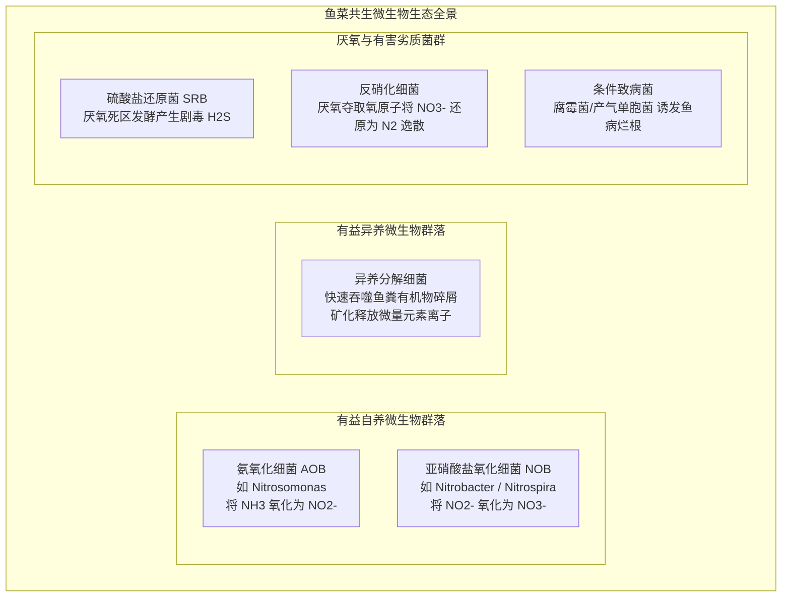
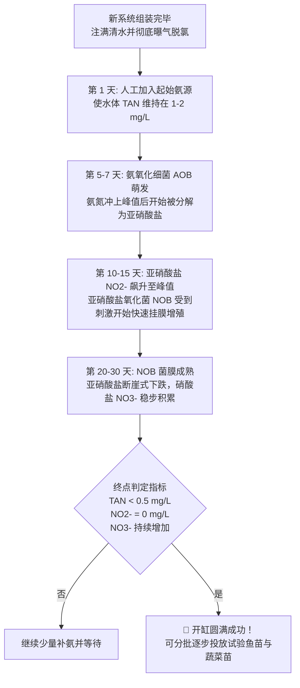

# 第 5 章 鱼菜共生中的细菌群落与生物过滤
## Chapter 5: Bacteria in aquaponics

---

> [!NOTE]
> **本章核心导读**：  
> 细菌群落是鱼菜共生闭环生态系统中体量最大、活性最高却对肉眼完全隐形的“生化代谢中枢”。本章系统解构维系系统运转的两大有益菌群——**专性自养硝化细菌（Nitrifying Bacteria）** 与 **异养矿化细菌（Heterotrophic Bacteria）** 的生态位分工；揭示因缺氧或沉积引发的三大有害劣质菌群（硫酸盐还原菌、反硝化菌与致病菌）的危害机理；并详尽拆解了避免“新缸综合征（New Tank Syndrome）”的**无鱼开缸养水挂膜全流程（System Cycling）**、接种引菌策略与氮化合物动力学曲线监控。

---

---

## 5.1 硝化细菌与生物滤器（Nitrifying Bacteria and the Biofilter）

在鱼菜共生生态工程中，**自养硝化细菌（Autotrophic Nitrifying Bacteria）**承担着将鱼类排泄的剧毒氨氮转化为植物所需硝酸盐的根本任务。

### 5.1.1 专性化能自养的生理特征
与腐生异养菌直接摄取现成有机碳源（葡萄糖、蛋白质等）不同，硝化菌属于**化能自养型生物（Chemoautotrophs）**：
- **碳源合成**：它们只能利用水体中溶解的游离无机碳（主要为碳酸氢根 $\text{HCO}_3^-$ 和二氧化碳 $\text{CO}_2$）通过卡尔文循环合成自身细胞结构；
- **能量来源**：其生命活动全部能量来自于氧化还原反应——AOB 氧化游离氨获取微弱能量，NOB 氧化亚硝酸根获取能量；
- **生长分裂极缓**：因为无机碳同化与无机物氧化的生化产能效率极低，硝化细菌的细胞代时（Generation Time，繁殖一倍所需时间）长达 **10~15 小时**（而普通异养腐生菌仅需 20~30 分钟）。这意味着生物滤膜一旦遭受干涸、毒死或强光破坏，重新恢复活性需要数周之久。

---

### 5.1.2 菌群健康五大环境控制基准（回顾与深化）

1. **高比表面积载体（High Surface Area Media）**：硝化菌必须固着在坚硬固相表面分泌胞外多聚物形成生物被膜（Biofilm）。填料比表面积越大，容纳的活菌总生物量越庞大；
2. **水质 pH 黄金带（6.0–7.0 折中）**：硝化菌原生适宜 pH 为 $7.2\sim 8.2$，但在鱼菜系统中为兼顾植物根系对铁、磷微量元素的吸收，工程上必须动态压制在 **$6.0\sim 7.0$（最佳 $6.8\sim 7.0$）**。严禁跌破 $6.0$（会导致酶构象破坏彻底停摆）；
3. **水温区间（17–34 °C）**：$24\sim 28\text{ }^\circ\text{C}$ 时繁殖最旺盛。$< 15\text{ }^\circ\text{C}$ 硝化速率腰斩；$< 10\text{ }^\circ\text{C}$ 仅剩 25% 活性；
4. **充足的溶解氧（DO 4–8 mg/L）**：硝化是强好氧过程，生物滤池必须维持强劲的微孔曝气，局部 DO 绝不能低于 $2.0\text{ mg/L}$；
5. **绝对遮阳防紫外线（UV Shielding）**：自养硝化菌对紫外线具有极高光敏性，生物滤槽必须 100% 避光遮蔽。

---

### 5.1.3 细菌活性的日常生化监控
判断生物滤池运转是否健康的唯一金标准是水质中含氮离子的浓度阶跃：
- 在成熟系统中，**出水端的氨氮（TAN）与亚硝酸盐（$\text{NO}_2^-$）必须常态化趋近于 0（$< 0.2\text{ mg/L}$）**，同时硝酸盐（$\text{NO}_3^-$）呈稳定上升或与植物吸收平衡的动态平台期。

---

## 5.2 异养细菌与生物矿化作用（Heterotrophic Bacteria and Mineralization）

如果说硝化细菌是“脱毒先锋”，那么**异养细菌（Heterotrophic Bacteria）**则是全系统的“资源回收中枢”。

### 5.2.1 矿化作用的生化机制
水体中鱼类排出的固态粪便、未吃完的残饵颗粒以及脱落的植物老死根须，富含复杂的不可溶大分子有机物（蛋白质、多糖、脂质）。
- 异养腐生微生物群落分泌各种胞外水解酶（蛋白酶、淀粉酶、脂肪酶），将大分子有机碎屑逐步剪切水解为可溶性简单化合物；
- **矿化反应（Mineralization）**：将有机结合态的氮、磷、钾、硫、钙、镁以及铁、锰、铜、锌等微量元素，彻底矿化解离为游离的无机水溶性离子态（如 $\text{K}^+, \text{Ca}^{2+}, \text{Mg}^{2+}, \text{SO}_4^{2-}, \text{HPO}_4^{2-}$ 等），从而使这些原本被固锁在粪便中的养分重新变成植物根系可以吸收的“液体肥料”。

### 5.2.2 异养菌与硝化菌的生态位竞争
- **异养菌优势**：分裂极快（20~30 分钟增殖一代），耗氧极猛；
- **潜在风险**：若机械沉淀不彻底，过量固态鱼粪长期在生物滤槽堆积，异养菌将发生爆发式增殖，在填料表面形成厚重的灰色滑腻污泥膜。这会产生两大严重恶果：
  1. **空间覆盖窒息**：过厚的异养菌膜会物理覆盖附着在下层的自养硝化菌，阻断其氧气与氨氮扩散通道；
  2. **剧烈争夺溶解氧**：异养菌的剧烈呼吸会使滤池底层迅速沦为无氧状态。
- **工程对策**：必须在前置管道设置沉淀器，将粗大固废先期排出；在介质床中则必须引入**红蚯蚓（Red Wiggler Worms）**，利用蚯蚓的机械钻孔与吞食活性消化有机污泥。

---

## 5.3 有害与逆向细菌群落防范

当系统管理不当、水流停滞或发生有机物淤积沉淀时，三类厌氧或致病微生物将在暗处滋生：

### 5.3.1 硫酸盐还原菌（Sulphate-Reducing Bacteria, SRB）
- **生存环境**：滤槽底部厚泥区、介质床局部堵塞死水区等深层严格厌氧无氧环境；
- **危害机理**：SRB 还原水中的硫酸根离子，释放出具有恶臭“臭鸡蛋味”的**游离硫化氢（$\text{H}_2\text{S}$）**。硫化氢具有剧毒，极微量溶入水中就会麻痹鱼类的中枢神经并造成鱼群突发急性暴毙；
- **排查手段**：日常巡检若闻到底泥散发恶臭或看到滤材发黑，说明已出现 SRB 滋生，必须立即冲洗排淤并恢复水流通畅。

### 5.3.2 反硝化细菌（Denitrifying Bacteria）
- **生化本质**：兼性厌氧微生物，在完全缺乏溶解氧（$\text{DO} < 1.0\text{ mg/L}$）且富含有机碳源的环境中，会强行夺取硝酸根离子（$\text{NO}_3^-$）中的氧原子进行厌氧呼吸；
- **危害机理**：反硝化作用将高价值的植物营养源**硝酸盐逆向还原为一氧化二氮（$\text{N}_2\text{O}$）及分子态氮气（$\text{N}_2$）**并逸散到大气中，造成系统内宝贵氮肥的不可逆流失；
- **对策**：在循环水回路各处维持充沛曝气，杜绝积水停滞死区。

### 5.3.3 条件致病菌与食品卫生安全（Pathogens）
- **鱼类致病菌**：如产气单胞菌（*Aeromonas* spp.）、屈挠杆菌（*Flexibacter*，烂鳃病原菌），常在鱼群受水质恶化应激时乘虚而入；
- **人畜共患肠道病原菌**：大肠杆菌（*E. coli*）和沙门氏菌（*Salmonella* spp.）。**严禁使用未经无菌发酵的生家禽生畜生粪作为系统养分补充源**，杜绝食源性肠道污染。

---

## 5.4 养水开缸：生物滤器的菌群培植全流程（System Cycling）

新建成的鱼菜共生系统绝不能立刻下鱼！新系统管道与填料表面完全是无菌的，若直接投放大量鱼类，鱼类排泄的氨氮无法被氧化，将在数天内攀升至致死浓度，引发新养殖者最常遭遇的灾难——**“新缸综合征（New Tank Syndrome）”**。

“开缸（Cycling）”是指**在正式投放主要经济动植物前，人工连续提供氨源，诱导并培育起足够承载未来养殖负荷的成熟 AOB 与 NOB 菌膜的 3~6 周培育周期**。

### 5.4.1 开缸三曲线动力学规律详解

在标准的开缸养水过程中，水中三态氮的化学浓度呈现经典的时间序列波浪演变（图 5.3）：

```mermaid
gantt
    title 鱼菜共生开缸 30 天水化学氮素浓度演化曲线
    dateFormat X
    axisFormat 第 %d 天
    section 氨氮 TAN
    浓度自 2mg/L 升至 4mg/L 峰值: 0, 8
    AOB 菌增殖，氨氮急速跌回 0: 8, 16
    section 亚硝酸盐 NO2-
    迟滞潜伏期: 0, 6
    爆发式攀升至峰值 (>5mg/L): 6, 18
    NOB 菌接管，亚硝酸盐降至 0: 18, 28
    section 硝酸盐 NO3-
    极低浓度: 0, 12
    随硝化完全展开呈直线上升 (>50mg/L): 12, 30
```

1. **第 1–7 天（氨氮蓄积期）**：加入外源氨后，空气与水源中自然游离的极少量 AOB 开始附着在填料上，开始微弱氧化；
2. **第 8–18 天（亚硝酸盐峰值危险期）**：AOB 种群壮大，大量氨转化为 $\text{NO}_2^-$。水体中亚硝酸盐浓度常常暴飙至数个 $\text{mg/L}$。此时 NOB 细菌才被高浓度底物唤醒，开始缓慢定殖；
3. **第 20–35 天（硝酸盐生成与终点标志）**：NOB 菌膜完全成型，氧化速率超过生成速率，水中亚硝酸盐在一两天内垂直归零，水体中硝酸盐大幅蓄积。
4. **开缸成功判定红线**：
   - **氨氮（TAN）$< 0.5\text{ mg/L}$**；
   - **亚硝酸盐（$\text{NO}_2^-$）$= 0\text{ mg/L}$**；
   - **硝酸盐（$\text{NO}_3^-$）呈可测量的持续上升态势**。

---

### 5.4.2 初始氨源选择与优劣对比

| 氨源类型 | 典型代表物 | 投加方法与控制标准 | 优缺点深度评测 |
| :--- | :--- | :--- | :--- |
| **优质微细鱼饲料** | 新鲜水产幼鱼微配合饲料 | 每天向水体抛洒数克，让其自然水解腐烂释放氨 | **最佳推荐方案**：生物安全风险极低，且残饵分解同时释放微量元素；缺点是分解耗氧且水色稍显浑浊 |
| **纯化学试剂氨水** | 工业/分析纯氨水（$10\%\sim 25\%$）| 计算容积按需滴入，控制全池初始 $\text{TAN} = 1\sim 2\text{ mg/L}$ | 浓度纯净精准，不产生任何固体沉淀；但需严格确认**不含任何表面活性剂、香精或洗涤助剂** |
| **老鱼开缸（闯缸鱼）**| 放入极少量廉价耐受鱼苗（密度 $\le 1\text{ kg/m}^3$）| 极低投喂量，靠鱼排泄带水开缸 | **极不人道且风险高**：开缸中期的极高亚硝酸盐和高氨常导致闯缸鱼体表烧伤甚至大批死亡 |
| **生禽畜粪便** | 未经杀菌处理的生鸡粪、牛粪 | 严禁使用！ | **坚决取缔禁用**：极易引入大肠杆菌、沙门氏菌等致命致病菌，污染未来果蔬食品安全 |

> [!CAUTION]
> **开缸氨氮过量抑制警告**：  
> 添加外源氨源时必须坚守“宁少勿多”原则，维持水体初始 $\text{TAN} = 1\sim 2\text{ mg/L}$ 即可。若氨氮浓度盲目超标（$> 4\text{ mg/L}$），游离高浓氨反而会**直接毒害和化学抑制硝化细菌自身的生长分裂**，导致开缸周期无限期停滞滞后！

---

### 5.4.3 开缸加速“引种（Seeding）”秘籍
为了将长达 4~6 周的漫长开缸周期压缩至 **7~10 天**，可以采用成熟生物膜物理接种法：
1. **移植老缸滤料**：自一台运行多年的健康老鱼菜系统或观赏鱼缸中，取出一小袋生化棉、陶粒或 K1 生化填料，直接浸入新系统的生物滤池中；
2. **挤入老生化棉泥浆**：将老缸滤棉浸入水桶拧出的浓稠棕褐色“菌泥浆”，直接泼入新系统生化池。该泥浆中富含数十亿现成的高活性硝化菌群与胞外聚合物，能在数小时内吸附定殖；
3. **商用硝化菌液体胶囊制剂**：市售冷链保存的鲜活硝化细菌菌液也可辅助加速，但需确认出厂保质期与活性。

---

### 5.4.4 动植物进场节奏管理

1. **植物苗移栽节点**：
   - 可以在开缸中后期（亚硝酸盐峰值回落、硝酸盐刚刚起步上升时）定植首批耐贫瘠的先锋绿叶菜（如生菜、薄荷苗）；
   - **注意预期**：初期幼苗可能表现出微量元素缺乏症（如叶片微黄），随着后续鱼群加入与饲料投喂量递增，养分谱系完备后植物即可自发恢复浓绿；
2. **养殖鱼类下塘节点**：
   - 只有当水质测试确认**氨氮与亚硝酸盐双双降至安全红线以下（$< 0.5\text{ mg/L}$）**时，方可正式下鱼；
   - **分步渐进放养原则**：切忌一次性放满全负荷鱼苗！应首期先投放设计存塘量的 **20%~30%**；观察一周水质稳定后，再逐批增补其余鱼苗，使生物滤膜有充足时间同步增殖扩容。

---

## 5.5 本章小结（Chapter Summary）

- **硝化菌的自养本质**：AOB 与 NOB 属于专性自养化能菌，依靠氧化无机氨氮并固定无机碳生活，细胞分裂缓慢（代时 10~15 小时），生物膜一旦受创恢复漫长。
- **异养菌的矿化双刃剑**：异养菌负责将粗大鱼粪有机残渣水解为离子态植物养料，但必须依赖前置机械沉淀排除过量固废，防范其争夺氧气并覆盖窒息自养硝化菌。
- **杜绝厌氧三害**：全系统保持充沛曝气流通，防止底泥发酵滋生硫酸盐还原菌（释放剧毒 $\text{H}_2\text{S}$）、反硝化菌（脱氮偷走肥料）与致病病原菌。
- **开缸三阶段铁律**：新系统必须历经“氨升峰 $\rightarrow$ 亚硝升峰 $\rightarrow$ 硝酸盐累积归零”的 25~40 天无鱼或低密度开缸期，推荐采用微量鱼饲料作为生物安全氨源，严禁生粪开缸，并优选老缸滤料接种以实现快速挂膜。
