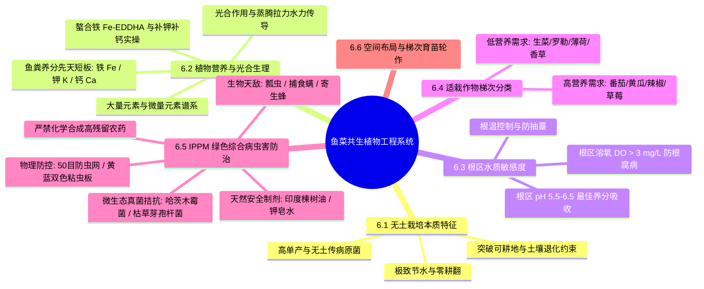
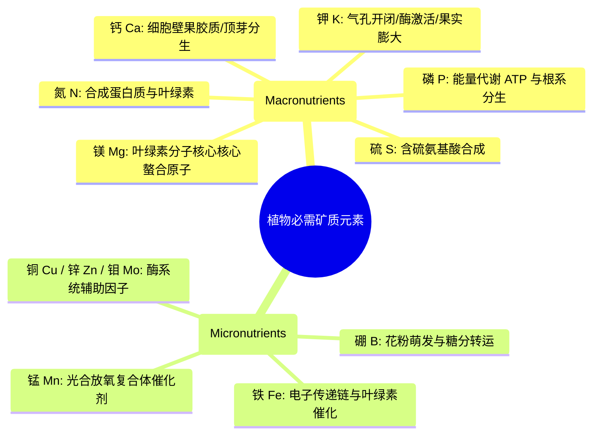
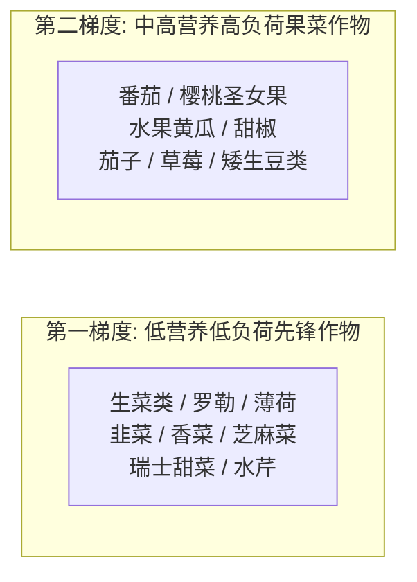
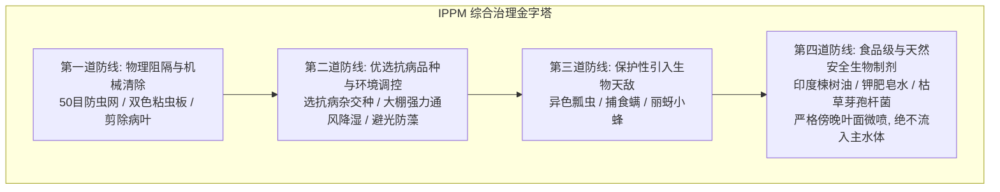

# 第 6 章 鱼菜共生中的植物生理与种植管理
## Chapter 6: Plants in aquaponics

---

> [!NOTE]
> **本章核心导读**：  
> 植物是鱼菜共生生态系统中承担光合自养、养分同化与水质深度净化的核心经济终端。本章系统解构水培植物的生理学解剖机理与矿质营养动力学；剖析鱼菜共生系统中天然养分的丰缺规律，重点阐明系统天生匮乏的**“三大短板元素（钾、钙、铁）”**的精准外源靶向补充方案；并基于水产与食品双重安全红线，详细制定了涵盖物理隔离、益虫天敌与有机植物源药剂的**农作物综合病虫害管理（IPPM）规程**，以及梯次错峰种植布局策略。

---

---

## 6.1 无土栽培与土壤种植的核心本质差异

理解无土水培与传统大田农业的生产机制差异，是掌握鱼菜共生植物管理的基础。

### 表 6.1：传统土壤农业与无土水培农业系统核心特征对比

| 生产对比要素 | 传统露地土壤农业 (Soil Agriculture) | 无土栽培 / 鱼菜共生系统 (Soil-less / Aquaponics) |
| :--- | :--- | :--- |
| **水肥供给机制** | 依赖土壤胶体保水保肥，养分释放缓慢且极易随雨水深层淋溶流失 | 根系直接浸润在全营养离子水溶液中，离子吸收无需克服土壤水势阻力，水肥协同秒级响应 |
| **淡水消耗强度** | 极其庞大。大量水分通过地表径流、土壤毛细蒸发和深层渗漏浪费，利用率通常 $< 30\%$ | **极致节水**。水体闭环自循环，水耗仅限于植物叶面蒸腾，总耗水量仅为土壤农业的 **$2\% \sim 10\%$** |
| **土地依赖度** | 严格受制于土壤耕层厚度、有机质含量、酸碱度及地形坡度 | **完全脱离土壤**。可架设于废弃盐碱地、沙漠沙洲、硬化水泥屋顶及地下垂直农场 |
| **单产水平与周期**| 易受季节干旱与土壤肥力递减制约，复种指数低 | **单位面积产量提升数倍**。养分供应无间断，植物无须费力扩展庞大根系寻肥，营养生长周期缩短 30% 以上 |
| **劳动强度与工效**| 极其繁重。需要重型农机深耕深翻、碎土起垄、繁重中耕除草与弯腰作业 | **极低体力消耗**。免除耕地、中耕与除草；栽培槽安装高度符合人体工程学，站立即可操作移栽与采收 |
| **连作障碍与病原**| 连作重茬极易诱发严重的土传线虫、青枯病、枯萎病菌积累，必须昂贵轮作或土壤熏蒸 | **阻断土传病害**。无土壤病原菌库，在严格水质消毒与生物竞争下可实现单一品种连续周年稳定单作 |
| **资本开支与系统风险**| 初始投资极低（锄头种子即可起步），气候自然抗性差但无骤死风险 | **初始硬件投资高**。依赖稳定电力管阀，若发生长时间断电或病原入侵，系统具有连带脆弱性 |

---

## 6.2 植物基础生物学与矿质营养动力学

### 6.2.1 植物解剖结构与水分养分运移机制
植物通过根、茎、叶构建起贯穿全株的水力输导网络：
1. **根系结构（Roots）**：幼嫩白色根尖的根毛区提供巨大的吸收表面积。植物根细胞通过质膜上的离子通道与质子泵（$\text{H}^+\text{-ATPase}$）进行**主动逆浓度梯度吸收**矿质阳离子与阴离子；
2. **蒸腾拉力（Transpiration Pull）**：叶片表皮的气孔（Stomata）在蒸发散失水分的同时，在植物体木质部导管内部形成巨大的水柱负压，产生自根系向上奔涌的“蒸腾流”，带动水溶性钙、镁、硝酸盐等养分输送至全株顶端；
3. **韧皮部同化产物输送（Phloem）**：成熟叶片光合作用合成的糖分（蔗糖）通过韧皮部筛管，双向运移至根尖分生组织、膨大果实与生长点。

---

### 6.2.2 光合作用与呼吸作用生化平衡
植物利用太阳光能，在叶绿体中将水和二氧化碳转化为高能碳水化合物，并向外释放氧气：

$$6\text{CO}_2 + 6\text{H}_2\text{O} + \text{光能} \xrightarrow{\text{叶绿体}} \text{C}_6\text{H}_{12}\text{O}_6 (\text{葡萄糖}) + 6\text{O}_2$$

而在夜间或无光期，全株所有活细胞依靠线粒体进行细胞呼吸，消耗葡萄糖与氧气释放能量：

$$\text{C}_6\text{H}_{12}\text{O}_6 + 6\text{O}_2 \xrightarrow{\text{线粒体}} 6\text{CO}_2 + 6\text{H}_2\text{O} + \text{ATP (能量)}$$

---

### 6.2.3 植物必需营养元素谱系与典型缺素症

高等绿色植物正常生长繁殖需要 **13 种必需无机矿质元素**，依需求量分为大量元素与微量元素：

#### 常见营养失调外在病理表征与诊断

1. **缺氮（Nitrogen Deficiency）**：
   - **典型表征**：全株生长停滞矮化；由于氮素在韧皮部中流动性极强，植株会分解老叶蛋白向新叶转移，导致**底部老叶整体均匀黄白化**，叶脉亦褪色，茎秆变硬发紫；
2. **缺磷（Phosphorus Deficiency）**：
   - **典型表征**：根系发育严重萎缩受限；老叶呈现不正常的**暗蓝绿色，叶背或叶脉显现深紫色红斑**，推迟开花坐果；
3. **缺钾（Potassium Deficiency）**：
   - **典型表征**：植株抗逆性变差；老叶**边缘与尖端呈现灼伤状焦枯褐变（Marginal Chlorosis/Necrosis）**，叶缘卷曲，果实发育干瘪无味；
4. **缺钙（Calcium Deficiency）**：
   - **典型表征**：钙在植物体内移动性极差。缺素症状首先从新生组织爆发：**新生顶芽扭曲畸形、幼叶边缘黑褐色枯死（生菜干烧心病 Tipburn）**；番茄和辣椒果实脐部组织溃烂凹陷，爆发典型的**脐腐病（Blossom-End Rot）**；
5. **缺铁（Iron Deficiency）**：
   - **典型表征**：铁在植物体内不可移动。症状特异性表现在**顶端新嫩叶片上：发生极具辨识度的“脉间失绿（Interveinal Chlorosis）”**——新生叶脉清晰保持鲜绿色，而叶脉之间的叶肉组织全部褪绿变成苍白色甚至象牙白；
6. **缺镁（Magnesium Deficiency）**：
   - **典型表征**：由于镁移动性较好，症状表现于**底部老叶的脉间失绿**，有时伴随红紫色斑块，但新叶依然葱绿。

---

### 6.2.4 鱼菜共生养分的先天短板与精准外源补充方案

鱼类配合饲料经鱼体同化和细菌硝化矿化后，能够稳定供给大量的氮（N）、磷（P）以及部分微量元素。但是，**鱼类配合饲料配方是为鱼类解剖生长定制的，而非植物化肥**。

> [!CAUTION]
> **鱼菜共生天然三大匮乏元素**：  
> 全球数十年的工程实践已无可辩驳地证明：在纯粹依靠鱼饲料运转的封闭鱼菜系统中，水体中必然发生**铁（Fe）、钾（K）与钙（Ca）**的严重匮乏。若不进行人工靶向干预补齐，植物在生长数月后必然集体爆发缺素症，果菜无法坐果。

#### 1. 补铁：螯合铁（Chelated Iron）精准添加法
- **游离铁的沉淀陷阱**：无机硫酸亚铁（$\text{FeSO}_4$）直接溶于水后，在 pH $> 6.5$ 的含氧水体中会迅速氧化水解为不溶性红褐色三氧化二铁（$\text{Fe}_2\text{O}_3$）沉淀，植物根系完全无法吸收；
- **现代螯合剂方案**：必须投加**有机人工螯合铁**，利用有机配体将铁离子紧紧包裹锁定：
  - **Fe-EDTA**：仅在 $\text{pH} < 6.5$ 的强酸性水体中稳定，在鱼菜系统中极易解离失效，不推荐；
  - **Fe-DTPA（二乙三胺五乙酸铁）**：在 $\text{pH} \le 7.0$ 条件下极其稳定，适宜常态化鱼菜共生系统；
  - **Fe-EDDHA（乙二胺二邻羟苯乙酸铁）**：呈红黑色粉末，在 **$\text{pH } 4.0 \sim 9.0$ 的超宽碱性全区间保持绝对稳定**，是中高 pH 或硬水系统最高效的补铁黄金药剂。
- **添加剂量**：维持系统水体有效铁浓度在 **$2.0 \sim 3.0\text{ mg/L}$**。一般初次按 **每 1000 升系统总水体添加 $20\sim 30\text{ 克}$ Fe-EDDHA**，之后每隔 3~4 周补充一次（水体呈现极淡的琥珀红茶色）。

#### 2. 补钾与补钙：双效缓冲调节法
巧妙地将“酸碱缓冲提高 KH”与“植物补钾补钙”合二为一：
- 轮流添加**碳酸氢钾（$\text{KHCO}_3$）**与**氢氧化钙（$\text{Ca(OH)}_2$）**或生石灰水；
- 在集水箱中吊挂**牡蛎贝壳粉网袋（$\text{CaCO}_3$）**，让酸性硝化产物自然溶蚀释放钙离子。

---

## 6.3 针对植物生长的水质调控

1. **pH 调谐**：植物根系吸收矿质离子的最佳根区环境为 **5.5–6.5**。但为兼顾自养硝化细菌活性，工程妥协点维持在 **6.5–7.0**。若水体 pH 长期超过 7.5，缺铁失绿症发生率上升 80%；
2. **溶解氧（DO）**：水培槽根区水体 DO 必须恒定保持在 **$> 3.0\text{ mg/L}$**（深水 DWC 槽推荐维持在 **$5.0\sim 8.0\text{ mg/L}$**），严防缺氧诱发腐霉菌侵染；
3. **水温与抽薹防范**：绿叶生菜类最适根温为 $16\sim 22\text{ }^\circ\text{C}$。盛夏期水温若超过 $26\text{ }^\circ\text{C}$，生菜将迅速发生生殖抽薹，叶片内苦味素（莴苣素）急剧积聚，商业价值完全丧失。可通过深水 DWC 浮板遮光隔热或冷水机控温。

---

## 6.4 适栽植物选型与营养需求梯度分类

根据对水体中电导率（EC）与硝酸盐营养浓度的依赖程度，适栽作物分为两大梯度：

1. **低营养需求作物（Low-nutrient demand plants）**：
   - 包括全部散叶生菜、结球生菜、罗勒、水芹、薄荷等绿叶沙拉蔬菜与芳香草本；
   - **特点**：营养生长周期极短（移栽后 25~35 天即可采收），只长茎叶不结实，耐贫瘠营养液，对水产系统负荷小，是**新建系统或初学者的绝对首选**；
2. **高营养需求作物（High-nutrient demand plants）**：
   - 包括番茄、黄瓜、茄子、辣椒、西葫芦等茄果与瓜类；
   - **特点**：全生育期长达数月，开花、传粉、坐果与果实膨大期需要海量的钾、磷、钙元素。只有在**运行成熟、鱼类存塘密度高且日投饲量充足的大型稳定系统**中，配合严密的外源补钾补铁，方能实现果蔬的高产甜度。

---

## 6.5 农作物病虫害综合绿色治理体系（IPPM）

在封闭循环的鱼菜共生系统中，**严禁使用任何常规化学合成杀虫剂（如有机磷、拟除虫菊酯）或内吸性杀真菌剂**！这些化学药剂对鱼类鳃部与神经系统具有剧毒，数滴农药漂移就足以导致鱼池全军覆没；同时也会严重杀伤生物滤槽内的有益硝化细菌。

鱼菜共生必须严格践行**农作物综合生产与病虫害管理体系（Integrated Production and Pest Management, IPPM）**：

### 6.5.1 常见害虫及其靶向生物物理防治

1. **刺吸式小型害虫（蚜虫、白粉虱、叶螨红蜘蛛、蓟马）**：
   - **物理阻隔**：温室所有进出通风口密布 **40~50 目防虫网**；
   - **色诱诱杀**：在植物冠层上方 10 厘米处密密悬挂**黄色双面粘虫板**（诱杀蚜虫、烟粉虱、潜叶蝇）与**蓝色粘虫板**（专性诱杀蓟马）；
   - **生物天敌投放**：
     - 捕食性天敌：在网室内释放**异色瓢虫（*Harmonia axyridis*）**成虫幼虫（专食蚜虫）、**草蛉幼虫**；
     - 寄生性天敌：针对白粉虱释放**丽蚜小蜂（*Encarsia formosa*）**；
     - 捕食螨：释放智利小植绥螨控制红蜘蛛叶螨；
   - **天然制剂安全点喷**：
     - **纯天然印度楝树油乳剂（Pure Cold-Pressed Neem Oil）**：按 0.5% 浓度混合极微量中性乳化剂，破坏害虫蜕皮激素蜕变，具有优异的拒食与不育效果；
     - **软钾肥皂水（Insecticidal Soap / Potassium Salts of Fatty Acids）**：低浓度喷雾能直接溶解软体害虫的蜡质外骨骼导致其脱水死亡。
     - **施用金准则**：仅在**傍晚日落后**进行精细叶面正反面喷雾；喷雾时在栽培床下方铺设塑料薄膜，**严禁药液滴落流入养殖水循环回路**！

---

### 6.5.2 常见真菌与细菌病害综合防控

#### 表 6.2：营养元素丰缺平衡对植物真菌性病害发生率的调控机理

| 营养元素 | 对抗真菌与病原菌侵染的生理生化调控机制 |
| :--- | :--- |
| **氮素 (N)** | **过度施氮**会导致植物茎叶徒长多汁、细胞壁极度薄嫩，极易被真菌菌丝穿透；而**严重脱氮饥饿**则导致植株僵化矮小，易受机会性寄生弱寄生菌感染 |
| **钾素 (K)** | 显著加速植株受损伤口的木质化愈合封闭；大幅减轻低温霜冻冷害伤口；延迟叶片早衰，提升对白粉病与叶斑病的系统获得性抗性 |
| **磷素 (P)** | 优化全株根系活力与细胞能量平衡，促进组织成熟，增强对根系病原菌的抵抗 |
| **钙素 (Ca)** | **决定性抗病元素**。钙构成果胶酸钙黏结在初生细胞壁中，高钙组织硬度极高，能够从物理上坚强抵御真菌分泌的多聚半乳糖醛酸酶（PG）的酶解穿透，有效预防根腐病与灰霉病 |
| **硅素 (Si)** | 在表皮细胞沉积形成坚硬的“双硅角质层”，刺激植物体内酚类抗病防御植保素的爆发合成 |

#### 典型真菌病害防治实战
1. **灰霉病（*Botrytis cinerea*）与白粉病（Powdery Mildew）**：
   - **发病诱因**：温室内相对湿度长期高于 85%，夜间叶面结露形成连续水膜；
   - **环境调控**：开启强制排风循环风机，消除温室死角微气流滞留，杜绝结露；
   - **生物防治**：叶面微喷**枯草芽孢杆菌（*Bacillus subtilis*）**或**哈茨木霉菌（*Trichoderma harzianum*）**可湿性粉剂，有益微生态菌在叶面迅速占据生态位，分泌抗真菌素杀灭真菌孢子；
   - **食品级小苏打（碳酸氢钠）叶面弱碱喷雾**：配制 $0.2\%\sim 0.3\%$ 极稀小苏打水进行叶面喷雾，瞬间改变叶表酸碱微生境，直接使白粉菌菌丝破裂脱水死亡。
2. **水培根腐病（Pythium Root Rot）**：
   - **发病诱因**：水温持续高企（$> 28\text{ }^\circ\text{C}$）伴随水体根区溶氧贫乏；
   - **防治方案**：向水体追加大功率气石强力曝气（维持 $\text{DO} > 6\text{ mg/L}$）；利用遮阳降温将水温压回 24 °C 以下；及时修剪剪除黑褐色腐烂死根。

---

## 6.6 种植空间布局、梯次育苗与轮作设计

为保障鱼菜共生系统常年保持高产并使水质养分吸收处于平滑平稳状态，必须执行严密的**梯次错峰种植（Staggered Planting）**。

```mermaid
gantt
    title 生菜梯次错峰收获日历 (每周均匀产出 25% 蔬菜)
    dateFormat X
    axisFormat 第 %d 周
    section 批次 A
    定植生长: 0, 4
    采收清茬: 4, 5
    section 批次 B
    定植生长: 1, 5
    采收清茬: 5, 6
    section 批次 C
    定植生长: 2, 6
    采收清茬: 6, 7
    section 批次 D
    定植生长: 3, 7
    采收清茬: 7, 8
```

1. **独立洁净育苗区（Plant Nursery）**：
   - 绝不在主系统种植床上直接播撒生种子！应在独立的微型育苗托盘内，利用洁净珍珠岩、椰糠或育苗岩棉块进行人工播种育苗；
   - 待幼苗长出 2~3 片真叶、根系发达盘结后，清洗浮杂后再定植入鱼菜系统；
2. **四阶段错峰循环采收**：
   - 将水培床均分为 4 个区段。每周采收其中成熟的 25% 蔬菜，并立即移入 25% 的新幼苗；
   - **生态价值**：彻底避免了“一次性全采收拔光植物后，水质硝酸盐骤升；移入全小苗后作物吸肥微弱造成养分失衡”的剧烈震荡，使全系统硝酸盐吸收处于恒定的稳态。

---

## 6.7 本章小结（Chapter Summary）

- **无土水培高产基石**：根系直接浸润离子态水环境，水分与养分利用率达极限（节水 90% 以上），杜绝土传病虫害。
- **矿质养分精准配伍**：鱼类代谢可满足常规氮磷需求，但系统**天然匮乏铁（Fe）、钾（K）、钙（Ca）**。必须常态化添加高稳定性**螯合铁（Fe-EDDHA）**以及通过**碳酸氢钾**和**贝壳石灰质**补足钾钙短板。
- **IPPM 绝对绿色生态红线**：由于水产和硝化细菌的高度敏感性，严禁使用化学农药。以**防虫网、粘虫色板、天敌益虫及楝树油/软皂**构建四道安全护城河。
- **梯次种植平稳水质**：采用独立育苗托盘育壮苗，实行分批梯次错峰移栽采收，维持系统吸收负荷常年动态均衡。
