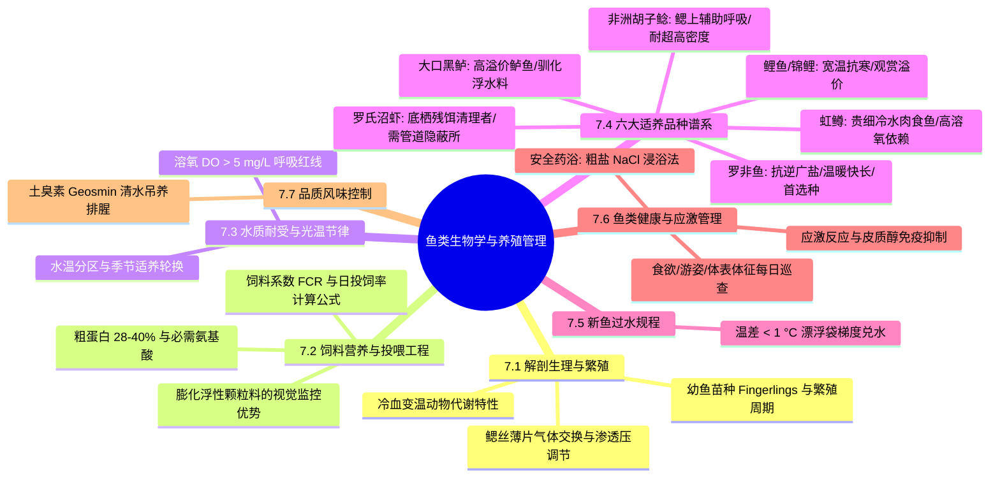
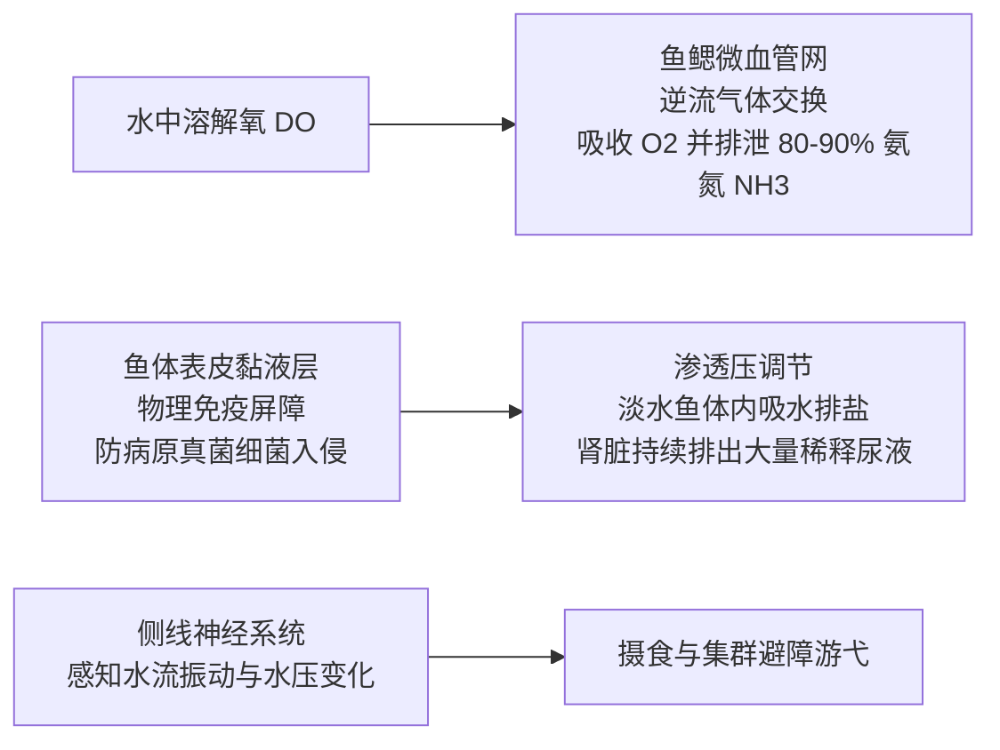
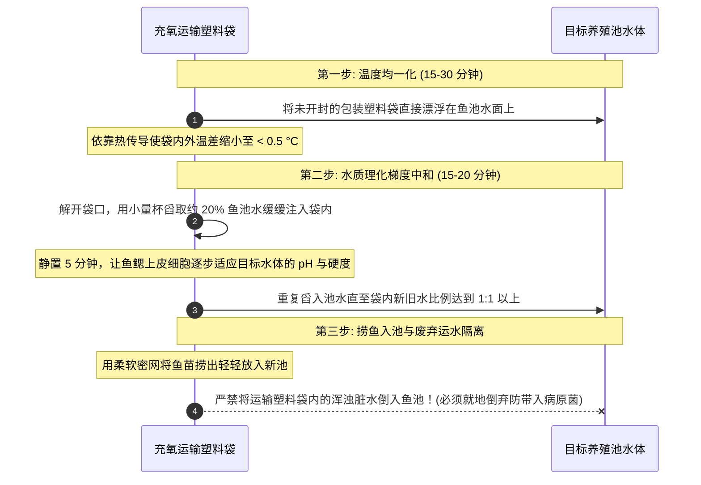

# 第 7 章 鱼菜共生中的鱼类生物学与养殖管理
## Chapter 7: Fish in aquaponics

---

> [!NOTE]
> **本章核心导读**：  
> 水产动物（鱼类与甲壳类）是鱼菜共生闭环回路中养分输入的生物转化源泉与首要经济产出。本章系统解构鱼类解剖生理机能（鳃呼吸、渗透压调节与冷血变温代谢）；系统阐述人工配合配合饲料营养学、膨化浮水颗粒料的工程优势与**饲料系数（FCR）及日投喂率计算公式**；全景式剖析全球六大主流适养品种（罗非鱼、鲤鱼/锦鲤、非洲胡子鲶、虹鳟、大口黑鲈与罗氏沼虾）的生物学特性与温水/冷水生态位；并制定科学的新鱼过水入塘规程、鱼类应激识别矩阵、**高安全粗盐（NaCl）药浴防病法**与上市前吐腥风味控制技术。

---

---

## 7.1 鱼类解剖结构、生理学与生活史

理解鱼类的生理生化特性是预防养殖应激与保障高存活率的前提。

### 7.1.1 鱼类解剖生理与水生适应性

1. **鳃丝微循环与气体代谢中枢（Gills）**：
   - 鱼鳃不仅是呼吸器官，更是**全系统氨氮排泄的最核心通道**。鱼类摄食蛋白质后代谢产生的游离氨（$\text{NH}_3$），约有 **$80\% \sim 90\%$ 直接通过鳃小片的毛细血管上皮以被动扩散方式直接排入水体**，仅有极少部分经由肾脏尿液排出；
   - 鳃丝具有极大的微血管表面积，水流与血液在鳃片中呈“逆流交换（Counter-Current Exchange）”，确保即使在低氧环境下也能最大限度摄取水中的溶解氧；
2. **冷血变温生理特性（Poikilothermic Metabolism）**：
   - 鱼类不具备恒温动物的体温调节中枢，其**体温完全随水温波动**；
   - 水温直接控制其体内消化酶与代谢酶的催化速率。水温每下降 10 °C，鱼类的基础代谢率与摄食强度将暴跌 50% 以上；
3. **渗透压动态平衡（Osmoregulation）**：
   - 淡水鱼体内体液与血液的无机盐浓度（约 $9\text{ ppt}$）远高于外部淡水水体（$< 0.5\text{ ppt}$）。根据渗透压物理规律，外部水分会通过鳃和表皮源源不断渗入鱼体内，而体内盐分持续向外流失；
   - 淡水鱼必须通过鳃上的特化“氯细胞（Chloride Cells）”主动耗能逆浓度泵入水中的钙、钠、氯离子，并依靠发达的肾脏持续排出大量极度稀释的尿液以维持体内水分平衡。

---

### 7.1.2 鱼类生命周期与分级饲养（Life Cycle）

商业与家庭养殖通常将鱼类生命周期划分为若干关键阶段：
1. **亲鱼产卵与受精卵（Broodstock & Eggs）**；
2. **卵黄囊仔鱼（Sac-fry / Larvae）**：刚孵化的仔鱼自带腹部卵黄囊，暂不摄食，依靠内源性营养生存；
3. **开口稚鱼（Fry）**：卵黄吸收完毕，必须投喂微细鲜活浮游动物（轮虫、丰年虾幼虫）或超微粉状配合饲料；
4. **育成幼鱼苗种（Fingerlings，体长 $5\sim 10\text{ cm}$，体重 $10\sim 50\text{ g}$）**：**鱼菜共生系统引种放养的标准黄金规格**。该规格鱼苗免疫系统已完全发育，抗病抗应激能力强，已完全适应摄食硬质颗粒饲料；
5. **成鱼育成（Grow-out）至上市规格（$400\sim 800\text{ g}$）**。

---

## 7.2 鱼类营养学与科学投喂工程

### 7.2.1 配合饲料核心营养素配比
鱼类健康快速生长依赖全价配合颗粒饲料（Pelleted Feed）：
- **粗蛋白质（Crude Protein, CP）**：构成肌肉生长的核心原料，通常占饲料总重的 **$28\% \sim 40\%$**。肉食性鱼类（如虹鳟、鲈鱼）要求 CP 达 $38\%\sim 45\%$；温水杂食性鱼类（如罗非鱼、鲤鱼）要求 CP 为 $28\%\sim 32\%$；
- **必需氨基酸（EAA）**：包括赖氨酸、蛋氨酸等 10 种鱼体自身无法合成的氨基酸，主要由优质鱼粉、豆粕提供；
- **粗脂肪与必需脂肪酸（EFA）**：提供高能量并提供细胞膜所需的 Omega-3 / Omega-6 多不饱和脂肪酸；
- **微量矿物质与多维预混料**：添加维生素 C、E 及微量元素，强化免疫抗应激能力。

---

### 7.2.2 膨化浮性颗粒料的工程决定性优势

市售水产颗粒料分为“硬质沉水颗粒料”与“膨化浮性颗粒料”：

> [!TIP]
> **鱼菜共生绝对首选：膨化浮性颗粒料（Floating Pellets）**：  
> 1. **直观监控摄食活力**：浮水料漂浮在水面，管理者能清晰肉眼观察到鱼群上浮抢食的凶猛程度，秒级判断鱼群健康状态；  
> 2. **残饵零盲区与防坏水**：投喂 15~20 分钟后若水面仍漂浮有未吃完的浮料，可轻松用手抄网捞出，彻底杜绝残饵沉降至池底发酵败坏水质并堵塞滤网；  
> 3. 沉水料落入池底后混入鱼粪排污口，操作者完全无法判断鱼群是否吃饱，极易导致过量投喂灾难。

---

### 7.2.3 饲料转化比（FCR）与每日投饲率计算法则

#### 1. 饲料转化比（Feed Conversion Ratio, FCR）
衡量饲料利用效率与水产养殖技术水准的最核心经济指标：

$$\text{FCR} = \frac{\text{特定周期内消耗的配合饲料总重量 (kg)}}{\text{同一周期内养殖鱼体净增加的总重量 (kg)}}$$

- 鱼类属于体外受精、无需维持恒温、依靠浮力支撑骨骼的冷血动物，其能量转化效率远高于陆生牲畜（肉牛 FCR 约 6~8，肉猪约 3，肉鸡约 1.8~2.0）；
- 在规范管理的鱼菜共生系统中，**罗非鱼与虹鳟的典型优质 FCR 介于 $1.1 \sim 1.5$ 之间**（即投喂 $1.2\text{ kg}$ 优质饲料即可产出 $1.0\text{ kg}$ 鲜活鲜鱼）。

#### 2. 日投饲率（Daily Feeding Rate）
投喂重量并非固定不变，而是严格依据鱼类当前体重的百分比进行动态核算：

| 养殖阶段 | 鱼体个体规格 | 推荐每日投喂量 (占鱼体总重的百分比) | 每日推荐投喂频次 |
| :--- | :--- | :--- | :--- |
| **幼鱼期 (Fingerlings)** | $10 \sim 50\text{ g}$ | **$3.0\% \sim 5.0\%$** | 每日 3~4 次 |
| **中鱼生长期** | $50 \sim 200\text{ g}$ | **$2.0\% \sim 3.0\%$** | 每日 2~3 次 |
| **成鱼育肥期** | $200 \sim 500\text{ g}+$ | **$1.0\% \sim 1.5\%$** | 每日 1~2 次 |

> [!NOTE]
> **计算实例（Box 3）**：  
> 设鱼池内蓄养有 100 尾平均体重为 $200\text{ g}$ 的罗非鱼，当前鱼群总生物量为：  
> $$100\text{ 尾} \times 0.2\text{ kg} = 20\text{ kg}$$  
> 查表选取投喂率为自身体重的 $2.0\%$，则该鱼池全天标准投喂量为：  
> $$20\text{ kg} \times 2.0\% = 0.4\text{ kg} = 400\text{ 克/天}$$  
> 分早、晚各投喂 200 克。根据第 2 章的投饵比率（绿叶菜按 $40\sim 50\text{ g/m}^2/\text{天}$），这 400 克日饲料投入可完美支撑 **$8\sim 10\text{ m}^2$** 的旺盛水培蔬菜床！

---

## 7.3 针对鱼类养殖的水质环境要求

- **溶解氧（DO）**：鱼池出水端必须常态化维持在 **$> 5.0\text{ mg/L}$**（冷水鳟鱼要求 $> 6.5\text{ mg/L}$）；
- **总氨氮（TAN）与亚硝酸盐**：$\text{TAN} < 1.0\text{ mg/L}$（游离 $\text{NH}_3 < 0.05\text{ mg/L}$），亚硝酸盐 $\text{NO}_2^- < 0.2\text{ mg/L}$；
- **酸碱度（pH）**：$6.5 \sim 8.0$（鱼菜折中控制为 $6.8 \sim 7.0$），短时间内 pH 波动严禁超过 $0.3\text{ /天}$；
- **光照与黑暗节律**：鱼池上方保持弱漫射光或全遮阳，**严防强直射光照射**，保障鱼类在幽暗安静环境中休息摄食。

---

## 7.4 鱼菜共生适养水产品种全谱系深度剖析

### 表 7.1：全球主要适养鱼种生物学特性与工程参数横向对照表

| 鱼类品种 | 核心优势生态位 | 适宜水温区间 | 致死极限水温 | 粗蛋白需求 | 耐低氧极限 | 饲料习惯 |
| :--- | :--- | :--- | :--- | :--- | :--- | :--- |
| **罗非鱼 (Tilapia)** | **抗逆之王/高抗病/杂食快速** | **$24 \sim 30\text{ }^\circ\text{C}$** | $< 12\text{ }^\circ\text{C}$ / $> 38\text{ }^\circ\text{C}$ | $28\% \sim 32\%$ | **极高**（可耐受 1.0 mg/L）| 杂食性浮水配合料 |
| **普通鲤鱼/锦鲤 (Carp/Koi)**| **温差耐受极宽/观赏高溢价** | **$20 \sim 28\text{ }^\circ\text{C}$** | $< 4\text{ }^\circ\text{C}$ / $> 35\text{ }^\circ\text{C}$ | $30\% \sim 35\%$ | 高（耐受 1.5 mg/L）| 杂食偏底栖颗粒料 |
| **非洲胡子鲶 (Catfish)** | **耐超高密度/辅助鳃器官** | **$24 \sim 30\text{ }^\circ\text{C}$** | $< 10\text{ }^\circ\text{C}$ / $> 36\text{ }^\circ\text{C}$ | $32\% \sim 38\%$ | **无敌**（可直接呼吸空气）| 肉食偏杂食沉/浮料 |
| **虹鳟 (Rainbow Trout)** | **高经济价值/冷水特种鱼** | **$12 \sim 18\text{ }^\circ\text{C}$** | $> 21\text{ }^\circ\text{C}$ 致死 | **$40\% \sim 45\%$** | **极低**（$< 5.0$ 即窒息）| 专性肉食高脂沉浮料 |
| **大口黑鲈 (Largemouth Bass)**| 优质淡水鲈/肉质鲜美无刺 | $22 \sim 28\text{ }^\circ\text{C}$ | $< 5\text{ }^\circ\text{C}$ / $> 34\text{ }^\circ\text{C}$ | $38\% \sim 42\%$ | 中等（需 $> 4.0$ mg/L）| 肉食性，需驯化转浮料 |
| **罗氏沼虾 (River Prawn)** | 底栖残饵清除者/立体复养 | $26 \sim 31\text{ }^\circ\text{C}$ | $< 15\text{ }^\circ\text{C}$ | $35\% \sim 40\%$ | 中等偏高 | 杂食碎屑与沉性残饵 |

---

### 详细品种特征与运维精要

#### 1. 罗非鱼（Tilapia, *Oreochromis niloticus* / *mossambicus*）
- **鱼菜之王**：全球鱼菜共生系统中最普遍采用的标杆鱼种。耐粗饲、极耐低氧、抗高氨氮逆境；
- **温控生命线**：纯正热带鱼类。水温降至 **17 °C 以下停止摄食生长**；水温跌破 **12 °C 将大批受冻死亡**。温带地区冬季若无加温设施，必须在深秋清池收获或转养抗寒鱼种；
- **生长速度**：在 $28\text{ }^\circ\text{C}$ 理想水温下，从 $50\text{ g}$ 规格鱼种生长至 $500\text{ g}$ 上市规格仅需约 6 个月。

#### 2. 鲤鱼、金鱼与日本锦鲤（Carp, Goldfish & Koi）
- **气候抗性基石**：对水温具有不可思议的适应跨度（$4\sim 32\text{ }^\circ\text{C}$），在结冰水面下依然能安全越冬，是温带高寒地区露天系统的最佳选择；
- **锦鲤与高附加值观赏经济**：锦鲤不仅排泄量大能提供稳定优质肥料，且纯观赏性名贵锦鲤的单尾售价可达食用鱼的数十倍，规避了食品安全顾虑。

#### 3. 非洲胡子鲶（African Catfish, *Clarias gariepinus*）
- **超高密度养殖首选**：胡子鲶头部具有特化的**鳃上树枝状辅助呼吸器官（Arborescent Organ）**，能够在严重缺氧的水中直接将头探出水面吞咽空气呼吸！
- **养殖极限容积**：水产养殖密度可达难以置信的 **$50 \sim 100\text{ kg/m}^3$**；
- **管理禁忌**：必须配备防跳盖板；缺乏鱼鳞，操作严防体表擦伤；鱼群必须大小严格分级，否则大鲶鱼会凶猛吞食小鲶鱼。

#### 4. 虹鳟（Rainbow Trout, *Oncorhynchus mykiss*）
- **冷季与高山系统的明星**：对水温要求苛刻，最适 $12\sim 18\text{ }^\circ\text{C}$。**水温一旦连续超过 21 °C 会发生毁灭性热应激全池死亡**；
- **冬夏季节性轮作模式**：温带农场可在夏季炎热期养殖罗非鱼，深秋全部收获后，在寒冬与早春引入虹鳟鱼苗，利用天然冷水进行错峰养殖。

#### 5. 罗氏沼虾（淡水长臂大虾, *Macrobrachium rosenbergii*）
- **池底清洁工**：多用于鱼池底栖复养或水培床沉淀区。专食沉底残饵与有机脱落物碎屑；
- **同类残杀防护**：罗氏沼虾具有强烈的领地攻击性，蜕壳期极易被同伴残杀。**必须在池底交错堆叠投入大量短截 PVC 管道或塑料波纹网兜，为蜕壳虾提供充足的隐蔽避难所**。

---

## 7.5 新鱼转塘过水与应激缓释规程（Acclimatization）

新引进的鱼苗在运输后体质极度虚弱，若直接倒入鱼池，巨大的水温差、pH 差与渗透压骤变会引发致命的**“渗透压休克”**。

---

## 7.6 鱼类健康监测、应激防范与无害化防病指南

### 7.6.1 健康鱼类的六大行为表征
- 鱼鳍完全舒展开张，尾鳍挺拔无卷曲破损；
- 游泳姿态优雅自然、群游同步，无离群呆滞、侧翻漂浮；
- 食欲极其旺盛，投料时在水面翻滚争抢，无惧人工走动；
- 体表覆盖光洁透明黏液，无白点、棉絮状水霉、充血红斑或脱鳞；
- 无频繁在池壁池底管道上摩擦身体（Flashing）；
- 鳃丝呈鲜艳玫瑰红色，呼吸张合频率稳定，不在水面张口浮头（Piping）。

---

### 7.6.2 鱼类应激源与病理反应矩阵

#### 表 7.2：水生动物核心应激诱因与生理病理对应矩阵

| 应激诱发因素 (Causes of Stress) | 鱼体典型异常病理与行为表征 (Symptoms) |
| :--- | :--- |
| **水温剧变或偏离生理范围** | 食欲严重废绝，消化不良，幼鱼消化道胀气 |
| **pH 剧烈剧变（每天波动 $> 0.3$）** | 游姿怪异狂躁，体表黏液大量脱落变白，沉底不起 |
| **氨氮 TAN 或亚硝酸盐超标** | 在池壁剧烈蹭身（擦缸），鳃盖外翻充血发紫，水面浮头 |
| **溶解氧极度匮乏（DO 跌破 2 mg/L）**| 鱼群全部集中在出水口或水面大口吞咽空气，眼球充血 |
| **过度放养超密或饥饿脱肥** | 鳍条残缺破损，自相撕咬残食，体形极度消瘦呈大头针状 |
| **剧烈噪音振动或强光惊扰** | 受惊撞壁，体表大面积机械擦伤出血，极易感染水霉菌 |

---

### 7.6.3 鱼病安全综合防治与粗盐（NaCl）药浴绝技

在鱼菜共生系统中，**严禁向主水体泼洒任何化学抗生素、孔雀石绿、重金属硫酸铜或有机磷杀虫剂**！这些药剂不仅在蔬菜中形成非法残留，更会彻底杀灭生物滤池内的硝化细菌。

> [!TIP]
> **鱼菜系统唯一安全通用鱼药：农用无碘粗盐（NaCl）**：  
> - **物理药理机制**：提高水体盐度一方面能改变水体渗透压，促使单细胞体表寄生虫（如车轮虫、斜管虫、小瓜虫/白点病）细胞脱水破裂致死；另一方面向水体释放大量氯离子（$\text{Cl}^-$），竞争性阻断亚硝酸盐穿透鱼鳃进入血液；同时刺激鱼体表皮重新分泌健康黏液保护层。

#### 粗盐药浴操作规范
1. **主系统预防性低浓度长效药浴**：
   - 维持主水体盐度在 **$1 \sim 2\text{ ppt}$**（即每 1000 升系统总水体投加 $1\sim 2\text{ kg}$ 纯粗盐）；
   - 该浓度对所有淡水鱼极度安全舒适，且**绝大多数耐盐力较强的蔬菜（如番茄、生菜、甜菜）完全不受影响**；
2. **隔离桶高浓度短时间速效强药浴（针对重症鱼体）**：
   - 在独立的隔离塑料桶内，用养殖水配制 **$10 \sim 15\text{ ppt}$**（即每升水加 $10\sim 15\text{ 克}$ 粗盐）的高浓度盐水，配置强力曝气石；
   - 将病鱼浸没药浴 **$10 \sim 20\text{ 分钟}$**（操作者必须全程在一旁严密观察）；
   - 一旦病鱼失去平衡侧翻，立即捞回清水观察。该方法能瞬间剥离体表全部寄生纤毛虫与外部真菌菌丝。

---

## 7.7 水产品收获与“土腥味”清除（Purging）

许多养殖于闭合循环水池中的底栖温水鱼（尤其是罗非鱼和鲶鱼），其鱼肉中容易蓄积一种令人不悦的泥腥味与霉味。
- **生化本质**：泥腥味并非来自鱼类本身，而是水体中附着的放线菌（Actinomycetes）与残存蓝绿藻代谢释放的**土臭素（Geosmin）**与**2-甲基异茨醇（2-MIB）**，经由鱼鳃吸收沉积在鱼体脂肪组织中；
- **清水吊养吐腥技术（Depuration / Purging）**：
  - 在上市屠宰或食用前 **$3 \sim 5\text{ 天}$**，将成鱼转入一个**独立的、注入洁净脱氯自来水的清水隔离池中**；
  - 期间**彻底断食停食**，保持强劲曝气与微流水；
  - 鱼体在清水中剧烈代谢，体内积累的 Geosmin 会通过鳃部完全反向析出排放。经过 5 天吐腥吊养的鱼肉，肉质紧实洁白，土腥味彻底清零，达到顶级高端餐厅刺身与清蒸品质要求。

---

## 7.8 本章小结（Chapter Summary）

- **鳃呼吸与排氨一体化**：鱼鳃承担呼吸与 80% 以上游离氨排泄，是维持水生代谢的命脉；
- **饲料与 FCR 科学基石**：全系统严格选用**膨化浮性颗粒饲料**以实现视觉无盲区监控，依据幼鱼至成鱼 $1\%\sim 5\%$ 的体重梯度科学投喂，维系 $1.1\sim 1.5$ 的高效饲料系数；
- **适养品种梯度分明**：热带首选**罗非鱼**，高寒跨年首选**鲤鱼锦鲤**，超高密首选**胡子鲶**，低温冷水首选**虹鳟**，底栖复养搭配**罗氏沼虾**；
- **新鱼梯度过水与应激减压**：严控入塘温差 $< 0.5\text{ }^\circ\text{C}$，规范执行袋装梯度兑水，废弃原袋运水；
- **绿色粗盐防病与清水吐腥**：严禁化学杀虫与抗生素，坚持采用 **$1\sim 3\text{ ppt}$ 无碘纯粗盐**长效药浴压制寄生虫；成鱼上市前严谨执行 **3~5 天断食清水吊养**，彻底杜绝泥腥味。
