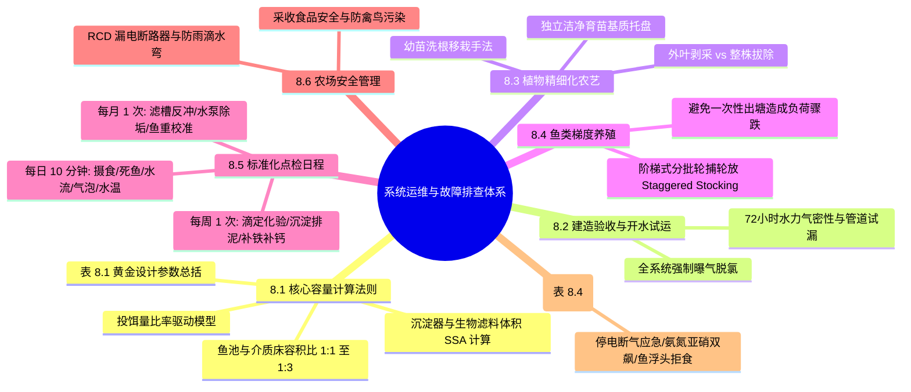
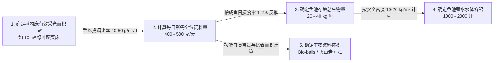
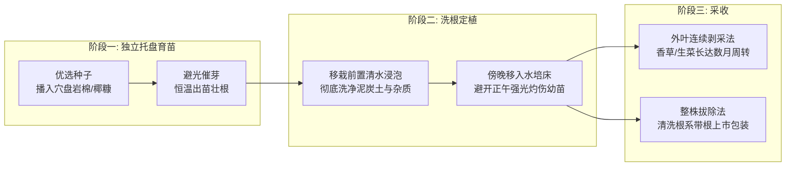

# 第 8 章 系统日常运营管理与故障排查
## Chapter 8: Management and operation of aquaponic units

---

> [!NOTE]
> **本章核心导读**：  
> 鱼菜共生系统的长期稳定运行依赖于严格的量化工程配比与标准化的日常运维规程。本章系统阐述系统容量规划的**核心组件计算法则与黄金设计参数表（表 8.1）**；提供新建系统水力试漏与初期开机要领；详解植物独立托盘育苗、洗根定植、梯次采收与成鱼分级轮捕轮放（Staggered Stocking）制度；制定每日、每周与每月的标准化点检清单；并提供涵盖水力电气、水化学毒性、动植物病理等 12 类突发危机的**故障排查排障决策矩阵（表 8.4）** 与系统运维**十大黄金戒律**。

---

---

## 8.1 核心组件容量计算与黄金设计比率法则

工程设计的根本原则是：**以植物预期的光合吸肥需求为基准，反向推导所需投入的日饲料总量；进而推导鱼类存塘生物量；最终确定机械沉淀器与生物滤池的有效填料体积**。

### 8.1.1 种植面积、日饲料量与鱼类存塘量的联动模型
1. **投饵量比率（Feed Rate Ratio）基准**：
   - **绿叶蔬菜类（生菜、罗勒、菠菜、瑞士甜菜）**：**$40 \sim 50\text{ 克饲料 / 平方米种植面积 / 每天}$**；
   - **茄果瓜类（番茄、黄瓜、甜椒、草莓）**：**$50 \sim 80\text{ 克饲料 / 平方米种植面积 / 每天}$**；
2. **鱼池蓄养总重量反推**：
   - 处于旺盛生长期至育肥期的成年鱼，每日健康摄食量为其自身体重的 **$1.0\% \sim 2.0\%$**；
   - 设全天需投入 500 克饲料，则鱼池内需蓄养的总鱼体生物量为：
     $$\text{鱼类总存塘生物量} = \frac{500\text{ 克}}{1.5\%} \approx 33.3\text{ kg}$$
3. **鱼类放养安全密度（Stocking Density）**：
   - **低密度/入门初学级（推荐）**：**$10 \sim 20\text{ kg 鱼 / 1000 升水}$**（即 $10\sim 20\text{ g/L}$）。在断电或水泵偶发故障时具有极高的缓冲自愈容错率；
   - **高密度/专业商业级**：$30 \sim 50\text{ kg 鱼 / 1000 升水}$。必须配置双路市电、柴油发电机自动切换（ATS）与全自动纯氧增氧机。

---

### 8.1.2 水体容积比率（Water Volume Ratio）
- 在经典**介质床系统（Media Bed）** 中，推荐**鱼池水体容积与介质床体积比例为 1:1 至 1:3**：
  - 例如一个 1000 升的鱼池，标准配置总容积为 $1000 \sim 3000\text{ 升}$ 的介质床（约 $3\sim 10\text{ m}^2$ 种植床面积）；
- **集水箱容积（Sump Tank Volume）**：集水箱容量至少应达到介质床总水力蓄水量的 **70% 以上**，保障潮汐退潮时能够全额容纳，涨潮蓄水时水泵绝不吸空干烧。

---

### 8.1.3 过滤系统工程选型与计算（Filtration Sizing）
1. **机械沉淀器容积**：旋流沉淀器或径向流沉淀槽的有效沉降水体容积，通常设计为**鱼池总容积的 1/6 至 1/5**（停留时间 HRT 至少 20~30 分钟），保障悬浮大颗粒在重力下彻底下沉；
2. **生物滤料有效体积**：
   - 依据经验公式：**每投喂 1 克的全价鱼饲料（按 32% 粗蛋白计），大约需要 $0.5\text{ m}^2$ 的微生物有效硝化比表面积**；
   - 设每日投喂 500 克饲料，系统需要总生物膜表面积：$500 \times 0.5 = 250\text{ m}^2$；
   - 若选用比表面积为 $600\text{ m}^2/\text{m}^3$ 的塑料 K1 填料，则所需填料净体积仅为：
     $$\text{填料体积} = \frac{250\text{ m}^2}{600\text{ m}^2/\text{m}^3} \approx 0.417\text{ m}^3 \approx 417\text{ 升}$$

---

### 表 8.1：小型鱼菜共生系统核心设计与工程容量黄金基准对照表

| 设计工程参数 | 推荐标准基准指标 | 适用说明与工程边界 |
| :--- | :--- | :--- |
| **绿叶菜日投饵比率** | **$40 \sim 50\text{ g/m}^2/\text{天}$** | 适用于生菜、草本香草、小白菜等 |
| **茄果类日投饵比率** | **$50 \sim 80\text{ g/m}^2/\text{天}$** | 适用于番茄、黄瓜、茄子、辣椒等高耗肥果菜 |
| **鱼类日摄食率** | 鱼体重的 **$1\% \sim 2\%$** | 幼鱼期取 $3\%\sim 5\%$，中成鱼取 $1\%\sim 2\%$ |
| **安全养殖存塘密度** | **$10 \sim 20\text{ kg / 1000 升水体}$** | 小型家庭与农场安全上限，严禁初学者盲目超密 |
| **水泵循环换水流量** | **$1.0 \sim 2.0\text{ 次 / 小时}$** | 水泵实际扬程净流量每小时至少完整循环鱼池 1 遍 |
| **机械沉淀器容积** | 鱼池水体容积的 **$16\% \sim 20\%$** | 水流停留时间保证在 20~30 分钟以实现重力沉降 |
| **介质床基质深度** | **$30\text{ cm}$（黄金标准）** | 营造“表层干燥、中层硝化、底层矿化”三层生态 |
| **NFT 管道坡度与流速** | **坡度 $1\%$，流量 $1.0\sim 2.0\text{ L/min}$** | 每根种植管道入口流量严格微阀微调 |
| **DWC 水道水力停留时间**| **$2.0 \sim 4.0\text{ 小时}$** | 槽深 30 cm，槽底高密度布设刚玉增氧气石 |
| **集水箱安全缓冲容积** | 介质床总容积的 **$\ge 70\%$** | 防范多床同时潮汐蓄水导致水泵吸空干烧 |

---

## 8.2 新系统启动验收与水力运行调试

1. **结构承重与水平找平复验**：系统注水前，使用水平尺重新复验鱼池基座与水培支架的水平度；
2. **72 小时闭水气密性试漏（Pressure & Leak Testing）**：
   - 注入全容量清水，开启水泵进行连续 72 小时不间断带水循环运转；
   - 细致勘验所有 PVC 胶水粘接管件、活接球阀、桶壁开孔密封圈（Uniseal / Bulkheads）及种植槽排水口，发现渗漏立即排空补胶修复；
3. **脱氯与管道清洗排空**：
   - 若注入的是市政自来水，在全系统开启超大功率强力曝气连续冲刷 48 小时，促使余氯与挥发性有机粘胶溶剂彻底挥发；
   - 随后将冲刷水全部排空，重新注入洁净原水，开始第 5 章所述的**生物开缸养水流程**。

---

## 8.3 植物精细化农艺管理

1. **建立洁净育苗区（Nursery Base）**：
   - 严禁在大田泥土中直接育苗后移入鱼菜系统！泥土带有土壤线虫与腐霉真菌；
   - 应在专用的塑料育苗穴盘中，选用高温消毒的**岩棉育苗塞（Rockwool Plugs）、膨胀珍珠岩或细椰糠**作为育苗介质；
2. **洗根定植工艺**：
   - 幼苗长出 3~4 片真叶时即可移栽；移栽前在水桶中轻轻漂洗根系，去除粘附的杂质后轻轻定植入定植杯或陶粒床中；
   - **移栽时间选在傍晚日落后或阴天**，给新生根系整夜时间适应水质，避免次日正午强烈蒸腾导致幼苗萎蔫；
3. **采收模式选择**：
   - **分批外叶剥采法（Cut-and-Come-Again）**：适用于散叶生菜、羽衣甘蓝、罗勒与瑞士甜菜。每周仅剥取植株最外围成熟的 3~4 片大叶，中心生长点继续快速萌发新叶，单株可持续产收长达 2~3 个月；
   - **整株连根采收法**：针对结球生菜或高档沙拉菜，整株连同根系拔出，清洗白嫩根系后带根冷藏销售（根系带水可大幅延长货架保鲜期）。

---

## 8.4 鱼类梯度养殖与阶梯式轮捕轮放制度（Staggered Stocking）

在鱼菜共生运维中，最忌讳的是“一次性全池放养同规格小鱼苗，几个月后一次性将所有大鱼全部捞出卖光”：
- **灾难后果**：小鱼期排泄极少，植物长期脱肥饥饿；中鱼期水质达峰；而成鱼一次性清池卖空后，系统养分输入瞬间归零，植物大面积枯萎脱肥，同时生物滤膜因缺乏氨源大批饿死崩溃！

> [!IMPORTANT]
> **阶梯式轮捕轮放制度（Staggered Stocking Protocol）**：  
> - 鱼池内必须**常态化维持 3 个大小不同规格的鱼群梯队**：  
>   - **梯队 A（大鱼组，约占总重量 50%）**：处于最后育成期（$350\sim 500\text{ g}$），即将分批上市；  
>   - **梯队 B（中鱼组，约占总重量 35%）**：处于快速骨骼肌肉生长期（$150\sim 300\text{ g}$）；  
>   - **梯队 C（幼鱼苗组，约占总重量 15%）**：新引入的优质苗种（$20\sim 50\text{ g}$）。  
> - **操作实现**：可以通过多养殖桶并联循环，或者在单个大鱼池内加装尼龙网箱隔板进行物理分选分级；  
> - **生态收益**：每月定期捞出捕获最大规格的成鱼上市，并同步补充等量幼鱼苗。全系统总生物量与日投饲排氨量常年保持恒定，形成完美的营养稳态。

---

## 8.5 标准化日常巡检与运维时间表

### 8.5.1 每日工作清单（Daily Checklist，10~15 分钟）
- [ ] 检查电源供电，确认水泵运转正常，各出水管出水通畅；
- [ ] 检查气泵运转，确认各气石剧烈冒泡，水面无异样白沫；
- [ ] 测量并记录即时水温（早晨与傍晚各一次）；
- [ ] **早晨投喂**：观察鱼群抢食活性，15 分钟后捞出未吃完的残饵；
- [ ] 目测鱼群外表，确认无浮头、无擦缸、体表无白点；
- [ ] **傍晚投喂**：再次投喂，巡视植物叶片无萎蔫与害虫群聚。

### 8.5.2 每周工作清单（Weekly Checklist，30~45 分钟）
- [ ] **水质全套理化滴定**：测定 **pH、KH、硝酸盐（$\text{NO}_3^-$）**，必要时加测 TAN 与 $\text{NO}_2^-$；
- [ ] **机械沉淀器排污**：打开旋流器/沉淀桶底部排污阀，将沉积的浓稠黑色鱼粪污泥排入外部堆肥桶；
- [ ] **水质调控与营养补偿**：
  - 若 $\text{pH} < 6.5$，补充适量碳酸氢钾或向集水箱补充贝壳石灰质；
  - 补充螯合铁（Fe-EDDHA），维持水体呈微黄琥珀色（铁浓度约 $2\text{ mg/L}$）；
- [ ] 补足由于蒸腾蒸发损耗的水分；
- [ ] 检查苗盘发芽情况，移栽壮苗并采收成熟蔬菜。

### 8.5.3 每月工作清单（Monthly Checklist，1~2 小时）
- [ ] 彻底检查潜水泵进水口过滤罩，清除缠绕的毛发、细根与藻类纤维；
- [ ] 检查并清洗生物滤槽进水导流板，防止异养污泥局部板结；
- [ ] 随机抽样称重 10~20 尾代表性养殖鱼体，精准校准更新下月的每日饲料投喂总量；
- [ ] 全面检查电线回路、漏电保护开关（按下“Test”按键测试脱扣功能）。

---

## 8.6 农场安全管理与职业健康规程

### 8.6.1 电气安全操作规范（Electrical Safety）
- **高危环境**：鱼菜共生属于水利与电气设备高度密集交织的湿热环境；
- **核心防护**：
  1. 所有用电设备总回路必须配备高灵敏度**剩余电流动作保护器（RCD / GFCI，动作电流 $\le 30\text{ mA}$）**；
  2. 插座与接线盒必须使用 **IP55 以上防水防溅盒**，并架设在高出地面最高水位线 $50\text{ cm}$ 以上的安全高处；
  3. 电源线进入插座前必须向下自然下垂弯曲形成 **“滴水弯（Drip Loop）”**，防止凝结水顺着电线直接流入插座引发短路爆燃。

### 8.6.2 食品安全与采收卫生准则（Food Safety）
- **严禁养殖水直接喷淋叶面**：灌溉水流只能流经植物根系，严禁直接接触绿叶菜的叶片表面，彻底消除水生微生物对鲜食生菜的附着污染；
- **周界防鸟防兽**：加装鸟网，严防野生鸟类停歇在种植槽边沿排便造成沙门氏菌感染；
- **采收卫生规范**：采收人员操作前必须流水洗手消毒，采收刀剪定期酒精擦拭消毒。

---

## 8.7 典型系统故障排查决策矩阵

### 表 8.4：鱼菜共生系统全要素故障排查与应急排障决策矩阵

| 故障现象 | 潜在触发根因 (Reason) | 系统即时危害 (Problem) | 现场黄金应急解决措施 (Solution) |
| :--- | :--- | :--- | :--- |
| **突发停电，循环泵与气泵全部停摆** | 外部市电断电、线路跳闸或电闸跳开 | 水中溶解氧快速消耗，高密度鱼群可能在数小时内窒息 | 1. 立即启动备用电磁蓄电池气泵或发电机； 2. 无备用电时，人工用桶舀取集水箱水自高空猛烈冲回鱼池人工充氧（每 1 小时重复一次）； 3. 彻底停止喂料。 |
| **有电但水泵出水量骤减或停转** | 水泵进水滤网被鱼粪烂根堵塞，或叶轮被异物卡死 | 水循环阻断，硝化受阻，硝酸盐无法运达植物根区 | 立即切断水泵电源，将潜水泵提出水面拆开叶轮罩，清除缠绕纤维与异物；若电机烧毁立即更换备用泵。 |
| **鱼池水位异常暴跌或地面大量积水** | 管路接头脱扣松脱、桶体开裂破损或虹吸管外溢 | 系统水体流失，鱼群面临干涸暴死风险 | 1. 立即排查并关闭对应支路阀门； 2. 坚守 CHIFT-PIST 结构确保鱼池溢流管底限安全； 3. 迅速修补裂缝并缓慢补入脱氯新水。 |
| **全系统水质发绿，池壁长满厚绿藻** | 鱼池或管道暴露在直射阳光下，发生藻华爆发 | 夜间藻类呼吸剧烈与鱼争氧，水体 pH 剧烈昼夜波动 | 立即为鱼池、沉淀桶及水培管加装 100% 遮光黑盖板或遮阳棚；物理擦拭刮除附着藻类并用密网捞出。 |
| **氨氮 TAN 或亚硝酸盐突然超标（$> 1\text{ mg/L}$）** | 1. 硝化菌受低 pH 抑制； 2. 投喂过量产生严重残饵； 3. 鱼类意外死亡未被发现； 4. 气泵停转生物膜缺氧窒息 | 产生急性鱼类神经与血液毒性，鱼群即将大批死亡 | 1. **立即全池彻底断食停食**； 2. 紧急置换 1/3~1/2 的新鲜脱氯洁净水； 3. 若亚硝酸盐超标，**立即投加无碘粗盐（按 1 g/L 水量）** 利用氯离子解毒； 4. 全力强化曝气，调节 pH 回升至 7.0。 |
| **碳酸盐硬度 KH 跌至 0，pH 暴跌至 $< 5.5$** | 硝化反应持续消耗碱度，长期未补充缓冲盐 | 爆发“pH 暴跌（pH Crash）”，硝化停摆，鱼鳃酸灼伤 | 立即在集水槽中吊挂大网袋**碳酸钙贝壳粉/消石灰**，或缓慢点滴注入碳酸氢钾浓溶液，使其在数小时内缓慢回升至 6.8。 |
| **鱼群水面集体“浮头张口喘息”** | 水体严重缺氧（$\text{DO} < 2\text{ mg/L}$）或鳃被高浓度氨氮灼伤 | 鱼类即将发生群体窒息死亡 | 立即将备用大功率气泵气石直接投入鱼池中央；检查循环管路是否堵塞；立刻停止投喂。 |
| **鱼群全池废食，完全拒绝摄食** | 1. 溶氧过低； 2. 氨氮/亚硝酸盐超标； 3. 水温骤变跌破下限； 4. 寄生虫爆发 | 鱼类处于严重应激前驱期，即将爆发疾病 | 立即化验水化学全套（DO、pH、TAN、水温）；排查应激根因；断食静养，绝对禁止强行投喂。 |
| **水温极端过高（$> 33\text{ }^\circ\text{C}$）** | 夏季高温热浪与强光暴晒 | 溶氧急剧萎缩，鱼类食欲衰退，植物根腐病爆发 | 立即在水体上方搭设 50% 遮光网；加强大棚湿帘风机降温；必要时用冻冰块密封袋投入集水箱物理降温。 |
| **水温极端过低（$< 12\text{ }^\circ\text{C}$）** | 冬季严寒寒潮侵袭 | 罗非鱼受冻死亡，硝化细菌活性丧失 80% 以上 | 为鱼池覆盖聚苯乙烯发泡保温盖板；鱼池外壁包裹气泡保温棉；开启钛合金水产加热棒；减料 80%。 |
| **植物新嫩幼叶大面积发黄失绿（叶脉保持鲜绿）** | 典型的**缺铁失绿症（Iron Deficiency）**，常由 pH 偏碱引发 | 植物营养生长阻滞，无法光合作用 | 1. 测定 pH，若偏高应适度调低至 6.8； 2. 向系统水体补充投加**螯合铁（Fe-EDDHA，按 20~30 g / 1000 升）**，数天内新叶恢复葱绿。 |
| **介质床进水端蔬菜旺盛，远端蔬菜矮小枯黄** | 进水管多孔出水不均，导致近端养分被截留吸收 | 介质床作物生长严重参差不齐 | 重新改造打孔滴灌供水支管，确保水流在介质床全表面均匀淋浇；定期拔起中央虹吸立管全量冲洗底泥。 |

---

## 8.8 系统日常运营管理的“十大黄金戒律”（Ten Golden Rules）

1. **每日坚持 10 分钟目视巡检**：观察鱼类游泳摄食、植物叶色生长以及水泵气石运转；
2. **保障充沛强劲的曝气充氧**：维持鱼池出水与水培根区 $\text{DO} > 5.0\text{ mg/L}$；
3. **将水质锁定在黄金折中带**：pH 恒定在 6.0–7.0，水温 18–26 °C，氨氮与亚硝酸盐趋近于 0；
4. **科学选配适应本地气候的适养鱼种与蔬菜**：顺应季节自然轮作，不打逆风仗；
5. **坚守安全放养密度红线**：初学者放养密度绝不超过 $20\text{ kg 鱼 / 1000 升水}$；
6. **坚决杜绝过量投饲（Overfeeding）**：投喂 15 分钟后捞尽残饵，根据鱼体日食量精准投喂；
7. **及时排出浓缩固废，严防厌氧淤泥沉积**：保持机械沉淀器清洁，鱼池全避光防藻；
8. **以投饵量比率精准配平系统**：绿叶菜按 $40\sim 50\text{ g/m}^2/\text{d}$，茄果菜按 $50\sim 80\text{ g/m}^2/\text{d}$；
9. **严格执行阶梯式错峰轮捕轮放**：分批采收蔬菜，分批放养收获鱼类，维持养分稳态；
10. **构筑严密生物安全防火墙**：杜绝野生动物禽鸟污染，严禁养殖原水直接喷淋沾染蔬菜食用叶片。
