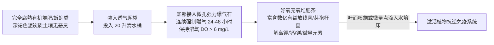
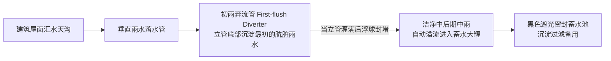
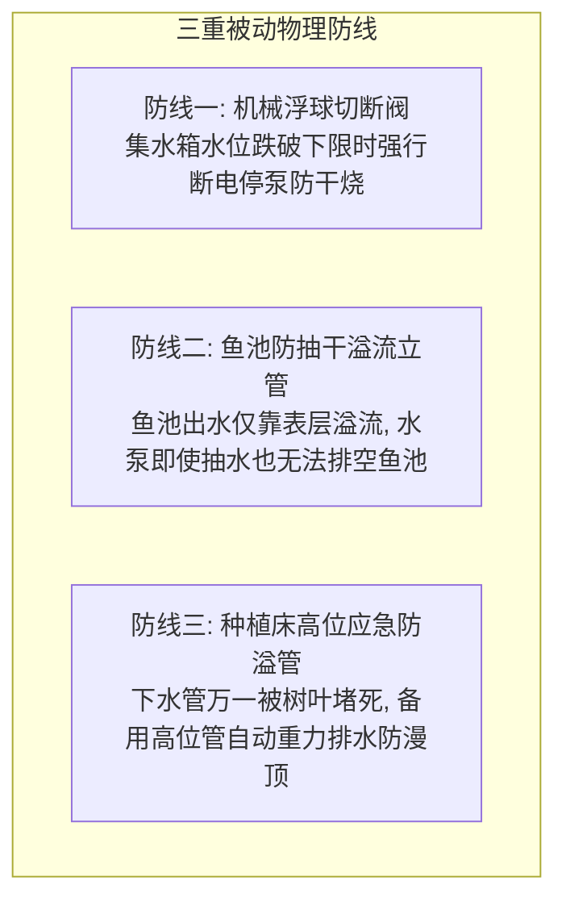
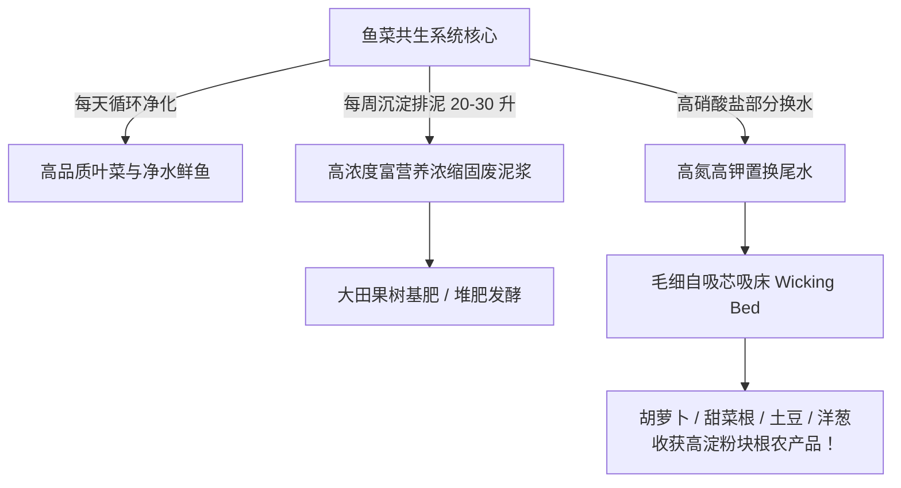

# 第 9 章 拓展话题：资源替代、安全冗余与多模态集成
## Chapter 9: Additional topics on aquaponics

---

> [!NOTE]
> **本章核心导读**：  
> 鱼菜共生的生命力在于其超越传统温室农业的极致生态韧性与本土适配性。本章系统阐明面向资源匮乏与偏远地区的**低成本可持续替代投入品**开发（包括充氧堆肥茶、高蛋白浮萍培育、黑水虻幼虫昆虫蛋白转化、雨水收集初雨弃流与太阳能光伏微电网集成）；深入剖析杜绝“水淹农舍与水泵干烧”的**多重水力被动安全硬件冗余设计**（浮球切断阀、防溢流管与破虹吸立管）；首创性推介利用鱼菜排污水滋养根茎类蔬菜的**毛细芯吸床（Wicking Beds）复合模式**；并全景解析缅甸低成本生计微系统、微咸水盐生植物共生（Saline Aquaponics）及印尼 Yumina/Bumina 塘基集成工程。

---

```mermaid
mindmap
  root((拓展话题与多模态集成))
    9.1 可持续本土化替代投入品
      有机补肥: 好氧堆肥茶 / 海藻茶 / 草木灰浸出液
      替代蛋白饲料: 浮萍 (粗蛋白40%) / 黑水虻幼虫 / 红蚯蚓
      自主种子收集: 传家宝品种留种与干燥储藏
      雨水收集: 初雨弃流装置 First-flush
      低成本建造: 生土袋 Earthbags / 竹木工程
      清洁能源: 太阳能光伏 PV + DC 低压直流泵 + 太阳能螺旋盘管加热
    9.2 关键水力安全防线
      机械浮球补水阀 + 电子低液位断电开关
      高位防溢流安全管 (Overflow Pipes)
      破虹吸防抽干立管 (Standpipes)
    9.3 跨系统复合延伸
      浓缩固废与排污水大田果园灌溉
      毛细自吸芯吸床 Wicking Beds (攻克土豆/胡萝卜块根种植)
    9.4 全球创新案例剖析
      缅甸重力流小农生计鱼菜示范
      微咸水共生: 海鲈/鲷鱼 + 盐地碱蓬/海蓬子
      印尼池塘 Yumina (菜鱼) 与 Bumina (果鱼) 模式
```

---

## 9.1 可持续本土化替代投入品（Sustainable Local Inputs）

在偏远农村或高成本运营环境中，减少对昂贵外源工业化肥、商业配合鱼饲料与市电电网的依赖，是决定项目长期经济生存力的关键。

### 9.1.1 有机植物补充肥料（Organic Fertilizers）
虽然鱼类代谢提供主体氮磷，但在果菜盛果期或系统出现微量元素失衡时，自制高活性有机液肥具有极高价值：



1. **好氧充氧堆肥茶（Aerated Compost Tea, ACT）**：
   - **核心禁忌**：严禁采用密闭无氧泡水发酵！厌氧泡肥会迅速滋生厌氧病原菌并产生恶臭酚类化合物；
   - **制作规程**：将数大把完全腐熟的优质热力堆肥或纯蚯蚓粪（Vermicompost）装入密目网袋，悬吊于 20 升清水桶中。在网袋底部放置强力气石，**连续剧烈曝气翻滚 24~48 小时**；
   - 气泡 agitation 剧烈剥离并增殖有益放线菌与枯草芽孢杆菌，矿化溶出丰富的可溶性钾、磷、钙及腐殖酸。取出后稀释 5~10 倍用于叶面喷施或少量兑入种植槽；
2. **海藻提取液（Seaweed Tea）**：
   - 将海滩收集的新鲜海藻反复浸泡漂洗褪去有害表面海盐（$\text{NaCl}$），切碎后进行好氧浸提；
   - 海藻提取液富含天然**细胞分裂素（Cytokinins）、生长素与 60 余种海洋微量矿物质**，对诱导果菜生根和膨果具有奇效；
3. **草木灰浸出液（Wood Ash Extract）**：
   - 纯净硬木燃烧后的白灰色草木灰富含高水溶性**碳酸钾（$\text{K}_2\text{CO}_3$）**；
   - 将草木灰浸入清水搅拌沉淀后，取上层清亮弱碱性滤液，是鱼菜共生中最为廉价、纯天然的快速**补钾降酸缓冲剂**。

---

### 9.1.2 替代性鱼类高蛋白昆虫与植物饲料（Alternative Feeds）

鱼粉与商业配合饲料占养殖总运营成本的 60% 以上。利用农场有机废弃物自产鲜活或风干高蛋白饲料，能大幅压缩生产开支：

```mermaid
mindmap
  root((农场内生替代饲料库))
    水生植物蛋白
      浮萍 (Lemna minor): 粗蛋白高达 35-40%
      满江红红萍 (Azolla): 粗蛋白 25-30%
      辣木鲜叶 (Moringa): 粗蛋白 25-28%
    昆虫与无脊椎鲜活蛋白
      黑水虻幼虫 (BSF): 粗蛋白 42% / 优质脂质 35%
      赤子爱胜蚓 (红蚯蚓): 粗蛋白 60% / 促摄食引诱活性
      蝇蛆干粉: 鲜活诱食
```

1. **浮萍（Duckweed, *Lemna minor*）与满江红（*Azolla* spp.）**：
   - **营养价值**：在富营养水体中，干基粗蛋白质含量高达 **$35\% \sim 40\%$**，必需氨基酸谱系极其接近优质大豆粕；
   - **生产特性**：漂浮在浅水静水面上，在适宜温度下生物量 **每 2~3 天即可翻倍扩繁一次**；
   - **投喂实践**：每天用捞网打捞新鲜鲜嫩浮萍，直接泼洒在鱼池水面。草食性与杂食性鱼类（草鱼、罗非鱼、鲤鱼）极为嗜食，可**安全替代商业颗粒饲料总量的 30%~50%**；
2. **黑水虻幼虫（Black Soldier Fly Larvae, BSFL, *Hermetia illucens*）**：
   - **生物废弃物转化神虫**：黑水虻幼虫具有惊人的取食杂食性，能将厨房烂菜叶、瓜果皮及豆渣快速吞噬分解；
   - **营养剖面**：老熟预蛹风干物质中，**粗蛋白质含量高达 40%~44%，粗脂肪 30%~35%**，富含抗菌肽与月桂酸；
   - **投喂规范**：鲜活幼虫可直接投喂给大中规格罗非鱼、鲶鱼与鲈鱼。因其脂肪含量偏高，推荐投喂量占全天日粮的 **$15\% \sim 25\%$** 为宜，避免鱼体发生脂肪肝。
3. **蚯蚓与红蚯蚓（Earthworms, *Eisenia fetida*）**：
   - 纯干基蛋白质含量高达 **60%**，富含高诱食性游离氨基酸。在介质床底层或外部蚯蚓堆肥箱中养殖，兼具消化污泥与提供高蛋白活饵双重功能。

---

### 9.1.3 自主留种与种子干燥储藏（Seed Collection）
- 严禁对杂交一代（F1）种子留种（子二代会发生严重的性状分离退化）；
- **传家宝非转基因常规种（Heirloom / Open-pollinated Seeds）**：选择长势最健壮、无病斑、抗逆性最强的前 5% 植株作为留种母本；
- 待果实充分生理成熟或花薹结荚彻底干枯后脱粒采收，晾晒至含水量 $< 8\%$，密封放入带有硅胶干燥剂的玻璃瓶中，置于阴凉干燥避光处冷藏保存。

---

### 9.1.4 雨水收集与初雨弃流装置（Rainwater Harvesting）

雨水是廉价且无化学氯气的绝佳补水水源，但天然降雨会冲刷屋面沉积的粉尘、鸟粪与大气酸沉降。



- **初雨弃流法则（First-Flush Rule）**：
  - 每场降雨开始的前 **$1 \sim 2\text{ mm}$ 降水**必须被物理导流抛弃；
  - 弃流管容积经验公式：每 $1\text{ m}^2$ 采雨屋面面积，初雨弃流管道至少预留 **$1 \sim 2\text{ 升}$** 的弃流水柱容积；
- **水质重构防酸崩**：天然雨水 $\text{KH} \approx 0$，直接大量注入系统会导致 pH 崩溃。因此，**雨水入缸前必须先在预备储水桶中浸泡贝壳粉或添加微量碳酸氢钙**以重构碱度。

---

### 9.1.5 低成本替代建造工艺
- **生土袋工程（Earthbag Construction）**：在缺乏木材与红砖的干旱沙漠地区，利用耐晒编织袋装填湿润泥沙就地堆砌，外表面抹灰防水砂浆，构筑成坚固耐用、保温隔热性极强的地下蓄鱼池；
- **竹构工程（Bamboo Structures）**：在东南亚与热带非洲，采用经过硼酸防蛀浸泡处理的粗楠竹劈开制成半圆水培输水水槽与种植支架。

---

### 9.1.6 清洁能源与光伏微电网集成（Alternative Energy）
- **直流低压潜水泵（DC 12V/24V Pumps）**：淘汰高压交流泵，采用无刷直流太阳能水泵。由 2~4 块 $250\text{W}$ 太阳能光伏板直接配合 MPPT 控制器与深循环胶体蓄电池供电，彻底摆脱不稳定的市电电网；
- **太阳能黑色盘管被动加热（Passive Solar Coil Heating）**：在温室阳光直射区铺设数百米盘旋的黑色 PE 塑料软管，水流以极低流速流经盘管自然吸热后回流鱼池，在春秋季节可将水温免费拉升 $3\sim 6\text{ }^\circ\text{C}$。

---

## 9.2 关键水力安全被动防线（Securing Water Levels）

机械故障与停电是鱼菜共生的头号杀手。优秀的工程设计必须做到 **“即便所有自控元件全部失灵，系统依然依靠物理重力维持生命底线”**。



1. **机械浮球补水阀（Ballcock Float Valve）**：类似于抽水马桶浮球阀，安装在集水箱内。一旦系统蒸腾使水位下降，浮球下沉自动打开市政给水管补水，水满自动闭锁；
2. **防干烧电子液位继电器（Float Switch）**：串联在潜水泵电源零线上。当集水槽水位跌破潜水泵吸水网罩前 $5\text{ cm}$ 时，浮球倾倒自动切断水泵供电，彻底消除电机干烧火灾隐患；
3. **紧急防溢流支管（Emergency Overflow Pipes）**：每个种植床与沉淀槽的排水侧，必须在**高于正常工作水位 $3 \sim 5\text{ cm}$ 处打孔安装一根内径 $\ge 50\text{ mm}$ 的粗溢流管**。即使主出水阀被蜗牛、烂叶或陶粒彻底堵死，水流也能通过备用管无声排回集水箱，绝不漫溢淹没地面。

---

## 9.3 复合生态系统延伸：大田整合与毛细芯吸床（Wicking Beds）

鱼菜共生不应是一座封闭的孤岛，而是现代全域生态农场的“养分泵送核心引擎”。



### 9.3.1 废弃尾水大田果林资源化利用
机械沉淀池底部每周排出的浓缩黑色淤泥，富含矿化后的钙、镁、磷酸盐及活性微生物菌群。直接将其用作高产果树（柑橘、香蕉、无花果、木瓜）的根部环状沟施肥液，能提升大田果实糖度，实现真正的全场零排放。

---

### 9.3.2 毛细芯吸自润种植床（Wicking Beds）

> [!IMPORTANT]
> **破除传统水培局限的世纪创新——芯吸床（Wicking Bed）**：  
> 传统水培（NFT、DWC 和潮汐床）只能栽培叶菜或攀援果菜，**绝不可能栽培马铃薯、胡萝卜、洋葱、大蒜等块根块茎作物**（块茎长时间泡在流动水中会直接腐烂发臭）。  
> **芯吸床结构彻底攻克了这一痛点**！

```mermaid
flowchart TD
    subgraph 芯吸床解剖结构 (深度 50 cm)
        SoilZone["🌱 上层透气土壤有机种植层 (厚度 25 - 30 cm)\n由腐殖土、沙壤土与堆肥构成\n疏松透气干燥，土豆/胡萝卜在其中膨大"]
        Geotextile["➖ 透水透气土工织物隔离层 (无纺布)\n物理隔离泥土，仅允许水分毛细穿透，防泥土下漏"]
        WaterZone["💧 底层粗砾石密闭水库 (厚度 15 - 20 cm)\n注满来自鱼菜系统的富营养尾水\n内铺打孔注水管与溢流出水孔"]
    end
    SoilZone --- Geotextile
    Geotextile --- WaterZone
```

- **物理动力学机理**：利用土壤的**微细毛细管虹吸吸力（Capillary Action）**，底部蓄水库中的富营养水份与无机盐缓慢、恒定、均匀地自下而上“向上抽吸浸润”土壤层；
- **上干下湿的完美农艺生境**：土壤表层始终保持干爽疏松，杜绝了水分无谓蒸发和杂草种子萌发；而深层根区常年湿润通气。胡萝卜、白萝卜和马铃薯在疏松土壤中自由膨大，外形光滑笔直，且由于直接吸收鱼菜有机养分，风味浓郁清甜。

---

## 9.4 全球特色创新实践案例

### 9.4.1 缅甸因莱湖与仰光低成本生计微系统（Myanmar Livelihood Project）
- **项目背景**：FAO 针对缅甸农村赤贫无地农户实施的粮食营养应急计划；
- **工程特色**：完全摒弃昂贵的进口塑料管件。鱼池采用当地挖坑铺设双层重型黑色低密度聚乙烯（LDPE）防渗薄膜；种植槽使用当地盛产的毛竹和木板纯手工扎接；
- **生计产出**：系统由妇女居家日常打理，利用厨房残渣堆肥滋养浮萍喂鱼，既彻底改善了儿童动物蛋白摄入不良，富余蔬菜更在乡镇市集贩卖换取日常现金收入。

### 9.4.2 盐碱环境与微咸水鱼菜共生（Saline Aquaponics）
- **极端环境破局**：在海岛、沿海荒漠或地下水重度盐渍化区域（淡水匮乏，盐度达 $5\sim 15\text{ ppt}$）；
- **系统生物学选型**：
  - **水生动物**：引入高广盐性鱼类，如**海鲈（European Seabass）、金头鲷（Gilthead Seabream）或高耐盐杂交红罗非鱼**；
  - **共生植物**：选用高价值特种**盐生经济植物（Halophytes）**，包括**海蓬子（Salicornia，海芦笋）、海芥菜与盐地甜菜**，或者经过盐胁迫梯级驯化的耐盐圣女果（在微咸水胁迫下，果实糖分积累惊人，单宁芳香浓郁，在高端欧陆超市卖出极高溢价）。

### 9.4.3 印度尼西亚池塘微系统：Yumina（菜鱼）与 Bumina（果鱼）
- **传统大塘生态升级**：印尼水产研究所发明的创新模式；
- **技术构型**：农户无须购买塑料水箱，直接在现有的天然泥塘水面上搭设竹木浮桥平台：
  - **Yumina 模式**：在竹筒内填装火山石浮于塘面，引塘水种植绿叶蔬菜；
  - **Bumina 模式**：在池塘堤坝外围构筑条状土垄，引入塘底富营养底泥与排污水，高密度种植木瓜、香蕉等高经济价值多年生热带水果，实现水下养鲶鱼、水上收鲜果的双丰收。

---

## 9.5 本章小结（Chapter Summary）

- **投入品自给自足闭环**：通过**好氧充氧堆肥茶**定向补全微量元素，依托**浮萍培育与黑水虻生物堆肥**替代商业鱼粉，结合**雨水初雨弃流收集**，可大幅斩断对外源工业物资的依赖。
- **水力安全的三重物理锁**：牢固确立机械浮球补水阀、电子低液位断电保护与高位防溢流安全管，从物理结构上免除跑水与火灾风险。
- **芯吸床拓展全品类疆域**：利用鱼菜共生置换尾水驱动**毛细芯吸床（Wicking Beds）**，完美补齐了传统水培不能栽培马铃薯、胡萝卜等块茎根作物的技术短板。
- **全球情境化适应范式**：从缅甸低成本竹木生计项目、沿海微咸水盐生植物共生，到印尼塘基 Yumina/Bumina 模式，充分印证了鱼菜共生在不同资源约束环境下的极高适应弹性。
