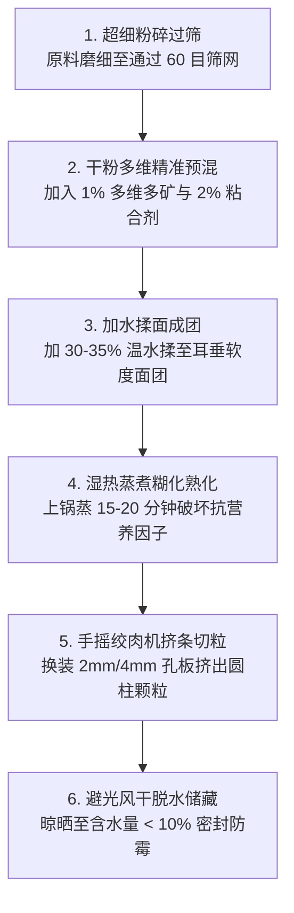

# 附录 4 至 7：工程计算、自制饲料、规划考量与经济效益分析
## Appendix 4–7: Calculations, feed making, setup considerations, cost-benefit

---

> [!NOTE]
> **附录导读**：  
> 本篇系统整合了 FAO 589 技术报告中四个极具工程落地与产业投资指导价值的实操附录：  
> 1. **附录 4**：氨氮生成量与生物滤料体积精准生化工程计算模型（涵盖步进式数学公式与填料比表面积表）；  
> 2. **附录 5**：自制鱼配合饲料的配方设计（皮尔逊十字法）与手工颗粒挤出干燥全流程；  
> 3. **附录 6**：建厂前气候、水质、供应链、法律合规与市场可行性自检清单；  
> 4. **附录 7**：标准 1000 升小型介质床系统的全生命周期财务成本-效益分析（CAPEX、OPEX、产出测算与 19 个月回本模型）。

---

# 第一部分：附录 4 氨氮生成量与生物滤料体积工程计算模型

设计一个稳定不倒缸的鱼菜共生系统，必须通过物质守恒定律精确核算**“投饲负荷 $\rightarrow$ 氨氮释放量 $\rightarrow$ 微生物氧化所需表面积 $\rightarrow$ 生物填料体积”**。

```mermaid
flowchart LR
    Feed[1. 每日投入饲料量 F (克)\n及其粗蛋白含量 CP%] --> N_in[2. 饲料含氮总量\nN = F × CP% × 16%]
    N_in --> TAN[3. 鱼类鳃部排泄总氨氮 TAN\n约 70% 氮转化为游离 TAN]
    TAN --> Area[4. 所需生物膜总比表面积\n每克 TAN 需 1.75 m² 表面积]
    Area --> Volume[5. 换算生物填料净体积\n填料体积 = 总面积 / 填料比表面积 SSA]
```

## 4.1 步进式数学推导与计算实例

### 第一步：计算每日饲料中的总氮素输入量
配合饲料中的粗蛋白质（Crude Protein, CP）平均含有 **$16\%$ 的化学结合氮**。  
设系统每日投喂 **$F = 100\text{ 克}$** 的配合饲料，其粗蛋白标称含量为 **$CP = 32\%$**：

$$\text{每日输入蛋白质总量} = 100\text{ g} \times 32\% = 32.0\text{ 克}$$

$$\text{每日输入纯氮总量} = 32.0\text{ g} \times 16\% = 5.12\text{ 克氮}$$

---

### 第二步：计算鱼类排泄的游离总氨氮（TAN）
水产鱼类吸收同化饲料蛋白合成自身肌肉组织的净保留率约为 $30\%$。**剩余约 $70\%$ 的摄入氮素将通过鱼鳃代谢与尿液以氨态氮（TAN）的形式直接排泄入水体中**：

$$\text{每日系统产生的总氨氮 (TAN)} = 5.12\text{ g} \times 70\% = \mathbf{3.584\text{ 克 TAN / 天}}$$

---

### 第三步：计算维持硝化平衡所需的最小生物膜表面积
根据受控水产工程试验，在正常温度（22–26 °C）与最佳 pH（6.8–7.2）工况下，自养硝化菌群的平均净硝化氧化速率常数为：  
$$\text{硝化活性} \approx 0.57\text{ 克 TAN / 平方米有效生物膜表面积 / 每天}$$

因此，要安全氧化分解每天产生的 $3.584\text{ 克}$ 氨氮，系统所需的**最小总生化有效表面积（Total Surface Area）**为：

$$\text{所需总表面积} = \frac{3.584\text{ g TAN/天}}{0.57\text{ g/m}^2/\text{天}} \approx \mathbf{6.29\text{ 平方米 (m}^2\text{)}}$$

> [!TIP]
> **工程安全冗余系数（Safety Factor）**：  
> 考虑到冬季低温、部分生物膜老化脱落以及投喂量偶发超标，工程规范强制要求引入 **$2.0 \sim 2.5$ 倍的安全富余系数**。  
> 因此，实际工程设计的最低总有效表面积为：  
> $$\text{设计总表面积} = 6.29\text{ m}^2 \times 2.0 \approx \mathbf{12.6 \sim 13.3\text{ 平方米 (m}^2\text{)}}$$

---

### 第四步：查表换算所需填料的物理装填体积

#### 表 A4.1：常见生物过滤填料比表面积（SSA）与容积换算对照表

| 填料材质与类型 (Media Type) | 比表面积 SSA ($\text{m}^2/\text{m}^3$) | 氧化 100g 饲料(32%蛋白)所需填料净体积 | 适用过滤槽类型与优缺点 |
| :--- | :---: | :---: | :--- |
| **多孔玄武岩火山石 (Volcanic Tuff)** | **$300 \sim 400$** | **$33 \sim 44\text{ 升}$** | 介质床或静止浸没式滤池，质优价廉 |
| **轻质膨胀陶粒 (LECA)** | **$250 \sim 300$** | **$44 \sim 53\text{ 升}$** | 介质床首选，表面光滑不伤菌膜 |
| **生化球 (Bio-balls)** | **$150 \sim 250$** | **$53 \sim 88\text{ 升}$** | 滴滤塔或大颗粒生化槽，空隙大永不堵塞 |
| **流化床 K1 塑料填料 (MBBR)** | **$600 \sim 800$** | **$16 \sim 22\text{ 升}$** | **最紧凑**；配合微孔曝气翻滚，生化效率最高 |
| **塑料瓶盖 (回收洗净)** | $50 \sim 100$ | $130 \sim 260\text{ 升}$ | 零成本替代品，需巨大滤槽容积 |

**选型算例**：若选用比表面积为 $300\text{ m}^2/\text{m}^3$ 的火山石，则所需填料净体积为：
$$\text{火山石体积} = \frac{13.3\text{ m}^2}{300\text{ m}^2/\text{m}^3} = 0.044\text{ m}^3 = \mathbf{44\text{ 升}}$$

---

# 第二部分：附录 5 农场自制鱼配合饲料全流程指南

外购全价颗粒饲料往往占据养殖总可变开支的 $60\%$ 以上。在商业饲料匮乏或价格高昂区域，掌握自配饲料工艺具有决定性意义。

## 5.1 主要适养鱼种全价营养素基准需求

### 表 A5.1：精选鱼种粗蛋白、消化能及必需氨基酸最低营养需求表（改编自 NRC, 1993）

| 营养指标要素 | 尼罗罗非鱼 (Tilapia) | 普通鲤鱼 (Common Carp) | 虹鳟 (Rainbow Trout) | 非洲胡子鲶 (Catfish) |
| :--- | :---: | :---: | :---: | :---: |
| **可消化粗蛋白 (DP, %)** | **$30\%$** | **$32\%$** | **$42\%$** | **$27\%$** |
| **可消化能量 (DE, kcal/kg)** | $2900$ | $2900$ | $4100$ | $3100$ |
| **蛋白能量比 (DP/DE, mg/kcal)** | $103$ | $108$ | $105$ | $86$ |
| **赖氨酸 (Lysine, %)** | $1.4\%$ | $2.2\%$ | $1.9\%$ | $1.2\%$ |
| **蛋氨酸 (Methionine, %)** | $0.7\%$ | $1.2\%$ | $1.0\%$ | $0.6\%$ |
| **精氨酸 (Arginine, %)** | $1.2\%$ | $1.5\%$ | $1.6\%$ | $1.0\%$ |
| **苏氨酸 (Threonine, %)** | $1.0\%$ | $1.5\%$ | – | $0.5\%$ |

---

## 5.2 饲料配方设计：皮尔逊十字法（Pearson's Square Method）

皮尔逊十字法是水产与畜牧营养学中最简便高效的双原料蛋白配平计算工具。

> [!NOTE]
> **计算场景**：  
> 设我们手头有两种本地极其充裕的饲料原料：  
> - **大豆粕（高蛋白源）**：粗蛋白含量 $\text{CP}_A = 44\%$  
> - **碎小麦粉（能量源与粘结剂）**：粗蛋白含量 $\text{CP}_B = 12\%$  
> 目标：配制出一款适合育成期罗非鱼的 **$32\%$ 粗蛋白全价饲料**。

```
大豆粕 (44% CP)                20 份大豆粕 (32 - 12 = 20)
                  \        /
                    目标: 32%
                  /        \
碎小麦 (12% CP)                12 份碎小麦 (44 - 32 = 12)
                             -------------------------
                             总计: 32 份原料
```

1. **沿对角线相减（大数减小数，取绝对值）**：
   - 对应大豆粕的份额：$|32 - 12| = 20\text{ 份}$
   - 对应碎小麦的份额：$|44 - 32| = 12\text{ 份}$
   - 两者合计总份数：$20 + 12 = 32\text{ 份}$
2. **计算各原料百分比配比**：
   - **大豆粕比例**：$\frac{20}{32} \times 100\% = \mathbf{62.5\%}$
   - **碎小麦比例**：$\frac{12}{32} \times 100\% = \mathbf{37.5\%}$
3. **验证复合蛋白含量**：
   $$(62.5\% \times 44\%) + (37.5\% \times 12\%) = 27.5\% + 4.5\% = \mathbf{32.0\% \text{ CP}}$$
   完全精准符合罗非鱼营养需求！

---

## 5.3 手工颗粒饲料制作六步法（Step-by-Step Production）



1. **微细粉碎过筛**：鱼类肠道短小，原料颗粒必须细碎。将大豆粕、干浮萍、鱼粉彻底磨粉，过筛除去粗硬纤维；
2. **添加天然粘结剂与预混料**：按比例加入 $2\%\sim 5\%$ 的木薯淀粉或小麦面筋粉（谷朊粉），并添加 $1\%$ 的水产专用复合维生素与矿物质；
3. **加水揉团**：加入原料总重约 $30\%\sim 35\%$ 的清洁温水，反复揉搓成均匀不黏手的面团；
4. **湿热蒸煮熟化（关键工序）**：大豆原料含有生大豆胰蛋白酶抑制剂（Trypsin Inhibitors），直接生喂会导致鱼类肠道肿胀腹泻。**将面团置于蒸锅内大火蒸煮 15~20 分钟**，彻底破坏抗营养因子并使淀粉糊化（提升在水中的抗溶失耐水时间）；
5. **机械挤条造粒**：将蒸熟的面团趁热放入手摇绞肉机或小型颗粒机中，选装 $2\text{ mm}$（喂幼鱼）或 $4\text{ mm}$（喂成鱼）孔径模盘，挤出长条状圆柱饲料并切成小粒；
6. **薄摊干燥与保鲜**：将湿颗粒均匀摊开在阴凉通风网架上自然风干（避免暴晒破坏维生素），待水分降至 **$< 10\%$（掰断时发出脆响）**，装入密封桶防虫保存。

---

# 第三部分：附录 6 建厂前核心考量与可行性自检清单

盲目投入鱼菜共生建设常导致失败。在采购任何设备前，必须对照本清单进行系统性可行性评估：

```mermaid
mindmap
  root((建厂前五维可行性核验))
    1. 宏观气候微环境
      全年极值气温与日照时数
      冬季防冻加温能耗经济性
    2. 水电生命线
      水源是否含剧毒高余氯或重金属
      电网年跳闸停电频率与备用发电机
    3. 农资与种源供应链
      本地是否有稳定健康的优质鱼苗场
      商业配合浮水料采购可达性
    4. 法律法规与环保合规
      外来水产物种 (罗非鱼) 养殖行政许可
      农产品直接鲜食卫生上市资质
    5. 市场与投资回报
      当地鲜活鱼与沙拉菜的零售竞价空间
      目标客群与溢价认同度
```

### 1. 气候与地理微环境自查
- [ ] 建设场地是否每天能获得至少 4~8 小时的直射阳光？
- [ ] 冬季最冷月份的夜间最低气温是多少？是否需要昂贵的温室主动加热？加热成本是否会吞噬全部蔬菜利润？
- [ ] 当地是否常有强台风、暴雪或沙尘暴？支撑结构是否做足了风雪荷载加固？

### 2. 水电与基础设施保障
- [ ] 市政自来水是否含有不可挥发的氯胺（Chloramine）？地下深井水是否含有过量铁、硫化氢或偏碱（$\text{pH} > 8.0$）？
- [ ] 电网供电是否稳定？若当地经常停电超过 1 小时，是否已提前购置了 12V 蓄电池备用气泵或小型汽油发电机？

### 3. 供应链与支持生态
- [ ] 在系统半径 50 公里内，能否随时采购到健康无白点病的罗非鱼或鲤鱼稚鱼苗（Fingerlings）？
- [ ] 本地是否有农资店常态化供应膨化浮水配合颗粒料？
- [ ] 能否便捷网购到**螯合铁（Fe-EDDHA）与 API 液体水质测试盒**？

### 4. 法律合规与市场空间
- [ ] 当地农业或渔业主管部门是否禁止引入外来水生生物（部分温带及亚热带自然保护区严禁散养罗非鱼防外来物种入侵）？
- [ ] 当地消费者对鲜活水产品与高端无农药水培沙拉菜的接受度如何？售价能否覆盖较高的初始折旧？

---

# 第四部分：附录 7 小型系统财务模型与投资回报率分析

本模型以一套标准的**家庭级/小型农场 1000 升储水吨桶（IBC）介质床系统**（水体 $1000\text{ 升}$，介质床种植面积 $3\text{ m}^2$）为基准对象，提供严密的全生命周期收支测算。

## 7.1 初始硬件投资成本清单（CAPEX）

### 表 A7.1：小型 1000L 介质床系统初始建造资本投入清单（基准价：美元 USD）

| 硬件材料分类与规格 | 明细描述与用途 | 预估采购成本 (USD) |
| :--- | :--- | :---: |
| **IBC 中型散装容器 (吨桶)** | 二手食品级清洗干净白色吨桶（切分制作鱼池与 3 个介质床） | $200.00$ |
| **动力水暖电气设备** | 潜水循环水泵（流量 2000 L/h）、工业双孔电磁气泵、气管气石与电线 | $120.00$ |
| **种植床基础支撑构架** | 混凝土空心砖 24 块、经防腐处理的厚木板梁架 | $80.00$ |
| **生化过滤多孔介质** | 多孔玄武岩火山石碎石或 LECA 膨胀陶粒（约 750 升体积） | $120.00$ |
| **PVC 给排水管件与阀门** | 食品级 PVC-U 管件、活接球阀、自动钟罩虹吸阀散件 | $80.00$ |
| **综合工具与安全辅料** | 水质测试盒、手抄鱼网、遮阳防虫网、生料带、密封胶垫圈 | $100.00$ |
| **全系统总初始建造成本 (CAPEX)**| **一次性硬件资产总投资** | **$700.00** |

---

## 7.2 年度可变运营成本核算（OPEX）

### 表 A7.2：小型鱼菜共生系统每月及全年持续运营成本明细表

| 投入运营消耗品 | 月消耗基准量 | 单价 (USD) | 月度支出 (USD) | **年度折算总成本 (USD)** |
| :--- | :---: | :---: | :---: | :---: |
| **蔬菜优质穴盘幼苗** | 35 株/月 | $0.10$ /株 | $3.50$ | $42.00$ |
| **优质健康鱼苗种 (Fingerlings)**| 5 尾/月 (轮放补充) | $1.00$ /尾 | $5.00$ | $60.00$ |
| **水泵气泵连续运转电费** | 25 kWh/月 | $0.10$ /kWh | $2.50$ | $30.00$ |
| **水体蒸腾补充水费** | 450 升/月 | $0.0027$ /升 | $1.20$ | $14.40$ |
| **全价膨化浮水配合饲料** | 4.5 kg/月 | $2.50$ /kg | $11.25$ | $135.00$ |
| **螯合铁、碳酸盐与试剂耗材** | 综合摊销 | 包月消耗 | $3.00$ | $36.00$ |
| **每月合计可变运营开支** | – | – | **$26.45** | – |
| **全系统年运营总成本 (OPEX)** | – | – | – | **$317.40** |

---

## 7.3 年度产出与经济收益估算（Revenues）

在实行严密阶梯式轮放轮捕与梯次种植的成熟系统中，全年的产出极其稳定：

### 表 A7.3：标准 1000L 系统年度实物产出与市场价值测算表

| 农副产品收获类别 | 全年预期实物总产出量 | 当地优质绿色市集单价 (USD) | 全年总产出价值 (USD) |
| :--- | :---: | :---: | :---: |
| **鲜活无公害成鱼 (罗非鱼)** | **$24.0\text{ kg / 年}$**（约 48 尾，每尾 500g）| $6.00$ / kg | $144.00$ |
| **免农药鲜嫩高档绿叶蔬菜** | **$204.8\text{ kg / 年}$**（生菜/罗勒/甜菜，约 800 株）| $3.00$ / kg | $614.40$ |
| **全年农副产品销售总收益 (Gross Revenue)** | – | – | **$758.40** |

---

## 7.4 综合财务投资回收期模型（Payback Period）

### 表 A7.4：小型鱼菜共生系统年度财务盈利与投资回收期总表

| 财务核算指标项目 | 对应金额 (美元 USD) | 财务指标解读 |
| :--- | :---: | :--- |
| **初始系统建设投资 (CAPEX)** | **$700.00** | 第一年硬件一次性资本开支（表 A7.1） |
| **全年正常运营总成本 (OPEX)** | **$317.40** | 饲料、水电、鱼苗、种苗及药剂消耗（表 A7.2） |
| **全年农水产品产出总收益** | **$758.40** | 鲜鱼与高品质绿叶蔬菜的市场总毛收益（表 A7.3） |
| **全年经营性净利润 (Net Annual Profit)**| **$441.00** | $\text{净利润} = 758.40 - 317.40$ |
| **静态投资回收周期 (Payback Period)** | **约 19 个月 (1.58 年)** | 仅用 **19 个月** 的净收益即可完全收回全套硬件投资！ |

> [!TIP]
> **财务总结与附加价值**：  
> 从纯商业与生计视角来看，小型鱼菜共生系统在仅运行 **19 个月（不到两年）** 后即可彻底收回全部初始设备采购成本。从第二年起，该系统每年可稳定为家庭贡献超过 **$440\text{ 美元}$ 的净收益**，并提供了绝对新鲜、安全无农残的优质鲜活水产蛋白与有机蔬菜，兼具显著的生态抗风险与家庭粮食安全自给价值。
