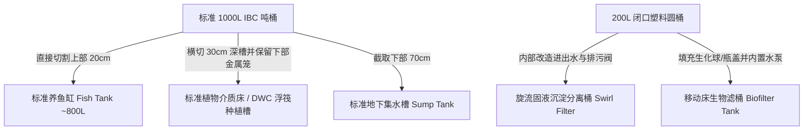
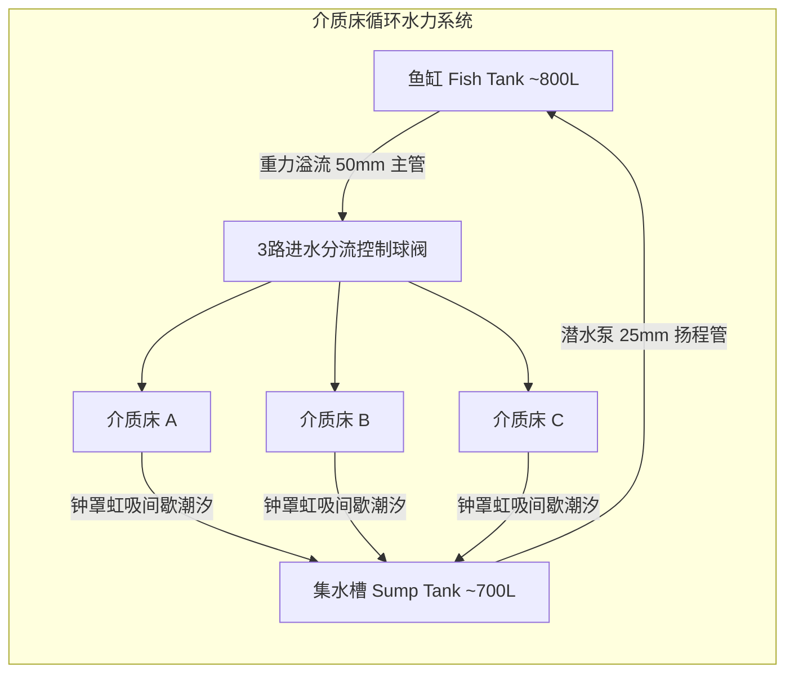
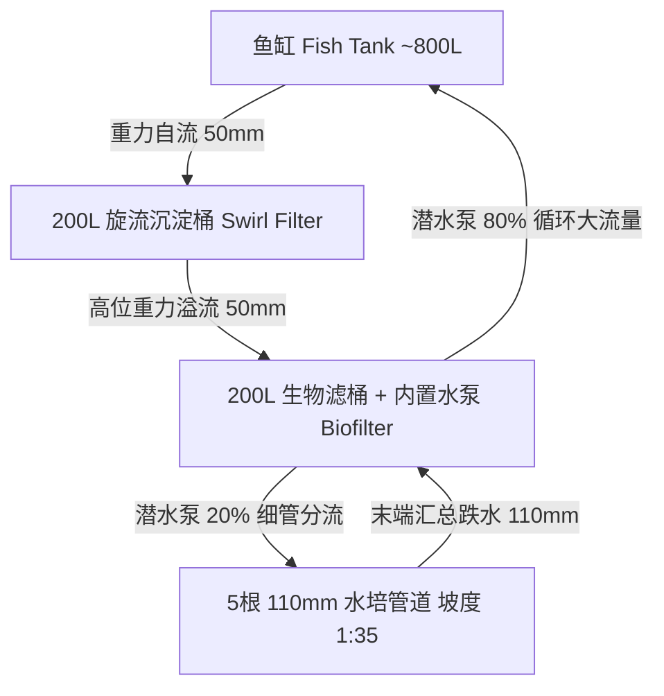
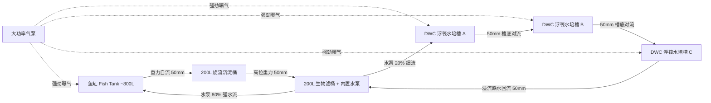

# 附录 8：小型鱼菜共生系统手把手工程搭建指南
> **FAO 渔业与水产养殖技术报告第 589 号**  
> *Small-scale aquaponic food production: Integrated fish and plant farming*  
> 来源：原书第 209–248 页（PDF 第 231–270 页）

---

## 导言与三大标准系统设计原则

本附录是一份详细的手把手（Step-by-step）工程施工与组装实操指南，旨在指导读者如何以最低成本、使用全球广泛易得的标准材料，完整亲手搭建出第 4 章详述的三种典型小型鱼菜共生单元：
1. **介质床单元（The Media Bed Unit）**：全重力/虹吸潮汐式介质床；
2. **营养液膜技术单元（The Nutrient Film Technique / NFT Unit）**：管道水培系统；
3. **深水浮筏培养单元（The Deep Water Culture / DWC Unit）**：连续层流浮筏水培槽。

### 三大系统的关键选材与设计基准
本附录设计的核心衡量原则为：
1. **材料成本（Material Cost）**：选用廉价、标准化的通用工业与民用配件；
2. **材料可获取性（Material Availability）**：全球各地均可轻易采购的五金管件；
3. **生产产能（Production Capacity）**：满足一个 4~5 口之家常年蔬菜与优质鱼蛋白自给自足。

在所有设计中，鱼缸、介质床以及 DWC 水培槽的核心容器均采用**标准中型散装容器（IBC，Intermediate Bulk Container，俗称 1000L / 1 吨白色吨桶）**。IBC 吨桶具有坚固的镀锌钢管外笼框架和食品级高密度聚乙烯（HDPE）内胆，抗紫外线老化性能优异。若当地 IBC 难以获得，可依照第 4 章推荐的安全替代容器（如蓝色塑料圆桶、水泥砌池、重型防水衬垫木箱）予以替换。



---

## 第一部分：全书施工材料与工具索引字典

### 1.1 材料清单总索引（Index of Materials）
> 对应原书表 A8.1（Table A8.1: Index of materials）

| 编号 (ID) | 中文名称 | 英文名称与规格说明 | 典型用途 |
| :--- | :--- | :--- | :--- |
| **1** | **IBC 吨桶** | IBC tank (1000 L, HDPE 内胆带镀锌外笼) | 鱼缸、介质床、集水槽、DWC 槽 |
| **2** | **200L 塑料圆桶** | 200 litre barrel (蓝色大白兰桶) | 旋流沉淀器、生物滤桶 |
| **3** | **遮阳网** | Shade material (遮阳率 50%~70%) | 鱼缸防藻防跳、育苗防护 |
| **4** | **防虫防鸟防跳塑料网** | Plastic netting | 鱼缸防跳、系统防鸟防鼠 |
| **5** | **标准混凝土空心砌块** | Concrete block (标砖或空心水泥砖) | 水平支撑基座、标高垫高垫层 |
| **6** | **防腐木方 / 龙骨板材** | Lumber ($8 \times 1\text{ cm}$ 截面) | 种植床与管道水平承托龙骨 |
| **7** | **潜水循环水泵** | Submersible water pump (额定 $\ge 2000\text{ L/h}$，扬程 $\ge 2.5\text{ m}$) | 系统主水动力心脏 |
| **8** | **环保生态肥皂 / 管件润滑剂** | Ecological soap or pipe lubricant | 橡胶穿墙圈（Uniseal）与管件穿插润滑 |
| **9** | **挤塑聚苯乙烯泡沫板 (XPS)** | Polystyrene sheet (厚度 $3\sim 5\text{ cm}$) | DWC 浮筏板，严禁漏光透光 |
| **10** | **生料带 (PTFE)** | Teflon (plumber's) tape | 螺纹管件密封缠绕防漏 |
| **11** | **耐候尼龙扎带** | Cable ties (重型自锁式扎带) | 管道稳固、气管绑扎、线缆收纳 |
| **12** | **室外防水电气箱** | Electric box (IP65 防水接线盒) | 水泵、气泵电源防雨插座集中保护 |
| **13** | **110mm PVC 排水管** | PVC pipe ($110\text{ mm}$ / 4 英寸) | NFT 种植主管道、虹吸防护外套管 |
| **14** | **50mm PVC 压力/排水管** | PVC pipe ($50\text{ mm}$ / 2 英寸) | 鱼缸溢流管、沉淀器连通管、回流主管 |
| **15** | **75mm 扩口 PVC 管组** | PVC pipe ($75\text{ mm}$) 扩口管 + $75\text{ mm}$ 管帽 + 密封圈 | 钟罩虹吸核心钟罩体（Bell Siphon） |
| **16** | **25mm PVC 供水管** | PVC pipe ($25\text{ mm}$ / 1 英寸) | 虹吸立管、水泵出水硬管、槽间连通管 |
| **17** | **20mm / 25mm PE 软管** | Polyethylene (PE) pipe ($20\text{ mm}, 25\text{ mm}$) | 水泵出水软连接管、微喷微滴供水支管 |
| **18** | **Uniseal® 橡胶密封穿墙圈** | Uniseal® ($50\text{ mm}, 110\text{ mm}$) | 塑料桶弧面快速防漏穿墙密封 |
| **19** | **平面橡胶密封垫圈** | Sealing rubber washer ($50\text{ mm}, 110\text{ mm}$) | 穿墙管件双向夹紧平面防水 |
| **20** | **40转25mm 变径同心大小头** | PVC enlarger / reducer ($40\text{–}25\text{ mm}$) | 钟罩虹吸立管顶端瞬时抽气启动漏斗 |
| **21** | **25mm 内螺纹直通接头** | PVC ($25\text{ mm} \times 1\text{ in}$) female adaptor | 穿墙公丝扣连接转换 |
| **22** | **20mm 外螺纹直通转换接头** | PVC adaptor ($20\text{ mm} \times 3/4\text{ in}$) male | 管件接口转换 |
| **23** | **25mm 转 1寸 内螺纹 90° 弯头** | PVC elbow ($25\text{ mm} \times 1\text{ in}$) female | 虹吸排出口转向接头 |
| **24** | **25mm 转 3/4寸 外螺纹弯头** | PVC elbow ($25\text{ mm} \times 3/4\text{ in}$) male | 管道拐弯连接 |
| **25** | **25mm 转 3/4寸 内螺纹直通** | PVC adaptor ($25\text{ mm} \times 3/4\text{ in}$) female | 阀门适配直通 |
| **26** | **20mm 快插式塑料球阀** | PVC tap "push-on" ($20\text{ mm}$) | NFT 每根分管的微流量调节阀 |
| **27** | **3/4寸 内外丝铜/塑调节球阀** | PVC or metal tap ($3/4\text{ in}$) male-to-female | 各系统排污阀与分水控制阀 |
| **28** | **20L 标准塑料手提水桶** | Bucket ($20\text{ litre}$) | 旋流器中心沉淀内胆桶、洗料桶 |
| **29** | **低功耗交直流电磁气泵** | Air pump ($10\text{–}15\text{ W}$，双孔或四孔出气) | 鱼缸与植物根区强制增氧 |
| **30** | **硅胶微孔输气管** | Air tubing ($4\text{ mm} / 6\text{ mm}$) | 气泵到气石的柔性输气管路 |
| **31** | **空塑料饮料瓶** | Plastic bottle ($1.5\text{–}2\text{ L}$) | 自制简易定植杯或虹吸气压平衡室 |
| **32** | **高温烧结微孔气石** | Air stone (高弥散度蓝/灰刚玉气石) | 水体细微气泡弥散增氧 |
| **33** | **软胶无结捞鱼网** | Fish net (柄长 $\ge 1\text{ m}$) | 鱼类日常健康检查与分拣转移 |
| **34** | **生化过滤填料** | Biofilter medium (K1/生化球/干净波纹瓶盖) | 提供巨大比表面积供硝化细菌附着 |
| **35** | **洗净火山岩 / 膨胀陶粒** | Gravel, volcanic or expanded clay ($8\text{–}20\text{ mm}$) | 介质床栽培基质与物理过滤填料 |
| **36** | **标准水培塑料定植杯** | Net pot ($50\text{ mm}$ 或 $75\text{ mm}$ 径) | 幼苗植入与根系伸展固承 |
| **37** | **50mm PVC 90° 直角弯头** | PVC elbow ($50\text{ mm}$) | 50mm 管路直角转向 |
| **38** | **50mm PVC 等径直通接头** | PVC coupler, straight ($50\text{ mm}$) | 管道直线拼接延长 |
| **39** | **50mm PVC 正三通接头** | PVC connector, T ($50\text{ mm}$) | 溢流水路分流与汇流 |
| **40** | **50mm PVC 专用平头管帽** | PVC endcap / stopper ($50\text{ mm}$) | 管道末端密封截止 |
| **41** | **110mm PVC 90° 直角大弯头** | PVC elbow ($110\text{ mm}$) | NFT 管道回流与连接转向 |
| **42** | **110mm PVC 正三通接头** | PVC connector, T ($110\text{ mm}$) | NFT 管道出水集中回流总管 |
| **43** | **110mm PVC 等径直通接头** | PVC coupler, straight ($110\text{ mm}$) | 种植槽贯穿管快速接头 |
| **44** | **110转50mm 偏心/同心大小头** | PVC reducer ($110\text{–}50\text{ mm}$) | 110mm 回流管收缩转接 50mm 滤桶 |
| **45** | **1寸 B型 PVC 穿墙螺纹法兰座** | PVC barrel connector, B-type ($1\text{ in}$) | 桶壁平面开孔硬密封穿墙件 |
| **46** | **1寸 V型 PVC 穿墙螺纹法兰座** | PVC barrel connector, V-type ($1\text{ in}$) | 介质床/种植槽底部穿孔接头 |
| **47** | **1寸 PVC/黄铜全通径球阀** | PVC or metal tap ($1\text{ in}$) male to female | 介质床各路进水量微调阀门 |
| **48** | **20mm 快插式 90° 弯头** | PVC elbow "push-on" ($20\text{ mm}$) | 细分水管路转角 |
| **49** | **25mm 转 3/4寸 内螺纹 90° 弯头** | PVC elbow ($25\text{ mm} \times 3/4\text{ in}$) female | 管道与水阀转向转接 |
| **50** | **20mm 快插式三通** | PVC connector, T "push-on" ($20\text{ mm}$) | 细分水管路逐级分流 |
| **51** | **110mm PVC 专用管帽** | PVC endcap / stopper ($110\text{ mm}$) | NFT 种植管首尾封口端盖 |
| **52** | **25mm 转 3/4寸 补芯/适配器** | PVC adaptor ($25\text{ mm} \times 3/4\text{ in}$) | 变径连接件 |
| **53** | **25mm 转 1寸 内螺纹三通** | PVC connector, T ($25\text{ mm} \times 1\text{ in}$) female | 槽底串联总管接口 |
| **54** | **25mm PVC 等径弯头** | PVC elbow ($25\text{ mm}$) | 纯 25mm 管道转向 |
| **55** | **25mm PVC 等径三通** | PVC connector, T ($25\text{ mm}$) | 纯 25mm 供水管分叉 |
| **56** | **25mm 转 1寸 外螺纹弯头** | PVC elbow ($25\text{ mm} \times 1\text{ in}$) male | 接口连接 |
| **57** | **25mm 转 3/4寸 内螺纹三通** | PVC connector, T ($25\text{ mm} \times 3/4\text{ in}$) female | 槽间溢流管汇流接口 |

---

### 1.2 施工工具索引（Index of Tools）
> 对应原书表 A8.2（Table A8.2: Index of tools）

1. **劳保耳罩（Ear protection）**：角磨机切割高频噪音防护；
2. **重型防割劳保手套（Work gloves）**：切割镀锌铁架与锋利塑料时防划伤；
3. **护目镜（Safety goggles）**：防止飞溅铁屑和塑料碎屑伤害眼睛；
4. **水平仪（Spirit level）**：校准介质床水平与 NFT 坡度；
5. **卷尺（Measuring tape，5m）**：精准划线放样；
6. **管子钳 / 活动扳手（Pipe wrench / Crescent wrench）**：旋紧各种穿墙接头法兰；
7. **手锯（Hand saw / Hacksaw）**：手工微调 PVC 管截面；
8. **铁锤（Hammer）**：调整框架与垫砖位置；
9. **钢丝钳 / 水泵钳（Pliers）**：紧固扎带与金属卡件；
10. **螺丝刀组（Screwdrivers，十字与一字）**；
11. **手持式充电/插电电钻（Electric drill）**；
12. **阶梯钻头（Conical drill bit / Step drill，0~32mm）**：钻削各类法兰孔；
13. **曲线锯（Jigsaw，配细齿塑料切片）**：快速切割 IBC 塑料内胆；
14. **重型美工刀（Utility knife）**：削平管口毛刺与切割泡沫板；
15. **油性耐水记号笔（Permanent marker）**；
16. **开孔器组（Hole saws，含 25mm, 32mm, 50mm, 57mm, 75mm, 110mm）**；
17. **角磨机（Angle grinder，配金属切片与打磨片）**：切割 IBC 镀锌钢管立柱；
18. **星形内梅花扳手套筒（Star-headed / Torx key，多为 T30/T40）**：拆卸 IBC 顶横梁固定螺栓。

---

## 第二部分：介质床系统单元（Section 1: The Media Bed Unit）



### 2.1 介质床系统物料总表
> 对应原书表 A8.3（Table A8.3: List of items for the media bed unit）

* **基础容器与基建**：IBC 吨桶 3 个；标准混凝土砖 48 块；$8 \times 1\text{ cm}$ 支撑防腐木方 21 米；洗净火山岩/陶粒基质 750 升；遮阳网 2 平方米。
* **动力与电气**：$\ge 2000\text{ L/h}$ 潜水泵 1 台；10W 双孔气泵 1 台；气管 3 米；气石 2 个；防水电气盒 1 个。
* **管件与虹吸组件**：
  * 50mm PVC 管 7.5 米；50mm 90° 弯头 5 个；50mm 直通 6 个；50mm 三通 2 个；50mm 管帽 4 个；
  * 50mm Uniseal 橡胶圈 1 个；1 寸 B 型穿墙接头 3 个；1 寸控水球阀 3 个；
  * **钟罩虹吸管件组（3 套）**：110mm PVC 割槽防护管（长 35cm）3 根；75mm PVC 虹吸钟罩（长 27cm，带扩口顶帽与垫圈）3 个；25mm PVC 虹吸立管（长 16cm）3 根；40转25mm 启动漏斗 3 个；25mm V 型穿墙螺栓 3 套；25mm 转 1 寸内丝弯头 3 个；25mm PE/PVC 排水软硬管 9 米。

---

### 2.2 十二步标准施工工序图解与操作标准

#### 步骤 1：处理鱼缸（Preparing the Fish Tank）
1. 将第 1 个 IBC 吨桶竖直放置，撕去原有所有化学品/工业标签。
2. 用卷尺沿桶身自顶向下测量 $20\text{ cm}$，使用记号笔沿四周画出一整圈水平切割线。
3. 佩戴护目镜与劳保手套，用角磨机先切断外层镀锌钢管网格框架；随后使用曲线锯或角磨机沿线切开塑料内胆。
4. 取出切下的顶部 $20\text{ cm}$ 桶罩（**切勿扔掉，保留打磨平整作为鱼缸遮阳与防跳安全盖**）。
5. 使用无毒生态环保洗洁精或中性肥皂配合温水，使用海绵和高压水枪彻底清洗内壁至少 3 遍，倒置通风干燥 24 小时。

#### 步骤 2：安装鱼缸溢流出水管（Fish Tank Exit Pipe）
1. 在鱼缸侧壁选定出水口位置：自桶顶口向下量取 $12\text{ cm}$，自侧棱向内量取 $12\text{ cm}$，使用记号笔画出中心交叉定位点。
2. 选用 $57\text{ mm}$ 环形开孔锯（Hole saw），低速垂直钻孔，使用美工刀仔细修刮孔壁两面毛刺，确保切口绝对平整光滑。
3. 将 $50\text{ mm}$ Uniseal® 专用密封圈涂抹少量中性肥皂水作为润滑，准确嵌入钻孔中。
4. 取一截长约 $20\text{ cm}$ 的 $50\text{ mm}$ PVC 直管，将插入端管口外缘打磨出 45° 倒角并涂抹肥皂水，用力平推穿入 Uniseal 圈内约 $10\text{ cm}$。密封圈将受挤压严密贴合并锁死管壁，形成耐压防漏密封。
5. 在鱼缸内部的该管端接一个 $50\text{ mm}$ 90° PVC 弯头，向下延伸一根套有防吸鱼网罩的排污吸管（底吸结构），确保能将缸底沉淀残饵与鱼粪抽吸溢流。

#### 步骤 3：鱼缸底部排污阀门改造（Fish Tank Sump Drain）
1. 检查 IBC 底部自带的 2 英寸凸轮锁定（Camlock）或螺纹放水阀门，彻底冲洗阀芯内的工业残留。
2. 缠绕充足的 PTFE 生料带，加装 2 英寸转 1 寸或 3/4 寸活接球阀，以便日后停机排空或冲洗底泥。

#### 步骤 4：利用第 2 个 IBC 制作 2 个标准介质床（Making 2 Media Beds）
1. 观察第 2 个 IBC 的外层镀锌钢管，顶面中间通常有两根加固横梁，使用星形内梅花螺丝刀（Torx T30/T40）拧下固定螺栓并取下横梁。
2. 将塑料内胆自铁笼中整体抽出。
3. 制作第 1、第 2 个介质床（每个床深为严格的 $30\text{ cm}$，这是保证植物根系深度与好氧干湿交替的最佳生理学深度）：
   - 在塑料内胆的顶部和底部，分别自两端边缘向内量取 $30\text{ cm}$，各画出一圈完整水平切割线。
   - 用曲线锯沿着两圈标线平整切开，得到 2 个深度均为 $30\text{ cm}$ 的大托盘（介质床内胆）。中间剩余约 $40\text{ cm}$ 的桶身材料切开作为挡板备用。
4. 用角磨机将对应的 IBC 镀锌铁笼从中央横向切断，修磨锋利切口，重新将切好的 2 个塑料托盘嵌入对应的上下两半金属框架内，形成极高结构强度的种植床单元。
5. 用环保肥皂彻底清洗内壁并沥干。

#### 步骤 5：托架木方安装与水平校准（Support Framing & Leveling）
1. 介质床盛满湿润火山石和水后自重高达 $350\sim 400\text{ kg}$，必须有极其稳固的托底支撑。
2. 准备规格 $8 \times 1\text{ cm}$ 的防腐木方龙骨板：4 根各长 $104\text{ cm}$，1 根长 $42\text{ cm}$，1 根长 $48\text{ cm}$。
3. 将木方龙骨水平铺垫于金属托架与塑料床底之间，防止床底在满载高压下中央下凹变形。
4. **核心红线**：架设完成后，必须使用水平仪在介质床四个边缘和对角线反复检测，**床体必须处于绝对水平状态**。如果床身发生倾斜，会导致床内水位不均，钟罩虹吸管将无法形成瞬间气塞，造成虹吸无法启动或断开。

#### 步骤 6：利用第 3 个 IBC 制作集水槽与第 3 个介质床（Sump Tank & 3rd Bed）
1. 将第 3 个 IBC 竖直放置，自底向上测量 $70\text{ cm}$，画出一圈水平切割线。
2. 用角磨机同时切断钢架立柱与内部塑料内胆。
3. 下半部分（高 $70\text{ cm}$，有效容积约 $700\text{ L}$）作为系统底部的**核心集水槽（Sump Tank）**；
4. 上半部分剩余深度约 $30\text{ cm}$ 的桶胆，按照步骤 4 的方法处理，作为系统的**第 3 个介质床**。

#### 步骤 7：制作并调试钟罩虹吸机构（Bell Siphon Fabrication）
钟罩虹吸是介质床实现全自动“慢进水、快排水”、无需任何电力阀门即达成间歇潮汐（Flood and Drain）的核心机械机构。3 个介质床各配 1 套标准钟罩。

```
                   [ 75mm PVC 密封管帽 (带内胶垫) ]
                   │                             │
                   │  ┌───────────────────────┐  │
                   │  │ 40转25mm 扩口变径漏斗  │  │  <-- 促进满流虹吸瞬间形成
                   │  └──────────┬────────────┘  │
 75mm PVC 虹吸钟罩 │             │ 25mm 立管   │  │
 (长 27cm)         │             │ (长 16cm)   │  │
                   │             │             │  │
    破虹吸进气孔   │ (○) 10mm 孔 │             │  │
 (距底开槽上 1.5cm)│             │             │  │
 底部对向过水缺口  ├───┐       ┌─┴─────────────┴──┼───┐
 ──────────────────┴───┴───────┴───────────────────┴───┴─────────────────
                         介质床 HDPE 底板
 ──────────────────────────────┬───────────────────┬─────────────────────
                               │ 25mm V型穿墙螺栓  │
                               └─────────┬─────────┘
                                         ▼ 排向集水槽
```

1. **制作虹吸钟罩（The Bell）**：
   - 取一截长 $27\text{ cm}$ 的 $75\text{ mm}$ PVC 扩口管。在未扩口的一端底缘，用角磨机对称切出 2 个宽 $1.5\text{ cm}$、高 $2\text{ cm}$ 的方形过水通道口。
   - 在切口上方 $1.5\text{ cm}$ 处的管壁上，用电钻打一个直径为 $10\text{ mm}$ 的圆孔。此孔为**破虹吸气孔（Siphon Break Hole）**；当排水至该高度时空气暴入，立即截断虹吸，防止水被抽干挂死。
   - 在钟罩顶端紧密压入 $75\text{ mm}$ PVC 管帽并衬垫橡胶密封垫圈，做到百分之百气密（若漏气则永远无法形成负压抽吸）。
2. **制作介质防护套管（Media Guard）**：
   - 取一截长 $35\text{ cm}$ 的 $110\text{ mm}$ PVC 管。使用角磨机沿其整个圆周和管长，每隔 $2\sim 3\text{ cm}$ 切出宽约 $5\text{ mm}$ 的纵向密集栅缝。
   - 其作用为永久隔离火山石/陶粒，防止碎石堵塞虹吸钟罩，同时便于日常掀盖检查立管与排障。
3. **安装立管与穿墙件（Standpipe & Bulkhead）**：
   - 在每个介质床底板几何中心两根托底木方之间，用阶梯钻钻出直径 $25\text{ mm}$ 的圆孔。
   - 安装 25mm V 型桶接穿墙件（Barrel connector），平胶垫置于床内侧，两面用力旋紧锁母。
   - 在床内穿墙件上端，垂直插入长 $16\text{ cm}$ 的 $25\text{ mm}$ PVC 立管；在立管顶端套接一个 $40\text{–}25\text{ mm}$ PVC 大小头（变径扩口漏斗）。此漏斗能在水位涨至最高点时，引发薄壁溢流水跌落瀑布效应，极大加速排气并诱发虹吸锁流。
4. **床底出水导流**：
   - 介质床底部穿墙件外端朝下连接 $25\text{ mm} \times 1\text{ in}$ 螺纹直角弯头，接出排水管。将制作好的钟罩套在立管上，外套防护套管。

#### 步骤 8：整体基座砌块堆叠与系统空间定位（Layout & Blocks Positioning）
1. 找平场地，按照图纸预留距离堆叠 48 块标准混凝土空心砖。
2. **集水槽就位**：集水槽置于中央地面最低处，两侧各用 6 块混凝土砖（共 12 块）砌墙夹紧加固，防止水压将塑料槽壁向外胀破膨胀。注意砖块避开侧壁预钻孔。
3. **鱼缸就位**：鱼缸基底垫高约 $15\text{ cm}$（平铺 1 层混凝土砖），使鱼缸高位溢流口自然高于介质床表面，实现全程无动力重力自流。
4. **介质床就位**：3 个介质床分别通过混凝土砖墩架高支撑（床底距地面约 $60\text{ cm}$），悬跨于集水槽两侧与上方，确保介质床底部出水口高于集水槽顶沿，保证出水全程重力跌落回流。

#### 步骤 9：敷设鱼缸至介质床进水分配支管网（Inlet Distribution Manifold）
1. 自鱼缸外壁 $50\text{ mm}$ Uniseal 伸出的出水管，连接 $50\text{ mm}$ 弯头向下，再通过弯头引向介质床上方。
2. 沿介质床边缘架设 $50\text{ mm}$ PVC 供水干管（长约 $150\text{ cm}$ 与 $85\text{ cm}$ 段）。
3. 在对应每个介质床正上方位置，接入 $50\text{ mm}$ 等径三通或弯头。
4. 取 3 个 $50\text{ mm}$ PVC 管帽，中心打 $25\text{ mm}$ 孔，安装 1 寸 B 型穿墙螺栓，外接 1 寸 PVC 调节球阀。将带有球阀的管帽胶粘固定于各支管三通端口。
5. 操作者可通过这 3 个独立球阀，极其灵敏地单独特调流向每个介质床的进水量，使其恰好匹配钟罩虹吸的黄金流量区间。

#### 步骤 10：敷设介质床至集水槽排水管网（Drain Plumbing）
1. **A 床出水**：A 床最靠近集水槽，底端弯头直接连接一根长 $60\text{ cm}$ 的 $25\text{ mm}$ PVC 硬管，直插集水槽侧壁孔洞倾泻入槽。
2. **B 床与 C 床汇流**：B 床与 C 床出水各引出一根长 $70\text{ cm}$ 的管线，通过 25mm PVC 正三通接入总汇流管，一并由集水槽上沿跌水跌入。
3. **跌水增氧设计**：排水管出口严禁深潜入水中，必须悬空高于集水槽液面至少 $15\sim 20\text{ cm}$，利用重力泄水强劲气水卷吸，为集水槽提供充沛的二次被动增氧。

#### 步骤 11：安装循环潜水泵与高位电气盒（Pump & Electrical Installation）
1. 将额定流量 $\ge 2000\text{ L/h}$ 的潜水泵稳固沉放在集水槽底部正中央。
2. 水泵出水口通过 $1\text{ 寸转 }25\text{ mm}$ 螺纹转接头，紧固连接 $25\text{ mm}$ 高强度 PE 输水管。
3. 将 PE 软管直接沿池体拉升接入鱼缸顶端，并牢固绑扎。管路力求顺直，**严禁使用过多 90° 弯头**，以避免扬程沿程水头损失导致流量剧烈衰减。
4. 将防水电气箱（IP65）固定于背阴干燥处的高墙或坚固立柱上，**其标高必须绝对高于全系统所有最高水位线**，防止暴雨喷淋或管道崩脱水淹导致漏电短路。

#### 步骤 12：填装火山石基质、加水试车与虹吸调谐（Filling Media & Commissioning）
1. **试水查漏**：**严禁在未试水前直接倾倒填料！** 先向鱼缸和集水槽灌入清水至运转水位，插电开启水泵试运行 2 小时，全方位检查各个穿墙胶圈、胶合接头和阀门是否存在微渗或漏水。
2. **调试钟罩虹吸**：微调各床进水球阀，观察水位涨落循环。标准状态下，水位上升至距床面 $3\sim 5\text{ cm}$ 时，虹吸应在 $10\sim 20$ 秒内强劲暴发启动，并在 $1.5\sim 3$ 分钟内彻底抽干底水，随后破虹吸气孔吸入空气瞬间切断，进入下一轮储水循环（完整单次潮汐周期宜在 $15\sim 25$ 分钟）。
3. **填料冲洗与铺设**：将 750L 粒径 $8\sim 20\text{ mm}$ 的火山岩或陶粒装入网兜或筛网，用大水反复冲洗去除微尘和粉末，然后平整铺装至 3 个介质床内，填装深度统一为 $28\sim 30\text{ cm}$。
4. 运行 24 小时过滤细微杂质后，进入无鱼加氨养水循环阶段（参见第 5 章）。

---

## 第三部分：营养液膜技术系统单元（Section 2: The NFT Unit）



### 3.1 NFT 系统物料总表
> 对应原书表 A8.4（Table A8.4: List of items for the NFT unit）

* **基础容器与基建**：IBC 吨桶 1 个；200L 蓝色闭口塑料桶 2 个；20L 塑料桶 1 个；标准混凝土砖 32 块；$8 \times 1\text{ cm}$ 木方 8 米；遮阳网 2 平方米。
* **生物填料与栽培配件**：生化球/瓶盖填料 $40\sim 80$ 升；水培定植网杯 80 个；火山石/陶粒 30 升；捞鱼网 1 把。
* **动力与电气**：$\ge 2000\text{ L/h}$ 潜水泵 1 台；10W 气泵 1 台；气管 3 米；气石 2 个；防水电箱 1 个。
* **PVC 管道与关键管件**：
  * **110mm 种植管道**：长 3 米的 110mm PVC 排水管 5 根（总长 15m）；110mm 三通 4 个；110mm 弯头 2 个；110mm 直通 1 个；110mm 管帽 5 个；110转50mm 大小头 1 个；110mm 橡胶圈 20 个；
  * **50mm 过滤连接管**：50mm PVC 管 5 米；50mm Uniseal 穿墙圈 5 个；50mm 弯头 6 个；50mm 直通 4 个；50mm 管帽 1 个；50mm 密封垫圈 8 个；
  * **20mm/25mm 分水主管与支管**：25mm PE 管 8 米；25mm PVC 三通 2 个；$25\text{ mm} \times 3/4\text{ in}$ 内丝弯头 2 个；$20\text{ mm} \times 3/4\text{ in}$ 外丝直通 1 个；20mm PE 管 2 米；20mm 快插三通 4 个；20mm 快插弯头 1 个；20mm 快插控水微调阀 5 个。

---

### 3.2 十四步标准施工工序详解

#### 步骤 1~3：鱼缸与两级过滤桶准备
1. **鱼缸制作**：同介质床单元步骤 1~3，将 1 个 IBC 吨桶上部切除 $20\text{ cm}$，保留 $800\text{ L}$ 净水体，安装高位出水 $50\text{ mm}$ Uniseal 穿墙件。
2. **旋流沉淀桶（Swirl Separator）制作**：
   - 选用第 1 个 200L 蓝桶。用曲线锯平整切开桶顶盖。
   - 在桶壁下部距底 $10\text{ cm}$ 处钻孔，安装一个 $3/4$ 寸排污球阀；
   - 在桶外壁距顶沿 $30\text{ cm}$ 处安装 $50\text{ mm}$ Uniseal，插入 50mm 进水管，并在桶内接一个 90° 弯头**沿切线方向贴壁出水**，使进入的水流产生高速旋转的离心漩涡；
   - 在桶正中心悬吊一个切除底部的 20L 塑料手提桶作为中心防紊流挡板（Stilling well）；
   - 在桶壁距顶 $15\text{ cm}$ 处安装高位出水口，加装防逃逸滤网，接出至生物滤桶。
3. **生物滤桶（Biofilter）制作**：
   - 选用第 2 个 200L 蓝桶，同样切除顶盖；底部加装 $3/4$ 寸排空阀；
   - 填装 $40\sim 80\text{ L}$ 生化球或洗净的塑料波纹瓶盖；
   - 将潜水泵沉入滤桶底部正中央。

#### 步骤 4：两级滤桶间管道重力连通
用 50mm PVC 管和 Uniseal 橡胶圈，将沉淀桶高位溢流口与生物滤桶进水口刚性连通，确保两桶水面保持平衡，水流平顺无阻滞。

#### 步骤 5：砌筑管道支撑架与设定 1:35 黄金坡度
1. 采用 32 块混凝土砖在平整地面上砌筑 3 组砖墩柱（每组 2 根立柱，共 6 根砖墩），两端砖墩间距 $2.5\text{ 米}$。
2. 铺设 8 米 $8 \times 1\text{ cm}$ 防腐木方龙骨作为承重托梁。
3. **核心红线——坡度设定**：
   - 靠近鱼缸端（进水端）龙骨顶面垫高垫片，高出排水端约 $8\sim 9\text{ cm}$；
   - 经水平仪精确测算，保持整根 3 米长种植管形成稳定 **1:30 ~ 1:40（标准 1:35，即约 2.8%）的均匀坡度**；
   - 若坡度太缓（$<1:50$），管内积水变深，丧失营养液“薄膜（Film）”特性，根系缺氧腐烂；若坡度太陡（$>1:25$），流速太快，根系来不及吸收养分且幼苗易被冲倒。

#### 步骤 6~7：110mm PVC 管道打孔与固定
1. 5 根 3 米长 110mm PVC 管道平行排列在木架上，间距保持 $15\text{–}20\text{ cm}$。
2. **打定植孔**：使用卷尺在管顶中心轴线上划线。自一端向内量取 $15\text{ cm}$ 打第 1 个孔，随后**每隔 $20\text{ cm}$ 钻一个定植孔**，每根管开孔 14~16 个，5 根管共计提供约 80 个标准水培定植位点。使用 $50\text{ mm}$ 或 $75\text{ mm}$ 环形开孔锯钻孔，用美工刀清除毛刺。
3. **进水小孔**：在进水端管帽内侧 $7\text{ cm}$ 处的管顶，打一个 $20\text{ mm}$ 进水孔，用于插入供水软管。
4. 使用耐候尼龙扎带将 5 根 PVC 管牢固捆扎锁定在木质龙骨上，防止侧滚位移。

#### 步骤 8：构建末端汇流排水主管（Drain Manifold）
1. 在 5 根管道的低端出水侧，分别安装 110mm 等径三通与 90° 弯头，将 5 路出水横向汇集串联进一根 110mm 集水总管。
2. 集水总管末端加装 $110\text{–}50\text{ mm}$ 偏心大小头变径，引出一根 50mm PVC 回流弯管，悬空伸入生物滤桶上方，利用高位落差跌水复氧冲入生物滤桶。

#### 步骤 9~12：敷设分水管路与 80/20 分流控制
1. 水泵出水口接一根 $25\text{ mm}$ PE 主管，在离开生物桶后接入一个 $25\text{ mm}$ 正三通。
2. **80/20 水力分配原则**：
   - **80% 主循环流量**：三通直行支路由 $25\text{ mm}$ 管直接打入鱼缸，并在鱼缸管端安装控制阀和射流混气嘴，为鱼缸提供强劲的水体翻滚和高溶氧；
   - **20% 水培分流流量**：三通侧向分支接入变径接头，引向 20mm PE 软管分配歧管。
3. 在 5 根 NFT 管道上方架设 20mm 分配干管，对应每根管道入口安装一个 20mm 快插微调球阀，阀后伸出细软管插入 110mm 管道顶部的 $20\text{ mm}$ 进水孔。
4. 调节微调阀，使**每根 NFT 管内的水流速度精确恒定在 $1\sim 2\text{ L/min}$**（在管底形成厚度仅几毫米的薄水层）。

#### 步骤 13~14：定植杯制作与闭水系统调试
1. 制作定植杯：在塑料网杯底部垫放数粒火山石，或使用 50mm PVC 短套管自制，装入洗净陶粒固定幼苗根须。
2. 全系统注水测试，检查旋流器旋转分离状态、生物球充氧沸腾状态，以及 NFT 管底水膜流动态势。

---

## 第四部分：深水浮筏系统单元（Section 3: The DWC Unit）



### 4.1 DWC 系统物料总表
> 对应原书表 A8.5（Table A8.5: List of items for the DWC unit）

* **基础容器与基建**：IBC 吨桶 3 个（1 个做鱼缸，2 个切成 3 个标准水培长槽）；200L 蓝色滤桶 2 个；20L 手提桶 1 个；混凝土砖 40 块；$8 \times 1\text{ cm}$ 木方 8 米；遮阳网 2 平方米。
* **浮筏与栽培辅件**：挤塑聚苯乙烯泡沫板（XPS，厚度 $3\sim 5\text{ cm}$）3 平方米；定植网杯 80 个；陶粒 30 升。
* **动力与曝气核心**：$\ge 2000\text{ L/h}$ 潜水水泵 1 台；**大排量气泵 1~2 台（总功率 $\ge 15\text{–}20\text{ W}$，配 4~6 独立出气孔）**；气管 10 米；高弥散度气石 4~6 个。
* **管网与配件**：50mm PVC 管道 2 米；50mm Uniseal 穿墙圈 5 个；50mm 弯头 6 个；50mm 直通 5 个；50mm 管帽 1 个；50mm 平面胶垫 10 个；$3/4$ 寸外丝阀门 4 个；1 寸外丝球阀 1 个；25mm PVC 管 0.9 米；25mm PE 软管 8 米；配套三通、内丝弯头与变径若干。

---

### 4.2 十一步标准施工工序详解

#### 步骤 1~4：鱼缸、双级滤桶与 3 个 DWC 种植槽制作
1. **鱼缸制作**：同前，利用第 1 个 IBC 制作深 $80\text{ cm}$ 的标准鱼缸。
2. **两级滤桶制作**：同 NFT 单元步骤 2~3，制作 200L 旋流沉淀器与 200L 移动床生物滤桶。
3. **制作 3 个 DWC 种植水槽**：
   - 取第 2 和第 3 个 IBC 吨桶，按照介质床的做法，分别切下 3 个深度均为 $30\text{ cm}$ 的金属包边塑料长槽（每个长宽 $1.2\text{ m} \times 1.0\text{ m}$，有效水深约 $25\text{ cm}$，容水量约 $300\text{ L}$，3 槽总有效水培水体近 $900\text{ L}$）。
4. **砌筑基台就位**：
   - 在平整地面使用 40 块混凝土砖，砌筑标高统一的支撑基座，铺设木龙骨，将 3 个 DWC 槽一字排开或 L 型紧凑摆放；
   - **核心红线**：3 个水槽必须调在**同一个绝对水平面**上，防止槽与槽之间因高差导致末端水槽漫顶溢流。

#### 步骤 5~7：槽间底部对流管道与排污系统安装
1. **安装槽底排污阀**：在每个 DWC 槽底板最低处，使用阶梯钻钻孔安装一个 25mm 穿墙接头，外接一个 $3/4$ 寸球阀，用于定期排空底层沉积的微量植物细根与老旧沉积物。
2. **槽间大通径串联连通管**：
   - 在槽 A 与槽 B 相对的侧壁靠下位置（距底约 $8\text{ cm}$ 处），使用 57mm 开孔器钻孔，加装 50mm Uniseal 密封圈，穿入一截 50mm PVC 短管将两槽刚性串联；
   - 同样在槽 B 与槽 C 之间安装 50mm 连通管；
   - 采用底部大通径低位连通，可迫使水流在槽内形成由表及里的立体推流，避免死水区停滞。
3. **C 槽末端出水回流**：在槽 C 侧壁标高 $25\text{ cm}$ 处安装 50mm 溢流穿墙管，出水管以大斜度延伸回流跌入生物滤桶。

#### 步骤 8：敷设水泵分流系统（80/20 比例）
1. 生物滤桶内的潜水泵接出 25mm PE 主管，通过三通分流：
   - 80% 流量回冲鱼缸，维系高换水率；
   - 20% 流量引入 DWC 第一个种植槽（槽 A）前端。
2. 缓慢的进水（约 $2\sim 4\text{ L/min}$）使整个近千升的 DWC 水培区保持极其宁静平稳的层流水环境，极利于植物根系向四周均匀舒展延伸。

#### 步骤 9：敷设超强曝气气石网络（Aeration Grid）
> [!IMPORTANT]
> **DWC 系统的绝对成败关键——水培槽曝气**  
> DWC 水槽深度达 $25\text{ cm}$ 且水流极缓，若溶氧不足，根系将在 24~48 小时内发生大面积无氧呼吸而黑根腐烂窒息。
1. 将大功率电磁气泵固定在干燥高位。
2. 使用气管分支器将输气管分出 4~6 路：
   - 鱼缸内投入 1~2 个大流量气石；
   - **每个 DWC 种植槽底部分散布置至少 1~2 个大气量气石**，并用扎带绑小石块沉底。
3. 开启气泵，确保每个槽内气泡翻滚密集成幕，保持水体溶氧稳定达到饱和极限（$\text{DO} \ge 5\sim 6\text{ mg/L}$）。

#### 步骤 10：精准裁切与打孔制作聚苯乙烯浮筏（Making the Rafts）
1. **板材选用**：选用厚度 $3\sim 5\text{ cm}$ 的**高密度挤塑聚苯乙烯泡沫板（XPS）**。XPS 板密度高、吸水率极低、浮力强劲且不透光。
2. **尺寸裁剪**：按照水槽内口净尺寸（约 $118\text{ cm} \times 98\text{ cm}$），将泡沫板裁切成略小 $1\sim 2\text{ cm}$ 的规整矩形板，确保浮筏能在水槽内自由随液面升降，无任何卡边卡滞。
3. **钻削定植孔**：
   - 在泡沫板表面画出 $20\text{ cm} \times 20\text{ cm}$ 的均匀方格网；
   - 使用与水培定植杯外径精准匹配的环形开孔锯（通常为 $50\text{ mm}$），在网格交叉点钻孔，每块板打孔 24~28 个，3 块浮筏总计容纳约 80 棵蔬菜。
4. **彻底遮光防藻原则**：浮筏边缘若有微小间隙，必须用黑色遮光膜或边角料封盖。水体一旦见光，单细胞绿藻会暴发性滋生，与蔬菜争夺养分并恶化根区环境。

#### 步骤 11：全系统灌水排漏、气流核验与定植试车
1. 向鱼缸、旋流桶、生物桶和 3 个 DWC 槽灌满清水，仔细检查槽间 50mm 穿墙管及各底部排污阀门；
2. 启动水泵与气泵，观察 DWC 3 槽水位差（正常推流下两槽间水头差应 $<5\text{ mm}$）；
3. 将植有生菜或甘蓝幼苗的定植杯卡入浮筏孔洞，确保杯底浸入水中约 $1\sim 2\text{ cm}$，完成搭建。

---

## 第五部分：三大系统施工排障与核心工艺红线

### 5.1 现场施工排障矩阵（Troubleshooting Common Construction Issues）

| 异常现象 | 物理根源剖析 | 现场补救与标准化处置措施 |
| :--- | :--- | :--- |
| **Uniseal 穿墙处持续渗水** | ① 钻孔边缘毛刺未削净；<br>② 开孔偏心或孔径偏大；<br>③ 穿插管壁未倒 45° 角导致撕裂胶圈 | 拔出 PVC 管，检查胶圈是否破损割伤；使用细砂纸打磨孔缘至完全光滑；换新胶圈并涂抹中性润滑肥皂水重新推入。 |
| **螺纹接口微量滴漏** | ① PTFE 生料带缠绕圈数不足或缠绕方向顺倒；<br>② 垫圈偏移压扁 | 拆卸管件，彻底清理旧胶带；沿螺纹顺时针方向紧密缠绕 15~20 圈 PTFE 生料带，重新用管钳紧固。 |
| **钟罩虹吸无法启动（水满溢流）** | ① 进水流量过小，未达启动临界值；<br>② 立管顶部变径漏斗未装或高度过低；<br>③ 钟罩顶盖漏气无法形成真空气锁 | 调大进水球阀流量；确保立管顶部安装 40转25mm 变径漏斗；在 75mm 顶盖内缘补打中性防霉硅酮密封胶。 |
| **钟罩虹吸无法断开（持续抽吸）** | ① 进水流量过大，超过立管排空通量；<br>② 破虹吸孔直径太小（$<8\text{ mm}$）或被碎石杂质堵塞；<br>③ 介质床排水管末端深潜入水中形成水封阻碍进气 | 微调关小进水球阀；扩大钟罩侧下方的破虹吸进气孔至 $10\text{ mm}$；将床底排水管端抬高离开集水槽水面至少 $15\text{ cm}$。 |
| **NFT 管道某处溢水/死水** | ① 支撑木方龙骨下垂；<br>② 坡度不均匀（部分路段反坡或积水） | 重新使用水平仪核准全线坡度，在下沉部位砖墩上垫入木质或塑胶硬垫片，使整根管保持平滑向下的 1:35 坡度。 |
| **DWC 水培槽边缘漏水溢流** | 槽与槽之间连通管孔径偏小（$<40\text{ mm}$），水力阻力大导致槽间产生较大壅水水头差 | 扩孔更换为通径 $\ge 50\text{ mm}$ 的连通短管，或将水泵分流入水槽的进水阀适当关小。 |

---

### 5.2 施工八大安全与工艺铁律（Golden Engineering Rules）

> [!CAUTION]
> 1. **严禁使用盛装过有毒工业化学品、农药、溶剂或石油类废旧 IBC 桶**：内胆材料具有微孔吸附性，任何化学渗透均会永久性杀死硝化细菌、致死鱼类并富集于蔬菜。必须使用食品级原装桶（如运输糖浆、果汁、食用油）。
> 2. **角磨机操作必须佩戴全封闭护目镜与劳保手套**：切割 IBC 镀锌铁笼钢管时火星剧烈，金属薄片极易反弹伤人。
> 3. **电气设备必须架设在全系统最高水线之上并配置漏电保护器（RCD/GFCI）**：凡浸水水泵与气泵电源必须配备灵敏度 $30\text{ mA}$ 的漏电断路器，电源线留出防雨滴弯弧，严防水流顺线渗入插座。
> 4. **火山岩/陶粒在入床前必须彻底用筛网冲洗去除微尘**：未冲洗的粉尘会瞬间将全系统染成红褐色，堵塞水泵叶轮、划伤鱼鳃致窒息并污染滤棉。
> 5. **介质床支撑结构必须达到抗剪与抗倾覆安全标准**：单个满载介质床自重接近半吨，严禁直接悬空搁置在单块未经支撑的空心砖上。
> 6. **PVC 供水管件胶粘后必须静置通风固化至少 24 小时**：胶水内含有挥发性强溶剂（如丁酮、四氢呋喃），过早通水会使溶剂溶入水体导致鱼类中枢神经中毒死亡。
> 7. **DWC 浮筏必须完全遮光封严**：任何漏光逢隙均会诱发绿藻暴发，降低夜间水体溶氧并使根系窒息。
> 8. **所有带切口的金属与硬质塑料管口必须用角磨片或美工刀刮除锋利毛刺**，防止操作割伤与刺破橡胶密封件。
