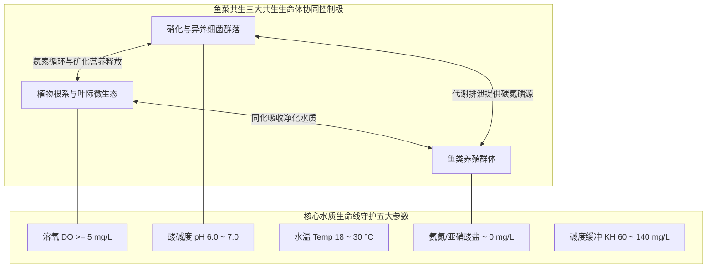

# 第 15 卷：全书速查参考折页与现场操作红线备忘卡
> **FAO 渔业与水产养殖技术报告第 589 号**  
> *Small-scale aquaponic food production: Integrated fish and plant farming*  
> 来源：原书第 249–266 页（PDF 第 271–288 页）  
> 文档属性：**农场现场张贴备忘卡 / 随身速查工程折页 / 运维应急排障掌上宝典**

---

## 模块导读与速查折页使用说明

本分卷是粮农组织（FAO）为全球基层农技推广员、农场主及家庭自给自足种植者定制的**高浓度速查核心知识提炼折页（Quick-Reference Handout）**。它将整本 288 页手册中最核心的技术参数、计算公式、控制阈值、物料平衡逻辑以及日常巡检流程高度压缩浓缩，非常适合打印覆膜后张贴于鱼菜共生大棚温室墙面或泵房配电箱旁，作为每日巡查与突发水质危机处置的标准化作业指导书（SOP）。



---

## 第一部分：鱼菜共生核心优势与局限性对照速查

### 1.1 核心优势（Benefits of Aquaponic Food Production）
1. **水资源极端节约**：仅消耗传统土壤农业用水量的 **$10\%\sim 20\%$**（全闭环循环，水体仅因植物蒸腾与蒸发少量损失）。
2. **零化学肥料依赖**：鱼类排泄物与未食饲料经细菌高效生物矿化，提供植物所需的绝大部分宏量与微量矿质元素。
3. **彻底杜绝化学合成农药与除草剂**：水体中游动着对杀虫剂极其敏感的活鱼，倒逼系统全生命周期实施严格的物理防虫与生物防治（IPPM），保障农产品达到超有机安全级。
4. **单位面积双重丰产**：同一占地面积上协同收获高品质淡水鱼蛋白与有机新鲜果蔬。
5. **打破土地贫瘠限制**：可建于干旱荒漠、盐碱地、海岛、城市楼顶或硬质水泥硬化地面。
6. **人体工效学与劳动强度极低**：免去翻耕土地、除草、土壤熏蒸消毒等重体力劳动，架高种植床大幅减轻腰椎疲劳。

### 1.2 潜在局限与工程挑战（Weaknesses & Challenges）
1. **初期一次性资本投入较高**：需要购置鱼缸、管阀配件、循环水泵、曝气气泵及温室结构。
2. **跨学科复合知识门槛**：操作者必须同时理解水产养殖学（鱼病与水质）、水培农艺学（缺素与光温湿）以及环境微生物学（硝化动力学）。
3. **极高电力连续性依赖**：断电停泵或停气会在数小时内引发鱼群缺氧浮头与硝化细菌活性暴跌，必须配备断电报警与备用发电/光伏系统。
4. **营养配比调和妥协性**：单一水体必须同时照顾鱼（偏好 pH 6.5~8.0）、植物（偏好 pH 5.5~6.5）和细菌（偏好 pH 7.2~8.2），全系统必须常年精准锚定于 **pH 6.0~7.0** 这一三方动态妥协平衡狭窄窗口。

---

## 第二部分：技术导论与三大系统类型速查

### 2.1 鱼菜共生技术基石（Technical Foundations）
* **物质流本质**：投入唯一的外部能量和营养载体——**高品质全价鱼饲料**；
* **能量转化**：鱼类摄入饲料，约 $30\%\sim 40\%$ 转化为鱼体生物量增重，剩余 $60\%\sim 70\%$ 作为代谢废弃物排出（粪便固废及鳃部排氨）；
* **微生物中枢**：异养菌将固废矿化水解为可溶态营养盐；自养硝化菌将高毒性游离氨分两步氧化为低毒硝酸盐；
* **植物同化吸收**：植物根系泵吸吸收硝酸盐及矿物质，洁净水体重新流回鱼池，完成无限内循环。

### 2.2 三大典型水培架构快速选型对比

| 系统类型 | 核心构造与适用场景 | 机械过滤需求 | 空间产出比 | 根区供氧机制 |
| :--- | :--- | :--- | :--- | :--- |
| **介质床（Media Bed）** | 深 30cm 火山岩/陶粒床，配备钟罩虹吸（潮汐排灌）。最适家庭、初学者、各类果菜与根茎作物。 | 填料床自备强大物理过滤与矿化功能，**无需额外生化滤桶**。 | 适中（承重大，需坚固支撑架）。 | 潮汐落水抽吸空气入床，根系干湿交替，自然复氧极其优异。 |
| **管道薄膜（NFT）** | 110mm PVC 管微倾斜（坡度 1:35），水流呈 1~2 毫米薄层流过。最适生菜、草莓及小型香草。 | **极高要求**：必须配备高效旋流分离器与沉淀桶，防止微细固废堵塞管底。 | 极高（自重极轻，可立体垂直多层架设）。 | 水流极薄露出根冠接触空气，但高温期管内根系极易缺氧。 |
| **深水浮筏（DWC）** | 深度 25~30cm 水槽，泡沫浮筏漂浮。最适商业化大规模高密度叶菜生产。 | **极高要求**：水体流动缓慢，必须前端拦截固废，防止水槽底泥厌氧发酵。 | 高（长周期水质缓冲容量巨大，抗外部扰动能力最强）。 | **完全依赖大功率气泵强力曝气**，气石遍布全槽，维持 $\text{DO}\ge 5\text{ mg/L}$。 |

---

## 第三部分：水质五大核心参数黄金基准矩阵

```
      【pH 黄金妥协窗口】
  植物最爱 (5.5 - 6.5)  <===[ 6.0 ~ 7.0 黄金窗口 ]===> 硝化细菌最爱 (7.5 - 8.2)
                                 ▲
                             鱼类可耐受
```

### 3.1 水质参数目标控制标准与检测周期表

| 检测指标 | 理想目标值 | 极限耐受红线 | 检测频率 | 偏离后果与应急调控措施 |
| :--- | :--- | :--- | :--- | :--- |
| **pH** | **$6.0\sim 7.0$** | $<5.5$ 或 $>8.0$ | **每周 1~2 次** | 偏低导致硝化崩溃；偏高导致铁/磷/锰全面沉淀锁死。<br>• **升碱补酸**：加碳酸氢钾 $\text{KHCO}_3$ 或氢氧化钙 $\text{Ca(OH)}_2$；<br>• **酸化降碱**：补雨水稀释或微量点滴食品级稀磷酸 $\text{H}_3\text{PO}_4$。 |
| **水温 (Temp)** | **$18\sim 30^\circ\text{C}$** | 依鱼种而定（罗非 $\ge 15^\circ\text{C}$，虹鳟 $\le 21^\circ\text{C}$） | **每日 1 次** | 温度剧烈波动压抑鱼类摄食，超出耐受范围直接致死。根据四季温标合理选配温带/热带鱼菜组合。 |
| **溶解氧 (DO)** | **$5\sim 8\text{ mg/L}$** | 鱼缸 $<3\text{ mg/L}$ 即刻窒息 | **连续监控 / 每日早晨** | 低溶氧导致鱼群浮头、细菌反硝化硫化氢中毒、根系黑腐。加装大功率文丘里射流嘴并开启全部气石。 |
| **总氨氮 (TAN)** | **$0\sim 0.5\text{ mg/L}$** | $>1.0\text{ mg/L}$（尤其高 pH 下） | **建缸初期每天；稳定后每周** | 游离分子氨破坏鳃小片与神经系统致死。<br>• **急救**：立即停食！紧急换水 $1/3$ 并加粗盐；降低 pH。 |
| **亚硝酸盐 ($\text{NO}_2^-$)** | **$0\sim 0.2\text{ mg/L}$** | $>1.0\text{ mg/L}$ | **建缸初期每天；稳定后每周** | 形成高铁血红蛋白引发鱼类“褐血病”窒息。<br>• **急救**：加粗盐（维持 $\text{Cl}^- \ge 100\text{ mg/L}$ 竞争拮抗），增氧。 |
| **硝酸盐 ($\text{NO}_3^-$)** | **$5\sim 150\text{ mg/L}$** | $>300\sim 400\text{ mg/L}$ | **每周 1 次** | 蔬菜核心氮源。$<5\text{ mg/L}$ 植株发黄长势停滞；$>150\text{ mg/L}$ 说明植物过少，需补种叶菜或部分换水稀释。 |
| **碳酸盐硬度 (KH)** | **$60\sim 140\text{ mg/L}$** ($\approx 3\sim 8^\circ\text{dKH}$) | $<40\text{ mg/L}$ | **每周 1 次** | 水体酸度缓冲堤坝。硝化产酸会持续消耗碱度，低于 $40\text{ mg/L}$ 时会诱发突发性“pH 崩盘（Crash）”。需定期补碱。 |

---

## 第四部分：细菌微生态与生化开缸速查

### 4.1 硝化作用两步生化反应方程式
$$1)\quad 2\text{NH}_4^+ + 3\text{O}_2 \xrightarrow{\text{氨氧化菌 AOB (Nitrosomonas)}} 2\text{NO}_2^- + 4\text{H}^+ + 2\text{H}_2\text{O} + \text{能量}$$
$$2)\quad 2\text{NO}_2^- + \text{O}_2 \xrightarrow{\text{亚硝酸盐氧化菌 NOB (Nitrobacter)}} 2\text{NO}_3^- + \text{能量}$$

> **三大生态认知铁律**：
> 1. **每氧化 $1\text{ g}$ 氨氮，需消耗约 $4.3\text{ g}$ 纯氧**，硝化生物滤池是全系统仅次于鱼缸的最大耗氧大户；
> 2. **每氧化 $1\text{ g}$ 氨氮，需消耗约 $7.14\text{ g}$ 碳酸钙当量的碱度（$\text{CaCO}_3$）**，系统天然具有不可逆的持续酸化倾向；
> 3. **硝化菌群具有强烈的厌光性**，强烈的紫外线辐射可在数小时内灭活菌群，生物过滤桶必须做避光密封遮蔽。

### 4.2 无鱼开缸（Fishless Cycling）四阶段生命体征指标

```
 浓度 (mg/L)
   ▲
 5 │        [1. 氨氮峰值]
 4 │          /\                 [2. 亚硝酸盐峰值]
 3 │         /  \                      /\
 2 │        /    \                    /  \               [3. 硝酸盐持续累积]
 1 │       /      \                  /    \             /─────────────────
 0 └───┬──┴────────┴─────────────┬──┴──────┴───────────┴─────────────► 时间 (天)
      第 0 天                 第 10~15 天           第 25~35 天 (正式进鱼放苗)
```

1. **第 1~5 天（点火期）**：向水体加入无毒氨源（如工业氯化铵、纯氨水或鱼饲料发酵液），维持水体 $\text{TAN} \approx 2\sim 3\text{ mg/L}$，水泵气泵全开连续运转；
2. **第 6~15 天（AOB 增殖期）**：氨氮开始断崖式下降，亚硝酸盐指标急剧飙升至 $5\sim 10\text{ mg/L}$ 以上；
3. **第 16~28 天（NOB 爆发期）**：亚硝酸盐达到最高峰后开始快速跌落，硝酸盐测试液首次出现鲜红色浓重反应；
4. **第 28~35 天（成熟平稳期）**：**氨氮与亚硝酸盐双双归零（$<0.2\text{ mg/L}$）**，且 24 小时内能将新加入的 $2\text{ mg/L}$ 氨氮完全转化为硝酸盐——开缸圆满成功，即可分批安全投放目标鱼苗和蔬菜定植！

---

## 第五部分：植物营养生理、缺素诊断与阶梯种植排期

### 5.1 六大微量与常量营养元素速查诊断与安全补肥指南

| 缺乏元素 | 典型表型生理病症 | 鱼菜系统安全矫正补剂与实操方法 | 严禁使用的危险物质 |
| :--- | :--- | :--- | :--- |
| **铁 (Fe)** | **新叶叶肉失绿黄化**，叶脉保持翠绿（网状失绿明显）。光合作用受阻。 | **EDDHA 螯合铁**（最适 pH 6~8 碱性弱碱性水体）或 DTPA 螯合铁，按 $1\sim 2\text{ mg/L}$ 浓度月度追施。 | 严禁使用未螯合的硫酸亚铁（在 pH>6.5 时迅速氧化沉淀失效）。 |
| **钾 (K)** | **老叶叶缘焦枯灼伤卷曲**，果实坐果差、膨大受阻。 | **碳酸氢钾 ($\text{KHCO}_3$)** 或硫酸钾 ($\text{K}_2\text{SO}_4$)；同时兼顾补碱缓冲。 | 严禁使用氯化钾（$\text{KCl}$，高氯毒性伤害部分敏感蔬菜）。 |
| **钙 (Ca)** | **生长点坏死、幼叶畸形皱缩**；番茄/辣椒果实底部发生**脐腐病（Blossom-end rot）**。 | **氢氧化钙 ($\text{Ca(OH)}_2$)**、氯化钙叶面喷施或系统内补充生石灰水/浸泡蛋壳。 | 严禁使用硝酸钙过量追施（导致水体硝态氮暴涨失衡）。 |
| **镁 (Mg)** | **老叶叶脉间失绿发黄**，向叶心扩展，严重时出现紫红色斑块。 | **泻盐（Epsom salt，七水硫酸镁 $\text{MgSO}_4\cdot 7\text{H}_2\text{O}$）**，按 $5\sim 10\text{ g/m}^3$ 补入。 | — |
| **磷 (P)** | **叶片暗绿无光泽，茎秆和老叶背面呈现异常紫红色**，根系发育极弱。 | 拔节开花期微量补加**食品级磷酸二氢钾 ($\text{KH}_2\text{PO}_4$)** 或稀释稀磷酸调酸。 | 严禁直接使用工业粗制过磷酸钙。 |
| **微量元素** | 顶芽簇生、枯顶、落花落果（缺硼/锌/铜/锰）。 | 全系统根灌或叶面喷洒**高品质海藻多糖提取液（Seaweed Extract）**。 | 严禁使用重金属超标的工业复合微肥。 |

---

### 5.2 阶梯式轮作与分级采收排期模型（Staggered Planting Schedule）
为避免整套系统一次性采收导致植物对硝酸盐的吸收陡降、引发硝态氮暴涨和系统生态失衡，必须强制执行**梯度分期排期（Staggered Production）**。

以常见奶油生菜（生长周期 4 周，单周收获量 25 棵/周）为例：
* **定植床位分区**：按 $1\text{ m}^2$ 容纳 25 棵标准密度，共设 4 个独立的 $1\text{ m}^2$ 种植单元（总面积 $4\text{ m}^2$，总容纳 100 棵生菜）。
* **每周滚动节拍**：
  * **第 1 周**：在单元 A 移栽入 25 棵新出叶幼苗；
  * **第 2 周**：在单元 B 移栽 25 棵新幼苗（单元 A 处于旺长期）；
  * **第 3 周**：在单元 C 移栽 25 棵新幼苗；
  * **第 4 周**：在单元 D 移栽 25 棵新幼苗；
  * **第 5 周及以后**：采收单元 A 达到商品规格的 25 棵成熟生菜，当日立即消毒补种 25 棵新苗；循环轮替，**实现每周 365 天无间断恒定产出，全系统水体营养吸收曲线绝对平滑恒定**。

---

## 第六部分：水产动物养殖与投饵平衡计算尺

### 6.1 黄金投饵比率核心计算公式（Feed Rate Ratio）

$$\text{每日最佳总投饵量 (g/天)} = \text{植物总种植净面积 } (\text{m}^2) \times \text{单位面积设计投饵比率 } (\text{g/m}^2/\text{天})$$

* **叶菜类蔬菜（生菜、小白菜、芹菜、芝麻菜、罗勒）**：
  $$\text{投饵基准} = \mathbf{40\sim 50\text{ g 饲料 / m}^2 / \text{天}}$$
* **果菜类蔬菜（番茄、黄瓜、甜椒、西葫芦、茄子）**：
  $$\text{投饵基准} = \mathbf{50\sim 80\text{ g 饲料 / m}^2 / \text{天}}$$

### 6.2 存塘鱼类生物量与反推核算
标准成鱼日常平均摄食率约为自身体重的 $1\%\sim 2\%$。  
若系统拥有 $4\text{ m}^2$ 生菜床：
$$\text{每日所需饲料量} = 4\text{ m}^2 \times 50\text{ g/m}^2/\text{天} = 200\text{ g/天}$$
$$\text{系统所需健康鱼类存塘总重 (Biomass)} = \frac{200\text{ g}}{1.5\%} \approx 13.3\text{ kg}$$
若单个成鱼规格为 $500\text{ g}$，则 $1000\text{ L}$ 鱼缸内宜长期维持约 **$25\sim 30$ 尾成鱼**（养殖密度约 $13\sim 15\text{ kg/m}^3$，处于家庭鱼菜共生系统低应激、零风险的最佳黄金安全负荷区间）。

### 6.3 鱼类饲喂黄金五准则
1. **配合饲料全价性**：必须选用正规大厂浮水性膨化颗粒饲料；杂食性鱼类（罗非鱼、鲤鱼）饲料粗蛋白含量宜在 **$30\%\sim 32\%$**；肉食性鱼类（虹鳟、鲈鱼）粗蛋白宜在 **$40\%\sim 45\%$**。
2. **30 分钟净料红线**：投喂后 30 分钟内未吃完的残饵，**必须全部用细网捞出并称重剔除**。残饵在水中泡解会在数小时内滋生腐败异养菌，引发氨氮和硫化氢致命暴雷。
3. **低温与应激断食原则**：水温低于 $15^\circ\text{C}$ 或极端高温超过 $32^\circ\text{C}$，以及水质突变、换水、移箱分拣前后 24 小时内，必须严格全天停食。
4. **饱食度观察法**：健康鱼群在投料时应上浮抢食翻水。若鱼群沉底不抢食、聚集于出水口或浮头喘气，即为严重中毒或缺氧险情，立即停食检测水质。
5. **分级阶梯放苗**：每隔 3~4 个月补放一批幼苗，分箱饲养，避免大鱼欺小鱼，维持常年稳定的饲料转化与排泄输入。

---

## 第七部分：成功运营鱼菜共生系统的十大管理戒律

> [!IMPORTANT]
> ### 粮农组织（FAO）鱼菜共生系统十大成功金律（Ten Key Guidelines）
> 1. **每日巡视，敏锐感知（Observe and monitor the system every day）**：每天早晨用几分钟仔细观察鱼的游姿摄食冲力、植物叶片挺拔度及水流声，绝大多数隐患均可在爆发前被肉眼识别。
> 2. **水泵与气泵双重生命线保障（Ensure adequate aeration and water circulation）**：坚持循环不息，确保水流顺畅；配置备用电磁气泵与逆变器电池应急保障。
> 3. **死守核心水质参数（Maintain good water quality）**：
>    $$\text{pH 6.0~7.0} \quad\Big|\quad \text{DO} \ge 5\text{ mg/L} \quad\Big|\quad \text{TAN} < 1\text{ mg/L} \quad\Big|\quad \text{NO}_2^- < 1\text{ mg/L} \quad\Big|\quad \text{NO}_3^- \text{ 5~150 mg/L}$$
> 4. **因地制宜，顺应节气时令（Choose fish and plants according to seasonal climate）**：夏季选养热带罗非鱼配空心菜、罗勒、木耳菜；冬季转养冷水耐寒加州鲈、虹鳟配耐寒生菜、菠菜、甘蓝。
> 5. **克制密度，切忌贪多挤压（Do not overcrowd the fish tanks）**：家庭与初级系统养殖密度严控在 **$\le 20\text{ kg} / 1000\text{ L}$** 净水体以内，给水体留出足够的生态容错缓冲空间。
> 6. **坚决杜绝过度投喂（Avoid overfeeding, remove uneaten food in 30 min）**：少食多餐，严控投喂量，决不允许残饵在缸底过夜沉积腐烂。
> 7. **坚决及时清除固废与遮光防藻（Remove solid wastes, keep tanks clean and shaded）**：定期排空旋流沉淀器与过滤桶底泥；为鱼缸和管道彻底遮阳，剥夺藻类光合能量。
> 8. **动态平衡鱼、菌、菜三者体量（Balance the number of plants, fish and biofilter）**：严格依照投饵比率匹配种植面积与生化填料体积，不可随意单边扩大某一环节。
> 9. **分期定植与分期捕捞（Stagger harvesting and restocking）**：保证系统全周期恒定吸氮与恒定排氨，杜绝大起大落的“断崖式波动”。
> 10. **构筑严密生物安全防线（Do not let pathogens enter the system）**：严禁猫狗宠物靠近水源；外来新苗隔离检疫；采收果蔬时严禁系统回流水喷淋或浸润叶片，保障食品卫生绝对安全。

---

## 第八部分：农场标准化日常运维检视登记单（SOP 模板）

```markdown
# 鱼菜共生农场标准化巡检运维登记表 (Farm Operations Logsheet)
巡检日期：202____年____月____日  天气：________  巡检员：__________

【1. 核心动力与水力检查 (每日)】
 [ ] 水泵运转声音是否正常？管道出水流量是否平稳充沛？
 [ ] 气泵排气量是否强劲？各鱼池、水培槽气石气泡是否均匀翻滚密集？
 [ ] 管道各接头、穿墙胶圈、阀门是否有微渗漏水现象？
 [ ] 沉淀分离器中心筒是否堵塞？底泥排污阀是否已完成例行快开冲洗 (10秒)？
 [ ] 介质床钟罩虹吸潮汐是否正常排吸循环？NFT 出水是否形成 1~2 mm 稳定水膜？

【2. 鱼类群体生命体征记录 (每日两次)】
 • 投喂时间：早 ____:____ / 傍晚 ____:____
 • 投喂量：________ 克 (规格: 粗蛋白 ____% 膨化浮性颗粒)
 • 摄食响应：[ ] 极其迅猛 (5分钟吃光)  [ ] 正常抢食 (15分钟吃光)  [ ] 迟缓不振 (30分钟有残饵)
 • 摄食率异常原因分析及处置：_____________________________________________
 • 伤亡与死鱼清除统计：共清理死鱼 ____ 尾，重量 ____ 克，死因初判：______________

【3. 实验室级水质指标实测 (每周定期)】
 ┌───────────────┬────────────┬──────────────┬────────────────────────────┐
 │ 测试项目      │ 实测数值   │ 目标红线     │ 处置记录 (加酸/加碱/补水)   │
 ├───────────────┼────────────┼──────────────┼────────────────────────────┤
 │ 水温 (Temp)   │ ______ ℃  │ 18 ~ 30 ℃   │                            │
 │ pH 值         │ ______     │ 6.0 ~ 7.0    │ 加碳酸氢钾 _____g / 磷酸__ml│
 │ 溶解氧 (DO)   │ ______ mg/L│ >= 5.0 mg/L  │                            │
 │ 总氨氮 (TAN)  │ ______ mg/L│ < 0.5 mg/L   │                            │
 │ 亚硝酸盐(NO2-)│ ______ mg/L│ < 0.2 mg/L   │                            │
 │ 硝酸盐 (NO3-) │ ______ mg/L│ 5 ~ 150 mg/L │ 补植幼苗 / 部分稀释换水    │
 │ 碳酸盐硬度(KH)│ ______ mg/L│ 60 ~ 140 mg/L│ 补贝壳粉 / 生石灰水        │
 └───────────────┴────────────┴──────────────┴────────────────────────────┘

【4. 植物健康与病虫害早筛】
 • 植物生长势：[ ] 叶色油绿肥厚  [ ] 轻度发黄 (疑缺氮/铁)  [ ] 老叶焦边 (疑缺钾)
 • 叶面叶背检查：有无蚜虫、红蜘蛛、白粉虱痕迹？ [ ] 无  [ ] 轻微 (喷洒印楝素/钾皂液)
 • 补肥执行记录：EDDHA-Fe 螯合铁添加量：______ 克；海藻精微肥叶面喷施：______ 毫升。

【5. 本周采收与移栽补苗记录】
 • 本周收获：生菜 ______ 棵 (净重 _____ kg)；果菜 ______ kg；成鱼出塘 ______ 尾 (_____ kg)。
 • 当日新移栽补苗：品种 ____________，株数 ______ 棵，定植分区：__________。
```

---

## 第九部分：全书出版版权与文献元数据记录

* **原著出版机构**：联合国粮食及农业组织（Food and Agriculture Organization of the United Nations, FAO）
* **报告出版序列**：FAO Fisheries and Aquaculture Technical Paper No. 589（FAO 渔业与水产养殖技术报告第 589 号）
* **国际标准书号与刊号**：
  * **ISBN**：`978-92-5-108532-5`
  * **ISSN**：`2070-7010`
* **主编作者**：Christopher Somerville, Moti Cohen, Edoardo Pantanella, Austin Stankus, Alessandro Lovatelli
* **原著官方引用格式**：
  > Somerville, C., Cohen, M., Pantanella, E., Stankus, A. & Lovatelli, A. 2014. *Small-scale aquaponic food production. Integrated fish and plant farming.* FAO Fisheries and Aquaculture Technical Paper No. 589. Rome, FAO. 262 pp.
* **中文技术标准审校团队**：中国农业科学院都市农业研究所 / 现代农业智能测控联合工程组
* **版本状态**：工程实操汉化完整归档版（涵盖原书全 16 卷 288 页全部正文、技术附录与实操备忘卡）
