# 联合国粮农组织（FAO）小型鱼菜共生系统技术全书（第 589 号技术报告）
## *Small-scale aquaponic food production: Integrated fish and plant farming*

> **全球水产养殖与可持续农业领域公认的“圣经级”权威工程操作指南**  
> 原著作者：Christopher Somerville, Moti Cohen, Edoardo Pantanella, Austin Stankus, Alessandro Lovatelli  
> 出版机构：联合国粮食及农业组织（FAO, Rome, 2014）  
> 国际标准刊号与书号：ISSN 2070-7010 | ISBN 978-92-5-108532-5  
> 中文工程翻译：现代农业智能测控工程组 / 鱼菜共生数字化开源知识库

---

## 项目概述与文档工程规范

本工程文档集为《FAO Fisheries and Aquaculture Technical Paper No. 589》全书 **288 页**的高保真中文技术手册。文档严格遵从工程可落地性、学术严谨性与数字交互规范，全面重构了全书的数学模型、化学反应动力学方程式、系统水力学计算尺、GFM 规范数据表、Mermaid 结构拓扑图，以及标准化工程下料清单。

全书采用模块化分卷排版，共计 16 个分卷文件：

```mermaid
graph TD
    subgraph 理论与生理生化核心
        M00[00 前言、缩写与总目录] --> M01[01 导论与四大应用光谱]
        M01 --> M02[02 认知鱼菜共生与氮循环]
        M02 --> M03[03 水质管理五大参数]
        M03 --> M05[05 细菌群落与无鱼开缸]
        M05 --> M06[06 植物生理与缺素诊断]
        M06 --> M07[07 鱼类解剖与健康管理]
    end
    subgraph 工程设计与日常运维
        M03 --> M04[04 系统组件设计与三剑客对比]
        M04 --> M08[08 系统管理运维与十大戒律]
        M08 --> M09[09 替代饲料、毛细床与全球案例]
        M09 --> M10[10 延伸阅读与英汉术语字典]
    end
    subgraph 落地实操与施工图纸附录
        M04 --> M14[14 附录8: IBC吨桶手把手施工全图解]
        M06 --> M11[11 附录1: 12种蔬菜农艺生产指南]
        M06 --> M12[12 附录2&3: 动植物病虫害IPPM手册]
        M04 --> M13[13 附录4~7: 填料计算/自制饲料/财务回本]
        M08 --> M15[15 全书速查备忘折页与农场SOP]
    end
```

---

## 全书 16 卷详尽导航目录索引

| 分卷编号 | 文档链接与标题 | 原书对应页码 | 核心内容概览 |
| :---: | :--- | :---: | :--- |
| **00** | [**00_front_matter.md**](file:///c:/DavidCode/aquaponics/docs/06_fao_manual_589/00_front_matter.md) 前言、缩写词与全书总目录 | 原书 i–xx 页 (PDF 1–22) | 编写背景、准备说明、前言摘要、致谢、专用缩写词与物理符号对照字典、全书总目录。 |
| **01** | [**01_ch01_introduction.md**](file:///c:/DavidCode/aquaponics/docs/06_fao_manual_589/01_ch01_introduction.md) 第 1 章 鱼菜共生导论 | 原书 1–10 页 (PDF 23–32) | 水资源危机背景、鱼菜共生历史渊源、四大应用光谱（自给自足/半商业/教育/高科技）及优劣势分析。 |
| **02** | [**02_ch02_understanding_aquaponics.md**](file:///c:/DavidCode/aquaponics/docs/06_fao_manual_589/02_ch02_understanding_aquaponics.md) 第 2 章 认知鱼菜共生与氮循环 | 原书 11–20 页 (PDF 33–42) | 鱼菜共生基本定义、氮素生物地球化学循环全解析、异养矿化作用、黄金投饵比率（Feed Rate Ratio）计算模型。 |
| **03** | [**03_ch03_water_quality.md**](file:///c:/DavidCode/aquaponics/docs/06_fao_manual_589/03_ch03_water_quality.md) 第 3 章 水质管理五大参数与调控实操 | 原书 21–34 页 (PDF 43–56) | 溶氧（DO）、酸碱度（pH）、水温、总氮（TAN/亚硝/硝酸）、碱度（KH）动态博弈、水质测试盒使用与调水急救。 |
| **04** | [**04_ch04_system_design.md**](file:///c:/DavidCode/aquaponics/docs/06_fao_manual_589/04_ch04_system_design.md) 第 4 章 系统组件设计与选型对比 | 原书 35–74 页 (PDF 57–96) | 鱼缸、过滤装置（旋流器/生物桶）、水泵气泵选型、介质床（潮汐虹吸）、NFT（水培管）与 DWC（深水浮筏）全维度工程对比。 |
| **05** | [**05_ch05_bacteria.md**](file:///c:/DavidCode/aquaponics/docs/06_fao_manual_589/05_ch05_bacteria.md) 第 5 章 细菌群落、生化过滤与无鱼养水 | 原书 75–82 页 (PDF 97–104) | 氨氧化菌（AOB）与亚硝酸盐氧化菌（NOB）生态生理学、无鱼加氨开缸（Fishless Cycling）实操曲线与硝化崩溃排障。 |
| **06** | [**06_ch06_plants.md**](file:///c:/DavidCode/aquaponics/docs/06_fao_manual_589/06_ch06_plants.md) 第 6 章 植物生理、缺素诊断与病虫害综合防治 | 原书 83–102 页 (PDF 105–124) | 宏量微量矿质元素吸收、缺铁/钾/钙/镁表型特征与安全补肥法、病虫害综合绿色治理（IPPM）与安全生物农药。 |
| **07** | [**07_ch07_fish.md**](file:///c:/DavidCode/aquaponics/docs/06_fao_manual_589/07_ch07_fish.md) 第 7 章 鱼类解剖生理、饲料管理与适养鱼种 | 原书 103–122 页 (PDF 125–144) | 鱼类解剖结构、饵料系数（FCR）计算、罗非鱼/鲤鱼/鲶鱼/虹鳟/加州鲈六大鱼种养殖特性、鱼病诊断与粗盐药浴。 |
| **08** | [**08_ch08_management.md**](file:///c:/DavidCode/aquaponics/docs/06_fao_manual_589/08_ch08_management.md) 第 8 章 系统日常运维日历与排障矩阵 | 原书 123–140 页 (PDF 145–162) | 每日/每周/每月标准化运维检查清单、阶梯式采收与放苗模型、全场景故障排查矩阵、鱼菜共生十大管理戒律。 |
| **09** | [**09_ch09_additional_topics.md**](file:///c:/DavidCode/aquaponics/docs/06_fao_manual_589/09_ch09_additional_topics.md) 第 9 章 增效主题、毛细床与全球示范案例 | 原书 141–156 页 (PDF 163–178) | 自制堆肥茶与蚯蚓水、浮萍/黑水虻替代饲料、毛细芯吸床（Wicking Bed）种植根茎瓜果、全球干旱/寒带应用范例。 |
| **10** | [**10_glossary_references.md**](file:///c:/DavidCode/aquaponics/docs/06_fao_manual_589/10_glossary_references.md) 延伸阅读书目与英汉双语术语词典 | 原书 157–166 页 (PDF 179–188) | 权威学术参考文献索引、70+ 个水产养殖、水培化学、环境微生物学核心术语中英双语权威诠释。 |
| **11** | [**11_appendix_1_vegetables.md**](file:///c:/DavidCode/aquaponics/docs/06_fao_manual_589/11_appendix_1_vegetables.md) 附录 1：12 种常见蔬菜农艺生产指南 | 原书 169–182 页 (PDF 189–204) | 涵盖生菜、罗勒、番茄、黄瓜、茄子、辣椒、草莓、豆类等 12 种常见作物生长温区、pH要求、定植密度与种植秘诀。 |
| **12** | [**12_appendix_2_3_pest_disease.md**](file:///c:/DavidCode/aquaponics/docs/06_fao_manual_589/12_appendix_2_3_pest_disease.md) 附录 2 & 3：动植物病虫害综合防治手册 | 原书 183–190 页 (PDF 205–212) | 植物伴生种植互利矩阵、自制植物杀虫浸出液（印楝/辣椒/大蒜/烟丝/小苏打/钾皂）、鱼类常见寄生虫与水霉病治疗。 |
| **13** | [**13_appendix_4_7_engineering_economics.md**](file:///c:/DavidCode/aquaponics/docs/06_fao_manual_589/13_appendix_4_7_engineering_economics.md) 附录 4~7：填料计算/自制饲料/财务分析 | 原书 191–208 页 (PDF 213–230) | 氨氮转化与生化填料体积精确计算法、自制廉价混合饲料配方表、系统建厂自检清单、19 个月商业回本全财务模型。 |
| **14** | [**14_appendix_8_construction.md**](file:///c:/DavidCode/aquaponics/docs/06_fao_manual_589/14_appendix_8_construction.md) 附录 8：小型系统手把手工程搭建指南 | 原书 209–248 页 (PDF 231–270) | 详尽的标准 IBC 吨桶切割尺寸、下料配件总表、工具清单、钟罩虹吸组装、介质床/NFT/DWC 步进式施工图解与排障。 |
| **15** | [**15_quick_reference.md**](file:///c:/DavidCode/aquaponics/docs/06_fao_manual_589/15_quick_reference.md) 全书速查参考折页与现场操作备忘卡 | 原书 249–266 页 (PDF 271–288) | 农场墙报速查卡、水质急救控制阈值、缺素图解、阶梯式采收排期表、投饵计算尺、十大成功戒律、SOP 日常巡检表模板。 |

---

## 核心设计准则与重要提示

> [!TIP]
> **关于科学补碱与调酸的原则**  
> - **补碱首选**：氢氧化钙 $\text{Ca(OH)}_2$ 与碳酸氢钾 $\text{KHCO}_3$ 交替补入，既能提升消耗的碱度（KH）中和硝化酸，又能协同为植物补充不可或缺的钙和钾元素。  
> - **严禁使用食用小苏打（碳酸氢钠 $\text{NaHCO}_3$）**：长期使用会导致钠离子蓄积中毒，破坏植物细胞渗透压引发烧根。  
> - **严禁使用柠檬酸或醋酸调酸**：有机酸会被水体异养菌瞬间分解并剧烈消耗溶氧，同时具有极强的抑菌杀菌性，易重创硝化生物滤膜。调酸请严格选用食品级稀磷酸或纯净雨水稀释。

> [!IMPORTANT]
> **电力保障与断水防干塘冗余**  
> 必须在鱼缸出水管端加装破虹吸小孔或倒 U 形防虹吸防溢管，确保在水泵突发断电或管道破损时，鱼缸底水不会被全抽干，强制保留至少 $60\%\sim 70\%$ 的应急存水救鱼体量。
