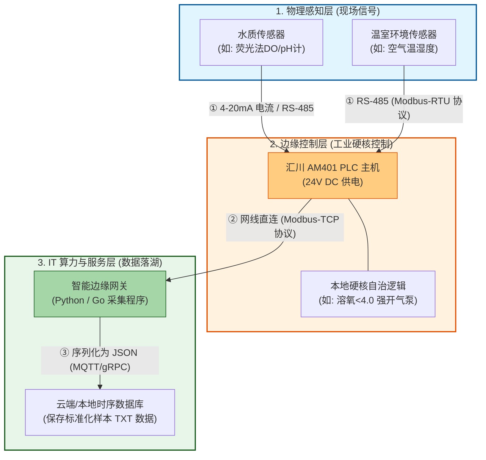

这是一个最基础、最核心的 **MVP（最小可行性产品）网络拓扑结构图**。

它抛弃了所有复杂的冗余设计，用最直观的层级结构，讲清楚数据是如何从物理世界的**原子（传感器）**，经过控制层的**转换（PLC）**，最终变成软件世界的**比特（服务器）**。

---

## 💡 MVP 拓扑结构的核心原理精解

这个 MVP 结构只讲透三个最根本的工业物联网（IIoT）数据流转原理：

### 原理一：物理信号的“数字量化”（Layer 1 $\rightarrow$ Layer 2）

* **过程：** 现场的传感器把水质或光照的物理变化，变成工业标准的电信号（如 $4 \sim 20\text{ mA}$ 电流）发给汇川 PLC。
* **IT 负责人的安全防线：** 数据必须先过 PLC，由 PLC 的硬件芯片完成模数转换（ADC）。这样即使后面的网关、服务器断网或死机，PLC 依然能靠本地的硬核代码闭环保命（如发现严重缺氧，不经云端直接拉高气泵继电器）。

### 原理二：工业协议到 IT 协议的“翻译与脱水”（Layer 2 $\rightarrow$ Layer 3 网关）

* **过程：** PLC 把换算好的物理数值（如 `pH = 7.6`）存放在它内部的保持寄存器（Holding Registers）里。
* **网关的角色：** 你的网关（比如一台小工控机或树莓派，跑着你写的 Python 脚本）通过网线连接 PLC，利用 **Modbus-TCP 协议** 去高频轮询（比如每秒 1 次）这些寄存器的内存地址，把冰冷的字节数据“读出来”。

### 原理三：数据资产的“结构化与时间戳绑定”（网关 $\rightarrow$ 数据库）

* **过程：** 网关拿到原始数据后，执行轻量清洗（过滤噪点），然后打上你在数据模型里设计好的 **`Batch_ID`（资产批次）、`Zone_ID`（池子编号）和 `Timestamp`（微秒级时空时间戳）**。
* **进入数据湖：** 最终，网关将这些元数据打包成软件工程师最熟悉的 **JSON 字符串**，通过 MQTT 或 API 协议远程推送给云端/本地的数据库存储。

这就是最简单、绝对能跑通的工业数据闭环。未来的 YOLO 训练模型、能耗 MPC 算法，全部都是在这个 MVP 拓扑结构稳定运行、源源不断产出干净数据之后，在大后方（Layer 3）叠加的算力外挂！