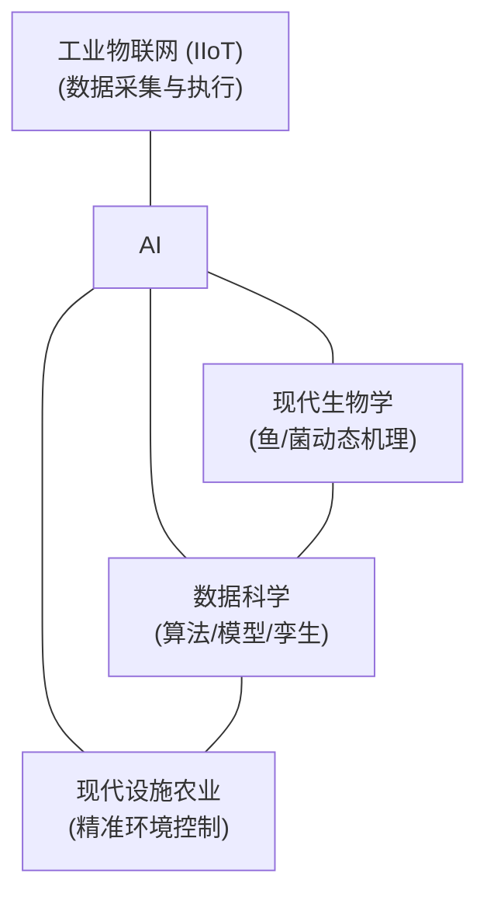
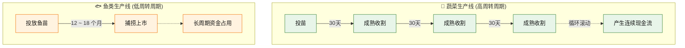
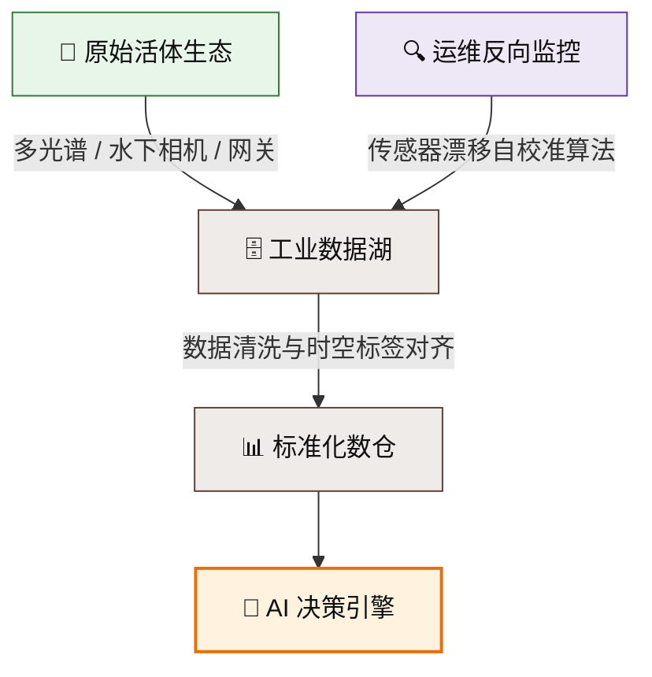
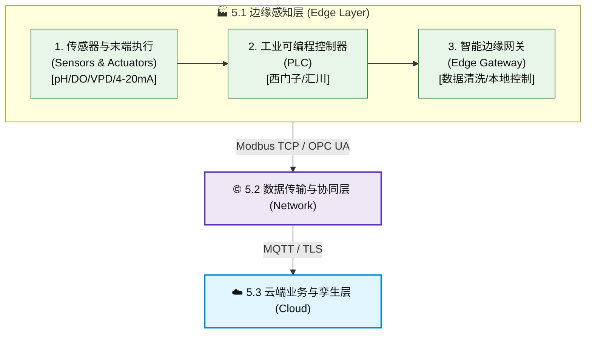
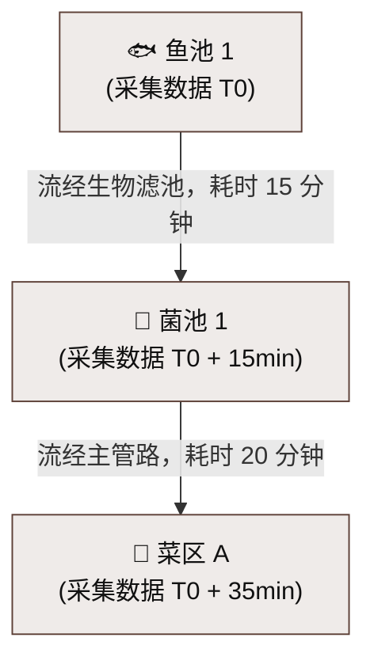
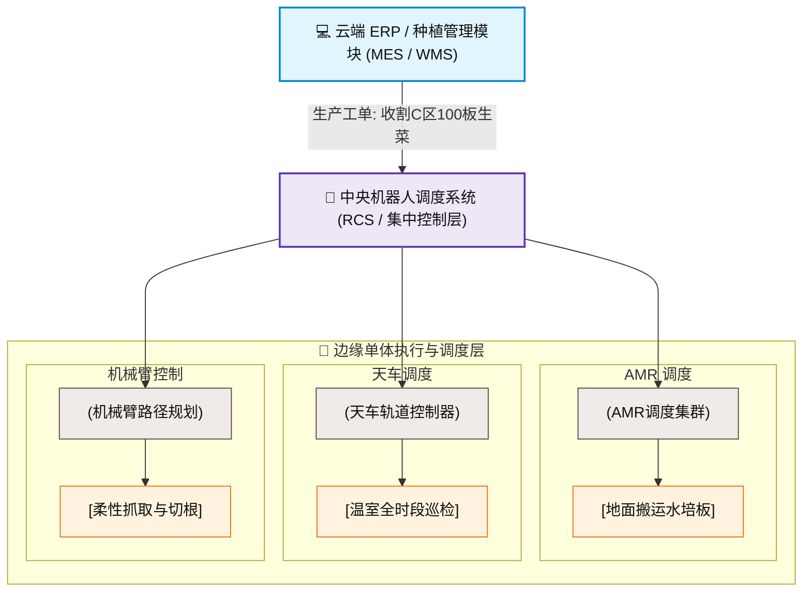
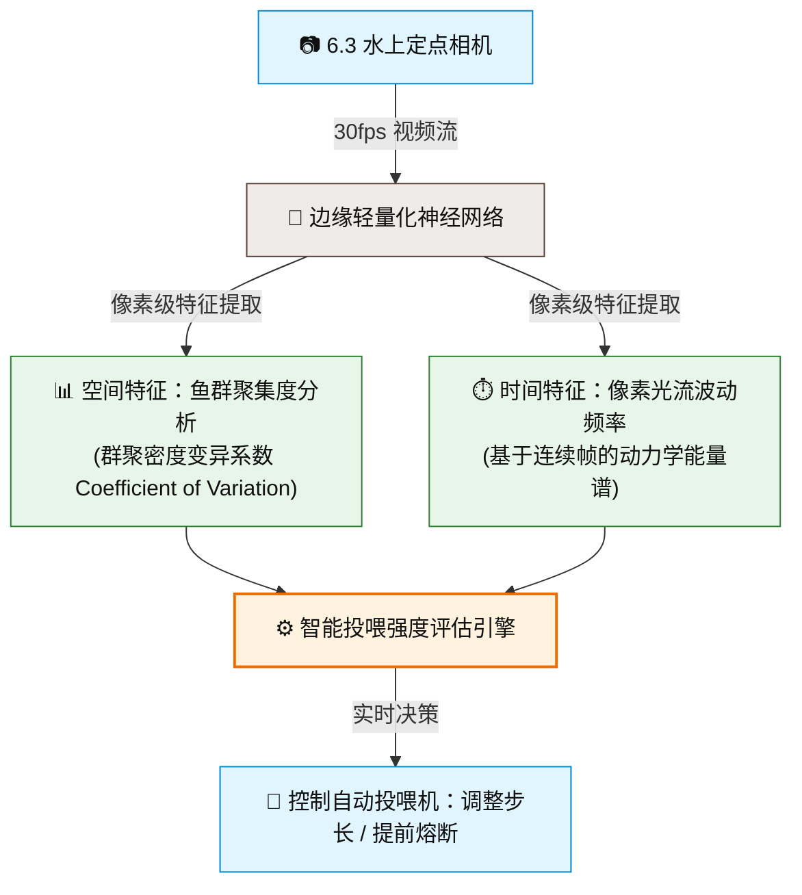

# 对 AI 时代鱼菜共生的理解

## 一、 AI 时代重新定义“鱼菜共生”

### 1.1 从“生物玄学”到“数字精密工业”

在过去很长一段时间里，鱼菜共生（Aquaponics）在外界眼中更像是一种带着理想主义色彩的“生物玄学”。

它描绘了一个近乎完美的生态乌托邦：鱼的排泄物化作作物的养分，作物的根系与硝化细菌净化了水体再反哺鱼群，实现零废水排放与极致的资源循环。然而，当这种理想走向工业化、商业化的现实时，迎接先行者的往往不是高额的利润，而是复杂的“生态黑盒”。

在传统的运营模式中，鱼菜共生高度依赖农场主的“经验”与“直觉”。温度高了一度、pH 值漂移了 0.2、或是硝化细菌的转化率在暗处悄然下降……这些微小的变量在复杂的生物网络中会产生恐怖的蝴蝶效应。由于缺乏数字化透明度，传统农场往往处于“出了问题找原因，找到原因鱼已死”的被动局面。缺乏连续、标准、精细的数据支撑，让这个完美的循环经济模型长期被困在低容错率、难以复制的“手工作坊”阶段。

然而，人工智能（AI）与工业物联网（IIoT）的爆发，正在以一种前所未有的姿态重新定义这个古老的产业。AI 时代的到来，正在将鱼菜共生从一门不可控的“生物玄学”，彻底转化为确定、可量化、可预测的“数字精密工业”。

### 1.2 跨界交汇：IIoT、现代生物学与数据科学的终极融合

现代商业化鱼菜共生，本质上不再是传统农业，而是一个重资产、高能耗、多变量的生物机器。它的本质是三大领域的交汇：



在这个公式中，**AI** 扮演着“中央大脑”的角色。

通过密布在园区内的传感器网络，IT 系统能够以秒级的频率感知溶解氧、饱和蒸汽压差（VPD）、光合有效辐射（PPFD）以及水质营养组分的变化；通过计算机视觉（CV），AI 能够像二十四小时不眨眼的专家一样，洞察千万条鱼的摄食行为与每一片菜叶的健康表型。

数据科学将这些冰冷的数据，转化为**生物动力学模型**与**数字孪生体（Digital Twin）**。它打破了传统的“烟囱式”管理，将鱼类的生长周期、温室的能耗成本、植物的营养吸收以及市场的价格波动强行编织进同一个“动态最优化算法”中。

### 1.3 核心命题：科技如何让绿色农业真正盈利？

这正是本文想要探讨的核心命题。

在全球气候异动、水资源日益匮乏、供应链追求本地化与零碳排放的 2026 年，鱼菜共生迎来了历史性的宏观机遇。但情怀无法支撑商业的运转，绿色农业要实现普及，其先决条件必须是“真正盈利”。

作为 IT 与 AI 系统，我们的使命不是为了技术而技术，而是要用数据和算法去攻克行业的核心痛点：

* 用异常检测算法将生物死亡风险降到最低；
* 用模型预测控制（MPC）去对冲高昂的电费与能源开支；
* 用数据驱动的业务系统去匹配鱼与菜不等的资产周转率。

AI 时代的鱼菜共生，是一场用比特（Bits）重塑原子（Atoms）与细胞（Cells）的变革。接下来，我们将从底层物理架构到上层算法模型，逐一拆解这场正在发生的智慧农业革命。

## 二、 什么是鱼菜共生系统？（物料与能量流向）

### 2.1 生态原理：鱼、菜、菌的“三位一体”循环

鱼菜共生系统（Aquaponics）的核心魅力，在于其模仿了自然界水生生态系统的自我循环机制。在传统的商业化思维中，这三个角色往往被视为独立的产业，而在鱼菜共生系统中，它们被整合为了一个**三位一体、互为因果的“生物软件闭环”**。

理解这个循环的物理和化学本质，是搭建 IT 监控系统与 AI 算法模型的底层基石。整个生态循环可以被解构为以下三个核心节点的物质与能量转化：

#### 1. 生产者与污染源：鱼

在系统的数据流中，鱼既是有价的生物资产，也是**氮元素的初始输入源**。

鱼类在摄入饲料并进行新陈代谢后，会通过鳃部排泄和粪便向水中释放大量的废物。这些废物中对系统最具威胁的是**总氨氮（TAN，Total Ammonia Nitrogen）**，主要以非离子氨（$\text{NH}_3$）和铵离子（$\text{NH}_4^+$）的形式存在。

对于水产养殖而言，氨氮是高毒性的致命物质（哪怕浓度低至 $0.05 \text{ mg/L}$，也会导致某些高价值鱼类慢性中毒或窒息）。在传统的纯养殖（RAS）中，必须通过频繁换水或昂贵的化学设备将氮稀释、排出；而在鱼菜共生系统中，这部分“废水”则是最宝贵的原料流。

#### 2. 核心路由器与转化器：硝化细菌（Bacteria）

微生物（主要是硝化细菌群体）是连接鱼和菜的“网络路由器”。**没有微生物的转化，鱼的废水就无法变成蔬菜的肥料。** 这个过程在生物化学上被称为**硝化作用（Nitrification）**，分为两个由不同菌群主导的阶段：

* **第一阶段（氨转亚硝酸盐）：**
  由**亚硝化单胞菌（Nitrosomonas）主导，它们将剧毒的氨氮转化为亚硝酸盐（$\text{NO}_2^-$）**。
  $$\text{2NH}_4^+ + \text{3O}_2 \rightarrow \text{2NO}_2^- + \text{4H}^+ + \text{2H}_2\text{O} + \text{能量}$$
  *注意：亚硝酸盐对鱼类而言同样具有极高的毒性（引发褐血病）。*

* **第二阶段（亚硝酸盐转硝酸盐）：**
  由**硝化杆菌（Nitrobacter）或硝化螺旋菌（Nitrospira）主导，它们将亚硝酸盐迅速氧化为硝酸盐（$\text{NO}_3^-$）**。
  $$\text{2NO}_2^- + \text{O}_2 \rightarrow \text{2NO}_3^- + \text{能量}$$

硝酸盐（$\text{NO}_3^-$）的毒性极低，且是水培植物最容易吸收的优质**大宗氮肥**。从方程式可以看出，整个转化过程是极度消耗氧气（$\text{O}_2$）并释放酸性氢离子（$\text{H}^+$）的。

#### 3. 终点净化器与经济收益产出：蔬菜

蔬菜是这个循环系统的终点，也是资金回笼最快的经济作物。

水培蔬菜（如生菜、罗勒）的根系浸泡在富含硝酸盐的水体中。植物的根系就像无数个微型的高效过滤器，疯狂吸收水中的硝酸盐、磷、钾等微量元素，以此构建自身的植物蛋白与纤维。

在这个过程中，蔬菜完成了两大核心任务：

* **自身生长：** 将多余的化学物质转化为可销售的绿色食品（资产增值）。
* **水质净化：** 蔬菜根系将水中的营养盐榨干后，水体重新恢复到了适合鱼类生存的低氨氮、低硝酸盐状态。净化后的清水在水泵的驱动下流回鱼池，闭环达成。

### IT 系统视角下的“能量与物质平衡公式”

从 IT 系统架构和 AI 建模的视角来看，“三位一体”循环本质上是一个**多变量动态平衡系统（Multivariate Dynamic Equilibrium System）**。它的核心输入输出可以被抽象为以下平衡关系：

$$\text{每日饲料投入量（Feed Input）} \propto \text{鱼类生物量（Fish Biomass）} \propto \text{氨氮产生率（TAN Rate）}$$

$$\text{氨氮产生率（TAN Rate）} \xrightarrow{\text{硝化细菌活性, DO, pH}} \text{硝酸盐累积率（NO}_3^-\text{ Accumulation Rate）}$$

$$\text{硝酸盐累积率（NO}_3^-\text{ Accumulation Rate）} \approx \text{蔬菜根系吸收率（Plant Uptake Rate）} \propto \text{蔬菜种植面积与叶面积指数（LAI）}$$

如果这个公式的任意一端出现失衡——例如喂了太多的饲料（输入过载），而菜太少或细菌活性不够（消纳能力不足）——数据流就会立刻报错，水质崩溃。

因此，AI 时代鱼菜共生的核心任务，就是通过物联网传感器死死盯住这个化学方程式的每一个节点，用算法代替肉眼，确保“鱼、菌、菜”始终跑在最佳的数学平衡点上。

### 2.2 现代商业化分类：耦合系统 vs 解耦系统

在明确了“鱼-菌-菜”的三位一体生物学原理后，如何将这一理论落地为真正的工业化园区，全球工程界演化出了两条截然不同的路线：**耦合系统（一环流系统）与解耦系统（多环流系统）**。

对于 IT 与系统架构师而言，这不仅仅是水管怎么接、阀门怎么装的物理问题，它直接决定了底层数据模型的复杂度、控制算法的收敛速度以及整个系统的容错率。

#### 1. 耦合系统（Coupled Aquaponics）：传统的“命运共同体”

耦合系统是经典的鱼菜共生模式。它的特点是“一水到底，单向死循环”。

在耦合系统中，水流从鱼池流出，经过固液分离和生物滤池（菌），直接进入植物水培床，被植物根系吸收净化后，再由水泵抽回鱼池。整个系统只有一条主循环回路。

* **生态妥协的代价：** 如前文所述，鱼、菜、菌对 pH 值和营养浓度的需求是冲突的。耦合系统迫使所有生物生活在完全相同的“大锅水”里。结果就是，为了照顾鱼，蔬菜无法获得最理想的养分（如铁、钙、镁等微量元素在鱼池中若浓度过高会对鱼产生毒性）；为了照顾菌，pH 值被强行固定在 $6.8 \sim 7.0$，这让蔬菜的根系吸收效率大打折扣。
* **IT 控制的灾难：** 在耦合系统中，所有环境变量高度强耦合。**它是一个超高阶、非线性的复杂动态系统。** 比如，为了提高蔬菜产量微调了水中的某种矿物质，这个微调会立刻随水流进入鱼池，影响鱼的摄食率；鱼的摄食率改变，又会导致氨氮排泄量剧变，进而冲击硝化细菌。在算法层面上，这种“牵一发而动全身”的系统极难建立精准的反馈控制模型，极易发生多变量震荡导致系统崩溃。

#### 2. 解耦系统（Decoupled Aquaponics）：现代商业大厂的必然选择

为了打破耦合系统的物理限制，全球现代大型商业农场（如 Superior Fresh）普遍转向了**解耦系统（Decoupled Systems）**。

解耦系统将整个园区切分为三个彼此独立、互不干扰的水循环回路：**水产养殖循环（RAS）**、**水培种植循环（Hydroponics）**、以及**污泥脱水与营养回收循环（Sludge Processing）**。

它们之间通过自动化的**单向单次补水阀（One-way Valve）和中间调理池**相连：

* 鱼池产生的高营养废水定期排入中间调理池。
* 在调理池中，系统可以安全地加入植物所需的化学微量元素（如螯合铁），并利用酸碱调理剂将 pH 值精准调至蔬菜最爱的 $5.5 \sim 6.0$。
* 调理好的“完美营养液”按需单向注入蔬菜循环，而蔬菜区的营养液**永远不会流回鱼池**。

##### ① 状态空间的降维（Dimension Reduction）

在耦合系统中，如果想用 AI 预测蔬菜下周的生长速率，特征向量（Features）必须包含：蔬菜温室数据 + 鱼池水质数据 + 鱼类摄食量 + 细菌转化率。变量之间互相纠缠，模型极难收敛。

而在解耦系统中，**蔬菜的生长只取决于“蔬菜循环”内部的水质和温室环控数据**。可以直接把鱼池的数据切离出去。AI 模型的输入特征大幅减少，训练成本和预测精度将获得质的提升。

##### ② 控制策略由“动态平衡”变为“边界断开”

* **传统控制逻辑：** 需要实时计算 $\Delta A \rightarrow \Delta B \rightarrow \Delta C$ 的连续影响。
* **解耦控制逻辑：** 变成了标准的“生产者-消费者（Producer-Consumer）”队列模型。鱼池是“营养液的生产者”，它只需将多余的废水推送到调理池（缓冲区 Buffer）；蔬菜是“消费者”，它只需根据自身的消耗速度，从调理池中调配并抽取营养。两个系统通过“中间缓冲区”实现了时间与空间上的双重解耦。

##### ③ 容错率与数据容灾的飞跃

在耦合系统中，传感器一旦读数漂移（例如 pH 计坏了，误判后盲目加碱），几分钟内就会引发连锁灾难。

在解耦系统中，即使蔬菜区的传感器发生故障导致加药过量，该区域的数据异常会被**物理隔离**在水培循环内。拥有充足的时间切换到手动模式或启动备用算法，而大后方的数十万条高价值鱼群甚至“毫无察觉”。

### 总结：系统设计视角的对比

| 维度 | 耦合系统 (Coupled) | 解耦系统 (Decoupled) |
| :--- | :--- | :--- |
| **物理水路** | 单环闭路循环 | 多环独立循环 + 缓冲区 |
| **生物表现** | 鱼、菜、菌互相妥协，产量达不到极致 | 各取所需，两端产量均最大化 |
| **数据关系** | **强耦合、非线性。** 跨区域数据强因果相关 | **高内聚、低耦合。** 区域内自治，边界数据交互 |
| **AI 建模难度** | 极高（需全局数字孪生，容错率极低） | 中等（可模块化建模，分而治之） |
| **IT 系统定位** | 敏感的“生态平衡仪” | 稳健的“工业调度与流水线协同系统” |

### 架构师结论

解耦系统用硬件（管道、阀门、储水池）的冗余，换取了软件和算法控制上的巨大便利。作为 IT 系统，要推行的第一条技术铁律应当是：极力推动或维护解耦系统设计，因为这是让 AI 算法真正落地并实现业务盈利的技术前提。

## 三、 鱼菜共生的发展历史与全球格局

* ### **3.1 历史演进：** 从古代稻鱼共生到现代设施农业

 略

* ### **3.2 泡沫与反思：** 过去十年全球商业化失败案例的启示（为什么空有概念赚不到钱？）
在技术发展史中，任何前沿产业都会经历高德纳（Gartner）技术成熟度曲线中的“泡沫期”（Hype Cycle）。鱼菜共生在 2010—2020 年代中期，就经历了一场轰轰烈烈的概念狂欢。

彼时，伴随着“都市农业”、“零碳循环”、“纯有机”等光鲜概念的加持，大批缺乏农业生产和工业工程背景的创投团队涌入这个赛道。他们拿到了数百万乃至数千万美元的融资，建造起一座座极具未来感的现代化农场。然而，随后的十年里，行业迎来了一场残酷的洗牌，诸如美国 Sweetwater Organics、Podponics 等曾经的明星初创企业纷纷宣布破产重组。

“情怀”在冰冷的财务报表前被撞得粉碎。我们需要跨过这些先驱的遗骸，用数据和底层逻辑深刻反思：为什么这些项目空有完美的生态概念，在商业上却赚不到钱？

#### 1. 致命的陷阱：重资本开支（CAPEX）下的“低周转率”
早期的失败企业往往把钱花在了“面子”上。为了打造高科技的视觉效果，他们盲目追求全封闭、纯人工光源（LED）的垂直农场结构，导致初始建造成本（CAPEX）高得畸形。

资产错配： 鱼菜共生中，蔬菜（如生菜）虽然 30 天就能收一茬、周转极快，但其本身属于低客单价、低毛利的大宗农产品（Commodity）。用造半导体晶圆厂的每平米造价，去种几块钱一斤的生菜，其资产回报率（ROIC）在数学上根本无法实现闭环。

高昂折旧压垮现金流： 极高的初期投资意味着企业每个月要承担巨额的固定资产折旧。当农场的产量或销售链条出现一点点波动时，折旧费和贷款利息就会瞬间榨干公司的账面现金。

#### 2. 吞噬利润的黑洞：不可控的日常运营开支（OPEX）
很多破产的农场在规划书里写着“省水 90%，节省肥料 100%”，却在实际运行后被暴涨的电费和人工费直接压垮。

“能耗炸弹”： 鱼菜共生是一个动态的水泵循环和空气环境调节系统。为了维持鱼类的溶解氧和温室的蒸汽压差（VPD），水泵、气泵、暖通空调（HVAC）必须 24 小时高功率运转。在遭遇国际能源价格波动时（例如前几年欧洲能源危机），那些没有能耗预测优化系统的农场，其电费支出直接翻了数倍，直接导致卖一棵菜就亏一棵菜的钱。

高昂的人工隐性成本： 早期系统自动化程度低。因为缺乏计算机视觉（CV）监控，农场需要雇佣大量工人去每天巡检病虫害、手动测量水质、弯腰收割。农业工人的流动性极高，不仅劳动力成本居高不下，由于员工“漏测数据”或“操作不规范”导致的生物死淘率也居高不下。

#### 3. 供应链的“黑天鹅”：活体生物资产的零容错率
传统的水培植物工厂如果断电 2 小时，大不了植物长得慢一点；传统的养鱼场如果水质波动，可以立刻换水。但耦合的鱼菜共生系统是一个高敏捷、零容错的生物机器。

“一倒俱倒”的多米诺骨牌： 早期项目由于缺乏物联网（IoT）的异常预测和主备冗余设计，发生过无数次由于一次意外停电、或是单个关键泵阀卡死，导致整个鱼池在 45 分钟内因缺氧“翻塘”的惨剧。

药剂两难： 鱼一旦爆发寄生虫或细菌病，最有效的手段是下药（如硫酸铜或抗生素）。但这些药物一旦随水流进入硝化滤池，会直接将辛辛苦苦培养数年的硝化细菌杀光，水体氨氮瞬间爆表，进而导致蔬菜全面枯死。这种“由于缺乏生物安全隔离和数据预警，导致系统反复重启”的代价是任何商业公司都无法承受的。

#### 4. 商业模式的错位：“鱼”与“菜”的销售渠道冲突
在经营层面，很多破产先驱死于“拿着种菜的脑袋去卖鱼”。

蔬菜是快消品，对接的是大型超市、沙拉连锁店，讲究的是天天有货、品质高度标准化、冷链即时配送；

活鱼或冷冻水产则是大宗或活鲜渠道，对接的是海鲜批发市场、高档餐厅，讲究的是单次起批量、特定季节性、以及完全不同的物流网络。

早期团队往往在把生菜卖得很好的时候，发现鱼池里的鱼还没长大；或者等到鱼可以捕捞了，却找不到合适的水产批发商，导致高价值的鱼在池子里多养了半年，白白消耗了巨额的饲料成本（FCR，饲料转化率严重恶化）。

#### 科技反思：
梳理这十年的失败史，我们会得出一个冷酷的结论：早期的鱼菜共生不是死于生态科学的失败，而是死于“缺乏数据控制的工程灾难”与“粗放的管理模式”。

这恰恰是时代赋予现代 IT 系统和 AI 的历史性机会。前人踩过的坑，就是我们系统的防护墙。在接下来的架构设计中，我们将用代码和算法针对性地反思并解决这些问题：

针对高 OPEX： 我们要用 AI 构建 模型预测控制（MPC）算法，结合天气预报，实现温室能耗与补光的“精细到分”的策略调度，把电费打下来。

针对零容错风险： 我们要打造具备边缘计算、多路由冗余的 IIoT 架构，结合机器学习的异常检测（Anomaly Detection），在水质和设备发生异动的前 10 分钟发出预警，将生物风险降为零。

针对人工成本： 我们要引入机器人柔性收割与视觉表型识别，将人类员工逐步剥离高危、高污染、重复性的温室环境，实现精细化、可编程的无菌工厂化作业。

唯有将前人的血泪教训转化为系统中的一条条约束条件（Constraints）与报警阈值，鱼菜共生才能真正跨越泡沫破裂的谷底，迎来属于数字精密工业的盈利时代。


### 3.3 全球现状：北美规模化、欧洲环控化、中东极端环境化的产业格局

正如软件架构需要因地制宜地部署在不同的云端环境（如 AWS、Azure、阿里云）一样，鱼菜共生作为物理实体，其商业形态在全球不同区域的落地，也受到了当地**资源禀赋、能源价格、气候条件和政策导向**的强烈重塑。

目前，全球鱼菜共生产业已经形成了截然不同的三大区域技术流派与市场格局。了解这一格局，不仅能帮助我们看清全球顶尖同行的技术天花板，更能为我们公司的 IT 架构与 AI 算法出海提供精准的商业场景靶向。


#### 1. 北美地区：高创投驱动的“美式规模化”

在北美（美国、加拿大），鱼菜共生的核心关键词是“资本、规模、大宗零售”。

以位于威斯康星州的 **Superior Fresh** 为代表，北美商业大厂的典型特征是动辄占地数十英亩（数十万平方米）的超大型连栋温室。他们通常采用深度解耦系统，年产数百万磅的有机陆基冷水鱼（如三文鱼、红点鲑）和数千万头绿叶蔬菜，直接切入 Walmart、Whole Foods 等主流商超供应链。


* **技术特征：** 追求极致的工业自动化流水线、高速移动行车、大规模中央过滤系统。
* **IT与AI的靶向场景：** 北美模式的核心痛点是**供应链匹配与大宗劳动力成本**。在这样的产业格局下，IT 系统的重心在于 **“大规模排程优化（APS）”**。AI 需要预测长达数月的鱼类生长周期与 30 天的蔬菜周期，精准对接零售商的订单预测；同时，由于园区占地极大，多传感器网络（WSN）的超长距离低功耗通信（如 LoRaWAN）以及仓储物流机器人的调度系统（WMS）是技术刚需。

---

#### 2. 欧洲地区：追求极致能耗比的“荷式环控化”

欧洲（以荷兰、德国、北欧为主）是全球智慧农业设备与现代温室控制技术的发源地。在欧洲，鱼菜共生的核心关键词是“环控、能耗闭环、极致效率”。

欧洲土地资源紧张，且近年来受国际局势影响，天然气和电费价格暴涨。因此，欧洲的鱼菜共生几乎全部采用高度精密的现代化玻璃温室（Venlo型），将“鱼-菌-菜”的循环与城市工业余热、二氧化碳捕集系统（CCUS）进行深度绑定。

* **技术特征：** 极其重度地依赖环境控制系统（如荷兰 Priva、Hoogendoorn 系统），对温室内的温度、湿度、$CO_2$、光照、幕帘进行差分微调。
* **IT与AI的靶向场景：** 欧洲模式的核心痛点是**能耗开支（OPEX）**。在这里，AI 的主战场是 **“能耗预测控制（MPC）算法”**。算法不能仅仅根据当前温室温度来开空调，而是需要实时读取当地气象台的未来 72 小时云层、辐射和气温预测，在深夜电价便宜时提前为水体蓄热/蓄冷，并在白天利用太阳辐射达到目标温度。这种将“生物需求”与“能源电价弹性”强绑定的动态调度算法，是欧洲格局下的核心竞争力。

---

#### 3. 中东与亚太极端环境地区：政策补贴下的“生存奇迹”

在阿联酋、沙特阿拉伯等中东国家，以及新加坡等土地极度匮乏的亚太城市国家，鱼菜共生的核心关键词是“水资源战略、粮食安全、极端生存”。

中东地区拥有全球最丰沛的阳光和资本，但极度缺水且土壤贫瘠，传统农业无法立足；新加坡则面临“90%以上食品依赖进口”的困局。这些地区的政府为了保障危机时期的粮食安全，正在砸下重金补贴室内垂直鱼菜共生与沙漠环控农场。

* **技术特征：** 完全密闭的植物工厂、多层垂直立体种植、高强度人工补光（LED）、极端海水淡化协同技术。
* **💡 IT与AI的靶向场景：** 极端环境下的核心痛点是**生物安全防护与空间利用率**。由于完全依赖人工光源，系统不容许任何一秒钟的补光失误。IT 系统需要构建超高可靠性的三冗余控制架构。AI 的核心应用则转向了“三维立体视觉表型监测”——由于是多层垂直种植，人工巡检几乎不可能，必须依赖轨道式 3D 相机或无人机，利用计算机视觉算法逐层扫描植物的饱和蒸汽压差（VPD）反应，防止局部由于空气不流通导致的“烧心病”或霉菌爆发。

---

#### 📊 全球产业格局技术需求矩阵

作为 IT 系统，通过这张矩阵表，可以清晰地看到未来的 IT 与 AI 系统在不同市场应该如何进行功能模块的组装与侧重：

| 区域流派 | 代表企业/区域 | 核心商业驱动力 | 核心痛点 | IT & AI 系统的主攻阵地 |
| --- | --- | --- | --- | --- |
| **北美规模化** | Superior Fresh (美) | 创投规模效应、商超供应链 | 劳动力成本、物流排程 | **ERP/APS 供应链匹配、计算机视觉产量预测、AGV/AMR 机器人调度** |
| **欧洲环控化** | EcoGro (德) / 荷兰温室群 | 能源闭环、极致资源利用率 | 暴涨的电费与天然气费 | **模型预测控制 (MPC) 能耗优化、工业总线协议集成、环境多变量反演算法** |
| **中东/亚太极端化** | Red Sea Farms / 新加坡垂直农场 | 国家粮食安全、水资源极度匮乏 | 生物安全、全人工光能耗 | **具身智能（机器人收割/定植）、高可靠边缘计算、3D 点云植物病害巡检** |

**总结：** 全球产业格局的演变告诉我们，鱼菜共生没有一套放之四海而皆准的“万能标准系统”。我们公司未来的 IT 系统架构，必须具备强大的**模块化和可配置性（Configurability）**。我们要做的，是打造一套稳健的底层数据底座，使其既能对接到北美的巨型输送带上，也能融合进欧洲的精密环控器中，更能支撑起中东沙漠里二十四小时不间断的 AI 视觉算力。

## 四、 商业化鱼菜共生的核心难点与风险

### 4.1 动态平衡的“木桶效应”： 鱼、菜、菌环境需求的冲突

在管理学和生态学中，“木桶效应”（Short-barrel Effect）指的是一只水桶能盛多少水，并不取决于最长的那块木板，而是取决于最短的那块。在商业化鱼菜共生系统中，这个效应被推向了极致：**整个系统的生产效率和安全系数，取决于鱼、菜、菌这三者中环境最恶劣、状况最差的那一个。**

传统的单一农业（如纯水培或纯养鱼）只需要服务好一个主体，环境控制曲线是单一的。但在鱼菜共生中，我们试图在一个互通的系统中同时喂养三种截然不同的生命体。它们在漫长的自然进化中形成了完全不同的基因偏好，对环境的需求存在着天然的、不可调和的冲突。

---

#### 1. 三大主体的“环境需求冲突矩阵”

为了量化这种冲突，我们可以观察以下这组核心物理与化学指标的对比。在传统的耦合系统中，这种冲突往往会导致灾难性的“相互妥协”：

| 关键环境变量 | 鱼类（以罗非鱼/高价值鳕鱼为例） | 硝化细菌（微生物群落） | 蔬菜（以生菜/茄果类为例） |
| :--- | :--- | :--- | :--- |
| **最适宜 pH 值** | **7.4 ~ 8.0**<br><br>*(过低会破坏鱼鳃，导致血液携氧能力下降)* | **7.5 ~ 8.0**<br><br>*(低于 6.5 硝化活性大幅衰减，低于 6.0 彻底罢工)* | **5.5 ~ 6.5**<br><br>*(高于 7.0 会导致铁、锰、磷等关键养分被锁死，植物无法吸收)* |
| **最适宜温度** | 温水鱼: **26°C ~ 30°C**<br>冷水鱼(三文鱼): **12°C ~ 16°C** | **24°C ~ 30°C**<br><br>*(低于 15°C 活性减半，严重影响氨氮转化)* | 根系温: **18°C ~ 22°C**<br><br>*(过高易滋生根腐病，且水中溶解氧饱合度下降)* |
| **溶解氧 (DO)** | **> 5.0 mg/L**<br><br>*(冷水鱼要求更高，缺氧会导致大面积死亡)* | **> 6.0 mg/L**<br><br>*(硝化反应是强耗氧过程，缺氧会导致氨氮毒素堆积)* | **> 4.0 mg/L**<br><br>*(根系呼吸需要，过低引发厌氧菌滋生和烂根)* |
| **主要化学耐受度** | **对氨氮（TAN）和亚硝酸盐极度敏感**<br><br>*(浓度 > 0.1 mg/L 即有毒害风险)* | **需要稳定的氨氮作为“食物”**<br><br>*(但害怕高浓度的游离氨和某些化学药剂)* | **对硝酸盐极其饥渴**<br><br>*(同时需要补充高浓度的钾、钙、镁等矿物质)* |

---

#### 2. 核心冲突深度剖析

##### ① pH 值的“生死博弈”

pH 值是系统中最无情、最致命的冲突点。

* 蔬菜喜欢微酸性环境（pH 5.5—6.5），因为在这个范围内，水中的金属离子（如铁、锌、铜）呈溶解状态，根系能轻易吸收。如果 pH 升到 7.5，蔬菜就会遭遇“隐性饥饿”，叶片发黄枯萎。
* 然而，硝化细菌是坚定的“保皇派”，要求微碱性环境（pH 7.5—8.0）。一旦 pH 跌破 6.5，细菌外壳的酶结构会遭到破坏，硝化反应停滞。鱼排出的毒性氨氮无法被转化，会在几小时内将鱼毒死。
* **传统做法的悲剧：** 人工被迫将 pH 固定在 6.8—7.0 的尴尬平衡点上。结果是细菌活得勉强，蔬菜长得缓慢，两端都在牺牲产量。

##### ② 营养浓度的“矛盾两重天”

蔬菜为了快速生长，需要水体中有很高的电导率（EC 值，代表养分浓度），特别是钾、钙、镁等元素。但是，水产养殖（RAS）追求的是水质的“清澈与纯净”。如果直接在水体中添加高浓度的化肥级矿物质，高渗透压会破坏鱼卵、损伤鱼的粘膜系统，甚至导致高价值鱼类慢性死亡。

##### ③ 温度的“冷热两难”

如果选择养殖高价值的冷水鱼（如虹鳟或大西洋三文鱼），水温必须控制在 15°C 左右。然而，在这个温度下，硝化细菌的代谢速度会下降 60% 以上，这意味着需要建造几倍大体积的生物滤池才能消化掉同等数量的鱼粪；同时，这个温度对于温室里喜欢 25°C 阳光的生菜或罗勒而言，根系活性会严重受阻。

---

### IT 与 AI 视角的破局：将“生物玄学”建模为“多目标最优化”

对于传统农民来说，这种多维度的冲突是一场无法精确计算的灾难。但作为系统的 IT 与 AI ，**这恰恰是算法最擅长解决的经典场景——“约束条件下的多目标最优化问题（Constrained Multi-objective Optimization）”**。

在解耦系统（Decoupled）的硬件支持下，我们的 IT 系统和 AI 模型将通过以下方式打破“木桶效应”：

1. **时空状态方程的建立：**
AI 不需要去寻找一个“万能的中间温度”或“万能的 pH 值”。我们将鱼池、菌池、菜池的数据在软件层面上进行“物理分层编码”。鱼池运行在 pH 7.6、28°C；菜池运行在 pH 5.8、20°C。

2. **基于强化学习（RL）的动态边缘决策：**
系统通过自动化阀门和调理池作为解耦缓冲。AI 模型实时计算鱼池的“氨氮产出速率”与菜池的“养分消耗速率”。算法控制的目标不再是保持静态平衡，而是计算“在什么时间节点，以多大的流速，将多少比例的鱼池废水抽入调理池，并在调理池中以何种加药步长调整 pH，最后精准输送给菜池”。

3. **软传感器（Soft Sensors）技术对抗数据滞后：**
硝化细菌的活性无法通过廉价的硬件传感器直接测量。AI 可以通过采集“总耗氧量的异常斜率”和“碱度消耗速度（pH 下降斜率）”作为代理变量，利用神经网络实时反推出硝化菌群的“当前工作效率”，在氨氮浓度真正超标前 2 小时通知执行机构介入。

**总结：** 动态平衡的木桶效应告诉我们，试图在物理上强行揉合不同的生命体是违背自然规律的。智慧农业的精髓在于“物理上解耦分区，数据上强力连接”。用 IT 系统的传感器看清每一块木板的短板，用 AI 算法动态调整资源流向，我们才能把木桶的容量做到最大，让生态的冲突转化为产量的乘数。


### 4.2 经济与运营风险：高初始投资（CAPEX）、高能耗（OPEX）与资产周转率错位

如果说环境需求的冲突（木桶效应）是鱼菜共生在“技术层面”的物理防线，那么财务模型的失衡则是它在“商业层面”的生死大考。

无数技术卓越的设施农业项目最终倒在商业化的中途，并非因为鱼养死了或菜枯萎了，而是因为他们的现金流枯竭了。作为 IT 与 AI 系统，所规划的数字底座必须对企业的财务指标负责。我们需要用精细的财务工程视角，深度解构鱼菜共生系统背后的三大核心经济风险。

---

### 1. 沉重的枷锁：高初始投资（CAPEX）带来的财务杠杆风险

商业化的鱼菜共生系统本质上不是传统意义上的“农田”，而是一个**高密度、工业化的活体制造工厂**。它的初期固定资产投入（CAPEX）在整个农业领域属于最高的一档：

* **精密硬件的堆砌：** 园区需要高刚性的连栋温室主体、自动化育苗流水线、工厂化重力反冲洗微滤机、生物滤塔、高精度的多参数水质监测器，以及复杂庞大的双向或多向解耦管道阀门网络。
* **高昂的折旧与资金成本：** 如此高昂的固定资产投资意味着企业在还未卖出第一批产品前，就背负了沉重的每平米折旧成本和贷款利息。如果早期的 IT 系统和项目规划不够标准化，一旦遭遇工程延期、硬件调试不兼容，每天开闸的固定消耗就能瞬间拖垮一家初创公司的财务现金流。

---

### 2. 吞噬利润的黑洞：高能耗（OPEX）引起的成本失控风险

在日常运营成本（OPEX）中，“电费”是鱼菜共生企业最凶狠的利润杀手。

* **24小时不间断的能量输入：** 纯水培植物工厂对补光灯（LED）的依赖极高；而在鱼菜共生中，除了光照，系统为了维持数百吨水体的动态循环，巨大的水泵、溶氧气泵、紫外线物理杀菌器（UV-C）、冷水机（针对冷水鱼如三文鱼）或加热锅炉（针对温水鱼如罗非鱼）必须 24 小时满负荷不间断运转。
* **对外界能源市场的脆弱性：** 在工业化设施农业中，能源成本通常占到总 OPEX 的 $30\% \sim 50\%$。在过去几年的全球能源和电价波动中，那些缺乏精细化环控策略的传统农场，其电费支出呈非线性暴涨。当一公斤生菜的电费消耗超过了市场的终端零售价时，系统在商业上就彻底失去了生存空间。

---

### 3. 供应链的隐形毒药：“鱼”与“菜”的资产周转率（Asset Turnover）错位

这是鱼菜共生模式独有的、也是最容易被管理层忽视的**商业结构性陷阱**：



* **快短周期（菜） vs 慢长周期（鱼）：**
在水培系统中，绿叶蔬菜（如生菜、罗勒）是一架疯狂周转的现金流机器。从定植到收割只需要 $30 \sim 40$ 天，一年可以循环 $10 \sim 12$ 茬，能够为公司提供高频、稳定的日常现金流入。
然而，高价值的水产（如墨瑞鳕、三文鱼）则是一台漫长的资产吞噬机。它们的生长周期长达 $12 \sim 18$ 个月。这意味着在长达一到两年的时间里，鱼池不仅不产生任何收益，还要每天消耗高昂的高蛋白饲料。
* **现金流失衡的危机：**
如果企业的销售团队拿着“卖菜的脑袋”去规划全厂的财务现金流，就会发现菜的收益在源源不断地垫付鱼的饲料费和环控费。一旦某一阶段蔬菜遭遇短期病虫害减产、或商超渠道违约，整座工厂就会面临有大批未成熟的鱼要喂、但账面上已经发不出工人工资的“断流”窘境。

---

### IT 与 AI 系统如何用数字技术“围剿”经济风险？

面对如此冷酷的财务现实，传统的 ERP 和人工管理完全是“听天由命”。这正是 IT 系统和 AI 算法要在全公司树立核心话语权的关键战役。我们要用软件去优化硬件的账目：

#### ① 用 AI 的模型预测控制（MPC）直接斩断“电费黑洞”

AI 系统不能只是一个被动的环控器（如：温度高了开风机，温度低了开加热）。我们将开发**基于多变量预测的能耗控制算法**。系统实时抓取气象局未来数天的短波辐射、云层覆盖率和气温数据，结合当地电网的“峰谷分时电价（Time-of-Use Pricing）”。

* *执行逻辑：* 在深夜电价跌入谷底时，AI 调度系统控制高能耗的热泵提前为水体蓄热或蓄冷；在白天高电价时期，算法通过精准调节电动遮阳幕帘和通风阀门，利用自然光和热能维持室温，将高峰期电费开支最大程度地压低。

#### ② 用算法构建“资产数字化调度模型”对冲周转率错位

IT 系统需要建立一个打通养殖、种植与前端销售的 **“全产业链数字孪生排程系统（APS）”**。

* *执行逻辑：* AI 算法根据实时的水质和鱼群视觉测重，高精度预测鱼类的成熟起捕日期，并将这个日期反向推导到蔬菜的种植排班中。系统可以动态调整蔬菜的种植品种（例如：在鱼类即将成熟、饲料消耗最昂贵的最后3个月，系统自动提高超快周转、高毛利高现金流作物如罗勒、芝麻菜的种植比例，用蔬菜暴涨的即时现金流去对冲鱼类的期末饲料资金压力）。

#### ③ 利用“全流程无人生态”压低人力 CAPEX 摊销

通过前期对 IT 基础总线和机器人执行层的合理规划，实现定植、巡检、收割、包装的全流程机器人作业。将传统的“劳动密集型农业”转化为“资本与技术密集型工业”。通过大幅缩减现场的常驻工人数量，不仅能将高昂的人力 OPEX 砍掉 $60\%$ 以上，更能利用机器人全天候、高标准的工作表现，把由于员工漏操作、误操作引发的生物死亡风险（CAPEX 打水漂）降到绝对的零。

**总结：** 鱼菜共生的普及难，归根结底是财务模型的容错率太低。IT 系统的终极目标，就是通过一根根高响应的传感器电缆和高瞻远瞩的优化算法，将这些吞噬利润的物理风险、运营开支和时间错位，在代码层面上进行对冲与消纳，让设施农业真正实现“工业级的稳定盈利”。


### 4.3 数据荒漠：传统农场缺乏标准化、连续性的活体生物数据

在软件工程和人工智能领域，有一条铁律：**“垃圾进，垃圾出（Garbage In, Garbage Out）”**。

站在 2026 年的科技浪潮中，谈论如何用神经网络、计算机视觉和强化学习去颠覆农业时，我们会迎头撞上一面冰冷且隐形的墙——**传统农业极其残酷的“数据荒漠”现状**。设施农业和水产养殖虽然存在了几十年，但在数字化层面上，它们依旧是一片未被开垦的原始森林。缺乏标准化、连续性的活体生物数据，是阻碍鱼菜共生走向规模化工业流水的最大底层黑洞。

---

#### 1. 传统农场数字化现状的“三大怪状”

走进一个没有经过现代 IT 深度重塑的传统鱼菜共生农场，通常会看到以下三种令人窒息的数据景象：

##### ① 纸质与 Excel 堆砌的“断裂数据流”

大多数农场的生产数据存在于工人的记事本、白板或者格式各异的 Excel 表格中。

* *场景：* 质检员今天化验了水质，手写在纸上；喂鱼的小哥今天投了50公斤饲料，随手填进Excel；种植组的员工发现生菜有几棵黄了，口头跟场长汇报了一声。
* *后果：* 这些数据分散在不同人的手里，格式不一、标准全无，且充满了**极强的主观性**（例如：“鱼群抢食活跃”是一个无法被算法量化的主观词汇）。这些数据无法实时沉淀，更无法建立跨部门的因果关联。

##### ② “离散型”采样掩盖了“连续型”危机

传统的化学指标（如对鱼和菌至关重要的总氨氮 TAN、亚硝酸盐 $NO_2^-$）极度依赖人工使用试剂盒进行显色化验。由于人工成本高、操作繁琐，大多数农场只能做到“三天一测”或“一周一测”。

* *后果：* 活体生物的生态演变是分秒不停的连续过程。在两次人工采样的 72 小时空窗期内，水体可能早已因为温度微调爆发了氨氮飙升，随后又在植物的疯狂吸收下回落。**这种“离散的点状数据”完全掩盖了“连续的波动曲线”**，导致 AI 系统在进行时间序列预测时，拿到的全是被严重平滑和失真的伪数据。

##### ③ 硬件传感器的“数据孤岛”与高故障率

许多农场虽然采购了带有数字仪表的温室控制器（如风机、卷帘控制）或水质笔，但这些硬件属于不同厂家，彼此协议不通（有些走485总线，有些是私有云）。

* *后果：* 环控数据拿不出来，水质数据进不去，数据之间筑起了高高的“烟囱”。更致命的是，农业环境（高湿、高盐、有生物附着）对传感器极不友好。如果没有一套 IT 系统去自动监测传感器的健康度，pH 计在运行两周后产生漂移，读出的全是错误数据，AI 基于这些错误数据做出的控制决策将是一场灾难。

---

### 2. 活体生物数据（Living Biomass Data）的变态特征

作为 IT 系统，必须意识到，写农业系统的代码和写传统电商、金融系统的代码完全不同。电商的用户数据是确定性的（买了就是买了），而鱼菜共生要捕获的是“活体生物数据”，它具备极高的数据工程挑战性：

* **非确定性（Non-deterministic）：** 同样是28°C的水，鱼苗期、育肥期和临近捕捞期的鱼，其摄食行为和排泄特征完全不同。生物会随着时间、基因、甚至光照节律发生非线性变化，传统的静态阈值报警器（如：超过 1.0 就报警）根本无法应对这种复杂的生命体。
* **时空异步性（Spatial-Temporal Asynchrony）：** 鱼池里产生的一克氨氮，需要经过生物滤池的降解，再通过管道流进A区温室、B区温室。数据在空间上有位移，在时间上有滞后。如果 IT 系统不能为每一组数据打上精准的“时空同步标签”，AI 模型就永远无法理清“喂食量-水质-蔬菜生长”之间的真实因果链条。

---

### 💻 IT 与 AI 系统如何在一片荒漠中“开辟绿洲”？

面对行业无数据可用、无标准可依的窘境，不能坐在办公室等着别人把数据喂给你。核心任务，是**在全厂构建一套标准化、高可靠、连续性的“生物资产数字化采掘流水线”**：



#### ① 定义全厂的“生物数据字典（Data Dictionary）”

从一开始，就联合动保专家（养鱼）和农学专家（种菜），制定出公司统一的数据元标准。

* *落地方案：* 规范每一个物理池塘、每一个种植槽、每一个生长批次（Batch ID）的命名规则与数据格式。将所有人工化验、日常投喂、死淘计数全部强行集成进标准化移动端 App 或 PDA 扫描枪中，从源头上消灭纸质表单，实现“全渠道数据格式统一归仓”。

#### ② 引入“软传感器（Soft Sensor）”与算法自清洗，对抗硬件漂移

农业传感器极易损坏和漂移。需要在数据中台建立一套**基于机器学习的传感器状态评估算法**。

* *落地方案：* 比如，当 1 号鱼池的 pH 计读数在 10 分钟内突然异常抖动，而旁边的 2 号池、3 号池毫无变化时，算法需要自动判定这是“设备传感器漂移”，而非“水质突变”。系统会自动启用平滑替代算法（如卡尔曼滤波），并向运维机器人或人工发出“更换传感器头”的工单，确保进入 AI 训练集的数据永远是干净、真实的。

#### ③ 用“具身智能视觉”把活体变成结构化数据

既然无法在每条鱼、每片叶子上装传感器，我们就用眼睛（摄像头）和算法来做全时段感知。

* *落地方案：* 利用水下相机的计算机视觉（CV）实时测算鱼群的运动矢速，将其转化为“鱼群活力指数”；利用顶部轨道的机械臂多光谱相机，将作物的叶面积指数（LAI）和叶绿素反射率，转化为连续的“植物生长曲线”。**我们用视觉算力，把无法测量的生物活体，强行翻译成 IT 系统看得懂的结构化数字。**

**总结：** 谁掌握了高质量、标准化、连续性的农业生物数据，谁就掌握了 AI 时代设施农业的入场券。攻克“数据荒漠”，搭建起高容错、高敏捷的数据底座，不仅是在为你接下来的 AI 算法筑巢引凤，更是我们公司超越全球传统同行、建立核心行业壁垒的真正王牌。


## 五、 鱼菜共生 IT 系统的基本框架设计

在大数据与 AI 算法能够发挥威力之前，我们必须首先在喧闹、潮湿且充满电磁干扰的农场现场，搭建起一条高可靠、低延迟的“数据采掘输送带”。

根据典型的工业物联网（IIoT）架构，整个鱼菜共生 IT 系统由下至上分为：边缘感知层、数据传输层、云端孪生层与智能执行层。首先聚焦于系统最底层、也是环境最恶劣的——**边缘感知层（Edge Layer）**。




### 5.1 边缘感知层（Edge）：传感器、网关与 PLC 控制器

边缘感知层是整个系统的“触角”与“肌肉”。它直接与活体生物（鱼/菜）以及高功率电气设备接触，承担着环境参数电信号化（感知）**与**云端指令物理化（执行）的双向任务。

为了确保系统在商业化大规模高强度运转下的高可用性，我们将边缘感知层解构为三个核心子模块：

#### 1. 传感器与末端执行器（Sensors & Actuators）：工业级硬件选型规范

在农业物联网中，最大的误区是采购廉价的消费级或开源硬件（如 Arduino 生态下的玩具传感器）去支撑商业运营。鱼菜共生的高湿、高盐、多生物附着环境是“硬件杀手”。

在边缘层，我们必须强制推行**工业级标准**：

* **物理接口与信号规范：** 传感器必须优先选用支持工业标准的信号输出，如 **$4 \sim 20\,\text{mA}$ 模拟电流信号**（抗长距离传输干扰能力极强）或 **RS-485（Modbus-RTU协议）** 数字信号。
* **传感器防护等级：** 暴露在温室和鱼池环境中的硬件，防护等级必须达到 **IP67（防水防尘）** 甚至 **IP68（长期潜水）**。
* **软硬件防漂移设计：**
* *水质传感器（pH/溶解氧）：* 必须配置**自动气动/机械清洗刷**，防止生物膜（如绿藻、细菌层）附着在电极上导致读数漂移。
* *空气传感器：* 必须配置百叶箱，避免阳光直射和高湿结露引发的 VPD 误判。


---

#### 2. 工业可编程逻辑控制器（PLC）：坚固的“安全看门狗”

AI 模型虽然聪明，但云端服务器可能断网，操作系统的软件也可能崩溃。**我们绝不能把生物的生命安全交托给不稳定的远程网络。**

因此，系统引入了工业级 **PLC（如西门子 S7-1200/1500 系列或国产汇川系列）** 作为底层的本地控制核心：

* **本地逻辑自治（Edge Autonomy）：** PLC 负责执行最基础、高频且不容许半点闪失的闭环控制。例如：当水池溶解氧（DO）跌破 $4.0\,\text{mg/L}$ 时，PLC 的硬件中断会瞬间直接启动本地应急气泵，这一过程**完全不依赖云端，甚至不依赖网关**。
* **高可靠执行：** 阀门的开关、水泵的变频（VFD控制）、补光灯的定时动作，全部由 PLC 编写梯形图（LAD）或结构化文本（ST）进行绝对可靠的本地控制。PLC 向上通过 **Modbus-TCP** 或 **OPC UA** 协议将寄存器中的底层数据开放给 IT 系统。

---

#### 3. 智能边缘网关（Edge Gateway）：比特世界的“哨兵与翻译官”

边缘网关连接着冰冷的工业 PLC 寄存器与动态的 IT 软件系统（数据湖、云端平台）。它不仅是个“传话筒”，更是具备本地算力的**智能边缘节点（如基于 Linux/Ubuntu 系统或 NVIDIA Jetson 芯片的工业网关）**。

在边缘感知层中，网关需要承担以下三大核心软件功能：

* **多协议协议转化转换（Protocol Protocol Translation Conversion）：**
网关下行通过工业总线“下沉”到各个 PLC 和独立传感器，通吃 Modbus、CANopen、BACnet 等各种晦涩的工业协议；上行则将这些寄存器地址、16位整型等数据统一封装、序列化为软件工程师最爱的 **JSON 格式**，通过安全性极高的 **MQTT（走 TLS 加密）** 协议向云端物联网核心（IoT Hub）进行高频推送。
* **本地数据清洗与降频（Data Filtering）：**
传感器采集的频率往往很高（如电表电流每秒采集数次）。如果将这些原始数据不加过滤全部传上云端，不仅会产生巨额的带宽与云存储成本，更会产生无数的数据噪声。网关在本地运行轻量级算法（如滑动平均滤波、死区限制），仅在“数据发生显著异动”或“到了规定心跳时间”时才上传，实现**数据的高效脱水**。
* **本地 AI 推理流（Edge AI Inference）：**
针对水下相机、轨道相机的视频流，网关（配置边缘显卡算力）可以在本地直接运行轻量化的计算机视觉模型（如 YOLOv8），完成鱼群行为识别、叶片病灶初筛，仅将结构化的“识别结果”（如：鱼群抢食度：85%）上传，避免了海量高带宽视频流传输造成的网络瘫痪。


### 💡 IT 系统的底层设计防线

在设计边缘感知层时，必须树立一个**核心设计哲学——“分层防线、优雅降级（Graceful Degradation）”**：

1. **最坏打算：** 云端系统和 AI 算法全部宕机，网络彻底切断。
2. **安全基线：** 此时，边缘网关虽然失去云端通信，但能继续在本地存储 7 天的数据（断点续传机制）；同时，最底层的 PLC 依据本地固化的硬代码逻辑，依然能稳稳地保证水泵在转、氧气在打、温室遮阳帘在动。
3. **结果：** 农场产量可能因为失去 AI 优化而有所下降（能耗变高、蔬菜长得慢一点），但**绝不会死掉一条鱼，绝不会枯萎一片菜**。

唯有将底层感知与控制的基础打得如此坚固，我们上层的 AI 算法和数字孪生才能毫无后顾之忧地施展拳脚，真正将“数字精密工业”落地在温室的泥泞与水汽之中。


### 5.2 数据传输与协同层（Network）：工业总线、MQTT 协议与时空同步时间戳（Timestamp）

如果把边缘感知层比作分布在农场各处的“神经末梢”，那么数据传输与协同层就是连接中央大脑的“主动脉”。

在商业化鱼菜共生园区中，IT 架构师面临着一个极其特殊的网络环境：前线是高电磁干扰、长距离的温室与变频器环境，后端是追求高吞吐量、敏捷迭代的云端大数据平台。数据传输层不仅要保证数据“送得到”**，更要解决跨系统、跨时间、跨空间的**“协同与对齐”问题。

以下从工业总线布局、高并发物联网协议以及核心的时空对齐机制三个维度，拆解这一层的架构设计。


#### 1. 前线网络拓扑：工业总线（Industrial Bus）与无线矩阵的互补

在几万平方米的农业园区内，网络传输必须根据数据流的特性，采取“有线工业总线为主，无线传感网络为辅”的混合拓扑架构：

* **高可靠有线骨干：** 对于涉及设备控制（PLC 交互）和核心水质监测的数据，必须强制走有线网络。系统采用 **RS-485 总线（基于 Modbus-RTU 协议）** 进行就近集线，随后通过**工业以太网（Modbus-TCP 或 PROFINET 协议）** 汇聚到核心交换机。这种结构能免疫温室高功率水泵、风机启停时产生的巨大电磁脉冲干扰。
* **分布式无线矩阵：** 对于大面积空气温湿度、光照（PPFD）、土壤/基质微环境等布线成本高、点位密集的监测数据，系统采用 **LoRaWAN** 或 **工业级 ZigBee** 无线网关。利用其低功耗、长距离和强穿透特性，形成无死角的无线感知矩阵。


#### 2. 物联网核心协议：MQTT 协议的发布/订阅（Pub/Sub）机制

当数据被边缘网关脱水、结构化为 JSON 之后，如何高效地传输至云端中台？系统全面抛弃了传统的 HTTP 轮询模式，采用现代物联网的黄金标准协议——**MQTT（Message Queuing Telemetry Transport）**。

MQTT 的“异步发布/订阅”机制为鱼菜共生 IT 系统带来了三大核心优势：

* **极低的带宽开销与轻量化：** MQTT 的报头极其微小（最低仅 2 字节），这使得即使在偏远农场网络带宽受限（如走 4G/5G 工业路由）的情况下，依然能实现数万个测点的高频并发传输。
* **基于 Topic（主题）的解耦总线：** 系统设计了层次清晰的主题树，例如：`farm/zone_A/fish_tank_1/telemetry/pH` 或 `farm/zone_B/crop_row_5/env/VPD`。
* *优势：*  AI 异常检测引擎只需要订阅 `farm/+/+/telemetry/#`（所有水质数据），而能耗优化模块只需订阅 `farm/+/+/env/VPD`。各软件模块按需订阅，互不干扰，实现了真正的**微服务化架构**。


* **服务质量等级（QoS）的精准控制：** * 对于一般的环控数据（如每分钟的温度），采用 **QoS 0（最多发送一次）**，允许极少数丢包以换取最高效率；
* 对于报警控制信息和死淘资产数据，采用 **QoS 1 或 QoS 2（确保送达且仅送达一次）**，确保核心资产和安全数据绝不丢失。


#### 3. 架构师的终极核心：时空同步时间戳（Spatiotemporal Timestamping）

这是鱼菜共生 IT 系统区别于普通工业物联网最本质、也是最具技术含量的核心设计。如前文所述，活体水循环具有**空间流动性**和**时间滞后性**。为了让 AI 能够学习到正确的因果关系，必须引入**时空同步时间戳机制**。

##### ① 时间层面的“微秒级对齐（NTP同步）”

边缘网络的所有网关和 PLC 必须强行开启 **NTP（网络时间协议）服务**，与中央时钟源进行每小时校准，确保全厂所有设备的时间戳误差控制在微秒级。

* *反面教材：* 如果 1 号鱼池的网关慢了 5 分钟，当水质剧变发生时，AI 模型在时间线轴上会看到“蔬菜先烂根，鱼池后缺氧”的荒谬反向因果，直接导致模型训练走火入魔。

##### ② 空间与流体层面的“虚拟水体追踪时间戳”

AI 中台不能单纯记录物理时间戳 $T_0$，还必须结合流体力学模型，为数据打上“流体滞后标签（Fluid Lag Tag）”。



* **数据协同引擎的设计：**
IT 系统内部维护着一张实时更新的“流体网络拓扑图”**（包含当前水泵流量和管道流速）。当系统收到菜区 A 在 $T_0 + 35\,\text{min}$ 录入的“植物根系养分吸收异常”数据时，协同层算法会自动向前反溯，将其与 $T_0 + 15\,\text{min}$ 的菌池状态数据，以及 $T_0$ 时的鱼池投喂数据进行**空间对齐和绑定。

---

#### 💡 IT 系统的设计防线：打造“高鲁棒性的网络中继器”

作为网络协同层的总系统，在部署这套系统时，需要为现场的网络脆弱性建立两道防线：

1. **断网续传机制（Edge Storage & Forward）：** 当农场的公网连接（蜂窝网络或光纤）中断时，边缘网关的 MQTT 客户端必须自动切入本地缓存模式，利用本地 SQLite 数据库将所有带有时空时间戳的数据暂存起来。网络恢复后，以流量平滑控制（Throttling）的方式重发，既保证数据不丢失，又防止瞬间流量暴涨冲垮云端中台。
2. **网络心跳与故障自愈（Keep-Alive & Self-Healing）：** 利用 MQTT 的 **Will Message（遗嘱消息）** 机制。一旦某个偏远温室的网关因硬件断电或网络损毁离线，IoT 核心会在秒级内收到该网关的“遗嘱”，IT 系统将立即触发报警工单，并指挥本地冗余路由切换网络链路。

**总结：** 数据传输与协同层是打破“数据荒漠”的真正铁轨。通过稳健的工业总线把数据引出来，通过轻量高效的 MQTT 把数据传上去，再通过精妙的时空同步时间戳让冰冷的数据产生生物学的因果逻辑——这一步，我们完成了从“让设备说话”到“让数据思考”的惊艳跨越。


---

### 5.3 云端业务与孪生层（Platform/Cloud）：水产管理、种植管理、能耗监控与 ERP 对接

如果说边缘感知层提供了“触角”，网络层铺设了“铁轨”，那么云端业务与孪生层就是整个智慧园区的“中央大脑”与“数字大本营”。

在这一层，冰冷的微秒级 MQTT 数据流将穿过云端物联网核心（IoT Hub）和流计算引擎（如 Apache Flink），进入分布式时间序列数据库（Time Series Database）与关系型数据库。软件架构师的任务，是将这些物理数据重构为四大核心业务流与统一的**数字孪生（Digital Twin）中台**，真正实现全面以数据驱动的生产管理与商业决策。

---

### 1. 数字孪生中台：物理实体的“像素级映射”

云端平台的核心基石是基于物理世界构建的 **3D 数字孪生引擎（如基于 WebGL/Three.js 或工业级数字孪生引擎）**。

* **数据映射：** 平台在云端为每一个鱼池、每一列水培槽、每一个生物滤塔建立三维虚拟模型。边缘层上报的水温、VPD、溶解氧等时空同步数据，被实时渲染到这个虚拟园区中。
* **状态反演：** 管理人员无需穿戴无菌服进入温室，即可在世界任何地方的云端控制舱（Dashboard）内，通过颜色热力图直观看到“2号鱼池水质趋向亚健康”或“C区温室光照出现局部的阴影遮挡”。

---

### 2. 四大核心业务矩阵设计

云端平台向上延展出四个彼此独立又高度协同的业务功能模块，它们直接服务于农场的日常运营：

#### ① 水产养殖管理模块（Aquaculture Management）

该模块是鱼类资产的“健康与生命周期看板”。

* **活体资产账本：** 记录每一个鱼池的鱼苗批次（Batch ID）、投放日期、当前预计生物量（Biomass）、饲料转化率（FCR）曲线。
* **智能投喂中心：** 结合边缘端传回的鱼群抢食视觉数据，动态生成每日投喂计划，并向边缘端的自动投喂机下发定时定量的执行指令，实现“喂食策略云端计算、边缘执行”。

#### ② 水培种植管理模块（Hydroponics Management）

该模块专注于绿叶蔬菜与茄果类作物的“工厂化流水线调度”。

* **种植网格动态管理：** 水培漂浮板在池中是流动的。系统需要精确定位每一块漂浮板所在的槽位与定植天数。
* **周期阶段控制：** 系统根据品种自动匹配最佳营养液配方模板（EC值、pH值约束空间），并控制解耦系统的加药阀进行远程配方调整。

#### ③ 能耗监控与热力学中心（Energy & HVAC Monitoring）

该模块是控制运营成本（OPEX）的财务雷达。

* **能耗拆解看板：** 实时监控并拆解全厂分回路的电表数据（水泵电耗、LED补光电耗、HVAC空调电耗）。
* **策略分发机制：** 该模块负责运行能耗优化算法，将下文第七章计算出的模型预测控制（MPC）指令，下发给温室的物理环控系统。

#### ④ ERP 与供应链对接模块（ERP & Supply Chain Integration）

这是让高科技农业回归商业本质的“出海口”。传统农业的 ERP 只是个记账工具，而鱼菜共生的云端 ERP 是一架**供应链平衡机**：

* **产销强力匹配：** 系统打通了市场前端的销售订单系统（OMS）。当销售端接到商超下周需要“1万头精品罗勒”的订单时，云端 ERP 会反向检索水培管理模块中的作物成熟度矩阵，自动安排收割计划，并指挥下游的机器人调度系统（WMS）准备托盘与包装材料，实现真正意义上的“以销定产，秒级排产”。

---

#### 💡 IT 云端微服务架构设计防线

作为整个软件平台的总设计师，为了保证云端系统在海量物联网数据涌入时的吞吐量与稳定性，需要推行以下三条技术架构铁律：

1. **冷热数据分层存储（Hot/Cold Data Splitting）：** * *热数据（秒级时序数据）：* 如溶解氧、电流等，直接进入 Redis 缓存或高性能时序数据库（如 InfluxDB / TDengine），供 AI 异常检测和实时看板调用，保留 30 天。
* *冷数据（业务与历史统计）：* 满 30 天的时序数据自动触发降采样（Downsampling）归档，压缩存储到云端对象存储（Object Storage）或关系型数据库（MySQL/PostgreSQL）中，用于长期的 AI 模型迭代训练。


2. **微服务隔离与 API 网关（Microservices & API Gateway）：** 水产、种植、能耗、ERP 必须作为独立的微服务容器（如基于 Docker + Kubernetes）部署在云端。即使种植管理模块的视觉算法服务因为内存泄漏崩溃，API 网关也会立刻进行熔断隔离，绝对不能波及到大后方的水产安全监控微服务，确保系统“局部受损，大局稳健”。

**总结：** 云端业务与孪生层是把底层技术转化为商业价值的“炼金术”。通过数字孪生让复杂的生物现场变得透明，通过四大业务模块让跨学科的生产变得井然有序，通过与 ERP 的硬核对接让整个农场跑在最健康的财务曲线上——在这里，我们真正把鱼菜共生变成了一家可以用代码操控的数字工厂。


---

### 5.4 智能执行层（Actuation & Robotics）：轨道式机器人、多轴机械臂、无人调度系统（AGV/AMR）的集中控制与通信协议

如果说感知层、传输层和云端孪生层构建了整个园区的“感官、神经与大脑”，那么智能执行层就是这具数字躯体的“手与脚”。

随着 2026 年具身智能（Embodied AI）与工业机器人在设施农业中的爆发式应用，鱼菜共生系统终于迎来了全流程无人化作业的契机。然而，将多轴机械臂、轨道式巡检机器人、以及地面无人调度系统（AGV/AMR）无缝集成进同一个 IT 架构中，是一场极具挑战的**工业软件协同战**。

本章将从系统集中控制架构与核心通信协议两个维度，拆解智能执行层的核心设计。

---

#### 1. 机器人群控系统的“三层金字塔”控制架构

为了防止不同厂商的机器人各自为战（形成硬件孤岛），IT 系统必须建立统一的 **机器人集中控制与调度中心（RCS, Robot Control System）**，其架构遵循严格的金字塔分层：



* **顶层：云端业务指令层（MES/WMS/ERP）**
* *职责：* 不负责机器人的具体动作，只负责下发纯业务逻辑的“工单（Job Order）”。例如：“A区3号池的生菜已成熟，请搬运系统将该批次水培板运送至2号收割线。”


* **中层：中央机器人调度系统（RCS / 集中控制层）**
* *职责：* 作为 IT 系统需要核心攻坚的软件层。它负责将顶层的业务工单转化为**机器人的任务链（Task Chain）**。它需要计算：调动哪几台空闲的 AMR 前往接驳？如何规划路径以避开正在喷淋的区域？天车轨道机器人何时错峰避让？它扮演着整个园区无人化作业的“交警总指挥”。


* **底层：边缘单体执行层（Local Actuation）**
* *职责：* 机器人个体的车载控制器。它负责执行中层发来的具体行进轨道和动作坐标，并利用自身的雷达（LiDAR）、3D相机进行微秒级的本地避障与闭环力控。


---

#### 2. 三大机器人场景的工程集成规范

##### ① 巡检与环境干预：轨道式/天车机器人（Gantry Robots）

* *物理形态：* 挂载在温室顶部的三轴天车轨道或侧面钢轨上，横跨整个水培池上方。
* *IT集成重点：* 挂载多光谱相机和超声波传感器，实现全天候无死角微距扫描。其运动轨迹必须与**环控系统（HVAC）的数据联动**。例如：当 5.3 云端层检测到 B 区温室某个角落的 VPD（饱和蒸汽压差）连续 2 小时异常，中央调度系统应立即向轨道机器人发送“特种巡检工单”，指挥其移动到该坐标进行像素级图像采集，确认是否因空气停滞滋生了霉菌。

##### ② 跨区域重载运输：无人调度系统（AGV/AMR）

* *物理形态：* 潜伏式或叉车式移动机器人，配备激光 SLAM 导航，用于在育苗区、水培区和加工包装区之间搬运沉重的水培板和成箱的水产。
* *IT集成重点：* 自主导航必须免疫温室的高湿度（防止激光雷达镜面结露失效）。AMR 必须与园区的**自动感应电动门、提升机（电梯）进行物联网联动**，通过 MQTT 触发开门和乘梯指令，实现真正的跨车间完全自主穿梭。

##### ③ 精密柔性作业：多轴机械臂（Multi-axis Manipulators）

* *物理形态：* 位于定植线和收割线端的 6 轴/7 轴协作机械臂（如六轴工业机器人），末端搭载仿生软体抓手（Soft Gripper）与自动气动切刀。
* *IT集成重点：* 引入**3D点云与具身智能算法**。在收割端，由于蔬菜叶片形状各异且有重叠，机械臂不能走死坐标。3D相机捕捉点云后，本地边缘算力（如 NVIDIA Jetson）实时计算出蔬菜质心与根茎切割点的 3D 坐标空间，并动态修正机械臂的轨迹（Motion Planning），确保抓得稳、切得准、不伤叶片。

---

#### 3. 核心通信协议与数据总线（让机器说同一种语言）

在智能执行层，必须打破厂商的私有协议壁垒，强制推行以下三大标准通信协议：

* **机器人与底层工业设备通信：OPC UA & Modbus-TCP**
机械臂的外围气阀、传送带的电机变频器（VFD）与现场 PLC 之间，统一采用 **OPC UA** 协议。其“信息模型化”的特征使得机械臂能直接读取 PLC 的安全互锁信号（如：传送带未停稳，机械臂绝对禁止下刀）。
* **机器人集群与中央调度系统（RCS）通信：VDA 5050 标准协议**
这是全球现代工业物流机器人的黄金标准。无论是采购哪家厂商的 AMR，其上报位置、接收路径规划路线、汇报电量与故障编码，必须严格遵循 **VDA 5050 协议（基于 MQTT 或 WebSockets 传输）**。这确保了 IT 系统未来在扩容机器人团队时，具备极高的“即插即用”扩展性。
* **中央调度系统与云端数据中台通信：gRPC & RESTful API**
RCS 调度中心与云端数字孪生层、ERP 之间采用高吞吐、低延迟的 **gRPC 远程过程调用协议**。当机器人完成一板生菜的收割后，该状态通过 gRPC 秒级同步给云端资产账本，实现“物理世界收割完毕，数字世界资产核销”。

---

#### 💡 IT 系统的机器人系统安全防线

作为智能执行层的总掌舵人，必须为这群奔跑在温室里的“钢铁巨兽”设计最高级别的安全与容错机制：

1. **分布式硬核急停网络（Hardware-wired E-Stop）：** 绝对不允许仅依赖软件网络发送“停止”指令。全厂必须铺设一条物理的、串联的 **24V 硬线急停回路**。无论是网络断线、服务器死机，只要现场员工按下任何一个物理急停按钮，所有 AMR 和机械臂的伺服驱动器电源将瞬间被切断。
2. **场景自适应的“优雅避让”逻辑：** 当温室发生突发水管破裂（水质传感器报警）或高价值鱼池缺氧时，中央调度系统（RCS）拥有“特权级任务插队”机制。系统会瞬间暂停所有常规的蔬菜搬运工单，指挥所有 AMR 自动行驶到就近的靠边停靠点蓄势待命，清空主干道，为紧急运维人员或设备抢修让出绝对的物理通道。

**总结：** 智能执行层的成功整合，是鱼菜共生彻底告别“面朝黄土背朝天”传统模式的终极里程碑。通过标准协议把机械臂和无人车降服在统一的软件底座下，用业务工单驱动钢铁身躯，我们不仅消灭了由于人工操作带来的交叉污染和失误，更将整座农场真正升华为了一台全自动、可编程的“绿色生物计算机”。


---

## 六、 传感器选型与系统集成（数据从哪里来？）

在完成了系统IT框架的宏观设计后，我们必须将目光投向最前线的“数据矿工”——传感器。

鱼菜共生系统是一个以水为介质的能量网络，水质的数据质量直接决定了AI模型的生死。然而，农业水体中充满了悬浮物、有机碎屑和不断分裂的微生物，这使得传感器选型与集成成为了一场硬件物理特性与软件清洗算法的博弈。本章将详细拆解水质关键指标的监测与集成规范。


### 6.1 水质关键指标监测：溶解氧（DO）、pH、EC、水温、氨氮的在线与离线集成

为了建立高可信度的水质数仓，IT系统必须采取“在线实时流（Online Stream）”与“离线实验室录入（Offline Batch）”双轨集成的策略。我们必须清晰地认识到每个指标的物理限制，并给出相应的集成架构。

#### 1. 在线实时监测指标（秒级/分钟级连续流）

这类指标可以通过工业传感器实现全天候在线监测，数据直接通过 PLC 进入 MQTT 传输总线。

##### ① 溶解氧（DO, Dissolved Oxygen）—— 系统的“生命线”

* **选型规范：** 坚决抛弃传统的“原电池法/膜法”传感器（因为其电解液消耗快、极易受水流速度影响且需频繁校准）。**必须全面选用“荧光法（Optical/Luminescent）”工业级溶解氧传感器。**
* **物理集成：** 荧光法传感器不消耗氧气，不受流速限制，抗干扰能力强。但必须在安装点配置**自动气动喷嘴**，每 4 小时利用高压空气冲刷一次荧光帽，防止生物膜附着。
* **数据作用：** 鱼池与菌池的秒级实时数据，用于防范急性缺氧窒息风险，并作为 AI 评估硝化细菌代谢率的核心输入。

##### ② pH 值（酸碱度）与 水温（Water Temperature）—— 生态平衡的晴雨表

* **选型规范：** 温度传感器选用性质极其稳定的 **PT100/PT1000 铂电阻**，通常与 pH 计集成在一起。pH 传感器选用**工业复合玻璃电极**，必须带有**双盐桥设计**和自动温度补偿（ATC）功能，以对抗鱼池水体的高有机物污染。
* **物理集成：** 严禁直接将 pH 电极扔进大鱼池中央（水流死角和鱼群撞击易损坏硬件）。必须设计**旁路流通槽（Flow Cell）**，让水流平稳穿过传感器，并每两周由运维工单系统强制触发一次标准的双点（pH 4.01 / 7.00）标准液校准。

##### ③ 电导率（EC, Electrical Conductivity）—— 作物养分的总指挥

* **选型规范：** 传统的两电极式传感器在高浓度水培液中极易极化和结垢。**必须选用“四电极法”或“电磁感应法（环形电导率）”传感器。**
* **数据作用：** 实时监测水体中总溶解盐类的浓度，直接反映蔬菜循环中的肥料总丰枯度，作为自动化加药泵的控制依据。

---

#### 2. 离线/半在线集成指标（高难度化学指标的破局）

鱼菜共生中最核心的毒性指标——**总氨氮（TAN）**、**亚硝酸盐（$NO_2^-$）**和蔬菜主食**硝酸盐（$NO_3^-$）**，由于其化学特性的限制，在工业界极难做到长期、廉价、免维护的“在线监测”。

* *行业痛点：* 目前市面上的离子选择性电极（ISE）在线氨氮传感器，在多生物的水体中最多运行 3~7 天就会严重漂移；而基于化学试剂的湿法在线分析仪价格极其昂贵（单台动辄数万美金）且维护成本极高，无法大规模铺设到每个池塘。

为了解决这一“数据断层”，IT 系统必须采用以下**双轨集成方案**：

```
[ 方案 A: 离线数字集成 ]
手工取样化验 ──> 实验室分光光度计 ──> (LIMS/标准API) ┐
                                                  ├─> [ 统一水质数仓 ]
[ 方案 B: AI 软传感器反演 ]                        │
在线物理传感器 (pH/DO/Temp/EC) ──> [ 神经网络模型 ] ─┘

```

#### 方案 A：标准化的“离线数据数字集成”

* **业务逻辑：** 园区质检员每天固定时间前往各节点取样，使用实验室级的**分光光度计**或**多参数水质比色计**进行精准化验。
* **IT集成方案：** 拒绝人工二次誊写。化验仪器必须通过 **RS-232/USB 接口** 直接连接到实验室工作站的 IT 客户端，或者通过移动端 App 扫描化验管条形码。化验结果生成后，通过标准的 **RESTful API** 自动打上“采样点 ID”和“采样时间戳”，异步写入中央水质数仓，实现离线数据的“自动归仓与溯源”。

#### 方案 B：前沿破局——基于机器学习的“软传感器（Soft Sensor）”

利用离线高精度数据作为“标签（Labels）”，利用连续的在线数据作为“特征（Features）”，在云端训练一个**数据驱动的虚拟软传感器模型**。

* **算法原理：** 硝化反应是一个消耗溶解氧、消耗碱度（导致 pH 下降）的物理化学过程。AI 模型可以通过学习 `[DO消耗斜率、pH变化率、温度、投喂量、历史TAN值]` 之间的非线性映射关系，实时**反演并预测**当前水体中的氨氮和亚硝酸盐浓度。
* **工程价值：** 用“算法算力”替代“昂贵硬件”，实现对毒性物质的分钟级**模拟在线监测**，一旦预测值突破安全边界，立刻触发人工紧急抽样复检，将生态风险拦截在爆发前夜。

---

### 📊 水质数据集成规范一览表

| 指标 | 采集方式 | 推荐硬件原理 | 数据频次 | 核心传输/集成协议 | 运维防线 |
| --- | --- | --- | --- | --- | --- |
| **水温** | 在线实时 | PT1000 铂电阻 | 10秒/次 | Modbus-RTU $\rightarrow$ MQTT | 金属探头，定期清理表面附着物 |
| **溶解氧** | 在线实时 | 荧光法 (Optical) | 10秒/次 | Modbus-RTU $\rightarrow$ MQTT | 强力气动定时喷冲，防生物膜 |
| **pH 值** | 在线实时 | 双盐桥玻璃电极 | 1分钟/次 | 4-20mA $\rightarrow$ PLC $\rightarrow$ MQTT | 旁路流通槽安装，两周人工校准 |
| **EC 值** | 在线实时 | 四电极/电磁感应 | 1分钟/次 | Modbus-TCP $\rightarrow$ MQTT | 防止表面结垢，月度校准 |
| **氨氮/亚硝** | 离线+AI反演 | 分光光度计 + 神经网络 | 1天/次 (人工) <br>

<br>5分钟/次 (AI) | LIMS系统 API 导入 <br>

<br>gRPC 实时模型推理流 | 每日人工化验数据作为 AI 模型的在线校准校标（Ground Truth） |

**总结：** 集成核心在于“向物理现实妥协，用数据科学破局”。我们不能奢望传感器永远不坏、永远精准，我们的 IT 系统必须用稳健的工业接口把能拿到的在线数据稳稳拿住，再用标准化的数字化流程把离线化学指标规范地引入大后方，最后用 AI 软传感器填补两者的空窗期。这套刚柔并济的数据采集体系，才是真正能支撑商业化盈利的底层数字绿洲。


---

### 6.2 环境与能耗监测：VPD（饱和蒸汽压差）、光照（PPFD）、$\text{CO}_2$ 及分回路电表

如果说水质监测（6.1章节）确保了系统的“生物安全基线”，那么环境与能耗监测则直接决定了作物的“极限产出速度”与工厂的“核心利润率”。

在 AI 时代的鱼菜共生系统中，我们不再满足于传统的“温湿度监控”。为了给 AI 环控算法提供高质量的训练特征，IT 系统必须引入现代农学中更精细的**复合环境物理量**，并将其与能源消耗（电表数据）建立强有力的时空因果关联。本章将详细拆解这些关键指标的感知与集成规范。

---

### 1. 地上部高阶环境指标监测（农学机理驱动）

在地上部（温室/植物工厂）环境集成中，传统的温度和相对湿度（RH）只是表象。AI 真正需要的是能够直接反映植物光合作用与蒸腾作用的核心指标：

#### ① 饱和蒸汽压差（VPD, Vapor Pressure Deficit）—— 植物呼吸的“气压计”

* **物理机理：** VPD 是指在特定温度下，空气中饱和水汽压与实际水汽压之间的差值（单位通常为 $\text{kPa}$）。它直接决定了蔬菜叶片气孔的开闭与蒸腾作用的强弱。VPD 过低（空气太湿），植物无法蒸腾，会导致缺钙烧心；VPD 过高（空气太干），植物为了防脱水会闭合气孔，导致光合作用停滞。
* **IT集成方案：** 市场上没有直接测量 VPD 的工业硬件。IT 系统需要**利用边缘网关或云端流计算引擎进行“软计算”**。系统通过高精度温度传感器（PT100）和电容式空气湿度传感器，实时获取叶片表面温度、室内空气温湿度，利用马格努斯公式（Magnus Equation）在后台秒级动态反算出当前的 VPD 值。

#### ② 光合有效辐射（PPFD, Photosynthetic Photon Flux Density）—— 植物的“数字粮食”

* **物理机理：** 传统的“光照强度（Lux）”是基于人眼对光线的感知设计的，对植物毫无意义。植物光合作用只需要 $400 \sim 700\,\text{nm}$ 波长范围内的光子。PPFD（单位为 $\mu\text{mol}/(\text{m}^2\cdot\text{s})$）精确量化了每秒投射到每平方米作物冠层上的光子数量。
* **选型与集成：** 必须在蔬菜冠层上方、以及垂直种植的每层层板之间，均匀布置**量子效应光量子传感器（PAR 计）**。数据通过 RS-485 总线高频上报，作为 AI 调整 LED 补光灯功率、开关外遮阳幕帘的直接依据。

#### ③ $\text{CO}_2$ 浓度 —— 高产的“加速剂”

* **选型与集成：** 选用**非色散红外（NDIR）原理**的工业级 $\text{CO}_2$ 传感器。由于温室高湿环境易结露导致红外探头误判，必须选择带有**内置自加热元件**和**光路防结露设计**的传感器，安装在作物的呼吸冠层高度，通过 Modbus-RTU 协议集成入网。

---

### 2. 工业级分回路能耗监控（财务精细化驱动）

前文提到，能耗（电费）是吞噬鱼菜共生企业利润的黑洞。如果全厂只装一个总电表，IT 系统和 AI 就像蒙着眼睛的交警，根本不知道是哪个设备在“偷电”。因此，系统必须构建**多级、分回路的智能电表网络**：

```
                    [ 智能总电表 ]
                          │
         ┌────────────────┼────────────────┐
         ▼                ▼                ▼
  [ 动力回路电表 ]   [ 环控回路电表 ]  [ 补光回路电表 ]
  (大功率循环水泵)  (HVAC/冷水机/风机)  (LED调光驱动阵列)

```

* **硬件选型：** 采用支持**导轨式安装、带双向通信（Modbus-TCP 或 DL/T 645 规约）的三相/单相智能电卡/电表**。
* **拓扑拆解规范：** 必须在低压配电柜中将以下核心高能耗回路独立出来，进行秒级电流、电压、有功功率、无功功率及电能累计的采集：
* **动力回路：** 记录大规模循环水泵、曝气气泵、微滤机电机的实时耗电。
* **环控回路：** 记录中央暖通（HVAC）、热泵、降温湿帘水泵、锅炉循环泵、连栋温室电动卷膜风机阵列的能耗。
* **补光回路：** 记录成千上万盏大功率 LED 补光灯变压器阵列的总功率消耗。


---

#### 💻 AI 时代的“数据强映射”：把环境指标翻译成财务电费

作为 IT 与 AI 系统，6.2 章节的核心技术价值在于构建“环境变量 $\rightarrow$ 生物表型 $\rightarrow$ 能源消耗”的跨域多维时间序列数仓。

有了这套精细的分回路能耗数据，云端 AI 孪生中台将实现以下传统农业无法企及的功能：

1. **能效比（COP）的像素级诊断：**
AI 系统可以自动建立关联分析：当温室 VPD 偏离最适区间 $0.2\,\text{kPa}$ 时，系统为了纠正这一偏差，调动了 HVAC（环控回路电表功率飙升 $50\,\text{kW}$）；与此同时，水培种植模块监测到蔬菜根系的养分吸收速度反而下降了。算法会立刻判定该控制策略“极其不经济”，并在下一周期自动修正环控阈值。
2. **设备故障的预测性维护（Predictive Maintenance）：**
通过对“动力回路电表”的高频电流波形分析，如果 AI 发现 1 号主循环水泵在提供相同水流速（流速传感器数据）的情况下，其有功功率和工作电流较上个月悄然抬升了 $8\%$。算法会通过数据洞察到“该泵轴承可能发生磨损或管道发生了部分局部堵塞”，在水泵真正烧毁停机、引发鱼群死亡灾难前两周，自动向运维团队派发检修工单。

**总结：** 环境与能耗监控，是把鱼菜共生推向“数字精密工业”的核心拼图。我们用 VPD 和 PPFD 看清植物在空气和阳光下的真实呼吸，用分回路电表死死盯住每一度电的物理去向。当这两个维度的数据在 IT 系统的时间轴上完美融合成因果链条时，我们便握住了帮公司彻底击碎“高电费黑洞”、实现绿色农业真正盈利的数字法宝。


---

### 6.3 视觉传感布局：水下鱼群摄像机与顶部作物冠层多光谱相机

在工业数字化转型中，有句名言叫做：“无法测量的，就无法管理。”然而，在鱼菜共生这个活体工厂中，我们不可能在千万条游动的鱼身上贴传感器，也不可能在数万片随风呼吸的叶片上接电线。

为了打破这种“物理感知的绝壁”，IT 系统必须引入**计算机视觉（CV）与智能图像处理技术**。通过科学的视觉传感布局，我们把“摄像头”转化为全时段不眨眼的“高级生物特征提取器”，将无法直接测量的生物行为和生理表型，彻底转化为 IT 系统可计算的结构化结构数据。

---

#### 1. 水下视觉矩阵：鱼群行为与生物量监控

水产养殖区（RAS）的视觉布局分为**水面抢食监控**与**水下动态立体测算**两部分：

##### ① 水上定点相机（水面抢食度分析）

* **布局规范：** 每个鱼池正上方垂直安装一台工业级 **IP66 广角 RGB 相机**，视野必须完全覆盖投喂机的落料区域。
* **AI与数据价值：** 投喂机启动时，相机以 30 帧/秒的频率采集视频流。边缘网关的 AI 模型通过计算落料区域水面波纹的像素扰动剧烈度（Vibration Index）以及鱼群聚集的密集度，实时量化鱼群的“抢食活跃度”。一旦发现活跃度低于该鱼龄的基准曲线，系统会立刻中断自动投喂，防止饲料沉底污染水质，并向云端触发“鱼群健康预警”。

##### ② 水下立体双目相机（鱼体估重与健康筛查）

* **布局规范：** 鱼池内部交错安装 **IP68 工业级水下双目（Stereo）相机阵列**，配备高透光蓝宝石玻璃视窗，并内置自动超声波防海生物附着（Antifouling）系统。
* **AI与数据价值：** * *三维量化估重：* 利用双目相机的深度感知（Depth Sensing），AI 可以在鱼群游动时捕捉其三维点云骨架，实时测算单个鱼体的长、宽、高体积，并通过生物动力学公式反推出鱼池的**实时生物量（Biomass / 平均体重）**。这彻底取代了传统人工捞鱼秤重的粗暴手段，将估重误差控制在 $3\%$ 以内。
* *表型病害筛查：* 算法通过连续帧分析，监测鱼类的游动姿态（是否侧游、是否有离群独游的异常行为），并利用图像分割技术识别鱼体表面是否出现白点病、溃烂或寄生虫损伤。


---

#### 2. 地上部视觉矩阵：作物冠层多光谱立体巡检

蔬菜种植区（水培区）的视觉布局采用“高空固定大局相机 + 轨道动态微距多光谱相机”的立体网络：

##### ① 高空广角固定相机（大局生长速度监测）

* **布局规范：** 温室钢结构顶部，每隔固定跨度布置一台**高像素工业 RGB 相机**，每日正午光照最稳定时拍摄全区鸟瞰图。
* **AI与数据价值：** 利用语义分割（Semantic Segmentation）技术，将绿色蔬菜与背景水培板进行像素级分离，自动计算出全场的叶面积指数（LAI, Leaf Area Index）与绿色覆盖率，这为云端 ERP 评估整体蔬菜资产的每日“生长净增量”提供了最基础的真实数据源（Ground Truth）。

##### ② 轨道/机械臂多光谱相机（表型机理与早期病害诊断）

* **布局规范：** 挂载在 5.4 章节所述的温室天车轨道或巡检机器人末端。相机必须选用**多光谱相机（Multispectral Camera）**，至少包含绿光（550nm）、红光（660nm）、红边（735nm）和近红外（790nm）四个窄带通道。
* **AI与数据价值：** 巡检机器人每日按可编程路径在水培床上方进行微距“地毯式扫描”：
* *营养与水分胁迫预警：* 蔬菜在缺水、缺铁或遭遇病菌入侵的初期，其叶绿素细胞对红光和近红外光的反射率会发生人类肉眼无法察觉的微弱异动。AI 系统通过实时计算叶片的 **归一化植被指数（NDVI）** 和 **叶绿素指数（CVI）**，在蔬菜真正发黄枯萎前 48 小时，就能精准定位出“第3列第12板生菜处于养分饥饿状态”。
* *精准靶向无毒处理：* 当 AI 视觉识别出局部爆发蚜虫或叶斑病时，它不会建议全场喷药，而是直接生成包含精密坐标的“病害地理矢量图（GIS）”，调度 5.4 章节的收割/干预机器人精准前往该区域进行物理剔除或局部紫外线消杀，将生物安全风险掐灭在萌芽状态。


---

#### 📊 视觉传感系统集成技术矩阵

作为 IT 系统，需要统一规划视觉流的算力分配与数据链路，避免海量高清视频流冲垮园区局域网：

| 部署位置 | 硬件选型 | 采集频次 | 算力分配层级 | 核心 AI 算法模型 | 解决的传统痛点 |
| --- | --- | --- | --- | --- | --- |
| **鱼池水面** | IP66 工业大广角相机 | 投喂期间 <br>

<br>(30帧/秒短视频) | **边缘网关 (Edge)** <br>

<br>本地实时推理 | 像素光流法 (Optical Flow) <br>

<br>+ 行为状态机 | 盲目过度投喂导致的水质崩坏与饲料浪费 |
| **鱼池水下** | IP68 工业双目相机 <br>

<br>+ 蓝宝石视窗 | 24小时随机抽检时段 | **边缘计算一体机** <br>

<br>本地点云处理 | 三维骨架提取神经网络 <br>

<br>+ 图像分割 (Mask R-CNN) | 人工捞鱼称重导致的鱼群应激死亡与数据滞后 |
| **温室高空** | 5000万像素 工业相机 | 每日正午 1 次定格 | **云端孪生层 (Cloud)** <br>

<br>异步批处理 | 语义分割 (SAM / U-Net) <br>

<br>+ 时间序列面积反演 | 作物生长速度无法量化，产销计划脱节 |
| **巡检轨道** | 轻量化工业多光谱相机 | 每日夜间/清晨巡检 | **边缘（初筛特征提取）** <br>

<br>+ **云端（NDVI热力图渲染）** | 辐射校准算法 <br>

<br>+ 超像素异常检测 (Anomaly Detection) | 虫害爆发后才发现，导致大面积减产与农残超标 |

**总结：** 6.3 章节的视觉传感布局，是鱼菜共生系统从“被动监测”跨越到“具身智能”的灵魂一步。我们用光学和算力替代了昂贵的化学试剂与繁重的人力劳动，让摄像头变成了透视生命体内部生理特征的“X光机”。当水下的鱼群动态与水上的叶片光谱化作源源不断的结构化特征流入我们的 AI 引擎时，这座农场在数字化层面上，才真正变成了一个完全透明、可绝对掌控的数字精密工业体。


## 七、 AI 与数据：从“自动控制”到“智慧生命体”

如果说传统的工业自动化（PLC与环控系统）赋予了鱼菜共生工厂“条件反射”的能力，那么人工智能（AI）则是为其注入了“主观能动性”。

在这一章中，我们将深入探讨算法如何将割裂的、动态的时空数据，转化为高价值的生产决策。作为系统的 IT 与 AI 系统，我们最核心的战役首先是在园区内筑起一道坚不可摧的**全时段、多维度 AI 异常检测与生物安全防线**。这是对冲传统项目“一倒俱倒、全盘归零”风险的终极底牌。

---

### 7.1 异常检测与生物安全：水质突变预警、鱼类浮头/病害的视觉识别、设备故障预测

生物安全是鱼菜共生商业化的生命线。AI 异常检测的核心价值，在于**将“事后报警”转化为“事前预警”**，利用多元时序特征与图像表型，在物理灾难发生前数小时甚至数周将其拦截。系统内部部署了三道 AI 免疫防御算法流：

```
                    [ 鱼菜共生三大 AI 预警防线 ]
                                │
       ┌────────────────────────┼────────────────────────┐
       ▼                        ▼                        ▼
【防线一：水质突变预警】   【防线二：生物视觉筛查】   【防线三：设备预测性维护】
 (无监督孤立森林/LSTM)      (YOLOv8/光流行为识别)     (变频器电流时频域小波变换)

```

#### 1. 第一道防线：基于时序无监督学习的水质突变预警（水体免疫）

水体中总氨氮（TAN）和亚硝酸盐的局部飙升在早期是隐蔽的。传统的静态阈值（如超过固定数值报警）无法应对多系统动态波动。

* **算法模型：** 系统引入 **无监督异常检测算法（如孤立森林 Isolation Forest 或基于时间序列的 LSTM-Autoencoder 模型）**。
* **数据逻辑与特征工程：** 算法不单独盯着某一个指标，而是同时输入：`[DO变化率、pH下降斜率、ORP（氧化还原电位）、电导率突变步长、当前投喂量]`。
* **AI 决策表现：** 正常情况下，硝化反应会以相对稳定的速度消耗水中的碱度，使 pH 产生平滑的微幅下降曲线。如果 AI 发现 pH 的下降斜率在近 2 小时内突然陡峭了 $12\%$，且相连的生物滤塔溶解氧消耗量异常增加了 $8\%$。即便此时所有指标都还在所谓的“历史安全范围”内，无监督模型也会通过重建误差（Reconstruction Error）的飙升，敏锐地识别出这一“多变量协同异动”，判定系统内部爆发了反硝化反应或局部有机污泥堆积，并提早 4 小时发出水质恶化预警，指挥解耦系统阀门调整动作，切断风险蔓延。

---

#### 2. 第二道防线：基于计算机视觉的鱼类行为与病害识别（活体免疫）

当物理和化学指标还没来得及在庞大的水体中扩散时，鱼类的身体语言和行为往往会最先表现出对危险的感知。

#### ① 鱼群“浮头”与窒息行为识别

* **算法模型：** 边缘计算芯片（NVIDIA Jetson）直接运行改进的 **YOLOv8 实时物体检测与光流跟踪模型**。
* **执行逻辑：** 当溶氧机故障或水底爆发高浓度游离氨时，鱼群会因窒息疯狂游向水面，张口呼吸，这在养殖学上被称为“浮头”。AI 模型通过 6.3 章节的正上方相机，实时计算水面像素的运动矢量和鱼群头部的密集坐标。一旦连续 3 分钟内，水面区域的鱼头计数超过设定高密度阈值，且鱼群运速发生整体同步性停滞，AI 就会跳过所有云端层，直接向本地 PLC 发出最高级别的**硬核熔断指令（本地断网保护）**，强行开启备用液氧爆气系统，将鱼群从窒息死亡的边缘硬拉回来。

##### ② 鱼体表型病害与非接触式初筛

* **算法模型：** 结合水下双目图像，采用 **Mask R-CNN 实例分割神经网络** 与深度度量学习（Deep Metric Learning）。
* **执行逻辑：** AI 自动过滤背景噪点，对镜头前游过的鱼体进行像素级抠图。模型不仅计算体积估重，还会扫描鱼体表面的反光特征与纹理。通过与已知病原体数据库对比，如果识别到鱼体侧面出现人类肉眼早期难以察觉的白色霉斑（水霉病隐患）或局部鳞片红肿脱落，AI 会立即对该鱼池打上“高风险黄标”，并将病灶坐标写入工单系统，通知动保专家抽样确诊，防止传染病在密集的商业化鱼池中爆发。

---

#### 3. 第三道防线：基于物理机理与数据双驱动的设备预测性维护（工程免疫）

在鱼菜共生这种重资产设施农业中，硬件设备的停机（如主循环泵烧毁、温室风机卡死）就是生物死神的请柬。

* **算法模型：** 引入 **时间序列小波变换（Wavelet Transform）与基于逻辑回归/随机森林的生存分析模型（Survival Analysis）**。
* **数据逻辑与特征工程：** AI 引擎全时段订阅 6.2 章节中动力与环控回路电表的**变频器输出电流、有功功率、无功功率**，并匹配现场水流速、风机转速。
* **AI 决策表现：** 传统的设备维护是“坏了再换”或“定期死板保养”。而我们的 AI 系统每天都在计算设备的“剩余寿命曲线（RUL）”。当大功率循环水泵叶轮发生微小磨损、或温室电动卷膜风机因连日高湿轴承锈蚀时，电表的电流频谱中会产生极其微弱的特定谐波（Harmonics）分量。小波变换算法能够精准捕捉这些时频域的微弱异动。AI 会在设备电流彻底过载烧毁前两周，判定其“故障概率突破 $85\%$”，自动将该设备的备品备件从云端 ERP 仓储模块中锁定，并直接给工程运维团队发去一条命令：`“2号温室4号风机轴承磨损，建议48小时内更换，备件已在1号仓备好。”` 彻底消灭停机黑天鹅。

---

#### 💡 AI 系统的技术护城河总结

**我们通过这三道算法防线，将原本脆弱的、高度依赖人工运气和经验的绿色农业，变成了一座具备自愈能力（Self-healing）的智慧生命体。** 我们把生物安全交给了由万千神经网路和工业电缆编织成的数字化免疫系统，用比特世界的算力对冲了原子世界的生物灾难。这种零死角的安全容错率，正是我们公司在商业化道路上能够实现大规模普及、真正跑赢传统农业巨头的核心科技护城河。

---

### 7.2 智能投喂与生长预测：基于 CV（计算机视觉）的精准投喂算法与产量预测模型

如果说异常检测（7.1章节）是系统的“盾”，负责拦截风险；那么智能投喂与生长预测就是系统的“矛”，负责**直接夺取商业利润与生产效率的天花板**。

在鱼菜共生工厂的运营成本（OPEX）中，高蛋白鱼饲料是最大宗的变动成本；而在收入端，如何向商超巨头提供“产量绝对稳定、绝不断货”的履约承诺，则是决定公司能否拿到长期溢价订单的胜负手。作为 AI 系统，本章将展示我们如何通过计算机视觉（CV）与深度学习模型，将这两个核心痛点彻底转化为算法优化问题。

---

#### 1. 基于计算机视觉的精准投喂算法（智能降本）

传统水产养殖中，投喂只有两种粗放模式：要么死板地按照“鱼龄表格”定时定量扔饲料，要么靠人工站在池边肉眼观察鱼群争抢来决定。前者极易导致投喂过量（未吃完的饲料沉底腐烂，直接引发 4.1 章节的氨氮水质灾难），后者则耗费大量人力且极为主观。

我们的 AI 智能投喂系统通过以下三步，实现了“按需精准供给”的算法闭环：



* **① 空间特征提取（群体密度分析）：**
投喂机落料的瞬间，AI 利用**轻量化分割与目标检测模型**，实时计算落料核心区及周边辐射区的鱼头密集度变化。通过引入“空间分布变异系数”，算法能精准量化鱼群是从四周“疯狂向中心聚拢”（极度饥饿），还是“散漫游动”（饱食或健康度低）。
* **② 时间特征提取（像素光流能量谱）：**
利用**光流法（Optical Flow）与时空卷积网络（3D-CNN）**，算法实时捕获水面由于鱼群疯狂抢食造成的溅水花频率和水面波动振幅，将其转化为连续的“抢食动力学能量谱曲线”。
* **③ 动态反馈控制策略：**
AI 投喂引擎将空间和时间特征融合，实时输出一个 $0 \sim 100$ 的“鱼群摄食欲望指数”。
* *控制逻辑：* 投喂机不再一次性倒完饲料，而是采用“脉冲式少量多次”**投喂。前 3 秒投喂后，AI 评估指数。若指数处于 $90$ 以上的高位，维持高效落料；随着鱼群逐渐吃饱，水面波纹和聚集度开始非线性下滑，当指数跌破 $30$ 的瞬间，AI 立即远程控制 PLC **提前熔断投喂机**，即使此时原定计划还有 5 公斤饲料未投。这一算法能直接**为农场砍掉 $15\% \sim 20\%$ 的饲料浪费，并从源头上消灭了水质污染的根源。


---

#### 2. 双端活体资产生长预测与产量动态模型（智能增收）

在商业化对接中，商超（如 Walmart）要求每周一早上准时送达 2000 公斤生菜，多一斤是库存，少一斤是违约。AI 的核心任务是利用数据打破农业“天意难测”的魔咒，构建极其精准的**产量预测与采收期排程模型**。

##### ① 水产端：基于水下三维点云的“增重预测模型”

* **数据输入：** 6.3 章节水下双目相机每日自动生成的数万组鱼体三维长宽高点云数据、历史每日实际摄食量、平均水温曲线、溶解氧历史均值。
* **算法模型：** 引入**长短期记忆网络（LSTM）与多元非线性回归（如冯·贝塔朗菲生长方程的机器学习修正版）**。
* **商业表现：** 算法每天都在对这池鱼进行“数字化模拟增重”。它不仅能告诉你今天这池鱼总重多少，更能精准预测：按照目前的水温和摄食曲线，这批鳕鱼将在 45 天后达到单条 1.2 公斤的黄金捕捞规格。这让销售团队可以提前 6 周向海鲜批发商锁定高价远期合同。

##### ② 种植端：基于表型机理的“叶面积指数（LAI）与收割期预测模型”

* **数据输入：** 6.2 章节的积温（GDD, Growing Degree Days）、每日 PPFD（光照累积量）、VPD 曲线、以及 6.3 章节顶部相机拍摄的叶面积指数（LAI）变化率。
* **算法模型：** 结合**植物生理学机理模型（如 SUCROS 模型）与图神经网络（GNN）**。
* **商业表现：** 作物的生长是一个能量累积的过程。AI 系统每天计算蔬菜积累的“有效光合光子总量”与“有效积温”。通过叶面积分割算法，AI 能够建立生菜叶片面积在时间轴上的指数爆炸增长曲线（如下图所示）。
系统在生菜定植后的第 10 天，就能以 $97\%$ 左右的准确度预测出该批次生菜将在 21 天后的上午 10 点达到标准的 250 克/株的最佳收割表型。

---

### 💡 IT 与 AI 系统对商业闭环的终极赋能


传统农业是“种出什么卖什么，能收多少看运气”；而新系统用 CV 精准投喂把最贵的成本（饲料）卡死在浪费的边缘，用双端生长预测模型把产量变成了像数码工厂组装 iPhone 一样精准的流水线。

当销售团队坐在办公室，打开新系统的云端平台，能够清晰看到“未来 12 周每周的生菜吨位与鳕鱼磅数预测误差不超过 3%”时，他们便拥有了在谈判桌上击败所有传统农场、吞下巨头大宗溢价订单的绝对底气。在这层意义上，**新系统不仅是用代码在养鱼种菜，你是在用算法为绿色农业插上现代金融级供应链的翅膀。**


---

### 7.3 温室能耗的 MPC（模型预测控制）：结合天气预报的策略性控温控光（终极省电省钱）

如果说计算机视觉赋予了系统“敏锐的眼睛”，那么**模型预测控制（MPC, Model Predictive Control）算法**则是为系统换上了一个“能够预测未来的高瞻远瞩的大脑”。

如 4.2 章节所述，电费是设施农业最无情的利润杀手。传统的温室温控系统（如 PID 控制器）是极其被动的：室温高了才开风机，光照弱了才开补光灯。这种“见招拆招”的反馈机制，在面对具有巨大热惯性（Thermal Inertia）的数万吨水体与庞大玻璃温室时，会导致设备频繁在高功率状态下震荡运转，进而产生高额的阶梯电费。

为了彻底击碎这个能耗黑洞，IT 系统引进了现代工业控制领域的圣杯技术——**结合气象大数据的 MPC 算法**，从根本上实现了“策略性控温控光”的终极省钱闭环。

---

#### 1. 什么是 MPC？核心算法机理的通俗解构

模型预测控制（MPC）的核心思想可以概括为：**“走一步，看十步，提前布局。”** 它与传统控制最本质的区别在于，AI 控制引擎内部拥有一个**温室热力学与植物生理学的数字孪生预测模型**。算法在每一个决策时刻（如每 15 分钟），都会在虚拟世界中向前模拟未来 24 到 72 小时内，温室在不同控制策略下的温度演变与能耗走向，并求解出当前这一刻的最优控制指令。

```
 [ 外部天气预报数据 ] ──┐
 (辐射/气温/云层)       │
                       ▼
 [ 园区历史运行数据 ] ──┼─> [ MPC 算法中央引擎 ] ──(求解最优控制序列)──> [ 物理执行层 ]
 (水体热惯性/设备COP)   │       (时段电价约束最小化)                             (仅执行第 1 步指令)
                       ▲
 [ 实时物联网传感器 ] ──┘
 (当前温湿度/水温/电表)

```

MPC 算法在云端的每一次计算，都在同时求解以下这个满足多重约束的数学优化方程：

$$\min_{u} \int_{t}^{t+T} \left( \text{作物生长偏离惩罚} + \color{red}{\text{预测电费开支}(u)} \right) dt$$

$$\text{Subject to: 物理设备功率限制、生物安全温度红线}$$

---

#### 2. 跨界协同：当“天气预报 API”撞上“分时电网电价”

在实际工程落地中，MPC 算法将通过三道数据流的强力交织，展现出鬼斧神工般的省钱效果：

##### ① 接入高精度气象 API（引入外部特征）

IT 系统通过网络层实时订阅气象局精度达 $1\times1\,\text{km}$ 级别的**未来 3 天短波太阳辐射（Solar Radiation）、室外温湿度、风速和云层覆盖率预测**。

* *数据价值：* 太阳辐射是温室最大的免费热源。预测到阳光，就意味着预测到了温室未来的“自然升温”。

##### ② 导入电网分时电价（TOU, Time-of-Use Pricing）

将当地供电局的尖峰、高峰、平段、低谷电价表和实时动态电价（Real-time Pricing）强行写入 MPC 优化算法的成本权重（Cost Function）中。

##### ③ 激活水体与建筑的“天然蓄能特性”

鱼菜共生系统由于拥有数百吨甚至上千吨的巨大水体，其本身就是一块巨大的**天然热容（Thermal Battery）**。水升温慢，降温也慢。MPC 正是利用这层物理特性，展开了对传统能耗的“数字围剿”。

---

#### 3. 终极省电：一个典型商业场景的 AI 调度流

让我们把这套算法放进一个现实的商业运营场景中：

* **传统系统的愚蠢操作（PID）：**
傍晚 18:00，太阳落山，室温开始下降。PID 控制器发现温度低于设定值，立刻下令加热锅炉和热泵开足马力（此时正值 18:00—22:00 的**用电尖峰时段，电价最贵**）。全厂电表疯狂跳动，利润在瞬间被蒸发。
* **AI 时代 MPC 的神级微操：**
* **下午 14:00（平段/低谷电价）：** MPC 引擎通过气象数据得知天气晴朗，且预测到今晚 22:00 将有寒流降温。此时，算法不会让系统闲着，它敏锐地察觉到此时电价便宜、且阳光充足，于是控制遮阳帘全面开启，**利用免费的太阳辐射和低谷电价，提前将大鱼池的水温在安全红线内往上微调 1.5°C**。
* **傍晚 18:00（尖峰高电价时段）：** 寒流如期而至，外气温暴跌。传统系统开始尖峰用电加热。然而，MPC 在后台计算后发现：**“由于下午提前蓄热，庞大水体的热惯性足够撑过这 4 个小时。”** 于是，AI 下令加热设备全面处于睡眠或极低功率状态。系统静悄悄地释放白天的免费热能，彻底**避开了高电价电费**。
* **深夜 23:00（谷段电价，极便宜）：** 电价跌入谷底，而此时蓄热基本耗尽。MPC 下令热泵全力启动，在电价最便宜的深夜，完成水体温度的补充和下一轮的蓄能周转。


同样的逻辑被完美应用在“策略性控光”上。如果算法预测到明天中午将有长达 5 小时的强直射阳光（PPFD 爆表），AI 会在今天清晨和上午主动降低或关闭人工 LED 补光灯，因为植物所需的“日累积光照量（DLI）”完全可以由中午的免费阳光填补，绝不多浪费一度电。

---

#### 💡 IT 与 AI 系统对 OPEX 控制的里程碑总结


在智慧农业界有一句断言：“不能帮你省电费的环控系统，都是耍流氓。”传统的环控是把温室当成了静态的隔离盒，而 MPC 算法则是把温室、水体、植物、天气以及高深莫测的电力市场，编织成了同一个**高动态的统一对冲基金**。

通过这一算法模型的上线，公司能够直接**将全厂的空调与补光电费支出砍掉 $25\% \sim 40\%$**。这节省下来的每一度电，都会直接转化为公司账面上的净利润。在这一刻，IT 系统彻底告别了“烧钱的后台支持”定位，成为了整家初创公司最核心的“利润制造机”与“成本蒸发器”。


### 7.4 具身智能（Embodied AI）与三维视觉：机器人如何利用 3D 相机进行点云动态识别，精准避障并完成柔性抓取与收割


在传统的自动化工厂里，机器人面对的是刚性、标准且一成不变的工业零部件（如汽车钢板、手机外壳）。然而在鱼菜共生工厂中，收割机器人面对的是**极其脆弱、形态各异、高度重叠且无固定几何形状的活体蔬菜叶片**。如果机械臂仅仅依靠死板的固定坐标行进，要么会直接捏碎生菜脆嫩的叶片，要么会被叶片的视觉重叠误导导致切根失败。

为了攻克这一行业难题，系统必须为 5.4 章节所述的工业机械臂注入“具身智能”之魂——使其具备**将三维视觉感知与柔性力控运动强力融合**的自主决策能力。


#### 1. 具身智能三维感知：从 2D 像素到 3D 空间点云（Point Cloud）

机械臂的收割流水线第一步，是要在混乱、重叠的叶片堆里，“看清”每棵蔬菜的精准骨架与物理边界。

```
[ 工业级 3D 相机 (激光iToF) ] ──> [ 采集原始空间几何数据 ]
                                           │
                                           ▼ (千万级空间坐标)
                                [ 实时三维高密点云 (Point Cloud) ]
                                           │
                                           ▼ (无监督3D骨架提取)
                                [ 语义拓扑图 (Semantic Topology) ]
                                           │
                                           ├────────────────────────┐
                                           ▼                        ▼
                             【精准定位叶冠质心与切割点】    【构建障碍物与叶片碰撞体积】

```

* **选型规范：** 机器人末端（Hand-in-Eye 架构）搭载工业级 **3D 激光间接飞行时间（iToF）相机或高精度结构光相机**。该相机不仅采集 RGB 颜色信息，更能以每秒数十次的频率向空间发射光脉冲，获取千万个带有 $(X, Y, Z)$ 坐标和反射强度的**空间高密点云（Point Cloud）数据**。
* **点云分割与拓扑重建：** 边缘端的高算力芯片（如 NVIDIA Jetson）运行专为具身智能设计的**三维点云分割网络（如 PointNet++ 或 3D-Instance Segmentation）**。AI 模型在微秒级内对杂乱交错的绿色点云进行分类，将“重叠的叶片”、“水培板表面”以及“作物的核心基质根茎”在 3D 空间中剥离开来，实时构建出一幅蔬菜的**语义拓扑图（Semantic Topology）**。它不仅知道这里有一棵菜，更精确知道这棵菜在三维空间中向哪个方向倾斜、其切割点的最佳 $Z$ 轴深度在哪里。

---

#### 2. 精准避障与路径规划（Motion Planning）：在叶片丛中灵巧穿梭

在确定了收割靶点后，多轴机械臂必须在狭窄的连栋温室或垂直层板间下刀。此时，它必须做到“绝对避障”。

* **动态碰撞检测（Collision Avoidance）：** 具身智能模型在内部建立了一个实时的**机械臂三维数字孪生体与周围物理环境的包围盒（Bounding Volumes）模型**。
* **轨迹动态修正：** 在机械臂行进的毫室级（ms）过程中，AI 算法会持续检测机械臂的每一节关节与周围其他尚未成熟的蔬菜叶片、管道、甚至是工人的手是否发生空间点云重叠。通过运行**基于深度强化学习（DRL）的动态路径规划算法**，机械臂能够像蛇一样灵巧地绕过旁边的障碍物叶片，以最经济、最安全的曲线（Trajectory）直奔目标蔬菜。

---

#### 3. 仿生柔性抓取与微距切根（柔性执行）

这是整个收割流水线技术含量的最高潮。当机械臂到达目标位置，它必须执行两手动作——“轻拿”与“快切”：

```
                    [ 具身智能柔性收割双向指令流 ]
                                  │
         ┌────────────────────────┴────────────────────────┐
         ▼                                                 ▼
【左手：轻拿 ── 柔性力控闭环】                     【右手：快切 ── 视觉导引精准切根】
 (气动软体抓手 Soft Gripper)                        (微距图像伺服 Visual Servoing)
  │                                                 │
  ▼                                                 ▼
[ 触觉阵列反馈: 压力控制在 0.2N 阈值 ]               [ 超声波/气动切刀: 精准剥离基质 ]

```

* **① 仿生软体抓手与触觉力控反馈（柔性抓取）：**
机械臂末端不使用冰冷的金属夹爪，而是选用**由硅橡胶材质制成的仿生软体抓手（Soft Gripper）**。当抓手包裹住一棵多汁脆嫩的生菜时，抓手内壁集成的柔性压力传感器阵列（Tactile Array Sensors）开始向 AI 控制器疯狂回传数据。
* *算法表现：* 具身智能模型运行一个 **“力控制（Force Control）闭环反馈回路”**。算法将气动抓手的加压步长精细控制在毫巴（mbar）级别。一旦触觉反馈显示总接触力达到了作物的应力损伤阈值（如 $0.2\,\text{N}$，刚够拿稳但绝不捏伤叶片），气压瞬间被死死锁住。这确保了生菜从板上被拔起时，其细胞组织“零损伤”。


* **② 视觉伺服（Visual Servoing）辅助的高速精准切割：**
当软体抓手将蔬菜稳稳提起、露出水培板下方的根系与基质杯时，末端挂载的微距相机启动 **基于视觉伺服的近距离逼近算法**。AI 像优秀的医生做外科手术一样，引导气动切刀以平滑的弧度滑入茎叶交界处的微小空隙，在一瞬间完成根系切断与甩干动作。

---

#### 💡 AI 系统的技术前瞻：消灭交叉污染与劳动力依赖的终极利器

作为整个系统最前沿的 AI 算法主导者，7.4 章节具身智能机器人的成功上线，对公司具有非同凡响的**战略与营销价值**：

1. **实现绝对的生物资产洁净度（无菌工厂）：**
在传统的鱼菜共生农场中，**“人”是最大的传染源和过敏原**。员工在收割、分拣、包装过程中，手部的汗液、衣物的纤维和鞋底的泥土很容易将大肠杆菌或霉菌带给脆弱的蔬菜。具身智能机器人让整个车间实现了“从育苗到包装，全流程不着人手”。这让公司的市场团队可以在终端包装上骄傲地贴上“AI全无菌纯净蔬菜”的标签，直接打入高端母婴、精品沙拉等高溢价、高利润市场。
2. **彻底摆脱农业劳动力供给的系统性红利断层：**
温室收割是一项高强度、重复性且极其枯燥的劳动，现代年轻人极不愿意进入。通过算法赋予机械臂自主视觉与柔性力控，我们用一台运行着智能模型的机器，替代了多名在温室里高频弯腰的农业工人。机器全天候、高标准化不疲劳的工作表现，将公司的“人为操作操作失误率”和“劳动力运营 OPEX”直接斩断归零。

**总结：** 具身智能与三维视觉的融合，标志着我们的鱼菜共生系统正式跨越了数字化、智能化的门槛，跨入了“具身自动化（Embodied Automation）”的最高殿堂。在这里，AI 不再只是服务器里冷冰冰的预测图表和能耗百分比，它拥有了实体，拥有了双眼，拥有了能够触碰生命、精心呵护作物的灵巧双手。它证明了在 2026 年，我们不仅能用算法精算出一座数字工厂，更能用具身智能雕琢出一个真正自运转、高回报的绿色食物未来。


---

## 八、 结语：科技如何让绿色农业真正盈利

在漫长的农业文明史中，人类一直在两极之间摇摆：一极是传统小农经济对自然的敬畏与顺应，但受限于低效与不可控；另一极是现代石油农业、化学农业对产量的极致榨取，却付出了土壤退化、水资源枯竭与碳排放超标的沉重生态代价。

鱼菜共生（Aquaponics）的出现，本应是人类走向第三种可能性的曙光——一种将循环经济与设施农业完美融合的生态奇迹。然而，正如本文第四章所梳理的行业洗牌史所示，**缺乏底层数据支撑的理想主义，最终只会被冰冷的商业现实击碎。绿色农业如果无法实现可持续的盈利，其高尚的生态情怀就只能沦为资本的泡沫。**

进入 2026 年，以工业物联网（IIoT）、模型预测控制（MPC）、计算机视觉（CV）与具身智能（Embodied AI）为核心的技术浪潮，终于为这个困局递上了破壁的铁锤。

---

### 1. 科技赋能商业的“三大终极闭环”

回望我们为这座现代化工厂规划的数字蓝图，IT 系统与 AI 算法不是可有可无的数字化包装，而是直接决定企业生死存亡的“利润引擎”。科技之所以能让绿色农业真正盈利，是因为它在商业的底层逻辑上完成了三大闭环：

* **将“生态风险”闭环为“工业级确定性”：**
通过 5.1 边缘层与 7.1 异常检测算法的硬核部署，我们用 24 小时全时段守护的数字化免疫系统，取代了传统农场对员工个人经验和运气的依赖。将急性缺氧、氨氮中毒、设备停机等“归零灾难”的概率降到无限接近于零，为企业筑起了最稳固的资产资产安全防线。
* **将“能耗黑洞”闭环为“策略性弹性套利”**
面对压垮无数先驱的电费开支（OPEX），基于气象大数据与动态电价的 MPC 算法（7.3章节）展现了数字科学的魔力。它将庞大的水体转化为天然的蓄能电池，在平谷电价时蓄热，在峰段高电价时释放，让设施农业首次具备了与电力市场进行协同套利的能力，直接将核心运营成本砍掉了三分之一。
* **将“靠天吃饭”闭环为“订单驱动的数码流水线”**
利用水下三维点云估重与地上部叶面积指数（LAI）的表型预测模型（7.2章节），AI 将生物资产的动态生长轨迹翻译成了精准的产量预测曲线。配合具身智能机器人（7.4章节）全自动、无菌的柔性收割流，整个农场得以跨过“传统农业”的草率，直接与现代商超巨头的金融级供应链进行像素级的无缝对接。

---

### 2. 比特重塑原子：现代农业系统的使命

作为这家创业公司的 IT 与 AI 系统，站在这个跨学科赛道的最前沿，我们的视野应当超越传统的代码与服务器。

我们正在做的事情，本质上是一场**用比特（Bits）重塑原子（Atoms）与活体细胞（Cells）的伟大变革**。我们搭建的不再是冷冰冰的进销存软件或简单的物联网传感器网络，而是一个拥有感官（传感器）、血管（网络总线）、肌肉（多轴机械臂与 AMR）和灵魂（AI 大脑）的**复杂生物制造操作系统**。

在这个系统里，每一行代码的优化，都在减少现实世界中数吨珍贵水资源的浪费；每一个算法模型的收敛，都在为人类提供更纯净、更安全且不破坏地球生态的优质蛋白质与蔬菜。

科技让绿色农业真正盈利，这不仅是一个商业命题的解通，更是一个技术时代对未来的承诺。当整座园区在统一的数字底座上欢快地运转，当机器人的柔性夹爪稳稳举起第一板完美的生菜，当云端平台的电费曲线滑向历史新低时——我们便用技术证明了：**在 2026 年，守护地平线的绿色情怀，完全可以转化为资本市场最令人兴奋的高额回报。** 这，正是数字精密农业的黄金时代，也是每一位以代码改变世界的科技跨界者最崇高的使命。
