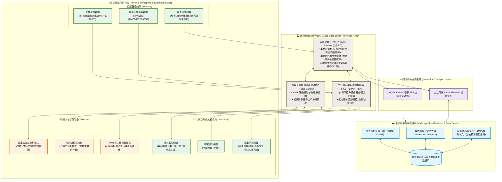
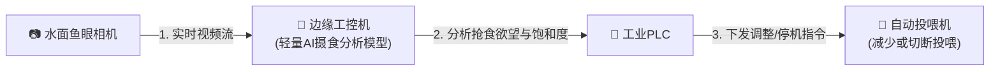
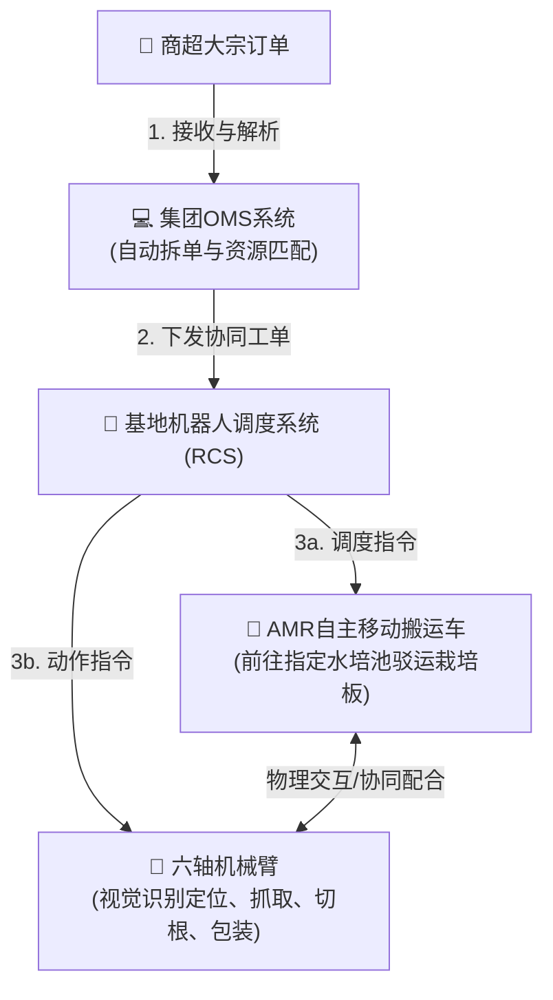

# 连锁数字化农业工厂：鱼菜共生系统宏观架构设计

本文件详述了面向未来**多地连锁、集团化运营的数字化农业工厂**的宏观 IT 与硬件架构体系。整个系统设计遵循“**物理感知、边缘自治、云端统筹、云边协同**”的核心架构原则，实现跨学科（水产养殖、设施园艺、机器人、数据科学）的闭环控制。

---

## 1. 宏观系统架构图 (Mermaid)

---

## 2. 系统分层深度解构

> [!NOTE]
> 集团化架构的核心在于：**“让本地听得见炮火，让总部看得清全局”**。如果发生公网中断，基地的物联网与控制回路绝不能瘫痪，因此边缘端（Edge）必须具备完全独立的闭环控制与数据存盘能力。

### A. 物理感知与执行层 (Perception & Execution)
这是数字化工厂的“五官”与“手脚”，直接作用于鱼、微生物、蔬菜三大生命系统：
* **传感器网 (Sensors)**：
  - *水质监测*：部署于鱼池、生物过滤池、植物栽培区。通过电极/光学原理秒级感知环境指标。
  - *视觉感知*：水下双目相机使用主动红外补光，通过点云算法在水中低能见度环境下测量鱼体规格；轨道光谱相机通过扫描叶片反射的光谱波段，在人眼不可见的潜伏期发现作物缺铁或蚜虫感染。
* **执行机构 (Actuators)**：接收 PLC 下发的毫秒级指令，调整水流、溶氧、光照及温度。
* **机器人与智能装备 (Robotics)**：
  - *六轴机械臂*：位于收割车间，配备带机器视觉的软性吸盘（末端执行器），全自动将成熟生菜从栽培板上提起，并进行无菌切根、分级与包装。
  - *AMR 搬运车*：采用 SLAM 激光雷达导航，在水培区和加工车间之间自动化往返，实现水培栽培板的物流闭环。

### B. 连锁基地边缘计算层 (Base Edge Layer)
这是基地的“本地小脑”，负责数据清洗、本地高频推理和紧急自治：
* **边缘计算工控机 (Edge Gateway)**：运行本地 Container（如 Docker/K3s）。在本地进行视频流检测（如分析鱼群摄食饱和度，动态命令投喂机停机），避免将海量高清视频上传云端浪费带宽。
* **工业 PLC**：采用西门子等标准工业控制器。由于生物安全不容片刻闪失，环控的逻辑闭环（例如：当溶解氧低于临界值 3.0 mg/L 时，无条件强制开启备用曝气机）运行在 PLC 固件中，具有最高的可靠性，不受操作系统死机或网络断开的影响。
* **机器人控制系统 (RCS)**：协调现场的多台 AMR 与收割机械臂，避免交叉碰撞，实现物料平滑流转。

### C. 网络传输与安全层 (Network & Transport)
* **协议与安全**：现场设备采用 Profinet 或 Modbus TCP 等工业协议。边缘网关通过基于 TLS 双向认证的 MQTT 协议与总部云端通信，数据打包加密传输。
* **断线续传**：边缘网关内置消息队列。当公网信号中断时，所有时序数据写入本地 InfluxDB；网络恢复后，通过断点续传协议平滑补报数据。

### D. 集团云平台与数据中心 (Group Cloud Center)
这是集团的“中央大脑”，负责数据汇聚、模型训练和战略统筹：
* **AI 训练与算法中心 (Cloud AI)**：收集全国十余个基地的脱敏数据，用于训练和重训深度学习模型。训练好的模型（如鱼病识别、叶片病害识别模型）通过云端流水线打包蒸馏后，一键下发给全国的边缘网关。
* **模型预测控制 (MPC) 引擎**：结合云端获取的未来 72 小时精细化气象预报、电网分时电价表，为各基地生成能耗控制策略（如地源热泵的蓄热建议值），下发给本地边缘网关执行。

### E. 业务应用层 (Enterprise Business Applications)
* **业务流闭环**：通过集团 ERP/OMS 系统，接收连锁商超订单，根据各基地的“数字孪生体”蔬菜成熟度预测，智能排产并调度冷链物流，打通从“订单”到“机械臂自动收割”再到“物流履约”的全链条。

---

## 3. 典型闭环控制场景流程

### 场景一：AI 驱动的闭环智能投喂（感知 ➔ 推理 ➔ 执行）

### 场景二：商超订单触发的自动化收割与补仓（需求 ➔ 调度 ➔ 机器人执行）

